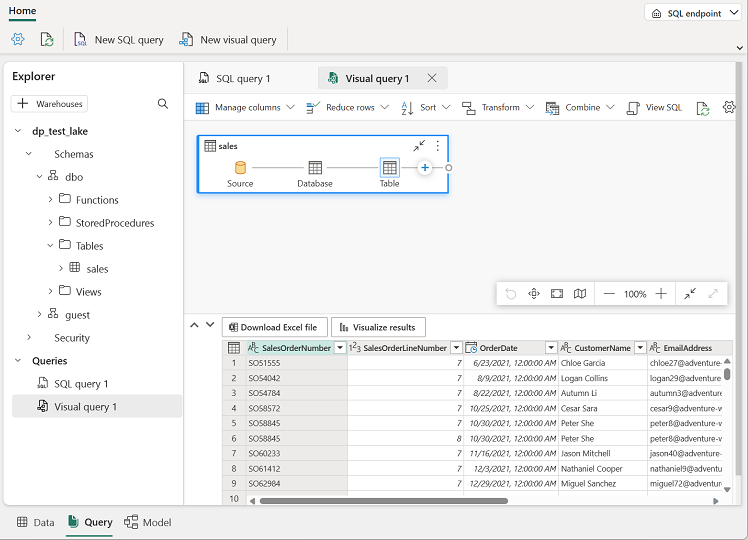

---
lab:
  title: Erstellen eines Microsoft Fabric-Lakehouse
  module: Get started with lakehouses in Microsoft Fabric
---

# Erstellen eines Lakehouse

Umfangreiche Datenanalyselösungen wurden traditionell um ein *Data Warehouse* herum erstellt, in dem Daten in relationalen Tabellen gespeichert und mithilfe von SQL abgefragt werden. Das Wachstum im Bereich von „Big Data“ (zeichnet sich durch hohe *Volumes*, *Vielfalt* und *Geschwindigkeit* neuer Datenressourcen aus) zusammen mit der Verfügbarkeit von kosteneffizienten Speicherlösungen und in der Cloud skalierbaren verteilten Computetechnologien hat zu einem alternativen Ansatz zur analytischen Datenspeicherung geführt: *Data Lakes*. In einem Data Lake werden Daten als Dateien gespeichert, ohne ein festes Schema für die Speicherung vorzuschreiben. Data Engineers und Data Analysts versuchen zunehmend, von den besten Features beider Ansätze zu profitieren, indem sie sie in einem *Data Lakehouse* kombinieren. In diesem werden Daten in Dateien in einem Data Lake gespeichert, und ein relationales Schema wird als Metadatenebene auf sie angewendet, damit sie mit herkömmlicher SQL-Semantik abgefragt werden können.

In Microsoft Fabric stellt ein Lakehouse hochgradig skalierbaren Dateispeicher in einem *OneLake*-Speicher (basierend auf Azure Data Lake Storage Gen2) mit einem Metastore für relationale Objekte wie Tabellen und Sichten bereit, die auf dem *Delta-Lake*-Open-Source-Tabellenformat basieren. Mit Delta Lake können Sie ein Schema von Tabellen in Ihrem Lakehouse definieren, das Sie mit SQL abfragen können.

Dieses Lab dauert ungefähr **30** Minuten.

> **Hinweis:** Für diese Übung benötigen Sie ein *Geschäfts-*, *Schul- oder Unikonto* von Microsoft. Wenn Sie über kein Microsoft-Konto verfügen, können Sie sich [für eine kostenlose Testversion von Microsoft Office 365 E3 oder höher registrieren](https://www.microsoft.com/microsoft-365/business/compare-more-office-365-for-business-plans).

## Erstellen eines Arbeitsbereichs

Erstellen Sie vor dem Arbeiten mit Daten in Fabric einen Arbeitsbereich mit aktivierter Fabric-Testversion.

1. Wählen Sie auf der [Microsoft Fabric-Homepage](https://app.fabric.microsoft.com) unter `https://app.fabric.microsoft.com` die Option **Datentechnik mit Synapse** aus.
1. Wählen Sie auf der Menüleiste auf der linken Seite **Arbeitsbereiche** aus (Symbol ähnelt &#128455;).
1. Erstellen Sie einen neuen Arbeitsbereich mit einem Namen Ihrer Wahl, und wählen Sie im Bereich **Erweitert** einen Lizenzierungsmodus mit Fabric-Kapazitäten aus (*Testversion*, *Premium* oder *Fabric*).
1. Wenn Ihr neuer Arbeitsbereich geöffnet wird, sollte er leer sein.

    

## Erstellen eines Lakehouse

Da Sie nun einen Arbeitsbereich besitzen, ist es an der Zeit, ein Data Lakehouse für Ihre Datendateien zu erstellen.

1. Erstellen Sie auf der Startseite **Datentechnik mit Synapse** ein neues **Lakehouse** mit einem Namen Ihrer Wahl.

    Nach etwa einer Minute wird ein neues Lakehouse erstellt:

    

1. Sehen Sie sich das neue Lakehouse an, und beachten Sie, dass Sie im Bereich **Lakehouse-Explorer** auf der linken Seite Tabellen und Dateien im Lakehouse durchsuchen können:
    - Der Ordner **Tables** enthält Tabellen, die Sie mithilfe der SQL-Semantik abfragen können. Die Tabellen in einem Microsoft Fabric-Lakehouse basieren auf dem *Delta-Lake*-Open-Source-Dateiformat, das üblicherweise in Apache Spark verwendet wird.
    - Der Ordner **Files** enthält Datendateien im OneLake-Speicher für das Lakehouse, die nicht verwalteten Deltatabellen zugeordnet sind. Sie können auch *Verknüpfungen* in diesem Ordner erstellen, um auf extern gespeicherte Daten zu verweisen.

    Derzeit sind keine Tabellen oder Dateien im Lakehouse vorhanden.

## Hochladen einer Datei

Fabric bietet mehrere Möglichkeiten zum Laden von Daten in das Lakehouse (einschließlich integrierter Unterstützung für Pipelines, die externe Datenquellen und Datenflüsse (Gen 2) kopieren, die Sie mithilfe von visuellen Tools basierend auf Power Query definieren können). Eine der einfachsten Methoden zum Erfassen kleiner Datenmengen ist jedoch das Hochladen von Dateien oder Ordnern von Ihrem lokalen Computer (oder ggf. einer Lab-VM).

1. Laden Sie die Datei [sales.csv](https://raw.githubusercontent.com/MicrosoftLearning/dp-data/main/sales.csv) von `https://raw.githubusercontent.com/MicrosoftLearning/dp-data/main/sales.csv` herunter, und speichern Sie sie als **sales.csv** auf Ihrem lokalen Computer (oder ggf. auf Ihrer Lab-VM).

   > **Hinweis:** Um die Datei herunterzuladen, öffnen Sie eine neue Registerkarte im Browser, und fügen Sie die URL ein. Klicken Sie mit der rechten Maustaste auf eine beliebige Stelle auf der Seite mit den Daten, und wählen Sie **Speichern als** aus, um die Seite als CSV-Datei zu speichern.

2. Kehren Sie zur Webbrowser-Registerkarte mit Ihrem Lakehouse zurück, und wählen Sie im Menü **...** für den Ordner **Files** im Bereich **Lakehouse-Explorer** die Option **Neuer Unterordner** aus, und erstellen Sie einen Unterordner namens **data**.
3. Wählen Sie im Menü **...** für den neuen Ordner **data** die Option **Hochladen** und **Datei hochladen** aus, und laden Sie dann die Datei **sales.csv** von Ihrem lokalen Computer (oder ggf. Ihrer Lab-VM) hoch.
4. Nachdem die Datei hochgeladen wurde, wählen Sie den Ordner **Files/data** aus, und vergewissern Sie sich, dass die Datei **sales.csv** wie im folgenden Beispiel hochgeladen wurde:

    

5. Wählen Sie die Datei **sales.csv** aus, um eine Vorschau des Inhalts anzuzeigen.

## Testen von Verknüpfungen

In vielen Szenarios können die Daten, mit denen Sie in Ihrem Lakehouse arbeiten müssen, an einem anderen Speicherort gespeichert werden. Obwohl es viele Möglichkeiten gibt, Daten im OneLake-Speicher für Ihr Lakehouse zu erfassen, besteht eine andere Option darin, stattdessen eine *Verknüpfung* zu erstellen. Mithilfe von Verknüpfungen können Sie externe Daten in Ihre Analyselösung einschließen, ohne den Mehraufwand und das Risiko von Dateninkonsistenzen, die mit dem Kopieren verbunden sind.

1. Klicken Sie im Menü **...** für den Ordner **Files** auf **Neue Verknüpfung**.
2. Zeigen Sie die verfügbaren Datenquellentypen für Verknüpfungen an. Schließen Sie dann das Dialogfeld **Neue Verknüpfung**, ohne eine Verknüpfung zu erstellen.

## Laden von Dateidaten in eine Tabelle

Die von Ihnen hochgeladenen Verkaufsdaten befinden sich in einer Datei, mit der Data Analysts und Data Engineers direkt mithilfe von Apache Spark-Code arbeiten können. In vielen Szenarios müssen Sie jedoch die Daten aus der Datei in eine Tabelle laden, damit Sie sie mithilfe von SQL abfragen können.

1. Wählen Sie auf der **Startseite** den Ordner **Files/data** aus, damit Sie die darin enthaltene Datei **sales.csv** anzeigen können.
2. Klicken Sie im Menü **...** für die Datei **sales.csv** auf **In Tabelle laden**.
3. Legen Sie im Dialogfeld **In Tabelle laden** den Tabellennamen auf **sales** fest, und bestätigen Sie den Ladevorgang. Warten Sie dann, bis die Tabelle erstellt und geladen wurde.

    > **Tipp:** Wenn die Tabelle **sales** nicht automatisch angezeigt wird, klicken Sie im Menü **...** für den Ordner **Tables** auf **Aktualisieren**.

3. Wählen Sie im Bereich **Lakehouse-Explorer** die Tabelle **sales** aus, die erstellt wurde, um die Daten anzuzeigen.

    

4. Klicken Sie im Menü **...** für die Tabelle **sales** auf **Dateien anzeigen**, um die zugrunde liegenden Dateien für diese Tabelle anzuzeigen.

    

    Dateien für eine Deltatabelle werden im *Parquet*-Format gespeichert und enthalten einen Unterordner namens **_delta_log**, in dem Details der auf die Tabelle angewendeten Transaktionen gespeichert werden.

## Verwenden von SQL zum Abfragen von Tabellen

Wenn Sie ein Lakehouse erstellen und darin Tabellen definieren, wird automatisch ein SQL-Endpunkt erstellt, über den die Tabellen mithilfe von `SELECT`-SQL-Anweisungen abgefragt werden können.

1. Wechseln Sie oben rechts auf der Lakehouseseite von **Lakehouse** zu **SQL-Analyseendpunkt**. Warten Sie dann kurz, bis der SQL-Analyseendpunkt für Ihr Lakehouse auf einer grafischen Benutzeroberfläche geöffnet wird, über die Sie wie im Folgenden gezeigt die zugehörigen Tabellen abfragen können:

2. Verwenden Sie die Schaltfläche **Neue SQL-Abfrage**, um einen neuen Abfrage-Editor zu öffnen, und geben Sie die folgende SQL-Abfrage ein:

    ```sql
   SELECT Item, SUM(Quantity * UnitPrice) AS Revenue
   FROM sales
   GROUP BY Item
   ORDER BY Revenue DESC;
    ```

3. Verwenden Sie die Schaltfläche **&#9655; Ausführen**, um die Abfrage auszuführen und die Ergebnisse anzuzeigen, die den Gesamtumsatz für jedes Produkt anzeigen sollten.

    

## Erstellen einer visuellen Abfrage

Während viele Datenexpert*innen mit SQL vertraut sind, können Data Analysts mit Power BI-Erfahrung ihre Power Query-Kenntnisse anwenden, um visuelle Abfragen zu erstellen.

1. Wählen Sie auf der Symbolleiste **Neue visuelle Abfrage** aus.
2. Ziehen Sie die Tabelle **sales** in den Editor-Bereich für neue visuelle Abfragen, der wie im Folgenden gezeigt geöffnet wird, um eine Power Query-Abfrage zu erstellen: 

    

3. Wählen Sie im Menü **Spalten verwalten** die Option **Spalten auswählen** aus. Wählen Sie dann nur die Spalten **SalesOrderNumber** und **SalesOrderLineNumber** aus.

    

4. Wählen Sie im Menü **Transformieren** die Option **Gruppieren nach** aus. Gruppieren Sie dann die Daten mithilfe der folgenden **Grundeinstellungen**:

    - **Gruppieren nach:** SalesOrderNumber
    - **Neuer Spaltenname:** LineItems
    - **Vorgang:** Eindeutige Werte zählen
    - **Spalte:** SalesOrderLineNumber

    Wenn Sie fertig sind, zeigt der Ergebnisbereich unter der visuellen Abfrage die Anzahl der Positionen für jeden Verkaufsauftrag an.

    

## Erstellen eines Berichts

Die Tabellen in Ihrem Lakehouse werden automatisch zu einem standardmäßigen Semantikmodell für die Berichterstellung mit Power BI hinzugefügt.


1. Wählen Sie unten auf der Seite „SQL-Endpunkt“ die Registerkarte **Modell** aus. Das Datenmodellschema für das semantische Modell wird angezeigt.

    

    > **Hinweis:** In dieser Übung besteht das semantische Modell aus einer einzelnen Tabelle. In einem realen Szenario würden Sie wahrscheinlich mehrere Tabellen in Ihrem Lakehouse erstellen, von denen jede im Modell enthalten wäre. Sie können dann Beziehungen zwischen diesen Tabellen im Modell definieren.

2. Klicken Sie auf dem Menüband auf die Registerkarte **Berichterstellung**, und wählen Sie dann **Neuer Bericht** aus. Eine neue Browserregisterkarte wird geöffnet, in der Sie Ihren Bericht entwerfen können.

    

3. Erweitern Sie im Bereich **Daten** auf der rechten Seite die Tabelle **sales**. Wählen Sie dann die folgenden Felder aus:
    - **Element**
    - **Menge**

    Dem Bericht wird eine Tabellenvisualisierung hinzugefügt:

    

4. Blenden Sie die Bereiche **Daten** und **Filter** im Sinne der Übersichtlichkeit aus. Stellen Sie dann sicher, dass die Tabellenvisualisierung ausgewählt ist, ändern Sie die Visualisierungseinstellung im Bereich **Visualisierungen** in **Balkendiagramm (gruppiert)** , und ändern Sie die Größe wie im Folgenden gezeigt.

    

5. Klicken Sie im Menü **Datei** auf **Speichern**. Speichern Sie dann den Bericht als **Item Sales Report** in dem Arbeitsbereich, den Sie zuvor erstellt haben.
6. Schließen Sie die Browserregisterkarte mit dem Bericht, um zum SQL-Endpunkt für Ihr Lakehouse zurückzukehren. Wählen Sie dann links auf der Hubmenüleiste Ihren Arbeitsbereich aus, um zu überprüfen, ob er die folgenden Elemente enthält:
    - Ihr Lakehouse
    - SQL-Analyseendpunkt für Ihr Lakehouse.
    - Standardmäßiges Semantikmodell für die Tabellen in Ihrem Lakehouse.
    - Bericht **Item Sales Report**

## Bereinigen von Ressourcen

In dieser Übung haben Sie ein Lakehouse erstellt und Daten in das Lakehouse importiert. Sie haben erfahren, dass ein Lakehouse aus Dateien und Tabellen besteht, die in einem OneLake-Datenspeicher gespeichert sind. Die verwalteten Tabellen können mithilfe von SQL abgefragt werden und sind in einem standardmäßigen Semantikmodell enthalten, um Datenvisualisierungen zu unterstützen.

Wenn Sie Ihr Lakehouse erkundet haben, können Sie den Arbeitsbereich löschen, den Sie für diese Übung erstellt haben.

1. Wählen Sie auf der Leiste auf der linken Seite das Symbol für Ihren Arbeitsbereich aus, um alle darin enthaltenen Elemente anzuzeigen.
2. Wählen Sie im Menü **...** auf der Symbolleiste die **Arbeitsbereichseinstellungen** aus.
3. Wählen Sie im Abschnitt **Andere** die Option **Diesen Arbeitsbereich entfernen** aus.
