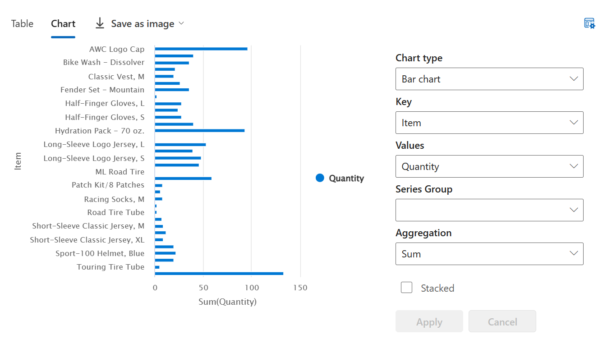

---
lab:
  title: Analysieren von Daten mit Apache Spark
  module: Use Apache Spark to work with files in a lakehouse
---

# Analysieren von Daten mit Apache Spark

Apache Spark ist eine Open-Source-Engine für verteilte Datenverarbeitung und wird häufig verwendet, um große Datenmengen in Data Lake Storage zu untersuchen, zu verarbeiten und zu analysieren. Spark ist als Verarbeitungsoption in vielen Datenplattformprodukten verfügbar (einschließlich Azure HDInsight, Azure Databricks, Azure Synapse Analytics und Microsoft Fabric). Einer der Vorteile von Spark ist die Unterstützung für eine Vielzahl von Programmiersprachen (einschließlich Java, Scala, Python und SQL). Dies macht Spark zu einer sehr flexiblen Lösung für Datenverarbeitungsworkloads (einschließlich Datenbereinigung und -manipulation, statistischer Analysen, maschinellem Lernen, Datenanalysen und Visualisierungen).

Dieses Lab dauert ungefähr **45** Minuten.

> **Hinweis:** Sie benötigen eine [Microsoft Fabric-Testversion](https://learn.microsoft.com/fabric/get-started/fabric-trial), um diese Übung abzuschließen.

## Erstellen eines Arbeitsbereichs

Erstellen Sie vor dem Arbeiten mit Daten in Fabric einen Arbeitsbereich mit aktivierter Fabric-Testversion.

1. Wählen Sie auf der [Microsoft Fabric-Homepage](https://app.fabric.microsoft.com/home?experience=fabric) unter `https://app.fabric.microsoft.com/home?experience=fabric` die Option **Datentechnik mit Synapse** aus.
1. Wählen Sie auf der Menüleiste auf der linken Seite **Arbeitsbereiche** aus (Symbol ähnelt &#128455;).
1. Erstellen Sie einen neuen Arbeitsbereich mit einem Namen Ihrer Wahl, und wählen Sie im Bereich **Erweitert** einen Lizenzierungsmodus mit Fabric-Kapazitäten aus (*Testversion*, *Premium* oder *Fabric*).
1. Wenn Ihr neuer Arbeitsbereich geöffnet wird, sollte er leer sein.

    

## Erstellen eines Lakehouse und Hochladen von Dateien

Da Sie nun einen Arbeitsbereich besitzen, ist es an der Zeit, ein Data Lakehouse für die Datendateien zu erstellen, die analysiert werden sollen.

1. Erstellen Sie auf der Startseite **Datentechnik mit Synapse** ein neues **Lakehouse** mit einem Namen Ihrer Wahl.

    Nach etwa einer Minute wird ein neues leeres Lakehouse erstellt. Sie müssen einige Daten für die Analyse in das Data Lakehouse einfügen. Es gibt mehrere Möglichkeiten, dies zu tun, aber in dieser Übung laden Sie einfach einen Ordner mit Textdateien auf Ihren lokalen Computer (oder ggf. einer Lab-VM) herunter, extrahieren sie und laden sie dann in Ihr Lakehouse hoch.

1. Laden Sie die [Datendateien](https://github.com/MicrosoftLearning/dp-data/raw/main/orders.zip) für diese Übung von `https://github.com/MicrosoftLearning/dp-data/raw/main/orders.zip` herunter und extrahieren Sie diese.

1. Stellen Sie nach dem Extrahieren des gezippten Archivs sicher, dass Sie über einen Ordner namens **orders** verfügen, der CSV-Dateien mit den Namen **2019.csv**, **2020.csv** und **2021.csv** enthält.
1. Kehren Sie zur Webbrowser-Registerkarte mit Ihrem Lakehouse zurück, und wählen Sie im Menü **...** für den Ordner **Files** im Bereich **Explorer** die Optionen **Hochladen** und **Ordner hochladen** aus. Laden Sie dann den Ordner **orders** von Ihrem lokalen Computer (oder ggf. Ihrer Lab-VM) in das Lakehouse hoch.
1. Nachdem die Dateien hochgeladen wurden, erweitern Sie **Dateien**, und wählen Sie den Ordner **orders** aus. Überprüfen Sie dann wie im Folgenden gezeigt, ob die CSV-Dateien hochgeladen wurden:

    

## Erstellen eines Notebooks

Um mit Daten in Apache Spark zu arbeiten, können Sie ein *Notebook* erstellen. Notebooks bieten eine interaktive Umgebung, in der Sie Code (in mehreren Sprachen) schreiben und ausführen sowie Notizen zum Dokumentieren hinzufügen können.

1. Wählen Sie beim Anzeigen des Inhalts des Ordners **orders** in Ihrem Datalake auf der Seite **Home** im Menü **Notebook öffnen** die Option **Neues Notebook** aus.

    Nach einigen Sekunden wird ein neues Notebook mit einer einzelnen *Zelle* geöffnet. Notebooks bestehen aus einer oder mehreren Zellen, die *Code* oder *Markdown* (formatierten Text) enthalten können.

2. Wählen Sie die erste Zelle aus (die derzeit eine *Codezelle* ist), und verwenden Sie dann auf der dynamischen Symbolleiste oben rechts die Schaltfläche **M&#8595;** , um die Zelle in eine *Markdownzelle* zu konvertieren.

    Wenn die Zelle in eine Markdownzelle geändert wird, wird der enthaltene Text gerendert.

3. Verwenden Sie die Schaltfläche **&#128393;** (Bearbeiten), um den Bearbeitungsmodus für die Zelle festzulegen, und ändern Sie dann die Markdownzelle wie folgt:

    ```
   # Sales order data exploration

   Use the code in this notebook to explore sales order data.
    ```

4. Klicken Sie außerhalb der Zelle auf eine beliebige Stelle im Notebook, um die Bearbeitung zu beenden und die gerenderte Markdownzelle anzuzeigen.

## Laden von Daten in einen Dataframe

Jetzt können Sie Code ausführen, der die Daten in einen *Dataframe* lädt. Dataframes in Spark ähneln Pandas-Dataframes in Python und bieten eine gemeinsame Struktur für die Arbeit mit Daten in Zeilen und Spalten.

> **Hinweis:** Spark unterstützt mehrere Programmiersprachen (unter anderem Scala und Java). In dieser Übung verwenden Sie *PySpark*. Hierbei handelt es sich um eine Spark-optimierte Variante von Python. PySpark ist eine der am häufigsten verwendeten Sprachen in Spark und ist die Standardsprache in Fabric-Notebooks.

1. Wenn das Notebook sichtbar ist, erweitern Sie im Bereich **Explorer** die Option **Lakehouses** und dann die Liste **Dateien** für Ihr Lakehouse, und wählen Sie den Ordner **orders** aus, sodass die CSV-Dateien wie folgt neben dem Notebook-Editor aufgeführt werden:

    

1. Wählen Sie im Menü **...** für **2019.csv** die Option **Daten laden** > **Spark** aus. Dem Notebook sollte eine neue Codezelle mit folgendem Code hinzugefügt werden:

    ```python
   df = spark.read.format("csv").option("header","true").load("Files/orders/2019.csv")
   # df now is a Spark DataFrame containing CSV data from "Files/orders/2019.csv".
   display(df)
    ```

    > **Tipp:** Sie können die Lakehouse-Explorer-Bereiche auf der linken Seite ausblenden, indem Sie jeweils das Symbol **<<** verwenden. Dies hilft Ihnen, sich auf das Notebook zu konzentrieren.

1. Verwenden Sie die Schaltfläche **&#9655; Zelle ausführen** links neben der Zelle, um diese auszuführen.

    > **Hinweis:** Da Sie zum ersten Mal Spark-Code ausführen, muss eine Spark-Sitzung gestartet werden. Dies bedeutet, dass die erste Ausführung in der Sitzung etwa eine Minute dauern kann. Nachfolgende Ausführungen erfolgen schneller.

1. Wenn der Zellenbefehl abgeschlossen ist, überprüfen Sie die Ausgabe unterhalb der Zelle, die wie folgt aussehen sollte:

    | Index | SO43701 | 11 | 01.07.2019 | Christy Zhu | christy12@adventure-works.com | Mountain-100 Silver, 44 | 16 | 3399.99 | 271.9992 |
    | -- | -- | -- | -- | -- | -- | -- | -- | -- | -- |
    | 1 | SO43704 | 1 | 01.07.2019 | Julio Ruiz | julio1@adventure-works.com | Mountain-100 Black, 48 | 1 | 3374.99 | 269.9992 |
    | 2 | SO43705 | 1 | 01.07.2019 | Curtis Lu | curtis9@adventure-works.com | Mountain-100 Silver, 38 | 1 | 3399.99 | 271.9992 |
    | ... | ... | ... | ... | ... | ... | ... | ... | ... | ... |

    Die Ausgabe zeigt die Zeilen und Spalten der Daten aus der Datei „2019.csv“ an. Beachten Sie jedoch, dass die Spaltenüberschriften nicht richtig dargestellt werden. Der Standardcode zum Laden der Daten in einen Dataframe geht davon aus, dass die CSV-Datei die Spaltennamen in der ersten Zeile enthält, aber in diesem Fall enthält die CSV-Datei nur die Daten ohne header-Informationen.

1. Ändern Sie den Code wie folgt, um die Option **header** auf **false** festzulegen:

    ```python
   df = spark.read.format("csv").option("header","false").load("Files/orders/2019.csv")
   # df now is a Spark DataFrame containing CSV data from "Files/orders/2019.csv".
   display(df)
    ```

1. Führen Sie die Zelle erneut aus, und überprüfen Sie die Ausgabe, die in etwa wie folgt aussehen sollte:

   | Index | _c0 | _c1 | _c2 | _c3 | _c4 | _c5 | _c6 | _c7 | _c8 |
    | -- | -- | -- | -- | -- | -- | -- | -- | -- | -- |
    | 1 | SO43701 | 11 | 01.07.2019 | Christy Zhu | christy12@adventure-works.com | Mountain-100 Silver, 44 | 16 | 3399.99 | 271.9992 |
    | 2 | SO43704 | 1 | 01.07.2019 | Julio Ruiz | julio1@adventure-works.com | Mountain-100 Black, 48 | 1 | 3374.99 | 269.9992 |
    | 3 | SO43705 | 1 | 01.07.2019 | Curtis Lu | curtis9@adventure-works.com | Mountain-100 Silver, 38 | 1 | 3399.99 | 271.9992 |
    | ... | ... | ... | ... | ... | ... | ... | ... | ... | ... |

    Jetzt schließt der Dataframe die erste Zeile als Datenwerte korrekt ein, aber die Spaltennamen werden automatisch generiert und sind nicht sehr hilfreich. Damit die Daten Sinn ergeben, müssen Sie explizit das richtige Schema und den richtigen Datentyp für die Datenwerte in der Datei definieren.

1. Ändern Sie den Code wie folgt, um ein Schema zu definieren und dieses beim Laden der Daten anzuwenden:

    ```python
   from pyspark.sql.types import *

   orderSchema = StructType([
       StructField("SalesOrderNumber", StringType()),
       StructField("SalesOrderLineNumber", IntegerType()),
       StructField("OrderDate", DateType()),
       StructField("CustomerName", StringType()),
       StructField("Email", StringType()),
       StructField("Item", StringType()),
       StructField("Quantity", IntegerType()),
       StructField("UnitPrice", FloatType()),
       StructField("Tax", FloatType())
       ])

   df = spark.read.format("csv").schema(orderSchema).load("Files/orders/2019.csv")
   display(df)
    ```

1. Führen Sie die bearbeitete Zelle aus, und überprüfen Sie die Ausgabe, die in etwa wie folgt aussehen sollte:

   | Index | SalesOrderNumber | SalesOrderLineNumber | OrderDate | CustomerName | E-Mail | Element | Quantity (Menge) | UnitPrice (Stückpreis) | Tax (Steuern) |
    | -- | -- | -- | -- | -- | -- | -- | -- | -- | -- |
    | 1 | SO43701 | 11 | 01.07.2019 | Christy Zhu | christy12@adventure-works.com | Mountain-100 Silver, 44 | 16 | 3399.99 | 271.9992 |
    | 2 | SO43704 | 1 | 01.07.2019 | Julio Ruiz | julio1@adventure-works.com | Mountain-100 Black, 48 | 1 | 3374.99 | 269.9992 |
    | 3 | SO43705 | 1 | 01.07.2019 | Curtis Lu | curtis9@adventure-works.com | Mountain-100 Silver, 38 | 1 | 3399.99 | 271.9992 |
    | ... | ... | ... | ... | ... | ... | ... | ... | ... | ... |

    Jetzt enthält der Dataframe die richtigen Spaltennamen (zusätzlich zum **Index**, der eine integrierte Spalte in allen Dataframes basierend auf der Ordnungsposition jeder Zeile ist). Die Datentypen der Spalten werden mithilfe einer Reihe von Standardtypen angegeben, die in der Spark SQL-Bibliothek definiert sind und am Anfang der Zelle importiert wurden.

1. Der Dataframe enthält nur die Daten aus der Datei **2019.csv**. Ändern Sie den Code so, dass der Dateipfad einen \*-Platzhalter verwendet, um die Auftragsdaten aus allen Dateien im Ordner **orders** zu lesen:

    ```python
   from pyspark.sql.types import *

   orderSchema = StructType([
       StructField("SalesOrderNumber", StringType()),
       StructField("SalesOrderLineNumber", IntegerType()),
       StructField("OrderDate", DateType()),
       StructField("CustomerName", StringType()),
       StructField("Email", StringType()),
       StructField("Item", StringType()),
       StructField("Quantity", IntegerType()),
       StructField("UnitPrice", FloatType()),
       StructField("Tax", FloatType())
       ])

   df = spark.read.format("csv").schema(orderSchema).load("Files/orders/*.csv")
   display(df)
    ```

1. Führen Sie die geänderte Codezelle aus, und überprüfen Sie die Ausgabe, die jetzt die Umsätze für 2019, 2020 und 2021 enthalten sollte.

    **Hinweis:** Es wird nur eine Teilmenge der Zeilen angezeigt, sodass Sie möglicherweise keine Beispiele für alle Jahre anzeigen können.

## Untersuchen von Daten in einem Dataframe

Das Dataframeobjekt enthält eine Vielzahl von Funktionen, mit denen Sie die darin enthaltenen Daten filtern, gruppieren und anderweitig bearbeiten können.

### Filtern eines Dataframes

1. Fügen Sie eine neue Codezelle hinzu, indem Sie den **Link +Code** verwenden, der angezeigt wird, wenn Sie die Maus auf der linken Seite der Ausgabe der aktuellen Zelle bewegen (oder auf der Menüleiste, auf der Registerkarte **Bearbeiten** die Option **+Codezelle hinzufügen**) auswählen. Geben Sie dann den folgenden Code ein.

    ```Python
   customers = df['CustomerName', 'Email']
   print(customers.count())
   print(customers.distinct().count())
   display(customers.distinct())
    ```

2. Führen Sie die neue Codezelle aus, und überprüfen Sie die Ergebnisse. Beachten Sie die folgenden Details:
    - Wenn Sie einen Vorgang für einen Dataframe ausführen, ist das Ergebnis ein neuer Dataframe (in diesem Fall wird ein neuer **customers**-Dataframe erstellt, indem eine bestimmte Teilmenge von Spalten aus dem **df**-Dataframe ausgewählt wird).
    - Dataframes bieten Funktionen wie **count** und **distinct**, die zum Zusammenfassen und Filtern der darin enthaltenen Daten verwendet werden können.
    - Die Syntax `dataframe['Field1', 'Field2', ...]` ist eine praktische Möglichkeit zum Definieren einer Teilmenge von Spalten. Sie können auch die **select**-Methode verwenden, sodass die erste Zeile des obigen Codes wie folgt geschrieben werden kann: `customers = df.select("CustomerName", "Email")`.

3. Ändern Sie den Code wie folgt:

    ```Python
   customers = df.select("CustomerName", "Email").where(df['Item']=='Road-250 Red, 52')
   print(customers.count())
   print(customers.distinct().count())
   display(customers.distinct())
    ```

4. Führen Sie den geänderten Code aus, um die Kunden anzuzeigen, die das Produkt *Road-250 Red, 52* erworben haben. Beachten Sie, dass Sie mehrere Funktionen verketten können, sodass die Ausgabe einer Funktion zur Eingabe für die nächste wird. In diesem Fall ist der von der **select**-Methode erstellte Dataframe der Quelldataframe für die **where**-Methode, die zum Anwenden von Filterkriterien verwendet wird.

### Aggregieren und Gruppieren von Daten in einem Dataframe

1. Fügen Sie dem Notebook eine neue Codezelle hinzu, und geben Sie darin den folgenden Code ein:

    ```Python
   productSales = df.select("Item", "Quantity").groupBy("Item").sum()
   display(productSales)
    ```

2. Führen Sie die hinzugefügte Codezelle aus, und beachten Sie, dass in den Ergebnissen die Summe der Bestellmengen nach Produkt gruppiert angezeigt wird. Die **groupBy**-Methode gruppiert die Zeilen nach *Item*, und die nachfolgende **sum**-Aggregatfunktion wird auf alle verbleibenden numerischen Spalten angewendet (in diesem Fall *Quantity*).

3. Fügen Sie dem Notebook eine weitere Codezelle hinzu, und geben Sie darin den folgenden Code ein:

    ```Python
   from pyspark.sql.functions import *

   yearlySales = df.select(year("OrderDate").alias("Year")).groupBy("Year").count().orderBy("Year")
   display(yearlySales)
    ```

4. Führen Sie die hinzugefügte Codezelle aus, und beachten Sie, dass in den Ergebnissen die Anzahl der Verkaufsaufträge pro Jahr angezeigt wird. Beachten Sie, dass die **select**-Methode die SQL-Funktion **year** zum Extrahieren der year-Komponente des *OrderDate*-Felds enthält (weshalb der Code eine **import**-Anweisung zum Importieren von Funktionen aus der Spark SQL-Bibliothek enthält). Es verwendet dann eine **Alias**-Methode, um dem extrahierten Jahreswert einen Spaltennamen zuzuweisen. Die Daten werden dann nach der abgeleiteten *Year*-Spalte gruppiert, und die Anzahl der Zeilen in jeder Gruppe wird berechnet, bevor schließlich die **orderBy**-Methode verwendet wird, um den resultierenden Dataframe zu sortieren.

## Verwenden von Spark zum Transformieren von Datendateien

Eine häufige Aufgabe für Data Engineers besteht darin, Daten in einem bestimmten Format oder einer bestimmten Struktur zu erfassen und für die nachfolgende Verarbeitung oder Analyse zu transformieren.

### Verwenden von Dataframemethoden und -funktionen zum Transformieren von Daten

1. Fügen Sie dem Notebook eine weitere Codezelle hinzu, und geben Sie darin den folgenden Code ein:

    ```Python
   from pyspark.sql.functions import *

   ## Create Year and Month columns
   transformed_df = df.withColumn("Year", year(col("OrderDate"))).withColumn("Month", month(col("OrderDate")))

   # Create the new FirstName and LastName fields
   transformed_df = transformed_df.withColumn("FirstName", split(col("CustomerName"), " ").getItem(0)).withColumn("LastName", split(col("CustomerName"), " ").getItem(1))

   # Filter and reorder columns
   transformed_df = transformed_df["SalesOrderNumber", "SalesOrderLineNumber", "OrderDate", "Year", "Month", "FirstName", "LastName", "Email", "Item", "Quantity", "UnitPrice", "Tax"]

   # Display the first five orders
   display(transformed_df.limit(5))
    ```

2. Führen Sie den Code aus, um einen neuen Dataframe aus den ursprünglichen Auftragsdaten mit den folgenden Transformationen zu erstellen:
    - Fügen Sie die Spalten **Year** und **Month** basierend auf der Spalte **OrderDate** hinzu.
    - Fügen Sie die Spalten **FirstName** und **LastName** basierend auf der Spalte **CustomerName** hinzu.
    - Filtern und sortieren Sie die Spalten neu, und entfernen Sie die Spalte **CustomerName**.

3. Überprüfen Sie die Ausgabe, und stellen Sie sicher, dass die Transformationen für die Daten vorgenommen wurden.

    Sie können die volle Leistungsfähigkeit der Spark SQL-Bibliothek nutzen, um die Daten zu transformieren, indem Sie Zeilen filtern, Spalten ableiten, entfernen, umbenennen und alle anderen erforderlichen Datenänderungen vornehmen.

    > **Tipp:** Weitere Informationen zu den Methoden des Dataframe-Objekts finden Sie in der [Spark-Dokumentation zu DataFrame](https://spark.apache.org/docs/latest/api/python/reference/pyspark.sql/dataframe.html).

### Speichern der transformierten Daten

1. Fügen Sie eine neue Zelle mit dem folgenden Code hinzu, um den transformierten Dataframe im Parquet-Format zu speichern (Daten werden überschrieben, falls bereits vorhanden):

    ```Python
   transformed_df.write.mode("overwrite").parquet('Files/transformed_data/orders')
   print ("Transformed data saved!")
    ```

    > **Hinweis:** Das *Parquet*-Format wird in der Regel für Datendateien verwendet, die Sie für die weitere Analyse oder Erfassung in einem Analysespeicher verwenden. Parquet ist ein sehr effizientes Format, das von den meisten umfangreichen Datenanalysesystemen unterstützt wird. Tatsächlich kann Ihre Datentransformation manchmal einfach darin bestehen, Daten aus einem anderen Format (z. B. CSV) in Parquet zu konvertieren!

2. Führen Sie die Zelle aus, und warten Sie auf die Meldung, dass die Daten gespeichert wurden. Klicken Sie dann im Bereich **Lakehouses** auf der linken Seite im Menü **...** für den Knoten **Files** auf die Option **Aktualisieren**, und wählen Sie den Ordner **transformed_data** aus, um zu überprüfen, ob er einen neuen Ordner namens **orders** enthält, der wiederum eine oder mehrere Parquet-Dateien enthält.

    

3. Fügen Sie eine neue Zelle mit dem folgenden Code hinzu, um einen neuen Dataframe aus den Parquet-Dateien im Ordner **transformed_data/orders** zu laden:

    ```Python
   orders_df = spark.read.format("parquet").load("Files/transformed_data/orders")
   display(orders_df)
    ```

4. Führen Sie die Zelle aus, und vergewissern Sie sich, dass in den Ergebnissen die aus den Parquet-Dateien geladenen Auftragsdaten angezeigt werden.

### Speichern von Daten in partitionierten Dateien

1. Fügen Sie eine neue Zelle mit dem folgenden Code hinzu. Dadurch wird der Dataframe gespeichert, und die Daten werden nach **Year** und **Month** partitioniert:

    ```Python
   orders_df.write.partitionBy("Year","Month").mode("overwrite").parquet("Files/partitioned_data")
   print ("Transformed data saved!")
    ```

2. Führen Sie die Zelle aus, und warten Sie auf die Meldung, dass die Daten gespeichert wurden. Klicken Sie dann im Bereich **Lakehouses** auf der linken Seite im Menü **...** für den Knoten **Files** auf die Option **Aktualisieren**, und erweitern Sie den Ordner **partitioned_orders**, um sicherzustellen, dass er eine Hierarchie von Ordnern mit dem Namen **Year=* xxxx*** enthält, die jeweils Ordner mit dem Namen **Month=* xxxx*** enthalten. Jeder Monatsordner enthält eine Parquet-Datei mit den Bestellungen für den jeweiligen Monat.

    

    Das Partitionieren von Datendateien ist eine gängige Methode, um die Leistung bei großen Datenmengen zu optimieren. Diese Technik kann die Leistung erheblich verbessern und das Filtern von Daten vereinfachen.

3. Fügen Sie eine neue Zelle mit dem folgenden Code hinzu, um einen neuen Dataframe aus der Datei **orders.parquet** zu laden:

    ```Python
   orders_2021_df = spark.read.format("parquet").load("Files/partitioned_data/Year=2021/Month=*")
   display(orders_2021_df)
    ```

4. Führen Sie die Zelle aus, und vergewissern Sie sich, dass in den Ergebnissen die Auftragsdaten für den Umsatz im Jahr 2021 angezeigt werden. Beachten Sie, dass die im Pfad angegebenen Partitionierungsspalten (**Year** und **Month**) nicht im Dataframe enthalten sind.

## Arbeiten mit Tabellen und SQL

Wie Sie gesehen haben, ermöglichen Ihnen die nativen Methoden des Dataframeobjekts, Daten aus einer Datei sehr effektiv abzufragen und zu analysieren. Viele Data Analysts arbeiten jedoch bevorzugt mit Tabellen, die sie mithilfe von SQL-Syntax abfragen können. Spark stellt einen *Metastore* bereit, in dem Sie relationale Tabellen definieren können. Die Spark SQL-Bibliothek, die das Dataframeobjekt bereitstellt, unterstützt auch die Verwendung von SQL-Anweisungen zum Abfragen von Tabellen im Metastore. Mithilfe dieser Funktionen von Spark können Sie die Flexibilität eines Data Lake mit dem strukturierten Datenschema und SQL-basierten Abfragen eines relationalen Data Warehouse kombinieren, was auch der Grund für die Bezeichnung „Data Lakehouse“ ist.

### Erstellen einer Tabelle

Tabellen in einem Spark-Metastore sind relationale Abstraktionen über Dateien im Data Lake. Tabellen können *verwaltet* werden (in diesem Fall werden die Dateien vom Metastore verwaltet) oder *extern* sein (in diesem Fall verweist die Tabelle auf einen Dateispeicherort im Data Lake, den Sie unabhängig vom Metastore verwalten).

1. Fügen Sie dem Notebook eine neue Codezelle hinzu, und geben Sie den folgenden Code ein, der den Dataframe der Bestelldaten als Tabelle namens **salesorders** speichert:

    ```Python
   # Create a new table
   df.write.format("delta").saveAsTable("salesorders")

   # Get the table description
   spark.sql("DESCRIBE EXTENDED salesorders").show(truncate=False)
    ```

    > **Hinweis:** In diesem Beispiel sind einige Dinge zu beachten. Erstens wird kein expliziter Pfad angegeben, sodass die Dateien für die Tabelle vom Metastore verwaltet werden. Zweitens wird die Tabelle im **Delta**-Format gespeichert. Sie können Tabellen basierend auf mehreren Dateiformaten (z. B. CSV, Parquet oder Avro) erstellen, aber *Delta Lakes* sind eine Spark-Technologie, bei der den Tabellen relationale Datenbankfunktionen hinzufügt werden (einschließlich Unterstützung für Transaktionen, Zeilenversionsverwaltung und anderer nützlicher Features). Das Erstellen von Tabellen im Delta-Format wird für Data Lakehouses in Fabric bevorzugt.

2. Führen Sie die Codezelle aus, und überprüfen Sie die Ausgabe, die die Definition der neuen Tabelle beschreibt.

3. Wählen Sie im Bereich **Lakehouses** im Menü **...** für den Ordner **Tables** die Option **Aktualisieren** aus. Erweitern Sie dann den Knoten **Tables**, und überprüfen Sie, ob die Tabelle **salesorders** erstellt wurde.

    

5. Klicken Sie im Menü **...** für die Tabelle **salesorders** auf **Daten laden** > **Spark**.

    Eine neue Codezelle, die Code ähnlich dem folgenden Beispiel enthält, wird dem Notebook hinzugefügt:

    ```Python
   df = spark.sql("SELECT * FROM [your_lakehouse].salesorders LIMIT 1000")
   display(df)
    ```

6. Führen Sie den neuen Code aus, der die Spark SQL-Bibliothek verwendet, um eine SQL-Abfrage für die **salesorders**-Tabelle im PySpark-Code einzubetten und die Ergebnisse der Abfrage in einen Dataframe zu laden.

### Ausführen von SQL-Code in einer Zelle

Obwohl es nützlich ist, SQL-Anweisungen in eine Zelle einzubetten, die PySpark-Code enthält, bevorzugen Data Analysts oft die Arbeit direkt in SQL.

1. Fügen Sie dem Notebook eine neue Codezelle hinzu, und geben Sie darin den folgenden Code ein:

    ```sql
   %%sql
   SELECT YEAR(OrderDate) AS OrderYear,
          SUM((UnitPrice * Quantity) + Tax) AS GrossRevenue
   FROM salesorders
   GROUP BY YEAR(OrderDate)
   ORDER BY OrderYear;
    ```
 
2. Führen Sie die Zelle aus, und überprüfen Sie die Ergebnisse. Beachten Sie, Folgendes:
    - Die Zeile `%%sql` am Anfang der Zelle (wird als *Magic-Befehl* bezeichnet) gibt an, dass anstelle von PySpark die Spark SQL-Runtime verwendet werden soll, um den Code in dieser Zelle auszuführen.
    - Der SQL-Code verweist auf die Tabelle **salesorders**, die Sie zuvor erstellt haben.
    - Die Ausgabe der SQL-Abfrage wird automatisch als Ergebnis unter der Zelle angezeigt.

> **Hinweis:** Weitere Informationen zu Spark SQL und Dataframes finden Sie in der [Spark SQL-Dokumentation](https://spark.apache.org/docs/2.2.0/sql-programming-guide.html).

## Visualisieren von Daten mit Spark

Ein Bild sagt sprichwörtlich mehr als tausend Worte, und ein Diagramm ist oft besser als tausend Datenzeilen. Notebooks in Fabric enthalten zwar eine integrierte Diagrammansicht für Daten, die aus einem Dataframe oder einer Spark SQL-Abfrage angezeigt werden, die Ansicht ist jedoch nicht für die umfassende Diagrammdarstellung konzipiert. Sie können jedoch Python-Grafikbibliotheken wie **matplotlib** und **seaborn** verwenden, um Diagramme aus Daten in Dataframes zu erstellen.

### Anzeigen von Ergebnissen als Diagramm

1. Fügen Sie dem Notebook eine neue Codezelle hinzu, und geben Sie darin den folgenden Code ein:

    ```sql
   %%sql
   SELECT * FROM salesorders
    ```

2. Führen Sie den Code aus, und beachten Sie, dass er die Daten aus der **salesorders**-Ansicht zurückgibt, die Sie zuvor erstellt haben.
3. Ändern Sie im Ergebnisabschnitt unterhalb der Zelle die Option **Ansicht** von **Tabelle** in **Diagramm**.
4. Verwenden Sie die Schaltfläche **Diagramm anpassen** oben rechts im Diagramm, um den Optionsbereich für das Diagramm anzuzeigen. Legen Sie dann die Optionen wie folgt fest, und klicken Sie auf **Anwenden**:
    - **Diagrammtyp:** Balkendiagramm
    - **Schlüssel:** Element
    - **Werte:** Menge
    - **Reihengruppe:** *Leer lassen*
    - **Aggregation:** Summe
    - **Gestapelt:** *Nicht aktiviert*

5. Stellen Sie sicher, dass das Diagramm in etwa wie folgt aussieht:

    

### Erste Schritte mit **matplotlib**

1. Fügen Sie dem Notebook eine neue Codezelle hinzu, und geben Sie darin den folgenden Code ein:

    ```Python
   sqlQuery = "SELECT CAST(YEAR(OrderDate) AS CHAR(4)) AS OrderYear, \
                   SUM((UnitPrice * Quantity) + Tax) AS GrossRevenue \
               FROM salesorders \
               GROUP BY CAST(YEAR(OrderDate) AS CHAR(4)) \
               ORDER BY OrderYear"
   df_spark = spark.sql(sqlQuery)
   df_spark.show()
    ```

2. Führen Sie den Code aus, und überprüfen Sie, ob ein Spark-Dataframe mit dem Jahresumsatz zurückgegeben wird.

    Um die Daten als Diagramm zu visualisieren, verwenden Sie zunächst die Python-Bibliothek **matplotlib**. Diese Bibliothek ist die zentrale Bibliothek für Darstellungen, auf der viele andere basieren, und sie bietet hohe Flexibilität beim Erstellen von Diagrammen.

3. Fügen Sie dem Notebook eine neue Codezelle hinzu, und fügen Sie darin den folgenden Code ein:

    ```Python
   from matplotlib import pyplot as plt

   # matplotlib requires a Pandas dataframe, not a Spark one
   df_sales = df_spark.toPandas()

   # Create a bar plot of revenue by year
   plt.bar(x=df_sales['OrderYear'], height=df_sales['GrossRevenue'])

   # Display the plot
   plt.show()
    ```

4. Führen Sie die Zelle aus, und überprüfen Sie die Ergebnisse, die sich aus einem Säulendiagramm mit dem Gesamtbruttoumsatz für jedes Jahr zusammensetzen. Beachten Sie die folgenden Features des Codes, der zum Erstellen dieses Diagramms verwendet wird:
    - Die **matplotlib**-Bibliothek erfordert einen *Pandas*-Dataframe, weshalb Sie den *Spark*-Dataframe, der von der Spark SQL-Abfrage zurückgegeben wird, in dieses Format konvertieren müssen.
    - Der Kern der **matplotlib**-Bibliothek ist das **pyplot**-Objekt. Dies ist die Grundlage für die meisten Darstellungsfunktionen.
    - Die Standardeinstellungen führen zu einem verwendbaren Diagramm, aber es gibt einige Optionen, um es weiter anzupassen.

5. Ändern Sie den Code, um das Diagramm wie folgt darzustellen:

    ```Python
   from matplotlib import pyplot as plt

   # Clear the plot area
   plt.clf()

   # Create a bar plot of revenue by year
   plt.bar(x=df_sales['OrderYear'], height=df_sales['GrossRevenue'], color='orange')

   # Customize the chart
   plt.title('Revenue by Year')
   plt.xlabel('Year')
   plt.ylabel('Revenue')
   plt.grid(color='#95a5a6', linestyle='--', linewidth=2, axis='y', alpha=0.7)
   plt.xticks(rotation=45)

   # Show the figure
   plt.show()
    ```

6. Führen Sie die Codezelle erneut aus, und zeigen Sie die Ergebnisse an. Das Diagramm enthält nun etwas mehr Informationen.

    Plots sind technisch gesehen in **Abbildungen** enthalten. In den vorherigen Beispielen wurde die Abbildung implizit für Sie erstellt, aber Sie können sie auch explizit erstellen.

7. Ändern Sie den Code, um das Diagramm wie folgt darzustellen:

    ```Python
   from matplotlib import pyplot as plt

   # Clear the plot area
   plt.clf()

   # Create a Figure
   fig = plt.figure(figsize=(8,3))

   # Create a bar plot of revenue by year
   plt.bar(x=df_sales['OrderYear'], height=df_sales['GrossRevenue'], color='orange')

   # Customize the chart
   plt.title('Revenue by Year')
   plt.xlabel('Year')
   plt.ylabel('Revenue')
   plt.grid(color='#95a5a6', linestyle='--', linewidth=2, axis='y', alpha=0.7)
   plt.xticks(rotation=45)

   # Show the figure
   plt.show()
    ```

8. Führen Sie die Codezelle erneut aus, und zeigen Sie die Ergebnisse an. Die Abbildung bestimmt die Form und Größe des Plots.

    Eine Abbildung kann mehrere Teilplots enthalten (jeweils auf einer eigenen *Achse*).

9. Ändern Sie den Code, um das Diagramm wie folgt darzustellen:

    ```Python
   from matplotlib import pyplot as plt

   # Clear the plot area
   plt.clf()

   # Create a figure for 2 subplots (1 row, 2 columns)
   fig, ax = plt.subplots(1, 2, figsize = (10,4))

   # Create a bar plot of revenue by year on the first axis
   ax[0].bar(x=df_sales['OrderYear'], height=df_sales['GrossRevenue'], color='orange')
   ax[0].set_title('Revenue by Year')

   # Create a pie chart of yearly order counts on the second axis
   yearly_counts = df_sales['OrderYear'].value_counts()
   ax[1].pie(yearly_counts)
   ax[1].set_title('Orders per Year')
   ax[1].legend(yearly_counts.keys().tolist())

   # Add a title to the Figure
   fig.suptitle('Sales Data')

   # Show the figure
   plt.show()
    ```

10. Führen Sie die Codezelle erneut aus, und zeigen Sie die Ergebnisse an. Die Abbildung enthält die im Code angegebenen Teilplots.

> **Hinweis:** Weitere Informationen zur Darstellung mit „matplotlib“ finden Sie in der [matplotlib-Dokumentation](https://matplotlib.org/).

### Verwenden der **seaborn**-Bibliothek

Mit **matplotlib** können Sie zwar komplexe Diagramme mit mehreren Typen erstellen, es kann jedoch komplexen Code erfordern, um die besten Ergebnisse zu erzielen. Aus diesem Grund wurden im Laufe der Jahre viele neue Bibliotheken auf der Basis von „matplotlib“ entwickelt, um die Komplexität dieser Bibliothek zu abstrahieren und ihre Funktionen zu verbessern. Eine dieser Bibliotheken ist **seaborn**.

1. Fügen Sie dem Notebook eine neue Codezelle hinzu, und geben Sie darin den folgenden Code ein:

    ```Python
   import seaborn as sns

   # Clear the plot area
   plt.clf()

   # Create a bar chart
   ax = sns.barplot(x="OrderYear", y="GrossRevenue", data=df_sales)
   plt.show()
    ```

2. Führen Sie den Code aus, und überprüfen Sie, ob bei Verwendung der seaborn-Bibliothek ein Balkendiagramm angezeigt wird.
3. Ändern Sie den Code wie folgt:

    ```Python
   import seaborn as sns

   # Clear the plot area
   plt.clf()

   # Set the visual theme for seaborn
   sns.set_theme(style="whitegrid")

   # Create a bar chart
   ax = sns.barplot(x="OrderYear", y="GrossRevenue", data=df_sales)
   plt.show()
    ```

4. Führen Sie den geänderten Code aus, und beachten Sie, dass Sie mit der seaborn-Bibliothek ein konsistentes Farbdesign für Ihre Plots festlegen können.

5. Ändern Sie den Code wie folgt erneut:

    ```Python
   import seaborn as sns

   # Clear the plot area
   plt.clf()

   # Create a line chart
   ax = sns.lineplot(x="OrderYear", y="GrossRevenue", data=df_sales)
   plt.show()
    ```

6. Führen Sie den geänderten Code aus, um den Jahresumsatz als Liniendiagramm anzuzeigen.

> **Hinweis:** Weitere Informationen zur Darstellung mithilfe der seaborn-Bibliothek finden Sie in der [seaborn-Dokumentation](https://seaborn.pydata.org/index.html).

## Speichern des Notebooks und Beenden der Spark-Sitzung

Nachdem Sie die Arbeit mit den Daten abgeschlossen haben, können Sie das Notebook mit einem aussagekräftigen Namen speichern und die Spark-Sitzung beenden.

1. Verwenden Sie auf der Menüleiste des Notebooks das Symbol ⚙️ **Einstellungen**, um die Einstellungen des Notebooks anzuzeigen.
2. Legen Sie den **Namen** des Notebooks auf **Explore Sales Orders** fest, und schließen Sie dann den Einstellungsbereich.
3. Klicken Sie im Notebookmenü auf **Sitzung beenden**, um die Spark-Sitzung zu beenden.

## Bereinigen von Ressourcen

In dieser Übung haben Sie gelernt, wie Sie Spark verwenden, um mit Daten in Microsoft Fabric zu arbeiten.

Wenn Sie Ihr Lakehouse erkundet haben, können Sie den Arbeitsbereich löschen, den Sie für diese Übung erstellt haben.

1. Wählen Sie auf der Leiste auf der linken Seite das Symbol für Ihren Arbeitsbereich aus, um alle darin enthaltenen Elemente anzuzeigen.
2. Wählen Sie im Menü **...** auf der Symbolleiste die **Arbeitsbereichseinstellungen** aus.
3. Wählen Sie im Abschnitt **Allgemein** die Option **Diesen Arbeitsbereich entfernen** aus.
