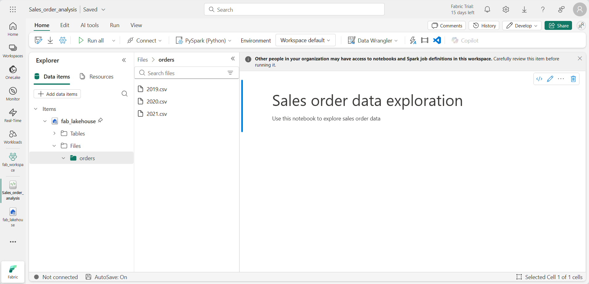
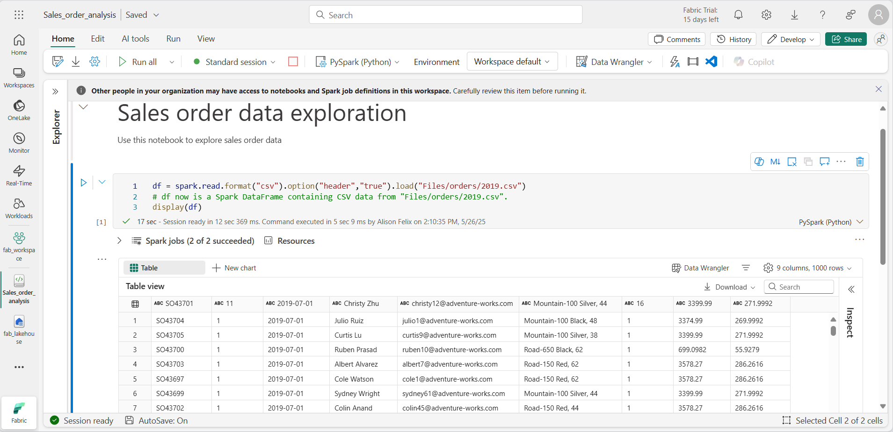
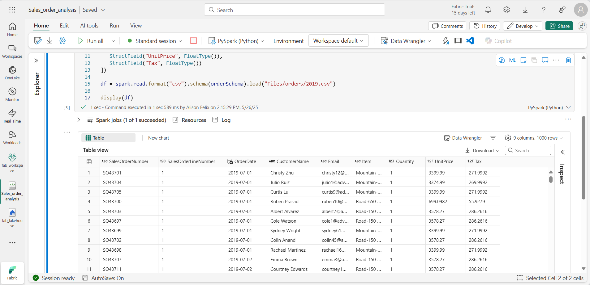
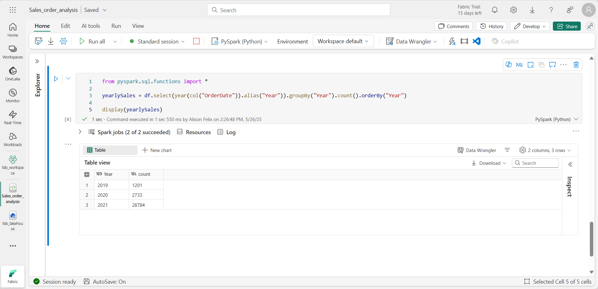
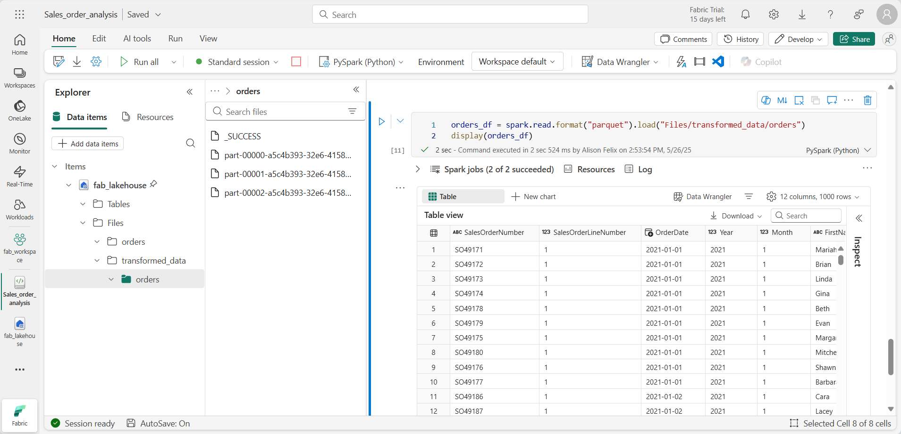
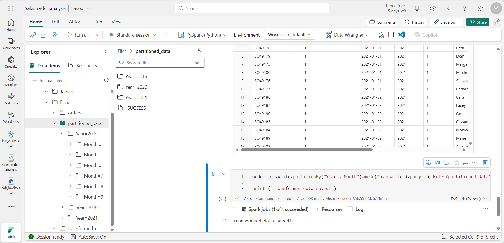
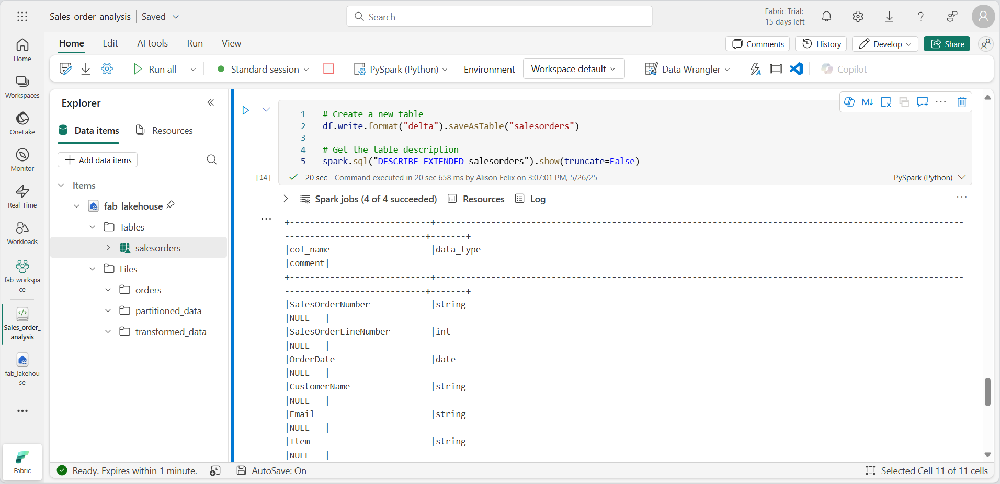
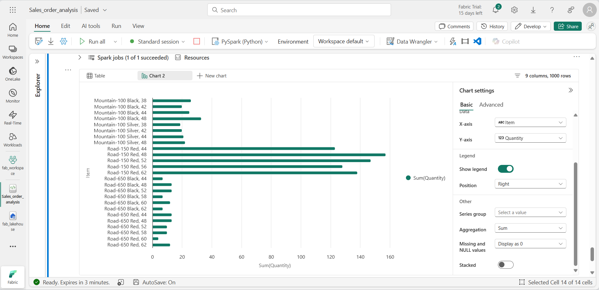

---
lab:
  title: Analysieren von Daten mit Apache Spark
  module: Use Apache Spark to work with files in a lakehouse
---

# Analysieren von Daten mit Apache Spark in Fabric

In dieser Übung werden Sie Daten in das Fabric Lakehouse erfassen und PySpark zum Lesen und Analysieren der Daten verwenden.

Dieses Lab dauert ungefähr 45 Minuten.

> [!Note] 
> Sie benötigen Zugriff auf einen [Microsoft Fabric-Mandanten](https://learn.microsoft.com/fabric/get-started/fabric-trial), um diese Übung abzuschließen.

## Erstellen eines Arbeitsbereichs

Bevor Sie mit Daten in Fabric arbeiten, erstellen Sie einen Arbeitsbereich in einem Mandanten mit aktivierter Fabric-Kapazität.

1. Navigieren Sie in einem Browser unter `https://app.fabric.microsoft.com/home?experience=fabric-developer` zur [Microsoft Fabric-Startseite](https://app.fabric.microsoft.com/home?experience=fabric-developer) und melden Sie sich mit Ihren Fabric-Anmeldeinformationen an.
1. Wählen Sie auf der Menüleiste auf der linken Seite **Arbeitsbereiche** aus (Symbol ähnelt &#128455;).
1. Erstellen Sie einen neuen Arbeitsbereich mit einem Namen Ihrer Wahl, und wählen Sie im Bereich **Erweitert** einen Lizenzierungsmodus mit Fabric-Kapazitäten aus (*Testversion*, *Premium* oder *Fabric*).
1. Wenn Ihr neuer Arbeitsbereich geöffnet wird, sollte er leer sein.

    

## Erstellen eines Lakehouse und Hochladen von Dateien

Jetzt, da Sie einen Arbeitsbereich haben, ist es an der Zeit, ein Data Lakehouse für Ihre Daten zu erstellen.

1. Wählen Sie in der Menüleiste auf der linken Seite **Erstellen** aus. Wählen Sie auf der Seite *Neu* unter dem Abschnitt *Datentechnik* die Option **Lakehouse** aus. Wählen Sie einen eindeutigen Namen Ihrer Wahl aus.

    >**Hinweis**: Wenn die Option **Erstellen** nicht an die Seitenleiste angeheftet ist, müssen Sie zuerst die Ellipses-Option (**…**) auswählen.

    Nach etwa einer Minute wird ein neues Lakehouse erstellt:

    

1. Sehen Sie sich das neue Lakehouse an, und beachten Sie, dass Sie im Bereich **Lakehouse-Explorer** auf der linken Seite Tabellen und Dateien im Lakehouse durchsuchen können:

Sie können nun Daten in das Lakehouse aufnehmen. Es gibt mehrere Möglichkeiten, dies zu tun, aber zunächst laden Sie einen Ordner mit Textdateien auf Ihren lokalen Computer (oder ggf. auf Ihre Lab-VM) herunter und dann auf Ihr Lakehouse hoch.

1. Laden Sie alle Dateien von `https://github.com/MicrosoftLearning/dp-data/raw/main/orders.zip` herunter.
1. Entpacken Sie das gezippte Archiv und überprüfen Sie, ob Sie einen Ordner mit dem Namen *orders* haben, der drei CSV-Dateien enthält: 2019.csv, 2020.csv und 2021.csv.
1. Kehren Sie zu Ihrem neuen Lakehouse zurück. Wählen Sie im Bereich **Explorer** neben dem Ordner **Files** das Feld **...** Menü und wählen Sie **Hochladen** und **Ordner hochladen**. Navigieren Sie zum Ordner „Bestellungen“ auf Ihrem lokalen Computer (oder ggf. Ihrer Lab-VM) und wählen Sie **Hochladen** aus.
1. Nachdem die Dateien hochgeladen wurden, erweitern Sie **Dateien** und wählen Sie den Ordner **Bestellungen**. Überprüfen Sie, ob die CSV-Dateien hochgeladen wurden, wie hier gezeigt:

    

## Erstellen eines Notebooks

Sie können nun ein Fabric-Notizbuch erstellen, um mit Ihren Daten zu arbeiten. Notebooks stellen eine interaktive Umgebung bereit, in der Sie Code schreiben und ausführen können.

1. Wählen Sie in der Menüleiste auf der linken Seite **Erstellen** aus. Wählen Sie auf der Seite *Neu* im Abschnitt *Datentechnik* die Option **Notebook** aus.

    Ein neues Notebook mit dem Namen **Notebook 1** wird erstellt und geöffnet.

    

1. Fabric weist jedem Notizbuch, das Sie erstellen, einen Namen zu, z. B. Notizbuch 1, Notizbuch 2 usw. Klicken Sie auf das Bedienfeld oberhalb der Registerkarte **Home** im Menü, um den Namen in einen aussagekräftigeren Namen zu ändern.
1. Markieren Sie die erste Zelle (die momentan eine Codezelle ist), und verwenden Sie dann in der oberen rechten Symbolleiste die Schaltfläche **M↓**, um sie in eine Abschriftenzelle umzuwandeln. Der in der Zelle enthaltene Text wird dann als formatierter Text angezeigt.
1. Verwenden Sie die Taste 🖉 (Bearbeiten), um die Zelle in den Bearbeitungsmodus zu schalten, und ändern Sie dann den Markdown wie unten gezeigt.

    ```markdown
   # Sales order data exploration
   Use this notebook to explore sales order data
    ```

    

Wenn Sie fertig sind, klicken Sie auf eine beliebige Stelle im Notebook außerhalb der Zelle, um die Bearbeitung zu beenden.

## Erstellen eines DataFrame

Nachdem Sie nun einen Arbeitsbereich, ein Lakehouse und ein Notebook erstellt haben, können Sie mit Ihren Daten arbeiten. Sie werden PySpark verwenden, die Standardsprache für Fabric-Notebooks und die für Spark optimierte Version von Python.

>[!NOTE]
> Hinweis: Fabric-Notebooks unterstützen mehrere Programmiersprachen, dazu gehören Scala, R und Spark SQL.

1. Wählen Sie Ihren neuen Arbeitsbereich in der linken Leiste aus. Sie sehen eine Liste der Elemente, die im Arbeitsbereich enthalten sind, einschließlich Ihres Lakehouses und Ihres Notebooks.
1. Wählen Sie das Lakehouse aus, um den Bereich des Explorers anzuzeigen, einschließlich des Ordners **Bestellungen**.
1. Wählen Sie im oberen Menü **Notebook öffnen** und **Vorhandenes Notebook** aus, und öffnen Sie dann das Notebook, das Sie zuvor erstellt haben. Das Notebook sollte nun neben dem Explorer-Bereich geöffnet sein. Erweitern Sie Lakehouses, erweitern Sie die Liste „Dateien“, und wählen Sie den Ordner „Bestellungen“ aus. Die CSV-Dateien, die Sie hochgeladen haben, werden wie folgt neben dem Notebook-Editor aufgeführt:

    

1. Wählen Sie im … Menü für 2019.csv die Option „**Daten laden**“ > **Spark** aus. Der folgende Code wird automatisch in einer neuen Codezelle generiert:

    ```python
   df = spark.read.format("csv").option("header","true").load("Files/orders/2019.csv")
   # df now is a Spark DataFrame containing CSV data from "Files/orders/2019.csv".
   display(df)
    ```

>[!TIP]
> Sie können die Explorer-Bereiche links ausblenden, indem Sie die „«“-Symbole verwenden. Dadurch erhalten Sie mehr Platz für das Notebook.

1. Wählen Sie ▷ **Zelle ausführen** links neben der Zelle aus, um den Code auszuführen.

>[!NOTE]
> Wenn Sie den Spark-Code zum ersten Mal ausführen, wird eine Spark-Sitzung gestartet. Dies kann einige Sekunden oder länger dauern. Nachfolgende Ausführungen innerhalb derselben Sitzung werden schneller sein.

1. Wenn der Zellencode abgeschlossen ist, überprüfen Sie die Ausgabe unterhalb der Zelle, die wie folgt aussehen sollte:
 
    

1. Die Ausgabe zeigt Daten aus der Datei „2019.csv“, die in Spalten und Zeilen angezeigt werden.   Beachten Sie, dass die Spaltenüberschriften die erste Zeile der Daten enthalten. Um dies zu korrigieren, müssen Sie die erste Zeile des Codes wie folgt ändern:

    ```python
   df = spark.read.format("csv").option("header","false").load("Files/orders/2019.csv")
    ```

1. Führen Sie den Code erneut aus, damit der DataFrame die erste Zeile korrekt als Daten identifiziert. Beachten Sie, dass sich die Spaltennamen jetzt in „_c0“, „_c1“ usw. geändert haben.

1. Beschreibende Spaltennamen helfen Ihnen dabei, die Daten zu verstehen. Um aussagekräftige Spaltennamen zu erstellen, müssen Sie das Schema und die Datentypen definieren. Außerdem müssen Sie einen Standardsatz von Spark SQL-Typen importieren, um die Datentypen zu definieren. Ersetzen Sie den vorhandenen Code durch folgenden Code:

    ```python
   from pyspark.sql.types import *

   orderSchema = StructType([
       StructField("SalesOrderNumber", StringType()),
       StructField("SalesOrderLineNumber", IntegerType()),
       StructField("OrderDate", DateType()),
       StructField("CustomerName", StringType()),
       StructField("Email", StringType()),
       StructField("Item", StringType()),
       StructField("Quantity", IntegerType()),
       StructField("UnitPrice", FloatType()),
       StructField("Tax", FloatType())
   ])

   df = spark.read.format("csv").schema(orderSchema).load("Files/orders/2019.csv")

   display(df)
    ```

1. Führen Sie die Zelle aus und überprüfen Sie die Ausgabe:

    

1.  Der DataFrame enthält nur die Daten aus der Datei „2019.csv“. Ändern Sie den Code so, dass der Dateipfad einen *-Platzhalter verwendet, um alle Dateien im Ordner „Aufträge“ zu lesen:

    ```python
    from pyspark.sql.types import *

    orderSchema = StructType([
        StructField("SalesOrderNumber", StringType()),
        StructField("SalesOrderLineNumber", IntegerType()),
        StructField("OrderDate", DateType()),
        StructField("CustomerName", StringType()),
        StructField("Email", StringType()),
        StructField("Item", StringType()),
        StructField("Quantity", IntegerType()),
        StructField("UnitPrice", FloatType()),
        StructField("Tax", FloatType())
    ])

    df = spark.read.format("csv").schema(orderSchema).load("Files/orders/*.csv")

    display(df)
    ```

1.  Wenn Sie den geänderten Code ausführen, sollte der Umsatz für 2019, 2020 und 2021 angezeigt werden. Es wird nur eine Teilmenge der Zeilen angezeigt, daher werden möglicherweise keine Zeilen für jedes Jahr angezeigt.

>[!NOTE]
> Wählen Sie **…** aus, um die Ausgabe einer Zelle ein- oder auszublenden. neben dem Bericht. Das macht die Arbeit im Notebook einfacher.

## Untersuchen von Daten in einem Dataframe

Das DataFrame-Objekt stellt zusätzliche Funktionalitäten bereit, z. B. die Möglichkeit, Daten zu filtern, zu gruppieren und zu bearbeiten.

### Filtern eines Dataframes

1. Fügen Sie eine Codezelle hinzu, indem Sie **+ Code** wählen, das erscheint, wenn Sie den Mauszeiger über oder unter die aktuelle Zelle oder deren Ausgabe bewegen. Alternativ dazu können Sie im Menüband-Menü **Bearbeiten** und **+ Codezelle unten hinzufügen** auswählen.

1.  Der folgende Code filtert die Daten so, dass nur zwei Spalten zurückgegeben werden. Außerdem werden *count* und *distinct* verwendet, um die Anzahl der Datensätze zusammenzufassen:

    ```python
    customers = df['CustomerName', 'Email']

    print(customers.count())
    print(customers.distinct().count())

    display(customers.distinct())
    ```

1. Führen Sie den Code aus und prüfen Sie die Ausgabe:

    * Der Code erstellt einen neuen DataFrame mit dem Namen **Kunden**, der eine Teilmenge von Spalten aus dem ursprünglichen **df** DataFrame enthält. Beim Ausführen einer DataFrame-Transformation ändern Sie den ursprünglichen DataFrame nicht, sondern geben eine neue zurück.
    * Eine andere Möglichkeit, das gleiche Ergebnis zu erzielen, ist die Verwendung der Select-Methode:

    ```
   customers = df.select("CustomerName", "Email")
    ```

    * Die DataFrame-Funktionen *count* und *distinct* werden verwendet, um Summen für die Anzahl der Kunden und der Einzelkunden bereitzustellen.

1. Ändern Sie die erste Zeile des Codes, indem Sie *select* mit einer *where* Funktion wie folgt verwenden:

    ```python
   customers = df.select("CustomerName", "Email").where(df['Item']=='Road-250 Red, 52')
   print(customers.count())
   print(customers.distinct().count())

   display(customers.distinct())
    ```

1. Führen Sie den geänderten Code aus, um nur die Kunden auszuwählen, die das Produkt Road-250 Red, 52 gekauft haben. Beachten Sie, dass Sie mehrere Funktionen miteinander „verketten“ können, so dass die Ausgabe einer Funktion die Eingabe für die nächste wird. In diesem Fall ist der mit der Methode *select* erstellte DataFrame der Quell-DataFrame für die Methode **where**, die zur Anwendung von Filterkriterien verwendet wird.

### Aggregieren und Gruppieren von Daten in einem DataFrame

1. Fügen Sie eine Codezelle hinzu, und geben Sie den folgenden Code ein:

    ```python
   productSales = df.select("Item", "Quantity").groupBy("Item").sum()

   display(productSales)
    ```

1. Führen Sie den Code aus. Sie können sehen, dass die Ergebnisse die Summe der Bestellmengen, gruppiert nach Produkt, anzeigen. Die Methode *groupBy* gruppiert die Zeilen nach Element, und die anschließende Aggregatfunktion *sum* wird auf die verbleibenden numerischen Spalten angewendet - in diesem Fall *Menge*.

1. Fügen Sie dem Notebook eine weitere Codezelle hinzu, und geben Sie den folgenden Code ein:

    ```python
   from pyspark.sql.functions import *

   yearlySales = df.select(year(col("OrderDate")).alias("Year")).groupBy("Year").count().orderBy("Year")

   display(yearlySales)
    ```

1. Führen Sie die Zelle aus. Prüfen Sie die Ausgabe. Die Ergebnisse zeigen nun die Anzahl der Kundenaufträge pro Jahr:

    * Mit der Anweisung *Importieren* können Sie die Spark-SQL-Bibliothek verwenden.
    * Die Methode *Auswählen* wird mit einer SQL-Jahresfunktion verwendet, um die Jahreskomponente des Feldes *Auftragsdatum* zu extrahieren.
    * Die Methode *Alias* wird verwendet, um dem extrahierten Jahreswert einen Spaltennamen zuzuweisen.
    * Die Methode *groupBy* gruppiert die Daten nach der abgeleiteten Spalte Jahr.
    * Die Anzahl der Zeilen in jeder Gruppe wird berechnet, bevor die Methode *orderBy* zum Sortieren des resultierenden DataFrame verwendet wird.

    

## Verwenden von Spark zum Transformieren von Datendateien

Eine häufige Aufgabe von technischen und wissenschaftlichen Fachkräften  ist die Umwandlung von Daten für die weitere nachgelagerte Verarbeitung oder Analyse.

### Verwenden von Dataframemethoden und -funktionen zum Transformieren von Daten

1. Fügen Sie dem Notebook eine Codezelle hinzu und geben Sie Folgendes ein:

    ```python
   from pyspark.sql.functions import *

   # Create Year and Month columns
   transformed_df = df.withColumn("Year", year(col("OrderDate"))).withColumn("Month", month(col("OrderDate")))

   # Create the new FirstName and LastName fields
   transformed_df = transformed_df.withColumn("FirstName", split(col("CustomerName"), " ").getItem(0)).withColumn("LastName", split(col("CustomerName"), " ").getItem(1))

   # Filter and reorder columns
   transformed_df = transformed_df["SalesOrderNumber", "SalesOrderLineNumber", "OrderDate", "Year", "Month", "FirstName", "LastName", "Email", "Item", "Quantity", "UnitPrice", "Tax"]

   # Display the first five orders
   display(transformed_df.limit(5))
    ```

1. Führen Sie die Zelle aus. Ein neuer DataFrame wird aus den ursprünglichen Auftragsdaten mit den folgenden Transformationen erstellt:

    - Spalten Jahr und Monat hinzugefügt, basierend auf der Spalte OrderDate.
    - Spalten Vorname und Nachname hinzugefügt, basierend auf der Spalte Kundenname.
    - Die Spalten werden gefiltert und neu sortiert, und die Spalte CustomerName wird entfernt.

1. Überprüfen Sie die Ausgabe, und stellen Sie sicher, dass die Transformationen für die Daten vorgenommen wurden.

Sie können die Spark-SQL-Bibliothek verwenden, um die Daten zu transformieren, indem Sie Zeilen filtern, ableiten, entfernen, Spalten umbenennen und andere Datenänderungen vornehmen.

>[!TIP]
> Weitere Informationen über das DataFrame-Objekt finden Sie in der [Apache Spark dataframe](https://spark.apache.org/docs/latest/api/python/reference/pyspark.sql/dataframe.html)-Dokumentation.

### Speichern der transformierten Daten

An diesem Punkt können Sie die transformierten Daten speichern, damit sie für eine weitere Analyse verwendet werden kann.

*Parkett* ist ein beliebtes Datenspeicherformat, da es Daten effizient speichert und von den meisten groß angelegten Datenanalysesystemen unterstützt wird. In der Tat besteht die Anforderung an die Datenumwandlung manchmal darin, Daten von einem Format wie CSV in Parquet zu konvertieren.

1. Um den umgewandelten DataFrame im Parquet-Format zu speichern, fügen Sie eine Codezelle und den folgenden Code hinzu:  

    ```python
   transformed_df.write.mode("overwrite").parquet('Files/transformed_data/orders')

   print ("Transformed data saved!")
    ```

1. Führen Sie die Zelle aus, und warten Sie auf die Meldung, dass die Daten gespeichert wurden. Anschließend klicken Sie im Explorer-Fenster auf der linken Seite auf … Menü für den Knoten Dateien die Option **Aktualisieren**. Wählen Sie den Ordner transformed_data aus, um zu überprüfen, ob er einen neuen Ordner namens orders enthält, der wiederum eine oder mehrere Paruet-Dateien enthält.

1. Fügen Sie eine Zelle mit dem folgenden Code hinzu:

    ```python
   orders_df = spark.read.format("parquet").load("Files/transformed_data/orders")
   display(orders_df)
    ```

1. Führen Sie die Zelle aus.  Ein neuer DataFrame wird aus den Parquet Dateien im Ordner *transformed_data/orders* erstellt. Überprüfen Sie, ob die Ergebnisse die aus den Parquet-Dateien geladenen Auftragsdaten anzeigen.

    

### Speichern von Daten in partitionierten Dateien

Bei großen Datenmengen kann die Partitionierung die Leistung erheblich verbessern und die Filterung der Daten erleichtern.

1. Fügen Sie eine Zelle mit Code zum Speichern des Datenframe hinzu, wobei die Daten nach Jahr und Monat aufgeteilt werden:

    ```python
   orders_df.write.partitionBy("Year","Month").mode("overwrite").parquet("Files/partitioned_data")

   print ("Transformed data saved!")
    ```

1.  Führen Sie die Zelle aus, und warten Sie auf die Meldung, dass die Daten gespeichert wurden. Wählen Sie dann im Bereich Lakehouses auf der linken Seite im ... Menü für den Knoten „Dateien“ die Option **Aktualisieren** aus und erweitern Sie den Ordner „partitioned_data“, um zu überprüfen, ob er eine Hierarchie von Ordnern mit dem Namen *Year=xxxx* enthält, die jeweils Ordner mit dem Namen *Month=xxxx* enthalten. Jeder Monatsordner enthält eine Parquet-Datei mit den Bestellungen für den jeweiligen Monat.

    

1. Fügen Sie eine neue Zelle mit dem folgenden Code hinzu, um einen neuen Dataframe aus der Datei orders.parquet zu laden:

    ```python
   orders_2021_df = spark.read.format("parquet").load("Files/partitioned_data/Year=2021/Month=*")

   display(orders_2021_df)
    ```

1. Führen Sie die Zelle aus, und vergewissern Sie sich, dass in den Ergebnissen die Auftragsdaten für den Umsatz im Jahr 2021 angezeigt werden. Beachten Sie, dass die im Pfad angegebenen Aufteilungsspalten (Jahr und Monat) nicht im DataFrame enthalten sind.

## Arbeiten mit Tabellen und SQL

Sie haben nun gesehen, wie die nativen Methoden des DataFrame-Objekts es Ihnen ermöglichen, Daten aus einer Datei abzufragen und zu analysieren. Es kann jedoch sein, dass Sie sich bei der Arbeit mit Tabellen mit der SQL-Syntax wohler fühlen. Spark stellt einen Metastore bereit, in dem Sie relationale Tabellen definieren können. 

Die Spark-SQL-Bibliothek unterstützt die Verwendung von SQL-Anweisungen zur Abfrage von Tabellen im Metaspeicher. Dies bietet die Flexibilität eines Data Lake mit dem strukturierten Datenschema und den SQL-basierten Abfragen eines relationalen Data Warehouse - daher der Begriff „Data Lakehouse“.

### Erstellen einer Tabelle

Tabellen in einem Spark-Metastore sind relationale Abstraktionen über Dateien im Data Lake. Tabellen können *vom Metaspeicher verwaltet* oder *extern* und unabhängig vom Metaspeicher verwaltet werden.

1.  Fügen Sie dem Notebook eine Codezelle hinzu und geben Sie den folgenden Code ein, der den DataFrame mit den Verkaufsauftragsdaten in einer Tabelle mit dem Namen *Verkaufsaufträge* speichert:

    ```python
    # Create a new table
    df.write.format("delta").saveAsTable("salesorders")

    # Get the table description
    spark.sql("DESCRIBE EXTENDED salesorders").show(truncate=False)
    ```

>[!NOTE]
> In diesem Beispiel wird kein expliziter Pfad angegeben, so dass die Dateien für die Tabelle vom Metaspeicher verwaltet werden. Außerdem wird die Tabelle im Delta-Format gespeichert, was den Tabellen zusätzliche relationale Datenbankfunktionen verleiht. Dazu gehören Support für Transaktionen, Zeilen-Versionsverwaltung und andere nützliche Funktionen. Das Erstellen von Tabellen im Delta-Format wird für Data Lakehouses in Fabric bevorzugt.

1. Führen Sie die Codezelle aus, und überprüfen Sie die Ausgabe, die die Definition der neuen Tabelle beschreibt.

1. Im **Explorer**-Fenster, im Menü … für den Ordner Tabellen, wählen Sie **Aktualisieren**. Erweitern Sie dann den Knoten **Tables**, und überprüfen Sie, ob die Tabelle **salesorders** erstellt wurde.

    

1. Geben Sie Feld Menü für die Tabelle der Verkaufsaufträge **Daten laden** > **Spark** aus. Es wird eine neue Codezelle hinzugefügt, die einen Code ähnlich dem folgenden enthält:

    ```pyspark
   df = spark.sql("SELECT * FROM [your_lakehouse].salesorders LIMIT 1000")

   display(df)
    ```

1. Führen Sie den neuen Code aus, der die Spark-SQL-Bibliothek verwendet, um eine SQL-Abfrage der Tabelle *Verkaufsaufträge* in PySpark-Code einzubetten und die Ergebnisse der Abfrage in einen DataFrame zu laden.

### Ausführen von SQL-Code in einer Zelle

Obwohl es nützlich ist, SQL-Anweisungen in eine Zelle einzubetten, die PySpark-Code enthält, arbeiten Datenanalysten oft lieber direkt mit SQL.

1. Fügen Sie eine neue Codezelle in das Notebook ein und geben Sie den folgenden Code ein:

    ```SparkSQL
   %%sql
   SELECT YEAR(OrderDate) AS OrderYear,
          SUM((UnitPrice * Quantity) + Tax) AS GrossRevenue
   FROM salesorders
   GROUP BY YEAR(OrderDate)
   ORDER BY OrderYear;
    ```

1. Führen Sie die Zelle aus, und überprüfen Sie die Ergebnisse. Beachten Sie, Folgendes:

    * Der Befehl **%%sql** am Anfang der Zelle (magic genannt) ändert die Sprache in Spark SQL anstelle von PySpark.
    * Der SQL-Code verweist auf die Tabelle *salesorders*, die Sie zuvor erstellt haben.
    * Die Ausgabe der SQL-Abfrage wird automatisch als Ergebnis unter der Zelle angezeigt.

>[!NOTE]
> Weitere Informationen zu Spark SQL und Dataframes finden Sie in der [Apache Spark SQL](https://spark.apache.org/sql/)-Dokumentation.

## Visualisieren von Daten mit Spark

Diagramme können Sie Muster und Trends schneller erkennen, als dies durch das Scannen von Tausenden von Datenzeilen möglich wäre. Fabric-Notebooks enthalten eine integrierte Diagrammansicht, die jedoch nicht für komplexe Diagramme ausgelegt ist. Um mehr Kontrolle darüber zu erhalten, wie Diagramme aus Daten in DataFrames erstellt werden, verwenden Sie Python-Grafikbibliotheken wie *Matplotlib* oder *Seaborn*.

### Anzeigen von Ergebnissen als Diagramm

1. Fügen Sie eine neue Codezelle hinzu, und geben Sie den folgenden Code ein:

    ```python
   %%sql
   SELECT * FROM salesorders
    ```

1. Führen Sie den Code aus, um Daten aus der zuvor erstellten Ansicht Kundenaufträge anzuzeigen. Wählen Sie im Ergebnisbereich unterhalb der Zelle die Option **+ Neues Diagramm**.

1.  Verwenden Sie die Schaltfläche **Eigenes erstellen** unten rechts im Ergebnisbereich und legen Sie die Diagrammeinstellungen fest:

    * Diagrammtyp: Balkendiagramm
    * X-Achse: Element
    * Y-Achse: Menge
    * Reihengruppe: Leer lassen
    * Aggregation: Summe
    * Fehlende und NULL-Werte: Anzeigen als 0
    * Gestapelt: Nicht aktiviert

1. Ihr Chart sollte in etwa so aussehen:

     

### Erste Schritte mit matplotlib

1. Fügen Sie eine neue Codezelle hinzu, und geben Sie den folgenden Code ein:

    ```python
   sqlQuery = "SELECT CAST(YEAR(OrderDate) AS CHAR(4)) AS OrderYear, \
                   SUM((UnitPrice * Quantity) + Tax) AS GrossRevenue, \
                   COUNT(DISTINCT SalesOrderNumber) AS YearlyCounts \
               FROM salesorders \
               GROUP BY CAST(YEAR(OrderDate) AS CHAR(4)) \
               ORDER BY OrderYear"
   df_spark = spark.sql(sqlQuery)
   df_spark.show()
    ```

1. Führen Sie den Code aus. Es wird ein Spark-DataFrame zurückgegeben, der den Jahresumsatz und die Anzahl der Aufträge enthält. Um die Daten in einem Diagramm darzustellen, verwenden wir zunächst die Python-Bibliothek matplotlib. Diese Bibliothek ist die zentrale Plotbibliothek, auf der viele andere basieren, und bietet ein hohes Maß an Flexibilität bei der Erstellung von Diagrammen.

1. Fügen Sie eine neue Codezelle hinzu, und fügen Sie den folgenden Code ein:

    ```python
   from matplotlib import pyplot as plt

   # matplotlib requires a Pandas dataframe, not a Spark one
   df_sales = df_spark.toPandas()

   # Create a bar plot of revenue by year
   plt.bar(x=df_sales['OrderYear'], height=df_sales['GrossRevenue'])

   # Display the plot
   plt.show()
    ```

1. Führen Sie die Zelle aus, und überprüfen Sie die Ergebnisse, die sich aus einem Säulendiagramm mit dem Gesamtbruttoumsatz für jedes Jahr zusammensetzen. Überprüfen Sie den Code, und beachten Sie Folgendes:

    * Die matplotlib-Bibliothek erfordert einen Pandas-DataFrame, daher müssen Sie den von der Spark-SQL-Abfrage zurückgegebenen Spark-DataFrame konvertieren.
    * Der Kern der matplotlib-Bibliothek ist das *pyplot*-Objekt. Dies ist die Grundlage für die meisten Darstellungsfunktionen.
    * Die Standardeinstellungen ergeben ein brauchbares Diagramm, aber es gibt beträchtliche Möglichkeiten, es anzupassen.

1.  Ändern Sie den Code, um das Diagramm wie folgt darzustellen:

    ```python
    from matplotlib import pyplot as plt

    # Clear the plot area
    plt.clf()

    # Create a bar plot of revenue by year
    plt.bar(x=df_sales['OrderYear'], height=df_sales['GrossRevenue'], color='orange')

    # Customize the chart
    plt.title('Revenue by Year')
    plt.xlabel('Year')
    plt.ylabel('Revenue')
    plt.grid(color='#95a5a6', linestyle='--', linewidth=2, axis='y', alpha=0.7)
    plt.xticks(rotation=45)

    # Show the figure
    plt.show()
    ```

1. Führen Sie die Codezelle erneut aus, und zeigen Sie die Ergebnisse an. Das Diagramm ist jetzt einfacher zu verstehen.
1. Ein Plot ist in einer Abbildung enthalten. In den vorherigen Beispielen wurde die Abbildung implizit erstellt, sie kann aber auch explizit erstellt werden. Ändern Sie den Code, um das Diagramm wie folgt darzustellen:

    ```python
   from matplotlib import pyplot as plt

   # Clear the plot area
   plt.clf()

   # Create a Figure
   fig = plt.figure(figsize=(8,3))

   # Create a bar plot of revenue by year
   plt.bar(x=df_sales['OrderYear'], height=df_sales['GrossRevenue'], color='orange')

   # Customize the chart
   plt.title('Revenue by Year')
   plt.xlabel('Year')
   plt.ylabel('Revenue')
   plt.grid(color='#95a5a6', linestyle='--', linewidth=2, axis='y', alpha=0.7)
   plt.xticks(rotation=45)

   # Show the figure
   plt.show()
    ```

1. Führen Sie die Codezelle erneut aus, und zeigen Sie die Ergebnisse an. Die Abbildung bestimmt die Form und Größe des Plots.
1. Eine Abbildung kann mehrere Teilplots enthalten (jeweils auf einer eigenen Achse). Ändern Sie den Code, um das Diagramm wie folgt darzustellen:

    ```python
   from matplotlib import pyplot as plt

   # Clear the plot area
   plt.clf()

   # Create a figure for 2 subplots (1 row, 2 columns)
   fig, ax = plt.subplots(1, 2, figsize = (10,4))

   # Create a bar plot of revenue by year on the first axis
   ax[0].bar(x=df_sales['OrderYear'], height=df_sales['GrossRevenue'], color='orange')
   ax[0].set_title('Revenue by Year')

   # Create a pie chart of yearly order counts on the second axis
   ax[1].pie(df_sales['YearlyCounts'])
   ax[1].set_title('Orders per Year')
   ax[1].legend(df_sales['OrderYear'])

   # Add a title to the Figure
   fig.suptitle('Sales Data')

   # Show the figure
   plt.show()
    ```

1. Führen Sie die Codezelle erneut aus, und zeigen Sie die Ergebnisse an. 

>[!NOTE] 
> Um mehr über das Plotten mit matplotlib zu erfahren, siehe die [matplotlib](https://matplotlib.org/) Dokumentation.

### Verwenden der seaborn-Bibliothek

Während *matplotlib* es ermöglicht, verschiedene Diagrammtypen zu erstellen, kann es einigen komplexen Code erfordern, um die besten Ergebnisse zu erzielen. Aus diesem Grund wurden neue Bibliotheken auf matplotlib aufgesetzt, um seine Komplexität zu abstrahieren und seine Fähigkeiten zu verbessern. Eine dieser Bibliotheken ist seaborn.

1. Fügen Sie eine neue Codezelle in das Notebook ein und geben Sie den folgenden Code ein: 

    ```python
   import seaborn as sns

   # Clear the plot area
   plt.clf()

   # Create a bar chart
   ax = sns.barplot(x="OrderYear", y="GrossRevenue", data=df_sales)

   plt.show()
    ```

1. Führen Sie den Code aus, um ein mit der seaborn-Bibliothek erstelltes Balkendiagramm anzuzeigen.
1. Ändern Sie den Code wie folgt:

    ```python
   import seaborn as sns

   # Clear the plot area
   plt.clf()

   # Set the visual theme for seaborn
   sns.set_theme(style="whitegrid")

   # Create a bar chart
   ax = sns.barplot(x="OrderYear", y="GrossRevenue", data=df_sales)

   plt.show()
    ```

1.  Führen Sie den geänderten Code aus und beachten Sie, dass Sie mit seaborn ein Farbthema für Ihre Plots festlegen können.
1.  Ändern Sie den Code wie folgt erneut:

    ```python
    import seaborn as sns

    # Clear the plot area
    plt.clf()

    # Create a line chart
    ax = sns.lineplot(x="OrderYear", y="GrossRevenue", data=df_sales)

    plt.show()
    ```

1.  Führen Sie den geänderten Code aus, um den Jahresumsatz als Liniendiagramm anzuzeigen.

>[!NOTE]
> Um mehr über das Plotten mit seaborn zu erfahren, siehe die [seaborn](https://seaborn.pydata.org/index.html) Dokumentation.

## Bereinigen von Ressourcen

In dieser Übung haben Sie gelernt, wie Sie Spark verwenden, um mit Daten in Microsoft Fabric zu arbeiten.

Wenn Sie mit der Untersuchung Ihrer Daten fertig sind, können Sie die Spark-Sitzung beenden und den Arbeitsbereich löschen, den Sie für diese Übung erstellt haben.

1.  Wählen Sie im Notebookmenü **Sitzung beenden** aus, um die Spark-Sitzung zu beenden.
1.  Wählen Sie auf der Leiste auf der linken Seite das Symbol für Ihren Arbeitsbereich aus, um alle darin enthaltenen Elemente anzuzeigen.
1.  Wählen Sie **Arbeitsbereichseinstellungen** und scrollen Sie im Abschnitt **Allgemein** nach unten und wählen Sie **Diesen Arbeitsbereich entfernen**.
1.  Wählen Sie **Löschen**, um den Arbeitsbereich zu löschen.

