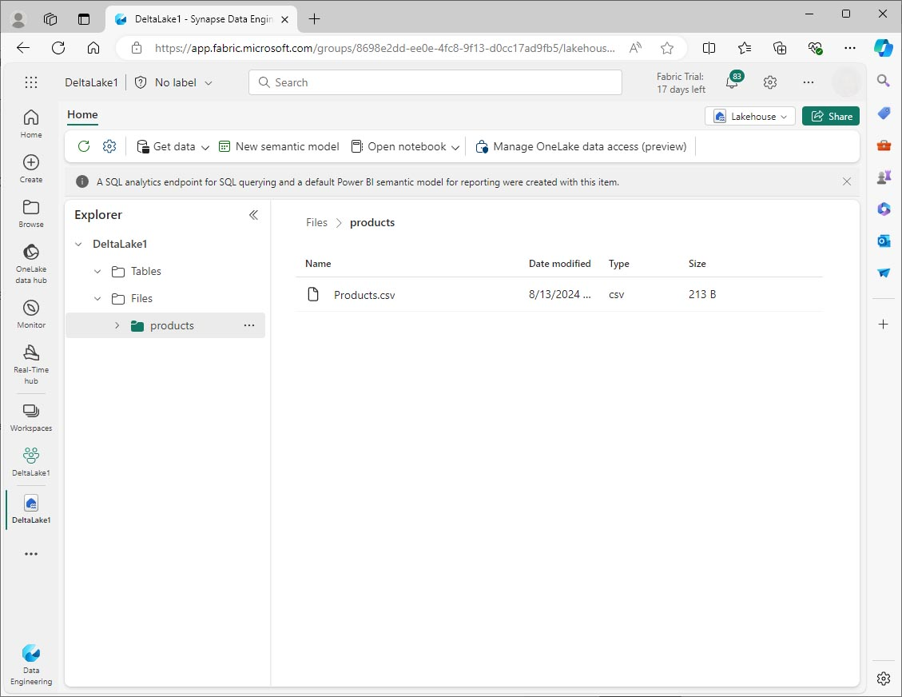

---
lab:
  title: Verwenden von Deltatabellen in Apache Spark
  module: Work with Delta Lake tables in Microsoft Fabric
---

# Verwenden von Deltatabellen in Apache Spark

Die Tabellen in einem Microsoft Fabric Lakehouse basieren auf dem Open-Source-Format Delta Lake. Delta Lake bietet Support für relationale Semantik sowohl für Batch- als auch für Streaming-Daten. In dieser Übung werden Sie Deltatabellen erstellen und die Daten mithilfe von SQL-Abfragen untersuchen.

Diese Übung dauert ca. **45** Minuten.

> [!NOTE]
> Sie benötigen eine [Microsoft Fabric](/fabric/get-started/fabric-trial) Testversion, um diese Übung durchzuführen.

## Erstellen eines Arbeitsbereichs

Erstellen Sie zunächst einen Arbeitsbereich mit  *Fabric* aktiviert.

1. Navigieren Sie in einem Browser unter `https://app.fabric.microsoft.com/home?experience=fabric` zur [Microsoft Fabric-Startseite](https://app.fabric.microsoft.com/home?experience=fabric) und melden Sie sich mit Ihren Fabric-Anmeldeinformationen an.
1. Wählen Sie in der Menüleiste auf der linken Seite **Arbeitsbereiche** (🗇).
1. Erstellen Sie einen **neuen Arbeitsbereich** mit einem Namen Ihrer Wahl und wählen Sie einen Lizenzierungsmodus, der Fabric-Kapazität beinhaltet (Trial, Premium oder Fabric).
1. Wenn Ihr neuer Arbeitsbereich geöffnet wird, sollte er leer sein.

    

## Erstellen eines Lakehouse und Hochladen von Daten

Jetzt, wo Sie einen Arbeitsbereich haben, ist es an der Zeit, ein Lakehouse zu erstellen und einige Daten hochzuladen.

1. Wählen Sie in der Menüleiste auf der linken Seite **Erstellen** aus. Wählen Sie auf der Seite *Neu* unter dem Abschnitt *Datentechnik* die Option **Lakehouse** aus. Wählen Sie einen eindeutigen Namen Ihrer Wahl aus.

    >**Hinweis**: Wenn die Option **Erstellen** nicht an die Seitenleiste angeheftet ist, müssen Sie zuerst die Ellipses-Option (**…**) auswählen.

1. Es gibt verschiedene Möglichkeiten, Daten zu erfassen. In dieser Übung laden Sie jedoch eine Textdatei auf Ihren lokalen Computer (oder ggf. auf die Lab-VM) herunter und laden sie dann auf Ihr Lakehouse hoch. Laden Sie die [Datendatei](https://github.com/MicrosoftLearning/dp-data/raw/main/products.csv) von `https://github.com/MicrosoftLearning/dp-data/raw/main/products.csv` herunter und speichern Sie sie als *Produkte.csv*.
1.  Kehren Sie zu der Registerkarte des Webbrowsers zurück, die Ihr Lakehouse enthält, und wählen Sie im Explorer-Bereich neben dem Ordner **Dateien** das Menü mit den drei Punkten (...) aus. Menü.  Erstellen Sie einen **neuen Unterordner** namens *Produkte*.
1.  Geben Sie Feld Menü für den Produktordner, **laden Sie die *products.csv* Datei von Ihrem lokalen Computer (oder lab VM, falls zutreffend) hoch**.
1.  Nachdem die Datei hochgeladen wurde, wählen Sie den Ordner **Produkte** aus, um zu überprüfen, ob die Datei hochgeladen wurde, wie hier gezeigt:

    
  
## Untersuchen von Daten in einem Dataframe

1.  Erstellen Sie ein **neues Notebook**. Nach einigen Sekunden wird ein neues Notebook mit einer einzelnen Zelle geöffnet. Notebooks bestehen aus einer oder mehreren Zellen, die Code oder Markdown (formatierten Text) enthalten können.
2.  Markieren Sie die erste Zelle (die momentan eine Codezelle ist), und verwenden Sie dann in der oberen rechten Symbolleiste die Schaltfläche **M↓**, um sie in eine Abschriftenzelle umzuwandeln. Der in der Zelle enthaltene Text wird dann als formatierter Text angezeigt. Verwenden Sie Markdownzellen, um erläuternde Informationen zu Ihrem Code bereitzustellen.
3.  Verwenden Sie die Schaltfläche 🖉 (Bearbeiten), um die Zelle in den Bearbeitungsmodus zu schalten, und ändern Sie dann das Markdown wie folgt:

    ```markdown
    # Delta Lake tables 
    Use this notebook to explore Delta Lake functionality 
    ```

4. Klicken Sie außerhalb der Zelle auf eine beliebige Stelle im Notebook, um die Bearbeitung zu beenden und die gerenderte Markdownzelle anzuzeigen.
5. Fügen Sie eine neue Codezelle hinzu, und fügen Sie den folgenden Code ein, um die Produktdaten mit Hilfe eines definierten Schemas in einen DataFrame zu lesen:

    ```python
    from pyspark.sql.types import StructType, IntegerType, StringType, DoubleType

    # define the schema
    schema = StructType() \
    .add("ProductID", IntegerType(), True) \
    .add("ProductName", StringType(), True) \
    .add("Category", StringType(), True) \
    .add("ListPrice", DoubleType(), True)

    df = spark.read.format("csv").option("header","true").schema(schema).load("Files/products/products.csv")
    # df now is a Spark DataFrame containing CSV data from "Files/products/products.csv".
    display(df)
    ```

> [!TIP]
> Blenden Sie die Explorer-Fenster aus oder ein, indem Sie das Chevron-Symbol « verwenden. So können Sie sich entweder auf das Notebook oder auf Ihre Dateien konzentrieren.

7. Benutzen Sie die Schaltfläche **Zelle ausführen** (▷) auf der linken Seite der Zelle, um sie zu starten.

> [!NOTE]
> Da dies das erste Mal ist, dass Sie den Code in diesem Notebook ausführen, muss eine Spark-Sitzung gestartet werden. Dadurch kann der Abschluss der ersten Ausführung etwa eine Minute dauern. Nachfolgende Ausführungen erfolgen schneller.

8. Wenn der Zellenbefehl abgeschlossen ist, überprüfen Sie die Ausgabe unterhalb der Zelle, die wie folgt aussehen sollte:

    
 
## Erstellen von Deltatabellen

Sie können den DataFrame als Delta-Tabelle speichern, indem Sie die Methode *saveAsTable* verwenden. Delta Lake unterstützt die Erstellung von verwalteten und externen Tabellen.

   * **Verwaltete** Delta-Tabellen profitieren von einer höheren Leistung, da Fabric sowohl die Schema-Metadaten als auch die Datendateien verwaltet.
   * **Externe** Tabellen ermöglichen es Ihnen, Daten extern zu speichern, wobei die Metadaten von Fabric verwaltet werden.

### Erstellen einer verwalteten Tabelle

Die Datendateien werden im Ordner **Tabellen** erstellt.

1. Verwenden Sie unter den Ergebnissen der ersten Codezelle das Symbol „+ Code“, um eine neue Codezelle hinzuzufügen.

> [!TIP]
> Um das Symbol für „+ Code“ zu sehen, bewegen Sie die Maus direkt unter und links neben die Ausgabe der aktuellen Zelle. Alternativ dazu können Sie in der Menüleiste auf der Registerkarte „Bearbeiten“ **+ Codezelle hinzufügen** auswählen.

2. Um eine verwaltete Deltatabelle zu erstellen, fügen Sie eine neue Zelle hinzu, geben den folgenden Code ein und führen die Zelle dann aus:

    ```python
    df.write.format("delta").saveAsTable("managed_products")
    ```

3.  **Aktualisieren** Sie im Explorer von Lakehouse den Ordner „Tabellen“ und erweitern Sie den Tabellen-Knoten, um zu überprüfen, ob die Tabelle **managed_products** erstellt wurde.

>[!NOTE]
> Das Dreieckssymbol neben dem Dateinamen gibt eine Deltatabelle an.

Die Dateien für verwaltete Tabellen werden im Ordner **Tabellen** im Lakehouse gespeichert. Es wurde ein Ordner mit dem Namen *managed_products* erstellt, in dem die Parquet-Dateien und der Ordner „delta_log“ für die Tabelle gespeichert werden.

### Erstellen einer externen Tabelle

Sie können auch externe Tabellen erstellen, die an einem anderen Ort als dem Lakehouse gespeichert sein können, wobei die Schemametadaten im Lakehouse gespeichert werden.

1.  Im Explorer-Fenster von Lakehouse, im Bereich ... Menü für den Ordner **Dateien**, wählen Sie **ABFS-Pfad kopieren**. Der ABFS-Pfad ist der vollständig qualifizierte Pfad zum Ordner mit den Lakehouse-Dateien.

2.  Fügen Sie den ABFS-Pfad in eine neue Codezelle ein. Fügen Sie den folgenden Code hinzu und verwenden Sie Ausschneiden und Einfügen, um den abfs_path an der richtigen Stelle im Code einzufügen:

    ```python
    df.write.format("delta").saveAsTable("external_products", path="abfs_path/external_products")
    ```

3. Der vollständige Pfad sollte etwa wie folgt aussehen:

    ```python
    abfss://workspace@tenant-onelake.dfs.fabric.microsoft.com/lakehousename.Lakehouse/Files/external_products
    ```

4. **Führen Sie** die Zelle aus, um den DataFrame als externe Tabelle im Ordner „Files/external_products“ zu speichern.

5.  **Aktualisieren** Sie im Lakehouse-Explorerfenster den Tabellenordner und erweitern Sie den Tabellenknoten. Überprüfen Sie, ob die Tabelle „external_products“ mit den Schemametadaten erstellt wurde.

6.  Im Explorer-Fenster von Lakehouse, im Bereich ... Menü für den Ordner „Dateien“, wählen Sie **Aktualisieren**. Erweitern Sie dann den Knoten „Dateien“ und überprüfen Sie, ob der Ordner „external_products“ für die Datendateien der Tabelle erstellt wurde.

### Vergleichen verwalteter und externer Tabellen

Lassen Sie uns die Unterschiede zwischen verwalteten und externen Tabellen mithilfe des Magic-Befehls „%%sql“ erkunden.

1. Geben Sie in eine neue Codezelle den folgenden Code ein:

    ```python
    %%sql
    DESCRIBE FORMATTED managed_products;
    ```

2. In den Ergebnissen können Sie die Tabelle nach der Speicherorteigenschaft anzeigen. Klicken Sie auf den Speicherortwert in der Spalte „Datentyp“, um den vollständigen Pfad anzuzeigen. Beachten Sie, dass der OneLake-Speicherort mit /Tables/managed_products endet.

3. Ändern Sie den DESCRIBE-Befehl, um die Details der external_products-Tabelle wie hier dargestellt anzuzeigen:

    ```python
    %%sql
    DESCRIBE FORMATTED external_products;
    ```

4. Führen Sie die Zelle aus und sehen Sie sich in den Ergebnissen die Eigenschaft „Speicherort“ für die Tabelle an. Erweitern Sie die Spalte „Datentyp“, um den vollständigen Pfad anzuzeigen, und beachten Sie, dass die OneLake-Speicherorte mit /Files/external_products enden.

5. Geben Sie in eine neue Codezelle den folgenden Code ein:

    ```python
    %%sql
    DROP TABLE managed_products;
    DROP TABLE external_products;
    ```

6. **Aktualisieren** Sie im Lakehouse-Explorerfenster den Tabellenordner, um zu überprüfen, dass im Tabellenknoten keine Tabellen aufgeführt sind.
7.  **Aktualisieren** Sie im Lakehouse- Explorerfenster den Ordner „Dateien“ und stellen Sie sicher, dass die Datei „external_products“ *nicht* gelöscht wurde. Wählen Sie diesen Ordner, um die Parquet-Datendateien und den Ordner „_delta_log“ anzuzeigen. 

Die Metadaten für die externe Tabelle wurden gelöscht, aber nicht die Datendatei.

## Verwenden Sie SQL, um eine Deltatabelle zu erstellen

Sie erstellen nun eine Deltatabelle mit dem Magic-Befehl „%%sql“. 

1. Fügen Sie eine weitere Codezelle hinzu, und führen Sie den Code aus:

    ```python
    %%sql
    CREATE TABLE products
    USING DELTA
    LOCATION 'Files/external_products';
    ```

2. Im Explorer-Fenster von Lakehouse, im Bereich ... Menü für den Ordner **Tabellen**, wählen Sie **Aktualisieren**. Erweitern Sie dann den Tabellenknoten und überprüfen Sie, ob eine neue Tabelle mit dem Namen *Produkte* aufgeführt ist. Erweitern Sie dann die Tabelle, um das Schema anzuzeigen.

3. Fügen Sie eine weitere Codezelle hinzu, und führen Sie den Code aus:

    ```python
    %%sql
    SELECT * FROM products;
    ```

## Erkunden der Tabellenversionsverwaltung

Der Transaktionsverlauf für Deltatabellen wird in JSON-Dateien im Ordner „delta_log“ gespeichert. Sie können dieses Transaktionsprotokoll verwenden, um die Datenversionsverwaltung zu verwalten.

1.  Fügen Sie dem Notebook eine neue Codezelle hinzu, und führen Sie den folgenden Code aus, der eine Reduzierung des Preises von 10 % für Mountainbikes implementiert:

    ```python
    %%sql
    UPDATE products
    SET ListPrice = ListPrice * 0.9
    WHERE Category = 'Mountain Bikes';
    ```

2. Fügen Sie eine weitere Codezelle hinzu, und führen Sie den Code aus:

    ```python
    %%sql
    DESCRIBE HISTORY products;
    ```

Die Ergebnisse zeigen den Verlauf der Transaktionen, die für die Tabelle aufgezeichnet wurden.

3.  Fügen Sie eine weitere Codezelle hinzu, und führen Sie den Code aus:

    ```python
    delta_table_path = 'Files/external_products'
    # Get the current data
    current_data = spark.read.format("delta").load(delta_table_path)
    display(current_data)

    # Get the version 0 data
    original_data = spark.read.format("delta").option("versionAsOf", 0).load(delta_table_path)
    display(original_data)
    ```

Es werden zwei Ergebnissätze zurückgegeben - einer mit den Daten nach der Preissenkung, der andere mit der ursprünglichen Version der Daten.

## Analysieren von Daten in Deltatabellen mit SQL-Abfragen

Mit dem SQL Magic-Befehl können Sie die SQL-Syntax anstelle von Pyspark verwenden. Hier erstellen Sie eine temporäre Ansicht aus der Produkttabelle mit einer `SELECT`-Anweisung.

1. Fügen Sie eine neue Codezelle hinzu, und führen Sie den folgenden Code aus, um die temporäre Ansicht zu erstellen und anzuzeigen:

    ```python
    %%sql
    -- Create a temporary view
    CREATE OR REPLACE TEMPORARY VIEW products_view
    AS
        SELECT Category, COUNT(*) AS NumProducts, MIN(ListPrice) AS MinPrice, MAX(ListPrice) AS MaxPrice, AVG(ListPrice) AS AvgPrice
        FROM products
        GROUP BY Category;

    SELECT *
    FROM products_view
    ORDER BY Category;    
    ```

2. Fügen Sie eine neue Codezelle hinzu, und führen Sie den folgenden Code aus, um die 10 wichtigsten Kategorien nach Anzahl der Produkte zu ermitteln:

    ```python
    %%sql
    SELECT Category, NumProducts
    FROM products_view
    ORDER BY NumProducts DESC
    LIMIT 10;
    ```

3. Wenn die Daten zurückgegeben werden, wählen Sie die Ansicht **Diagramm**, um ein Balkendiagramm anzuzeigen.

    

Alternativ können Sie eine SQL-Abfrage mit PySpark ausführen.

4. Fügen Sie den folgenden Code in einer neuen Codezelle hinzu und führen Sie ihn aus:

    ```python
    from pyspark.sql.functions import col, desc

    df_products = spark.sql("SELECT Category, MinPrice, MaxPrice, AvgPrice FROM products_view").orderBy(col("AvgPrice").desc())
    display(df_products.limit(6))
    ```

## Verwenden von Delta-Tabellen für Streaming-Daten

Delta Lake unterstützt Streaming-Daten. Deltatabellen können eine Senke oder Quelle für Datenströme sein, die mit der Spark Structured Streaming-API erstellt wurden. In diesem Beispiel verwenden Sie eine Deltatabelle als Senke für einige Streamingdaten in einem simulierten IoT-Szenario (Internet der Dinge).

1.  Fügen Sie eine neue Codezelle hinzu, fügen Sie den folgenden Code ein und führen Sie ihn aus:

    ```python
    from notebookutils import mssparkutils
    from pyspark.sql.types import *
    from pyspark.sql.functions import *

    # Create a folder
    inputPath = 'Files/data/'
    mssparkutils.fs.mkdirs(inputPath)

    # Create a stream that reads data from the folder, using a JSON schema
    jsonSchema = StructType([
    StructField("device", StringType(), False),
    StructField("status", StringType(), False)
    ])
    iotstream = spark.readStream.schema(jsonSchema).option("maxFilesPerTrigger", 1).json(inputPath)

    # Write some event data to the folder
    device_data = '''{"device":"Dev1","status":"ok"}
    {"device":"Dev1","status":"ok"}
    {"device":"Dev1","status":"ok"}
    {"device":"Dev2","status":"error"}
    {"device":"Dev1","status":"ok"}
    {"device":"Dev1","status":"error"}
    {"device":"Dev2","status":"ok"}
    {"device":"Dev2","status":"error"}
    {"device":"Dev1","status":"ok"}'''

    mssparkutils.fs.put(inputPath + "data.txt", device_data, True)

    print("Source stream created...")
    ```

Sicherstellen, dass die Meldung *Quell-Stream erstellt...* angezeigt. Der Code, den Sie gerade ausgeführt haben, hat eine Streamingdatenquelle basierend auf einem Ordner erstellt, in dem einige Daten gespeichert wurden, die Messwerte von hypothetischen IoT-Geräten darstellen.

2. Fügen Sie den folgenden Code in einer neuen Codezelle hinzu, und führen Sie ihn aus:

    ```python
    # Write the stream to a delta table
    delta_stream_table_path = 'Tables/iotdevicedata'
    checkpointpath = 'Files/delta/checkpoint'
    deltastream = iotstream.writeStream.format("delta").option("checkpointLocation", checkpointpath).start(delta_stream_table_path)
    print("Streaming to delta sink...")
    ```

Dieser Code schreibt die Streaminggerätedaten im Deltaformat in einen Ordner mit dem Namen iotdevicedata. Da der Pfad für den Ordnerspeicherort im Ordner Tabellen angegeben ist, wird automatisch eine Tabelle für ihn erstellt.

3. Fügen Sie den folgenden Code in einer neuen Codezelle hinzu, und führen Sie ihn aus:

    ```python
    %%sql
    SELECT * FROM IotDeviceData;
    ```

Dieser Code fragt die Tabelle IotDeviceData ab, die die Gerätedaten aus der Streamingquelle enthält.

4. Fügen Sie den folgenden Code in einer neuen Codezelle hinzu, und führen Sie ihn aus:

    ```python
    # Add more data to the source stream
    more_data = '''{"device":"Dev1","status":"ok"}
    {"device":"Dev1","status":"ok"}
    {"device":"Dev1","status":"ok"}
    {"device":"Dev1","status":"ok"}
    {"device":"Dev1","status":"error"}
    {"device":"Dev2","status":"error"}
    {"device":"Dev1","status":"ok"}'''

    mssparkutils.fs.put(inputPath + "more-data.txt", more_data, True)
    ```

Dieser Code schreibt weitere hypothetische Gerätedaten in die Streamingquelle.

5. Führen Sie die Zelle mit dem folgenden Code erneut aus:

    ```python
    %%sql
    SELECT * FROM IotDeviceData;
    ```

Dieser Code fragt die IotDeviceData-Tabelle erneut ab, die nun die zusätzlichen Daten enthalten sollte, die der Streamingquelle hinzugefügt wurden.

6. Fügen Sie in einer neuen Codezelle Code hinzu, um den Datenstrom zu beenden und die Zelle auszuführen:

    ```python
    deltastream.stop()
    ```

## Bereinigen von Ressourcen

In dieser Übung haben Sie gelernt, wie man mit Deltatabellen in Microsoft Fabric arbeitet.

Wenn Sie mit der Erkundung Ihres Lakehouses fertig sind, können Sie den für diese Übung erstellten Arbeitsbereich löschen.

1. Wählen Sie auf der Leiste auf der linken Seite das Symbol für Ihren Arbeitsbereich aus, um alle darin enthaltenen Elemente anzuzeigen.
2. Geben Sie Feld Menü auf der Symbolleiste, wählen Sie **Arbeitsbereichseinstellungen**.
3. Wählen Sie im Abschnitt Allgemein die Option **Diesen Arbeitsbereich entfernen**.
