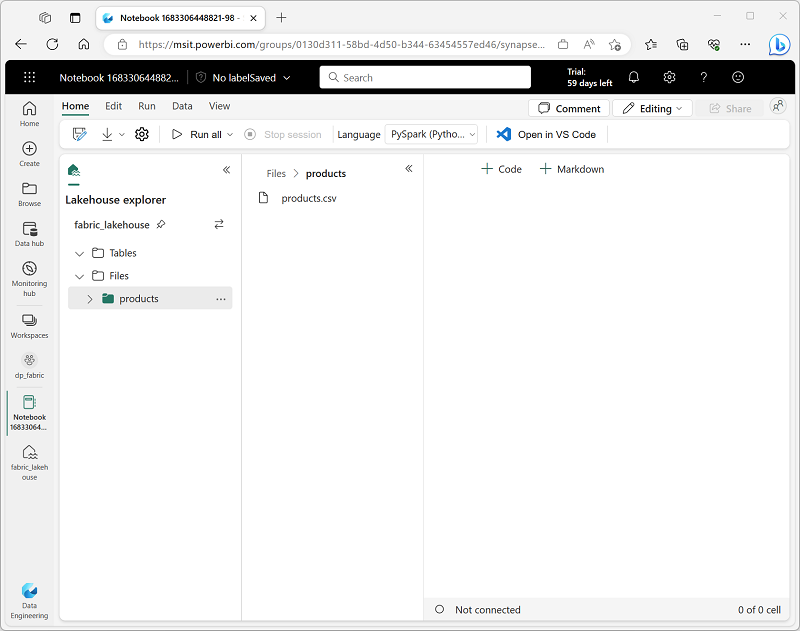

---
lab:
  title: Verwenden von Deltatabellen in Apache Spark
  module: Work with Delta Lake tables in Microsoft Fabric
---

# Verwenden von Deltatabellen in Apache Spark

Die Tabellen in einem Microsoft Fabric-Lakehouse basieren auf dem Open-Source-Format von *Delta Lake* für Spark. Delta Lake bietet Unterstützung für relationale Semantik für Batch- und Streamingdatenvorgänge und ermöglicht die Erstellung einer Lakehouse-Architektur, in der Apache Spark zum Verarbeiten und Abfragen von Daten in Tabellen verwendet werden kann, die auf zugrunde liegenden Dateien in einem Data Lake basieren.

Diese Übung dauert ca. **40** Minuten.

> **Hinweis:** Sie benötigen eine [Microsoft Fabric-Testversion](https://learn.microsoft.com/fabric/get-started/fabric-trial), um diese Übung abzuschließen.

## Erstellen eines Arbeitsbereichs

Erstellen Sie vor dem Arbeiten mit Daten in Fabric einen Arbeitsbereich mit aktivierter Fabric-Testversion.

1. Wählen Sie auf der [Microsoft Fabric-Homepage](https://app.fabric.microsoft.com) unter `https://app.fabric.microsoft.com` die Option **Datentechnik mit Synapse** aus.
2. Wählen Sie auf der Menüleiste auf der linken Seite **Arbeitsbereiche** aus (Symbol ähnelt &#128455;).
3. Erstellen Sie einen neuen Arbeitsbereich mit einem Namen Ihrer Wahl, und wählen Sie einen Lizenzierungsmodus mit Fabric-Kapazitäten aus (*Testversion*, *Premium* oder *Fabric*).
4. Wenn Ihr neuer Arbeitsbereich geöffnet wird, sollte er leer sein.

    

## Erstellen eines Lakehouse und Hochladen von Daten

Da Sie nun einen Arbeitsbereich besitzen, ist es an der Zeit, ein Data Lakehouse für die Daten zu erstellen, die analysiert werden sollen.

1. Erstellen Sie auf der Startseite **Datentechnik mit Synapse** ein neues **Lakehouse** mit einem Namen Ihrer Wahl.

    Nach etwa einer Minute ist ein neues leeres Lakehouse fertig. Sie müssen einige Daten für die Analyse in das Data Lakehouse einfügen. Es gibt mehrere Möglichkeiten, dies zu tun, aber in dieser Übung laden Sie einfach eine Textdatei auf Ihrem lokalen Computer (oder ggf. einer Lab-VM) herunter, extrahieren sie und laden sie dann in Ihr Lakehouse hoch.

1. Laden Sie die [Datendatei](https://github.com/MicrosoftLearning/dp-data/raw/main/products.csv) für diese Übung von `https://github.com/MicrosoftLearning/dp-data/raw/main/products.csv` herunter und speichern Sie diese als **products.csv** auf Ihrem lokalen Computer (oder ggf. auf Ihrer Lab-VM).

1. Kehren Sie zur Webbrowser-Registerkarte mit Ihrem Lakehouse zurück, und wählen Sie im Menü **...** für den Ordner **Files** im Bereich **Explorer** die Option **Neuer Unterordner** aus, und erstellen Sie einen Ordner namens **products**.

1. Wählen Sie im Menü **...** für den Ordner **products** die Optionen **Hochladen** und **Dateien hochladen** aus. Laden Sie dann die Datei **products.csv** von Ihrem lokalen Computer (oder ggf. einer Lab-VM) in das Lakehouse hoch.
1. Nachdem die Datei hochgeladen wurde, wählen Sie den Ordner **products**, und vergewissern Sie sich, dass die Datei **products.csv** hochgeladen wurde, wie hier gezeigt:

    

## Untersuchen von Daten in einem Dataframe

1. Wählen Sie beim Anzeigen des Inhalts des Ordners **products** in Ihrem Data Lake auf der Seite **Home** im Menü **Notebook öffnen** die Option **Neues Notebook** aus.

    Nach einigen Sekunden wird ein neues Notebook mit einer einzelnen *Zelle* geöffnet. Notebooks bestehen aus einer oder mehreren Zellen, die *Code* oder *Markdown* (formatierten Text) enthalten können.

2. Wählen Sie die vorhandene Zelle im Notizbuch aus, die einfachen Code enthält, und verwenden Sie dann das Symbol **&#128465;** (*Löschen*) oben rechts, um sie zu entfernen. Sie benötigen diesen Code nicht.
3. Erweitern Sie im Bereich **Lakehouse-Explorer** auf der linken Seite **Dateien**, und wählen Sie **products** aus, um einen neuen Bereich mit der **products.csv**-Datei anzuzeigen, die Sie zuvor hochgeladen haben:

    

4. Wählen Sie im Menü **...** für **products.csv** die Option **Daten laden** > **Spark** aus. Dem Notebook sollte eine neue Codezelle mit folgendem Code hinzugefügt werden:

    ```python
   df = spark.read.format("csv").option("header","true").load("Files/products/products.csv")
   # df now is a Spark DataFrame containing CSV data from "Files/products/products.csv".
   display(df)
    ```

    > **Tipp**: Sie können den Bereich mit den Dateien auf der linken Seite ausblenden, indem Sie das **<<** -Symbol verwenden. Dies hilft Ihnen, sich auf das Notebook zu konzentrieren.

5. Verwenden Sie die Schaltfläche **&#9655;** (*Zelle ausführen*) links neben der Zelle, um diese auszuführen.

    > **Hinweis:** Da Sie zum ersten Mal Spark-Code in diesem Notebook ausführen, muss eine Spark-Sitzung gestartet werden. Dadurch kann der Abschluss der ersten Ausführung etwa eine Minute dauern. Nachfolgende Ausführungen erfolgen schneller.

6. Wenn der Zellenbefehl abgeschlossen ist, überprüfen Sie die Ausgabe unterhalb der Zelle, die wie folgt aussehen sollte:

    | Index | ProductID | ProductName | Kategorie | ListPrice |
    | -- | -- | -- | -- | -- |
    | 1 | 771 | Mountain-100 Silver, 38 | Mountainbikes | 3399.9900 |
    | 2 | 772 | Mountain-100 Silver, 42 | Mountainbikes | 3399.9900 |
    | 3 | 773 | Mountain-100 Silver, 44 | Mountainbikes | 3399.9900 |
    | ... | ... | ... | ... | ... |

## Erstellen von Deltatabellen

Sie können einen Dataframe als Deltatabelle speichern, indem Sie die `saveAsTable`-Methode verwenden. Delta Lake unterstützt die Erstellung von *verwalteten* und *externen* Tabellen.

### Erstellen einer *verwalteten* Tabelle

*Verwaltete* Tabellen sind Tabellen, für die sowohl die Schemametadaten als auch die Datendateien von Fabric verwaltet werden. Die Datendateien für die Tabelle werden im Ordner **Tabellen** erstellt.

1. Verwenden Sie unter den Ergebnissen, die von der ersten Codezelle zurückgegeben werden, das Symbol **+ Code**, um eine neue Codezelle hinzuzufügen, falls noch keine vorhanden ist.

    > **Tipp**: Um das Symbol **+ Code** anzuzeigen, zeigen Sie mit dem Mauszeiger direkt links unter die Ausgabe der aktuellen Zelle. Alternativ können Sie auf der Menüleiste auf der Registerkarte **Bearbeiten** die Option **+ Codezelle hinzufügen** auswählen.

2. Geben Sie den folgenden Code in die neue Zelle ein und führen Sie ihn aus:

    ```python
   df.write.format("delta").saveAsTable("managed_products")
    ```

3. Klicken Sie im Bereich **Lakehouse-Explorer** im Menü **...** für den Ordner **Tables** auf die Option **Aktualisieren**. Erweitern Sie dann den Knoten **Tabellen**, und überprüfen Sie, ob die **managed_products**-Tabelle erstellt wurde.

### Erstellen einer *externen* Tabelle

Sie können auch *externe* Tabellen erstellen, für die die Schemametadaten im Metastore für das Lakehouse definiert sind, die Datendateien jedoch an einem externen Speicherort gespeichert werden.

1. Fügen Sie eine weitere neue Codezelle hinzu, und fügen Sie ihr den folgenden Code hinzu:

    ```python
   df.write.format("delta").saveAsTable("external_products", path="abfs_path/external_products")
    ```

2. Wählen Sie im Bereich **Lakehouse-Explorer** im Menü **...** für den Ordner **Files** die Option **ABFS-Pfad kopieren** aus.

    Der ABFS-Pfad ist der vollqualifizierte Pfad zum Ordner **Files** im OneLake-Speicher für Ihr Lakehouse – ähnlich wie hier:

    *abfss://workspace@tenant-onelake.dfs.fabric.microsoft.com/lakehousename.Lakehouse/Files*

3. Ersetzen Sie in dem Code, den Sie in die Codezelle eingegeben haben, **<abfs_path>** durch den Pfad, den Sie in die Zwischenablage kopiert haben, damit der Code den Dataframe als externe Tabelle mit Datendateien in einem Ordner namens **external_products** in Ihrem Ordner **Files** speichert. Der vollständige Pfad sollte etwa wie folgt aussehen:

    *abfss://workspace@tenant-onelake.dfs.fabric.microsoft.com/lakehousename.Lakehouse/Files/external_products*

4. Klicken Sie im Bereich **Lakehouse-Explorer** im Menü **...** für den Ordner **Tables** auf die Option **Aktualisieren**. Erweitern Sie dann den Knoten **Tabellen**, und überprüfen Sie, ob die **external_products**-Tabelle erstellt wurde.

5. Klicken Sie im Bereich **Lakehouse-Explorer** im Menü **...** für den Ordner **Files** auf die Option **Aktualisieren**. Erweitern Sie dann den Knoten **Dateien**, und überprüfen Sie, ob der Ordner **external_products** für die Datendateien der Tabelle erstellt wurde.

### Vergleichen *verwalteter* und *externer* Tabellen

Lassen Sie uns die Unterschiede zwischen verwalteten und externen Tabellen untersuchen.

1. Fügen Sie eine weitere Codezelle hinzu, und führen Sie den Code aus:

    ```sql
   %%sql

   DESCRIBE FORMATTED managed_products;
    ```

    Zeigen Sie in den Ergebnissen die **Location**-Eigenschaft für die Tabelle an, die ein Pfad zum OneLake-Speicher für das Lakehouse sein sollte, der auf **/Tables/managed_products** endet (Möglicherweise müssen Sie die Spalte **Datentyp** erweitern, um den vollständigen Pfad anzuzeigen).

2. Ändern Sie den `DESCRIBE`-Befehl, um die Details der Tabelle **external_products** anzuzeigen, wie hier gezeigt:

    ```sql
   %%sql

   DESCRIBE FORMATTED external_products;
    ```

    Zeigen Sie in den Ergebnissen die **Location**-Eigenschaft für die Tabelle an, die ein Pfad zum OneLake-Speicher für das Lakehouse sein sollte, der auf **/Files/external_products** endet (Möglicherweise müssen Sie die Spalte **Datentyp** erweitern, um den vollständigen Pfad anzuzeigen).

    Die Dateien für die verwaltete Tabelle werden im Ordner **Tabellen** im OneLake-Speicher für das Lakehouse gespeichert. In diesem Fall wurde ein Ordner mit dem Namen **managed_products** erstellt, um die Parquet-Dateien und den Ordner **delta_log** für die von Ihnen erstellte Tabelle zu speichern.

3. Fügen Sie eine weitere Codezelle hinzu, und führen Sie den Code aus:

    ```sql
   %%sql

   DROP TABLE managed_products;
   DROP TABLE external_products;
    ```

4. Klicken Sie im Bereich **Lakehouse-Explorer** im Menü **...** für den Ordner **Tables** auf die Option **Aktualisieren**. Erweitern Sie dann den Knoten **Tabellen**, und vergewissern Sie sich, dass keine Tabellen aufgeführt sind.

5. Erweitern Sie im Bereich **Lakehouse-Explorer** den Ordner **Dateien**, und überprüfen Sie, ob **external_products** nicht gelöscht wurde. Wählen Sie diesen Ordner aus, um die Parquet-Datendateien und den Ordner **_delta_log** für die Daten anzuzeigen, die sich zuvor in der Tabelle **external_products** befanden. Die Tabellenmetadaten für die externe Tabelle wurden gelöscht, aber die Dateien waren davon nicht betroffen.

### Verwenden von SQL zum Erstellen einer Tabelle

1. Fügen Sie eine weitere Codezelle hinzu, und führen Sie den Code aus:

    ```sql
   %%sql

   CREATE TABLE products
   USING DELTA
   LOCATION 'Files/external_products';
    ```

2. Klicken Sie im Bereich **Lakehouse-Explorer** im Menü **...** für den Ordner **Tables** auf die Option **Aktualisieren**. Erweitern Sie dann den Knoten **Tabellen**, und überprüfen Sie, ob eine neue Tabelle mit dem Namen **products** aufgeführt ist. Erweitern Sie dann die Tabelle, um zu überprüfen, ob das Schema dem ursprünglichen Datenrahmen entspricht, der im Ordner **external_products** gespeichert wurde.

3. Fügen Sie eine weitere Codezelle hinzu, und führen Sie den Code aus:

    ```sql
   %%sql

   SELECT * FROM products;
   ```

## Erkunden der Tabellenversionsverwaltung

Der Transaktionsverlauf für Deltatabellen wird in JSON-Dateien im Ordner **delta_log** gespeichert. Sie können dieses Transaktionsprotokoll verwenden, um die Datenversionsverwaltung zu verwalten.

1. Fügen Sie dem Notebook eine neue Codezelle hinzu, und führen Sie den folgenden Code aus:

    ```sql
   %%sql

   UPDATE products
   SET ListPrice = ListPrice * 0.9
   WHERE Category = 'Mountain Bikes';
    ```

    Dieser Code implementiert eine Preissenkung von 10 % für Mountainbikes.

2. Fügen Sie eine weitere Codezelle hinzu, und führen Sie den Code aus:

    ```sql
   %%sql

   DESCRIBE HISTORY products;
    ```

    Die Ergebnisse zeigen den Verlauf der Transaktionen, die für die Tabelle aufgezeichnet wurden.

3. Fügen Sie eine weitere Codezelle hinzu, und führen Sie den Code aus:

    ```python
   delta_table_path = 'Files/external_products'

   # Get the current data
   current_data = spark.read.format("delta").load(delta_table_path)
   display(current_data)

   # Get the version 0 data
   original_data = spark.read.format("delta").option("versionAsOf", 0).load(delta_table_path)
   display(original_data)
    ```

    Die Ergebnisse zeigen zwei Dataframes an: einer mit den Daten nach der Preissenkung und der andere mit der ursprünglichen Version der Daten.

## Verwenden von Deltatabellen zum Streamen von Daten

Delta Lake unterstützt das Streamen von Daten. Deltatabellen können eine *Senke* oder *Quelle* für Datenströme sein, die mit der Spark Structured Streaming-API erstellt wurden. In diesem Beispiel verwenden Sie eine Deltatabelle als Senke für einige Streamingdaten in einem simulierten IoT-Szenario (Internet der Dinge).

1. Fügen Sie dem Notebook eine neue Codezelle hinzu. Fügen Sie dann in der neuen Zelle den folgenden Code hinzu, und führen Sie ihn aus:

    ```python
   from notebookutils import mssparkutils
   from pyspark.sql.types import *
   from pyspark.sql.functions import *

   # Create a folder
   inputPath = 'Files/data/'
   mssparkutils.fs.mkdirs(inputPath)

   # Create a stream that reads data from the folder, using a JSON schema
   jsonSchema = StructType([
   StructField("device", StringType(), False),
   StructField("status", StringType(), False)
   ])
   iotstream = spark.readStream.schema(jsonSchema).option("maxFilesPerTrigger", 1).json(inputPath)

   # Write some event data to the folder
   device_data = '''{"device":"Dev1","status":"ok"}
   {"device":"Dev1","status":"ok"}
   {"device":"Dev1","status":"ok"}
   {"device":"Dev2","status":"error"}
   {"device":"Dev1","status":"ok"}
   {"device":"Dev1","status":"error"}
   {"device":"Dev2","status":"ok"}
   {"device":"Dev2","status":"error"}
   {"device":"Dev1","status":"ok"}'''
   mssparkutils.fs.put(inputPath + "data.txt", device_data, True)
   print("Source stream created...")
    ```

    Stellen Sie sicher, dass die Meldung *Quelldatenstrom erstellt...* ausgegeben wird. Der Code, den Sie gerade ausgeführt haben, hat eine Streamingdatenquelle basierend auf einem Ordner erstellt, in dem einige Daten gespeichert wurden, die Messwerte von hypothetischen IoT-Geräten darstellen.

2. Fügen Sie den folgenden Code in einer neuen Codezelle hinzu, und führen Sie ihn aus:

    ```python
   # Write the stream to a delta table
   delta_stream_table_path = 'Tables/iotdevicedata'
   checkpointpath = 'Files/delta/checkpoint'
   deltastream = iotstream.writeStream.format("delta").option("checkpointLocation", checkpointpath).start(delta_stream_table_path)
   print("Streaming to delta sink...")
    ```

    Dieser Code schreibt die Streaminggerätedaten im Deltaformat in einen Ordner mit dem Namen **iotdevicedata**. Da der Pfad für den Ordnerspeicherort im Ordner **Tabellen** angegeben ist, wird automatisch eine Tabelle für ihn erstellt.

3. Fügen Sie den folgenden Code in einer neuen Codezelle hinzu, und führen Sie ihn aus:

    ```sql
   %%sql

   SELECT * FROM IotDeviceData;
    ```

    Dieser Code fragt die Tabelle **IotDeviceData** ab, die die Gerätedaten aus der Streamingquelle enthält.

4. Fügen Sie den folgenden Code in einer neuen Codezelle hinzu, und führen Sie ihn aus:

    ```python
   # Add more data to the source stream
   more_data = '''{"device":"Dev1","status":"ok"}
   {"device":"Dev1","status":"ok"}
   {"device":"Dev1","status":"ok"}
   {"device":"Dev1","status":"ok"}
   {"device":"Dev1","status":"error"}
   {"device":"Dev2","status":"error"}
   {"device":"Dev1","status":"ok"}'''

   mssparkutils.fs.put(inputPath + "more-data.txt", more_data, True)
    ```

    Dieser Code schreibt weitere hypothetische Gerätedaten in die Streamingquelle.

5. Führen Sie die Zelle mit dem folgenden Code erneut aus:

    ```sql
   %%sql

   SELECT * FROM IotDeviceData;
    ```

    Dieser Code fragt die **IotDeviceData**-Tabelle erneut ab, die nun die zusätzlichen Daten enthalten sollte, die der Streamingquelle hinzugefügt wurden.

6. Fügen Sie den folgenden Code in einer neuen Codezelle hinzu, und führen Sie ihn aus:

    ```python
   deltastream.stop()
    ```

    Dieser Code beendet den Stream.

## Bereinigen von Ressourcen

In dieser Übung haben Sie gelernt, wie Sie mit Deltatabellen in Microsoft Fabric arbeiten.

Wenn Sie Ihr Lakehouse erkundet haben, können Sie den Arbeitsbereich löschen, den Sie für diese Übung erstellt haben.

1. Wählen Sie auf der Leiste auf der linken Seite das Symbol für Ihren Arbeitsbereich aus, um alle darin enthaltenen Elemente anzuzeigen.
2. Wählen Sie im Menü **...** auf der Symbolleiste die **Arbeitsbereichseinstellungen** aus.
3. Wählen Sie im Abschnitt **Andere** die Option **Diesen Arbeitsbereich entfernen** aus.
