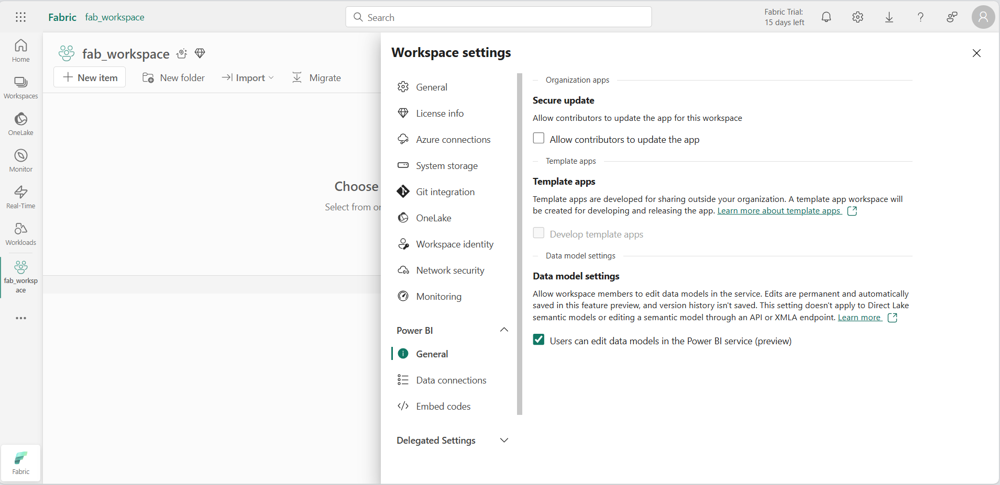

---
lab:
  title: Erstellen einer Medaillon-Architektur in einem Microsoft Fabric-Lakehouse
  module: Organize a Fabric lakehouse using medallion architecture design
---

# Erstellen einer Medaillon-Architektur in einem Microsoft Fabric-Lakehouse

In dieser Übung werden Sie mithilfe von Notebooks eine Medaillon-Architektur in einem Fabric-Lakehouse aufbauen. Sie werden einen Arbeitsbereich erstellen, ein Lakehouse anlegen, Daten in die Bronzeschicht hochladen, die Daten transformieren und in die silberne Deltatabelle laden, die Daten weiter transformieren und in die goldenen Deltatabellen laden und dann das semantische Modell erkunden und Beziehungen erstellen.

Diese Übung dauert ca. **45** Minuten.

> **Hinweis:** Sie benötigen eine [Microsoft Fabric-Testversion](https://learn.microsoft.com/fabric/get-started/fabric-trial), um diese Übung abzuschließen.

## Erstellen eines Arbeitsbereichs

Erstellen Sie vor dem Arbeiten mit Daten in Fabric einen Arbeitsbereich mit aktivierter Fabric-Testversion.

1. Navigieren Sie in einem Browser unter `https://app.fabric.microsoft.com/home?experience=fabric` zur [Microsoft Fabric-Startseite](https://app.fabric.microsoft.com/home?experience=fabric) und melden Sie sich mit Ihren Fabric-Anmeldeinformationen an.
1. Wählen Sie auf der Menüleiste auf der linken Seite **Arbeitsbereiche** aus (Symbol ähnelt &#128455;).
1. Erstellen Sie einen neuen Arbeitsbereich mit einem Namen Ihrer Wahl, und wählen Sie einen Lizenzierungsmodus mit Fabric-Kapazitäten aus (*Testversion*, *Premium* oder *Fabric*).
1. Wenn Ihr neuer Arbeitsbereich geöffnet wird, sollte er leer sein.
1. Navigieren Sie zu den Arbeitsbereichseinstellungen, und aktivieren Sie die Previewfunktion **Datenmodellbearbeitung**. Damit können Sie mithilfe eines semantischen Modells von Power BI Beziehungen zwischen Tabellen in Ihrem Lakehouse erstellen.

    

    > **Hinweis**: Möglicherweise müssen Sie die Browserregisterkarte aktualisieren, nachdem Sie die Previewfunktion aktiviert haben.

## Erstellen eines Lakehouses und Hochladen von Daten in die Bronzeschicht

Da Sie nun einen Arbeitsbereich besitzen, ist es an der Zeit, ein Data Lakehouse für die Daten zu erstellen, die analysiert werden sollen.

1. Erstellen Sie im soeben erstellten Arbeitsbereich ein neues **Lakehouse** mit dem Namen **Sales**, indem Sie auf die Schaltfläche **+ Neues Element** klicken.

    Nach etwa einer Minute wird ein neues leeres Lakehouse erstellt. Sie müssen einige Daten für die Analyse in das Data Lakehouse einfügen. Es gibt mehrere Möglichkeiten, dies zu tun, aber in dieser Übung laden Sie einfach eine Textdatei auf Ihrem lokalen Computer (oder ggf. einer Lab-VM) herunter, extrahieren sie und laden sie dann in Ihr Lakehouse hoch.

1. Laden Sie die Datendateien für diese Übung von `https://github.com/MicrosoftLearning/dp-data/blob/main/orders.zip` herunter. Extrahieren Sie die Dateien, und speichern Sie diese mit ihren ursprünglichen Namen auf Ihrem lokalen Computer (oder ggf. einer Lab-VM). Es sollten 3 Dateien mit Vertriebsdaten für 3 Jahre vorhanden sein: 2019.csv, 2020.csv und 2021.csv.

1. Kehren Sie zur Webbrowser-Registerkarte mit Ihrem Lakehouse zurück, und wählen Sie im Menü **...** für den Ordner **Dateien** im Bereich **Explorer** die Option **Neuer Unterordner** aus, und erstellen Sie einen Ordner namens **Bronze**.

1. Wählen Sie im Menü **...** für den Ordner **Bronze** die Optionen **Hochladen** und **Dateien hochladen** aus. Laden Sie dann die 3 Dateien (2019.csv, 2020.csv und 2021.csv) von Ihrem lokalen Computer (oder ggf. einer Lab-VM) in das Lakehouse hoch. Verwenden Sie die Umschalttaste, um alle drei Dateien gleichzeitig hochzuladen.

1. Nachdem die Dateien hochgeladen wurden, wählen Sie den Ordner **Bronze** aus, und überprüfen Sie dann wie im Folgenden gezeigt, dass die CSV-Dateien hochgeladen wurden:

    

## Transformieren von Daten und Laden in eine Silber-Deltatabelle

Nachdem Sie nun einige Daten in der Bronzeschicht Ihres Lakehouses haben, können Sie ein Notebook verwenden, um die Daten zu transformieren und in eine Deltatabelle in der Silberschicht zu laden.

1. Wählen Sie während dem Anzeigen des Inhalts des Ordners **Bronze** in Ihrem Data Lake auf der Seite **Home** im Menü **Notebook öffnen** die Option **Neues Notebook** aus.

    Nach einigen Sekunden wird ein neues Notebook mit einer einzelnen *Zelle* geöffnet. Notebooks bestehen aus einer oder mehreren Zellen, die *Code* oder *Markdown* (formatierten Text) enthalten können.

2. Wenn das Notebook geöffnet wird, benennen Sie es um in **Transformieren von Daten für Silber**, indem Sie oben links im Notebook den Text **Notebook xxxx** auswählen und den neuen Namen eingeben.

    

3. Wählen Sie die vorhandene Zelle im Notebook aus, die einen einfachen auskommentierten Code enthält. Markieren und löschen Sie diese beiden Zeilen – Sie werden diesen Code nicht benötigen.

   > **Hinweis**: Mit Notebooks können Sie Code in einer Vielzahl von Sprachen ausführen, einschließlich Python, Scala und SQL. In dieser Übung werden Sie PySpark und SQL verwenden. Sie können auch Markdownzellen hinzufügen, um formatierten Text und Bilder zur Dokumentation Ihres Codes bereitzustellen.

4. **Fügen Sie den folgenden Code in die Zelle ein:**

    ```python
    from pyspark.sql.types import *
    
    # Create the schema for the table
    orderSchema = StructType([
        StructField("SalesOrderNumber", StringType()),
        StructField("SalesOrderLineNumber", IntegerType()),
        StructField("OrderDate", DateType()),
        StructField("CustomerName", StringType()),
        StructField("Email", StringType()),
        StructField("Item", StringType()),
        StructField("Quantity", IntegerType()),
        StructField("UnitPrice", FloatType()),
        StructField("Tax", FloatType())
        ])
    
    # Import all files from bronze folder of lakehouse
    df = spark.read.format("csv").option("header", "true").schema(orderSchema).load("Files/bronze/*.csv")
    
    # Display the first 10 rows of the dataframe to preview your data
    display(df.head(10))
    ```

5. Verwenden Sie die Schaltfläche ****&#9655;** (*Zelle ausführen*) links neben der Zelle, um den Code auszuführen.

    > **Hinweis:** Da Sie zum ersten Mal Spark-Code in diesem Notebook ausführen, muss eine Spark-Sitzung gestartet werden. Dadurch kann der Abschluss der ersten Ausführung etwa eine Minute dauern. Nachfolgende Ausführungen erfolgen schneller.

6. Wenn der Zellenbefehl abgeschlossen ist, **überprüfen Sie die Ausgabe** unterhalb der Zelle, die wie folgt aussehen sollte:

    | Index | SalesOrderNumber | SalesOrderLineNumber | OrderDate | CustomerName | E-Mail | Element | Quantity (Menge) | UnitPrice (Stückpreis) | Tax (Steuern) |
    | -- | -- | -- | -- | -- | -- | -- | -- | -- | -- |
    | 1 | SO49172 | 1 | 2021-01-01 | Brian Howard | brian23@adventure-works.com | Road-250 Red, 52 | 1 | 2443.35 | 195.468 |
    | 2 |  SO49173 | 1 | 2021-01-01 | Linda Alvarez | linda19@adventure-works.com | Mountain-200 Silver, 38 | 1 | 2071.4197 | 165.7136 |
    | … | … | … | … | … | … | … | … | … | … |

    Der von Ihnen ausgeführte Code hat die Daten aus den CSV-Dateien im Ordner **Bronze** in ein Spark-DataFrame geladen und dann die ersten Zeilen des DataFrames angezeigt.

    > **Hinweis**: Sie können den Inhalt der Zellenausgabe löschen, ausblenden und die Größe automatisch ändern, indem Sie oben links im Ausgabebereich das Menü **...** auswählen.

7. Jetzt **fügen Sie Spalten für die Datenüberprüfung und -bereinigung hinzu**, indem Sie ein PySpark-DataFrame verwenden, um Spalten hinzuzufügen und die Werte einiger der vorhandenen Spalten zu aktualisieren. Verwenden Sie die Schaltfläche „+“, um **einen neuen Codeblock hinzuzufügen**, und fügen Sie der Zelle den folgenden Code hinzu:

    ```python
    from pyspark.sql.functions import when, lit, col, current_timestamp, input_file_name
    
    # Add columns IsFlagged, CreatedTS and ModifiedTS
    df = df.withColumn("FileName", input_file_name()) \
        .withColumn("IsFlagged", when(col("OrderDate") < '2019-08-01',True).otherwise(False)) \
        .withColumn("CreatedTS", current_timestamp()).withColumn("ModifiedTS", current_timestamp())
    
    # Update CustomerName to "Unknown" if CustomerName null or empty
    df = df.withColumn("CustomerName", when((col("CustomerName").isNull() | (col("CustomerName")=="")),lit("Unknown")).otherwise(col("CustomerName")))
    ```

    Die erste Zeile des Codes importiert die erforderlichen Funktionen aus PySpark. Anschließend fügen Sie dem DataFrame neue Spalten hinzu, sodass Sie den Quelldateinamen nachverfolgen können, ob die Bestellung als vor dem betreffenden Geschäftsjahr liegend gekennzeichnet wurde, und wann die Zeile erstellt und geändert wurde.

    Schließlich aktualisieren Sie die Spalte CustomerName auf „Unbekannt“, wenn sie NULL oder leer ist.

8. Führen Sie die Zelle aus, um den Code mithilfe der Schaltfläche ****&#9655;** (*Zelle ausführen*) auszuführen.

9. Als Nächstes definieren Sie das Schema für die Tabelle **sales_silver** in der Vertriebsdatenbank im Delta Lake-Format. Erstellen Sie einen neuen Codeblock, und fügen Sie der Zelle den folgenden Code hinzu:

    ```python
    # Define the schema for the sales_silver table
    
    from pyspark.sql.types import *
    from delta.tables import *
    
    DeltaTable.createIfNotExists(spark) \
        .tableName("sales.sales_silver") \
        .addColumn("SalesOrderNumber", StringType()) \
        .addColumn("SalesOrderLineNumber", IntegerType()) \
        .addColumn("OrderDate", DateType()) \
        .addColumn("CustomerName", StringType()) \
        .addColumn("Email", StringType()) \
        .addColumn("Item", StringType()) \
        .addColumn("Quantity", IntegerType()) \
        .addColumn("UnitPrice", FloatType()) \
        .addColumn("Tax", FloatType()) \
        .addColumn("FileName", StringType()) \
        .addColumn("IsFlagged", BooleanType()) \
        .addColumn("CreatedTS", DateType()) \
        .addColumn("ModifiedTS", DateType()) \
        .execute()
    ```

10. Führen Sie die Zelle aus, um den Code mithilfe der Schaltfläche ****&#9655;** (*Zelle ausführen*) auszuführen.

11. Wählen Sie im Bereich „Tabellen“ des Lakehouse-Explorers die Option **...** aus, und wählen Sie **Aktualisieren** aus. Die neue **sales_silver**-Tabelle sollte jetzt aufgeführt sein. Das **&#9650;** (Dreieckssymbol) gibt an, dass es sich um eine Deltatabelle handelt.

    > **Hinweis**: Wenn die neue Tabelle nicht angezeigt wird, warten Sie einige Sekunden, und wählen Sie dann erneut **Aktualisieren** aus, oder aktualisieren Sie die gesamte Browserregisterkarte.

12. Jetzt werden Sie einen **Upsert-Vorgang** für eine Deltatabelle ausführen, die vorhandenen Datensätze basierend auf bestimmten Bedingungen aktualisieren und neue Datensätze einfügen, wenn keine Übereinstimmung gefunden wird. Fügen Sie einen neuen Codeblock hinzu, und fügen Sie den folgenden Code ein:

    ```python
    # Update existing records and insert new ones based on a condition defined by the columns SalesOrderNumber, OrderDate, CustomerName, and Item.

    from delta.tables import *
    
    deltaTable = DeltaTable.forPath(spark, 'Tables/sales_silver')
    
    dfUpdates = df
    
    deltaTable.alias('silver') \
      .merge(
        dfUpdates.alias('updates'),
        'silver.SalesOrderNumber = updates.SalesOrderNumber and silver.OrderDate = updates.OrderDate and silver.CustomerName = updates.CustomerName and silver.Item = updates.Item'
      ) \
       .whenMatchedUpdate(set =
        {
          
        }
      ) \
     .whenNotMatchedInsert(values =
        {
          "SalesOrderNumber": "updates.SalesOrderNumber",
          "SalesOrderLineNumber": "updates.SalesOrderLineNumber",
          "OrderDate": "updates.OrderDate",
          "CustomerName": "updates.CustomerName",
          "Email": "updates.Email",
          "Item": "updates.Item",
          "Quantity": "updates.Quantity",
          "UnitPrice": "updates.UnitPrice",
          "Tax": "updates.Tax",
          "FileName": "updates.FileName",
          "IsFlagged": "updates.IsFlagged",
          "CreatedTS": "updates.CreatedTS",
          "ModifiedTS": "updates.ModifiedTS"
        }
      ) \
      .execute()
    ```
13. Führen Sie die Zelle aus, um den Code mithilfe der Schaltfläche ****&#9655;** (*Zelle ausführen*) auszuführen.

    Dieser Vorgang ist wichtig, da Sie damit vorhandene Datensätze in der Tabelle basierend auf den Werten bestimmter Spalten aktualisieren und neue Datensätze einfügen können, wenn keine Übereinstimmung gefunden wird. Dies ist eine häufige Anforderung, wenn Sie Daten aus einem Quellsystem laden, das möglicherweise Aktualisierungen für vorhandene sowie neue Datensätze enthält.

Sie verfügen nun über Daten in Ihrer Silber-Deltatabelle, die für die weitere Transformation und Modellierung bereit sind.

## Untersuchen von Daten in der Silberebene mithilfe des SQL-Endpunkts

Nachdem die Silberebene nun Daten enthält, können Sie den SQL-Endpunkt verwenden, um sie zu untersuchen und einige grundlegende Analysen auszuführen. Dies ist eine gute Option für Sie, wenn Sie mit SQL vertraut sind und eine grundlegende Untersuchung Ihrer Daten durchführen möchten. In dieser Übung verwenden wir die SQL-Endpunktansicht in Fabric. Beachten Sie jedoch, dass Sie auch andere Tools wie SQL Server Management Studio (SSMS) und Azure Data Explorer verwenden können.

1. Navigieren Sie zurück zu Ihrem Arbeitsbereich. Dort sind jetzt einige Ressourcen aufgelistet. Wählen Sie **Sales SQL analytics endpoint** aus, um Ihr Lakehouse in der SQL-Endpunktansicht zu öffnen.

    

2. Wählen Sie im Menüband **Neue SQL-Abfrage** aus, wodurch ein SQL-Abfrage-Editor geöffnet wird. Sie können Ihre Abfrage mit dem Menüelement **...** neben dem vorhandenen Abfragenamen im Lakehouse-Explorer-Bereich umbenennen.

   Als Nächstes führen Sie zwei SQL-Abfragen aus, um die Daten zu untersuchen.

3. Fügen Sie die folgende Abfrage in den Abfrage-Editor ein, und wählen Sie **Ausführen** aus:

    ```sql
    SELECT YEAR(OrderDate) AS Year
        , CAST (SUM(Quantity * (UnitPrice + Tax)) AS DECIMAL(12, 2)) AS TotalSales
    FROM sales_silver
    GROUP BY YEAR(OrderDate) 
    ORDER BY YEAR(OrderDate)
    ```

    Diese Abfrage berechnet den Gesamtumsatz für jedes Jahr in der Tabelle „sales_silver“. Ihre Ergebnisse sollten folgendermaßen aussehen:

    

4. Nun sehen wir uns an, welche Kundschaft am meisten (in Bezug auf die Menge) kauft. Fügen Sie die folgende Abfrage in den Abfrage-Editor ein, und wählen Sie **Ausführen** aus:

    ```sql
    SELECT TOP 10 CustomerName, SUM(Quantity) AS TotalQuantity
    FROM sales_silver
    GROUP BY CustomerName
    ORDER BY TotalQuantity DESC
    ```

      Diese Abfrage berechnet die Gesamtmenge der von jedem Kunden in der Tabelle „sales_silver“ erworbenen Artikel und gibt dann die 10 Kunden mit der größten Menge zurück.

Die Datenuntersuchung auf der Silberebene ist für die grundlegende Analyse nützlich, aber Sie müssen die Daten weiter transformieren und in einem Sternschema modellieren, um erweiterte Analysen und Berichte zu ermöglichen. Dies erledigen Sie im nächsten Abschnitt.

## Transformieren von Daten für die Goldschicht

Sie haben erfolgreich Daten aus Ihrer Bronzeschicht übernommen, sie transformiert und in eine Silber-Deltatabelle geladen. Sie werden jetzt ein neues Notebook verwenden, um die Daten weiter zu transformieren, sie in ein Sternschema zu modellieren und in Gold-Deltatabellen zu laden.

Beachten Sie, dass Sie all dies in einem einzelnen Notebook hätten tun können, aber für die Zwecke dieser Übung verwenden Sie separate Notebooks, um den Prozess der Transformation von Daten von Bronze in Silber und dann von Silber in Gold zu veranschaulichen. Dies kann beim Debuggen, bei der Problembehandlung und beim Wiederverwenden hilfreich sein.

1. Kehren Sie zur Startseite des Arbeitsbereichs zurück, und erstellen Sie ein neues Notebook mit dem Titel **Transform data for Gold**.

2. Fügen Sie im Lakehouse-Explorer-Bereich Ihr Lakehouse **Vertrieb** hinzu, indem Sie **Hinzufügen** und dann das zuvor erstellte **Vertrieb**-Lakehouse auswählen. Wählen Sie im Fenster **Add Lakehouse** die Option **Existing Lakehouse without Schema** aus. Die **sales_silver**-Tabelle sollte im Abschnitt **Tabellen** des Explorer-Bereichs angezeigt werden.

3. Entfernen Sie im vorhandenen Codeblock den Textbaustein und **fügen Sie den folgenden Code hinzu**, um Daten in Ihr DataFrame zu laden und mit dem Erstellen Ihres Sternschemas zu beginnen. Führen Sie es dann aus:

   ```python
    # Load data to the dataframe as a starting point to create the gold layer
    df = spark.read.table("Sales.sales_silver")
    ```

4. **Fügen Sie einen neuen Codeblock hinzu**, und fügen Sie den folgenden Code ein, um Ihre Datumsdimensionstabelle zu erstellen, und führen Sie sie aus:

    ```python
    from pyspark.sql.types import *
    from delta.tables import*
    
    # Define the schema for the dimdate_gold table
    DeltaTable.createIfNotExists(spark) \
        .tableName("sales.dimdate_gold") \
        .addColumn("OrderDate", DateType()) \
        .addColumn("Day", IntegerType()) \
        .addColumn("Month", IntegerType()) \
        .addColumn("Year", IntegerType()) \
        .addColumn("mmmyyyy", StringType()) \
        .addColumn("yyyymm", StringType()) \
        .execute()
    ```

    > **Hinweis**: Sie können den `display(df)`-Befehl jederzeit ausführen, um den Fortschritt Ihrer Arbeit zu überprüfen. In diesem Fall führen Sie „display(dfdimDate_gold)“ aus, um den Inhalt des dimDate_gold-DataFrames anzuzeigen.

5. Fügen Sie in einem neuen Codeblock **den folgenden Code hinzu** und führen Sie ihn aus, um ein DataFrame für Ihre Datumsdimension zu erstellen (**dimdate_gold**):

    ```python
    from pyspark.sql.functions import col, dayofmonth, month, year, date_format
    
    # Create dataframe for dimDate_gold
    
    dfdimDate_gold = df.dropDuplicates(["OrderDate"]).select(col("OrderDate"), \
            dayofmonth("OrderDate").alias("Day"), \
            month("OrderDate").alias("Month"), \
            year("OrderDate").alias("Year"), \
            date_format(col("OrderDate"), "MMM-yyyy").alias("mmmyyyy"), \
            date_format(col("OrderDate"), "yyyyMM").alias("yyyymm"), \
        ).orderBy("OrderDate")

    # Display the first 10 rows of the dataframe to preview your data

    display(dfdimDate_gold.head(10))
    ```

6. Sie teilen den Code in neue Codeblöcke, damit Sie verstehen und beobachten können, was im Notebook geschieht, während Sie die Daten transformieren. Fügen Sie in einen weiteren neuen Codeblock **den folgenden Code hinzu und führen Sie ihn aus**, um die Datumsdimension zu aktualisieren, wenn neue Daten eingehen:

    ```python
    from delta.tables import *
    
    deltaTable = DeltaTable.forPath(spark, 'Tables/dimdate_gold')
    
    dfUpdates = dfdimDate_gold
    
    deltaTable.alias('gold') \
      .merge(
        dfUpdates.alias('updates'),
        'gold.OrderDate = updates.OrderDate'
      ) \
       .whenMatchedUpdate(set =
        {
          
        }
      ) \
     .whenNotMatchedInsert(values =
        {
          "OrderDate": "updates.OrderDate",
          "Day": "updates.Day",
          "Month": "updates.Month",
          "Year": "updates.Year",
          "mmmyyyy": "updates.mmmyyyy",
          "yyyymm": "updates.yyyymm"
        }
      ) \
      .execute()
    ```

    Die Datumsdimension ist jetzt eingerichtet. Jetzt erstellen Sie Ihre Kundendimension.
7. Um die Kundendimensionstabelle zu erstellen, **fügen Sie einen neuen Codeblock hinzu**, fügen Sie den folgenden Code ein und führen Sie ihn aus:

    ```python
    from pyspark.sql.types import *
    from delta.tables import *
    
    # Create customer_gold dimension delta table
    DeltaTable.createIfNotExists(spark) \
        .tableName("sales.dimcustomer_gold") \
        .addColumn("CustomerName", StringType()) \
        .addColumn("Email",  StringType()) \
        .addColumn("First", StringType()) \
        .addColumn("Last", StringType()) \
        .addColumn("CustomerID", LongType()) \
        .execute()
    ```

8. Fügen Sie in einem neuen Codeblock **den folgenden Code hinzu** und führen Sie ihn aus, um doppelte Kunden zu löschen, bestimmte Spalten auszuwählen und die Spalte „CustomerName“ in die Namenspalten „First“ und „Last“ aufzuteilen:

    ```python
    from pyspark.sql.functions import col, split
    
    # Create customer_silver dataframe
    
    dfdimCustomer_silver = df.dropDuplicates(["CustomerName","Email"]).select(col("CustomerName"),col("Email")) \
        .withColumn("First",split(col("CustomerName"), " ").getItem(0)) \
        .withColumn("Last",split(col("CustomerName"), " ").getItem(1)) 
    
    # Display the first 10 rows of the dataframe to preview your data

    display(dfdimCustomer_silver.head(10))
    ```

     Hier haben Sie ein neues DataFrame dfdimCustomer_silver erstellt, indem Sie verschiedene Transformationen durchführten, z. B. Ablegen von Duplikaten, Auswählen bestimmter Spalten und Aufteilen der Spalte „CustomerName“, um die Spalten „Vorname“ und „Nachname“ zu erstellen. Das Ergebnis ist ein DataFrame mit bereinigten und strukturierten Kundendaten, einschließlich separater Spalten „Vorname“ und „Nachname“, die aus der Spalte „CustomerName“ extrahiert wurden.

9. Als Nächstes werden wir **die ID-Spalte für unsere Kunden erstellen**. Fügen Sie Folgendes in einen neuen Codeblock ein und führen Sie ihn aus:

    ```python
    from pyspark.sql.functions import monotonically_increasing_id, col, when, coalesce, max, lit
    
    dfdimCustomer_temp = spark.read.table("Sales.dimCustomer_gold")
    
    MAXCustomerID = dfdimCustomer_temp.select(coalesce(max(col("CustomerID")),lit(0)).alias("MAXCustomerID")).first()[0]
    
    dfdimCustomer_gold = dfdimCustomer_silver.join(dfdimCustomer_temp,(dfdimCustomer_silver.CustomerName == dfdimCustomer_temp.CustomerName) & (dfdimCustomer_silver.Email == dfdimCustomer_temp.Email), "left_anti")
    
    dfdimCustomer_gold = dfdimCustomer_gold.withColumn("CustomerID",monotonically_increasing_id() + MAXCustomerID + 1)

    # Display the first 10 rows of the dataframe to preview your data

    display(dfdimCustomer_gold.head(10))
    ```

    Hier bereinigen und transformieren Sie Kundendaten (dfdimCustomer_silver), indem Sie eine linke Anti-Verknüpfung ausführen, um Duplikate auszuschließen, die bereits in der dimCustomer_gold-Tabelle vorhanden sind, und dann eindeutige CustomerID-Werte mithilfe der Funktion monotonically_increasing_id() zu generieren.

10. Jetzt werden Sie sicherstellen, dass Ihre Kundentabelle immer auf dem neuesten Stand bleibt, wenn neue Daten eingehen. Fügen Sie Folgendes **in einen neuen Codeblock** ein und führen Sie ihn aus:

    ```python
    from delta.tables import *

    deltaTable = DeltaTable.forPath(spark, 'Tables/dimcustomer_gold')
    
    dfUpdates = dfdimCustomer_gold
    
    deltaTable.alias('gold') \
      .merge(
        dfUpdates.alias('updates'),
        'gold.CustomerName = updates.CustomerName AND gold.Email = updates.Email'
      ) \
       .whenMatchedUpdate(set =
        {
          
        }
      ) \
     .whenNotMatchedInsert(values =
        {
          "CustomerName": "updates.CustomerName",
          "Email": "updates.Email",
          "First": "updates.First",
          "Last": "updates.Last",
          "CustomerID": "updates.CustomerID"
        }
      ) \
      .execute()
    ```

11. Nun werden Sie **diese Schritte wiederholen, um Ihre Produktdimension zu erstellen**. Fügen Sie Folgendes in einen neuen Codeblock ein und führen Sie ihn aus:

    ```python
    from pyspark.sql.types import *
    from delta.tables import *
    
    DeltaTable.createIfNotExists(spark) \
        .tableName("sales.dimproduct_gold") \
        .addColumn("ItemName", StringType()) \
        .addColumn("ItemID", LongType()) \
        .addColumn("ItemInfo", StringType()) \
        .execute()
    ```

12. Fügen Sie **einen weiteren Codeblock** hinzu, um den Dataframe **product_silver** zu erstellen.
  
    ```python
    from pyspark.sql.functions import col, split, lit, when
    
    # Create product_silver dataframe
    
    dfdimProduct_silver = df.dropDuplicates(["Item"]).select(col("Item")) \
        .withColumn("ItemName",split(col("Item"), ", ").getItem(0)) \
        .withColumn("ItemInfo",when((split(col("Item"), ", ").getItem(1).isNull() | (split(col("Item"), ", ").getItem(1)=="")),lit("")).otherwise(split(col("Item"), ", ").getItem(1))) 
    
    # Display the first 10 rows of the dataframe to preview your data

    display(dfdimProduct_silver.head(10))
       ```

13. Jetzt erstellen Sie IDs für die Tabelle **dimProduct_gold**. Fügen Sie einem neuen Codeblock die folgende Syntax hinzu und führen Sie ihn aus:

    ```python
    from pyspark.sql.functions import monotonically_increasing_id, col, lit, max, coalesce
    
    #dfdimProduct_temp = dfdimProduct_silver
    dfdimProduct_temp = spark.read.table("Sales.dimProduct_gold")
    
    MAXProductID = dfdimProduct_temp.select(coalesce(max(col("ItemID")),lit(0)).alias("MAXItemID")).first()[0]
    
    dfdimProduct_gold = dfdimProduct_silver.join(dfdimProduct_temp,(dfdimProduct_silver.ItemName == dfdimProduct_temp.ItemName) & (dfdimProduct_silver.ItemInfo == dfdimProduct_temp.ItemInfo), "left_anti")
    
    dfdimProduct_gold = dfdimProduct_gold.withColumn("ItemID",monotonically_increasing_id() + MAXProductID + 1)
    
    # Display the first 10 rows of the dataframe to preview your data

    display(dfdimProduct_gold.head(10))
    ```

      Dadurch wird die nächste verfügbare Produkt-ID basierend auf den aktuellen Daten in der Tabelle berechnet, diese neuen IDs den Produkten zugewiesen und dann die aktualisierten Produktinformationen angezeigt.

14. Ähnlich wie bei den anderen Dimensionen müssen Sie sicherstellen, dass Ihre Produkttabelle immer auf dem neuesten Stand bleibt, wenn neue Daten eingehen. Fügen Sie Folgendes **in einen neuen Codeblock** ein und führen Sie ihn aus:

    ```python
    from delta.tables import *
    
    deltaTable = DeltaTable.forPath(spark, 'Tables/dimproduct_gold')
            
    dfUpdates = dfdimProduct_gold
            
    deltaTable.alias('gold') \
      .merge(
            dfUpdates.alias('updates'),
            'gold.ItemName = updates.ItemName AND gold.ItemInfo = updates.ItemInfo'
            ) \
            .whenMatchedUpdate(set =
            {
               
            }
            ) \
            .whenNotMatchedInsert(values =
             {
              "ItemName": "updates.ItemName",
              "ItemInfo": "updates.ItemInfo",
              "ItemID": "updates.ItemID"
              }
              ) \
              .execute()
      ```

      **Nachdem Sie nun Ihre Dimensionen aufgebaut haben, besteht der letzte Schritt darin, die Faktentabelle zu erstellen.**

15. Fügen Sie **in einen neuen Codeblock** den folgenden Code ein und führen Sie ihn aus, um die **Faktentabelle** zu erstellen:

    ```python
    from pyspark.sql.types import *
    from delta.tables import *
    
    DeltaTable.createIfNotExists(spark) \
        .tableName("sales.factsales_gold") \
        .addColumn("CustomerID", LongType()) \
        .addColumn("ItemID", LongType()) \
        .addColumn("OrderDate", DateType()) \
        .addColumn("Quantity", IntegerType()) \
        .addColumn("UnitPrice", FloatType()) \
        .addColumn("Tax", FloatType()) \
        .execute()
    ```

16. Fügen Sie **in einen neuen Codeblock** den folgenden Code ein und führen Sie ihn aus, um **ein neues DataFrame** zum Kombinieren von Vertriebsdaten mit Kunden- und Produktinformationen wie Kunden-ID, Artikel-ID, Bestelldatum, Menge, Einzelpreis und Steuern zu erstellen:

    ```python
    from pyspark.sql.functions import col
    
    dfdimCustomer_temp = spark.read.table("Sales.dimCustomer_gold")
    dfdimProduct_temp = spark.read.table("Sales.dimProduct_gold")
    
    df = df.withColumn("ItemName",split(col("Item"), ", ").getItem(0)) \
        .withColumn("ItemInfo",when((split(col("Item"), ", ").getItem(1).isNull() | (split(col("Item"), ", ").getItem(1)=="")),lit("")).otherwise(split(col("Item"), ", ").getItem(1))) \
    
    
    # Create Sales_gold dataframe
    
    dffactSales_gold = df.alias("df1").join(dfdimCustomer_temp.alias("df2"),(df.CustomerName == dfdimCustomer_temp.CustomerName) & (df.Email == dfdimCustomer_temp.Email), "left") \
            .join(dfdimProduct_temp.alias("df3"),(df.ItemName == dfdimProduct_temp.ItemName) & (df.ItemInfo == dfdimProduct_temp.ItemInfo), "left") \
        .select(col("df2.CustomerID") \
            , col("df3.ItemID") \
            , col("df1.OrderDate") \
            , col("df1.Quantity") \
            , col("df1.UnitPrice") \
            , col("df1.Tax") \
        ).orderBy(col("df1.OrderDate"), col("df2.CustomerID"), col("df3.ItemID"))
    
    # Display the first 10 rows of the dataframe to preview your data
    
    display(dffactSales_gold.head(10))
    ```

17. Jetzt stellen Sie sicher, dass die Vertriebsdaten auf dem neuesten Stand bleiben, indem Sie den folgenden Code **in einem neuen Codeblock** ausführen:

    ```python
    from delta.tables import *
    
    deltaTable = DeltaTable.forPath(spark, 'Tables/factsales_gold')
    
    dfUpdates = dffactSales_gold
    
    deltaTable.alias('gold') \
      .merge(
        dfUpdates.alias('updates'),
        'gold.OrderDate = updates.OrderDate AND gold.CustomerID = updates.CustomerID AND gold.ItemID = updates.ItemID'
      ) \
       .whenMatchedUpdate(set =
        {
          
        }
      ) \
     .whenNotMatchedInsert(values =
        {
          "CustomerID": "updates.CustomerID",
          "ItemID": "updates.ItemID",
          "OrderDate": "updates.OrderDate",
          "Quantity": "updates.Quantity",
          "UnitPrice": "updates.UnitPrice",
          "Tax": "updates.Tax"
        }
      ) \
      .execute()
    ```

     Hier verwenden Sie den Zusammenführungsvorgang von Delta Lake, um die factsales_gold-Tabelle mit neuen Vertriebsdaten (dffactSales_gold) zu synchronisieren und zu aktualisieren. Der Vorgang vergleicht das Bestelldatum, die Kunden-ID und die Artikel-ID zwischen den vorhandenen Daten (Silbertabelle) und den neuen Daten (aktualisiertes DataFrame), wobei übereinstimmende Datensätze aktualisiert und bei Bedarf neue Datensätze eingefügt werden.

Sie verfügen jetzt über eine kuratierte, modellierte **Goldebene**, die für Berichterstellung und Analyse verwendet werden kann.

## Erstellen eines semantischen Modells

In Ihrem Arbeitsbereich können Sie jetzt die Goldschicht verwenden, um einen Bericht zu erstellen und die Daten zu analysieren. Sie können direkt in Ihrem Arbeitsbereich auf das semantische Modell zugreifen, um Beziehungen und Kennzahlen für die Berichterstattung zu erstellen.

Beachten Sie, dass Sie nicht das **Standard-Semantikmodell** verwenden können, das automatisch erstellt wird, wenn Sie ein Lakehouse erstellen. Sie müssen ein neues semantisches Modell erstellen, das die in dieser Übung erstellten Goldtabellen aus dem Lakehouse Explorer enthält.

1. Navigieren Sie in Ihrem Arbeitsbereich zu Ihrem **Vertrieb**-Lakehouse.
2. Wählen Sie **Neues semantisches Modell** aus dem Menüband der Ansicht des Lakehouse Explorers.
3. Weisen Sie Ihrem neuen semantischen Modell den Namen **Sales_Gold** zu.
4. Wählen Sie die transformierten Goldtabellen aus, die Sie in Ihr semantisches Modell aufnehmen möchten, und wählen Sie **Bestätigen**.
   - dimdate_gold
   - dimcustomer_gold
   - dimproduct_gold
   - factsales_gold

    Dadurch wird das semantische Modell in Fabric geöffnet, wo Sie Beziehungen und Kennzahlen erstellen können, wie hier gezeigt:

    

Von hier aus können Sie oder andere Mitglieder Ihres Datenteams Berichte und Dashboards basierend auf den Daten in Ihrem Lakehouse erstellen. Diese Berichte werden direkt mit der Goldschicht Ihres Lakehouses verbunden, sodass sie immer die neuesten Daten widerspiegeln.

## Bereinigen von Ressourcen

In dieser Übung haben Sie gelernt, wie Sie eine Medaillon-Architektur in einem Microsoft Fabric-Lakehouse erstellen.

Wenn Sie Ihr Lakehouse erkundet haben, können Sie den Arbeitsbereich löschen, den Sie für diese Übung erstellt haben.

1. Wählen Sie auf der Leiste auf der linken Seite das Symbol für Ihren Arbeitsbereich aus, um alle darin enthaltenen Elemente anzuzeigen.
2. Wählen Sie im Menü **...** auf der Symbolleiste die **Arbeitsbereichseinstellungen** aus.
3. Wählen Sie im Abschnitt **Allgemein** die Option **Diesen Arbeitsbereich entfernen** aus.
