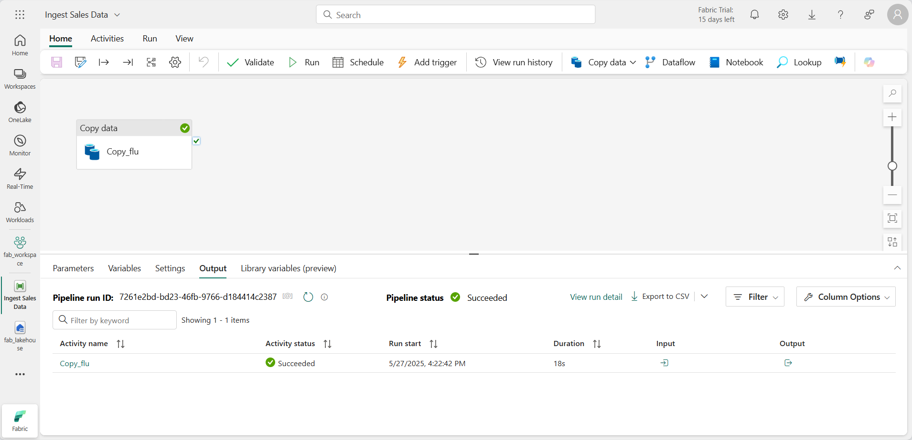

---
lab:
  title: Erfassen von Daten mit einer Pipeline in Microsoft Fabric
  module: Use Data Factory pipelines in Microsoft Fabric
---

# Erfassen von Daten mit einer Pipeline in Microsoft Fabric

Ein Data Lakehouse ist ein allgemeiner Analysedatenspeicher für Analyselösungen auf Cloudebene. Zu den Kernaufgaben technischer Fachkräfte für Daten gehört die Implementierung und Verwaltung der Erfassung von Daten aus mehreren operativen Datenquellen im Lakehouse. In Microsoft Fabric können Sie die folgenden Lösungen zur Datenerfassung durch das Erstellen von *Pipelines* implementieren: *Extrahieren, Transformieren und Laden* (ETL) oder *Extrahieren, Laden und Transformieren* (ELT).

Fabric unterstützt auch Apache Spark, was es Ihnen ermöglicht, Code zu schreiben und auszuführen, um Daten im großen Stil zu verarbeiten. Durch die Kombination der Pipeline- und Spark-Funktionen in Fabric können Sie eine komplexe Datenerfassungslogik implementieren, die Daten aus externen Quellen in den OneLake-Speicher kopiert, auf dem das Lakehouse basiert. Diese Logik verwendet im folgenden Schritt Spark-Code zum Ausführen benutzerdefinierter Datentransformationen, bevor die Daten zur Analyse in Tabellen geladen werden.

Dieses Lab dauert ungefähr **60** Minuten.

> **Hinweis:** Sie benötigen eine [Microsoft Fabric-Testversion](https://learn.microsoft.com/fabric/get-started/fabric-trial), um diese Übung abzuschließen.

## Erstellen eines Arbeitsbereichs

Erstellen Sie vor dem Arbeiten mit Daten in Fabric einen Arbeitsbereich mit aktivierter Fabric-Testversion.

1. Wählen Sie auf der [Microsoft Fabric-Startseite](https://app.fabric.microsoft.com) die Option **Datentechnik mit Synapse** aus.
1. Wählen Sie auf der Menüleiste auf der linken Seite **Arbeitsbereiche** aus (Symbol ähnelt &#128455;).
1. Erstellen Sie einen neuen Arbeitsbereich mit einem Namen Ihrer Wahl, und wählen Sie einen Lizenzierungsmodus mit Fabric-Kapazitäten aus (*Testversion*, *Premium* oder *Fabric*).
1. Wenn Ihr neuer Arbeitsbereich geöffnet wird, sollte er leer sein.

    

## Erstellen eines Lakehouse

Da Sie nun einen Arbeitsbereich besitzen, ist es an der Zeit, ein Data Lakehouse zu erstellen, in dem Daten erfasst werden sollen.

1. Erstellen Sie auf der Startseite **Datentechnik mit Synapse** ein neues **Lakehouse** mit einem Namen Ihrer Wahl.

    Nach etwa einer Minute wird ein neues Lakehouse ohne **Tabellen** oder **Dateien** erstellt.

1. Wählen Sie auf der Registerkarte **Lake-Ansicht** im Bereich auf der linken Seite im Menü **...** für den Knoten **Dateien** die Option **Neuer Unterordner** aus, und erstellen Sie einen Unterordner mit dem Namen **new_data**.

## Erstellen einer Pipeline

Eine einfache Möglichkeit zum Erfassen von Daten ist das Verwenden der Aktivität **Daten kopieren** in einer Pipeline, um die Daten aus einer Quelle zu extrahieren und in eine Datei im Lakehouse zu kopieren.

1. Wählen Sie auf der Seite **Home** für Ihr Lakehouse **Daten abrufen** aus und wählen Sie dann **Neue Datenpipeline** aus und erstellen Sie eine neue Datenpipeline mit dem Namen **Ingest Sales Data**.
2. Wenn der Assistent **Daten kopieren** nicht automatisch geöffnet wird, wählen Sie auf der Seite des Pipeline-Editors die Option **Daten kopieren** aus.
3. Wählen Sie im Assistenten **Daten kopieren** auf der Seite **Eine Datenquelle auswählen** im Abschnitt **Datenquellen** die Registerkarte **Generisches Protokoll** und dann **HTTP** aus.

    

4. Wählen Sie **Weiter** und dann **Neue Verbindung erstellen** aus, und geben Sie die folgenden Einstellungen für die Verbindung mit Ihrer Datenquelle ein:
    - **URL**: `https://raw.githubusercontent.com/MicrosoftLearning/dp-data/main/sales.csv`
    - **Verbindung**: Neue Verbindung erstellen
    - **Name der Verbindung**: *Angeben eines eindeutigen Namens*
    - **Datengateway**: (keine)
    - **Authentifizierungsart**: Anonym
5. Wählen Sie **Weiter** aus. Stellen Sie dann sicher, dass die folgenden Einstellungen ausgewählt sind:
    - **Relative URL**: *Nicht ausfüllen*
    - **Anforderungsmethode**: GET
    - **Zusätzliche Kopfzeilen**: *Nicht ausfüllen*
    - **Binärkopie**: <u>Nicht</u>ausgewählt
    - **Anforderungstimeout**: *Nicht ausfüllen*
    - **Maximal zulässige Anzahl paralleler Verbindungen**: *Nicht ausfüllen*
6. Wählen Sie **Weiter** aus, und warten Sie, bis die Daten in Stichproben erfasst werden. Stellen Sie dann sicher, dass die folgenden Einstellungen ausgewählt sind:
    - **Dateiformat**: DelimitedText
    - **Spaltentrennzeichen**: Komma (,)
    - **Zeilen-Trennzeichen**: Zeilenvorschub (\n)
    - **Erste Zeile ist Überschrift**: Ausgewählt
    - **Komprimierungstyp**: Keiner
7. Wählen Sie **Vorschaudaten** aus, um ein Beispiel für die erfassten Daten anzuzeigen. Schließen Sie dann die Vorschaudaten, und wählen Sie **Weiter** aus.
8. Wählen Sie auf der Seite **Mit Datenziel verbinden** Ihr vorhandenes Lakehouse aus. Wählen Sie **Weiter**aus.
9. Legen Sie die folgenden Datenzieloptionen fest, und wählen Sie dann **Weiter** aus:
    - **Stammordner**: Files
    - **Ordnerpfadname**: new_data
    - **Dateiname**: sales.csv
    - **Kopierverhalten**: Keins
10. Legen Sie die folgenden Dateiformatoptionen fest, und wählen Sie dann **Weiter** aus:
    - **Dateiformat**: DelimitedText
    - **Spaltentrennzeichen**: Komma (,)
    - **Zeilen-Trennzeichen**: Zeilenvorschub (\n)
    - **Header zu Datei hinzufügen**: Ausgewählt
    - **Komprimierungstyp**: Keiner
11. Überprüfen Sie auf der Seite **Zusammenfassung kopieren** die Details Ihres Kopiervorgangs, und wählen Sie dann **Speichern und ausführen** aus.

    Eine neue Pipeline wird wie folgt mit der Aktivität **Daten kopieren** erstellt:

    

12. Wenn die Pipeline gestartet wird, können Sie ihren Status im Bereich **Ausgabe** unter dem Pipeline-Designer überwachen. Verwenden Sie das Symbol **&#8635;** (*Aktualisieren*), um den Status zu aktualisieren, und warten Sie, bis der Vorgang erfolgreich abgeschlossen ist.

13. Wählen Sie in der Menüleiste auf der linken Seite Ihr Lakehouse aus.
14. Erweitern Sie auf der Seite **Start** im Bereich **Lakehouse-Explorer** die Option **Dateien**, und wählen Sie den Ordner **new_data** aus, um zu überprüfen, ob die **sales.csv**-Datei kopiert wurde.

## Erstellen eines Notebooks

1. Wählen Sie auf der Seite **Start** für Ihr Lakehouse im Menü **Notebook öffnen** die Option **Neues Notebook** aus.

    Nach einigen Sekunden wird ein neues Notebook mit einer einzelnen *Zelle* geöffnet. Notebooks bestehen aus einer oder mehreren Zellen, die *Code* oder *Markdown* (formatierten Text) enthalten können.

2. Wählen Sie die vorhandene Zelle im Notebook mit einfachem Code aus, und ersetzen Sie dann den Standardcode durch die folgende Variablendeklaration:

    ```python
   table_name = "sales"
    ```

3. Wählen Sie im Menü **...** der Zelle (oben rechts) die Option **Parameterzelle umschalten** aus. Dadurch wird die Zelle so konfiguriert, dass die darin deklarierten Variablen als Parameter behandelt werden, wenn das Notebook über eine Pipeline ausgeführt wird.

4. Verwenden Sie unter der Parameterzelle die Schaltfläche **+ Code**, um eine neue Codezelle hinzuzufügen. Fügen Sie anschließend den folgenden Code hinzu:

    ```python
   from pyspark.sql.functions import *

   # Read the new sales data
   df = spark.read.format("csv").option("header","true").load("Files/new_data/*.csv")

   ## Add month and year columns
   df = df.withColumn("Year", year(col("OrderDate"))).withColumn("Month", month(col("OrderDate")))

   # Derive FirstName and LastName columns
   df = df.withColumn("FirstName", split(col("CustomerName"), " ").getItem(0)).withColumn("LastName", split(col("CustomerName"), " ").getItem(1))

   # Filter and reorder columns
   df = df["SalesOrderNumber", "SalesOrderLineNumber", "OrderDate", "Year", "Month", "FirstName", "LastName", "EmailAddress", "Item", "Quantity", "UnitPrice", "TaxAmount"]

   # Load the data into a table
   df.write.format("delta").mode("append").saveAsTable(table_name)
    ```

    Dieser Code lädt die Daten aus der „sales.csv“-Datei, die von der Aktivität **Daten kopieren** erfasst wurde, wendet eine Transformationslogik an und speichert die transformierten Daten als Tabelle. Wenn die Tabelle bereits vorhanden ist, werden die Daten der Tabelle angefügt.

5. Stellen Sie sicher, dass Ihre Notebooks in etwa wie folgt aussehen, und verwenden Sie dann die Schaltfläche **&#9655; Alle ausführen** auf der Symbolleiste, um alle darin enthaltenen Zellen auszuführen.

    

    > **Hinweis**: Da Sie Spark-Code zum ersten Mal in dieser Sitzung ausführen, muss der Spark-Pool gestartet werden. Dadurch kann der Abschluss der ersten Zelle etwa eine Minute dauern.

6. Wenn das Notebook ausgeführt worden ist, wählen Sie im Bereich **Lakehouse-Explorer** auf der linken Seite im Menü **...** für **Tabellen** die Option **Aktualisieren** aus, und überprüfen Sie, ob eine **Sales**-Tabelle erstellt wurde.
7. Verwenden Sie in der Menüleiste des Notebooks das Symbol ⚙️ **Einstellungen**, um die Einstellungen des Notebooks anzuzeigen. Legen Sie dann den **Namen** des Notebooks auf **Sales laden** fest, und schließen Sie den Einstellungsbereich.
8. Wählen Sie in der Hubmenüleiste auf der linken Seite Ihr Lakehouse aus.
9. Aktualisieren Sie im Bereich **Explorer** die Ansicht. Erweitern Sie dann **Tabellen**, und wählen Sie die Tabelle **Sales** aus, um eine Vorschau der darin enthaltenen Daten anzuzeigen.

## Ändern der Pipeline

Nachdem Sie ein Notebook zum Transformieren von Daten und zum Laden von Tabellen implementiert haben, können Sie nun das Notebook in eine Pipeline integrieren, um einen wiederverwendbaren ETL-Prozess zu erstellen.

1. Wählen Sie in der Hubmenüleiste auf der linken Seite die Pipeline **Ingest Sales Data** aus, die Sie zuvor erstellt haben.
2. Wählen Sie auf der Registerkarte **Aktivitäten** in der Liste **Weitere Aktivitäten** die Option **Daten löschen** aus. Positionieren Sie wie hier gezeigt dann die neue Aktivität **Daten löschen** links neben der Aktivität **Daten kopieren**, und verbinden Sie die Ausgabe **Nach Abschluss** mit der Aktivität **Daten kopieren**:

    

3. Wählen Sie die Bereich **Daten löschen** aus, und legen Sie im Bereich unterhalb des Entwurfsbereichs die folgenden Eigenschaften fest:
    - **Allgemein:**
        - **Name**: Alte Dateien löschen
    - **Quelle**
        - **Verbindung**: *Ihr Lakehouse*
        - **Dateipfadtyp**: Platzhalterdateipfad
        - **Ordnerpfad**: Files/**new_data**
        - **Platzhalterdateiname**: *.csv        
        - **Rekursiv**: *Ausgewählt*
    - **Protokollierungseinstellungen**:
        - **Protokollierung aktivieren**: *<u>Nicht</u> ausgewählt*

    Diese Einstellungen stellen sicher, dass alle vorhandenen CSV-Dateien vor dem Kopieren der **sales.csv**-Datei gelöscht werden.

4. Wählen Sie im Pipeline-Designer auf der Registerkarte **Aktivitäten** die Option **Notebook** aus, um der Pipeline eine **Notebook**-Aktivität hinzuzufügen.
5. Wählen Sie wie nachfolgend dargestellt die Aktivität **Daten kopieren** aus, und verbinden Sie dann die Ausgabe **Bei Abschluss** mit der Aktivität **Notebook**:

    

6. Wählen Sie die Aktivität **Notebook** aus, und legen Sie dann im Bereich unterhalb des Design-Canvas die folgenden Eigenschaften fest:
    - **Allgemein:**
        - **Name**: Notebook „Sales“ laden
    - **Einstellungen**:
        - **Notebook**: Sales laden
        - **Basisparameter**: *Fügen Sie einen neuen Parameter mit den folgenden Eigenschaften hinzu:*
            
            | Name | type | Wert |
            | -- | -- | -- |
            | table_name | String | new_sales |

    Der Parameter **table_name** wird an das Notebook übergeben und überschreibt den Standardwert, der der Variablen **table_name** in der Parameterzelle zugewiesen ist.

7. Verwenden Sie auf der Registerkarte **Start** das Symbol **&#128427;** (*Speichern*), um die Pipeline zu speichern. Verwenden Sie dann die Schaltfläche **&#9655; Ausführen**, um die Pipeline auszuführen, und warten Sie, bis alle Aktivitäten abgeschlossen sind.

    

> Hinweis: Falls Sie die Fehlermeldung *Spark SQL-Abfragen sind nur im Kontext eines Lakehouses möglich erhalten. Bitte fügen Sie ein Lakehouse an, um fortzufahren*: Öffnen Sie Ihr Notebook, wählen Sie das Lakehouse aus, das Sie im linken Bereich erstellt haben, wählen Sie **Alle Lakehouses entfernen** aus, und fügen Sie es dann erneut hinzu. Kehren Sie zum Pipeline-Designer zurück, und wählen Sie **&#9655; Ausführen**.

8. Wählen Sie in der Hubmenüleiste am linken Rand des Portals Ihr Lakehouse aus.
9. Erweitern Sie dann im **Explorer** die Option **Tabellen**, und wählen Sie die Tabelle **new_sales** aus, um eine Vorschau der darin enthaltenen Daten anzuzeigen. Diese Tabelle wurde vom Notebook erstellt, als dieses von der Pipeline ausgeführt wurde.

In dieser Übung haben Sie eine Lösung zur Datenerfassung implementiert, die eine Pipeline zum Kopieren von Daten aus einer externen Quelle in Ihr Lakehouse verwendet. Diese Pipeline verwendet dann ein Spark-Notebook, um Daten zu transformieren und in eine Tabelle zu laden.

## Bereinigen von Ressourcen

In dieser Übung haben Sie gelernt, wie Sie eine Pipeline in Microsoft Fabric implementieren.

Wenn Sie Ihr Lakehouse erkundet haben, können Sie den Arbeitsbereich löschen, den Sie für diese Übung erstellt haben.

1. Wählen Sie auf der Leiste auf der linken Seite das Symbol für Ihren Arbeitsbereich aus, um alle darin enthaltenen Elemente anzuzeigen.
2. Wählen Sie im Menü **...** auf der Symbolleiste die **Arbeitsbereichseinstellungen** aus.
3. Wählen Sie im Abschnitt **Allgemein** die Option **Diesen Arbeitsbereich entfernen** aus.
