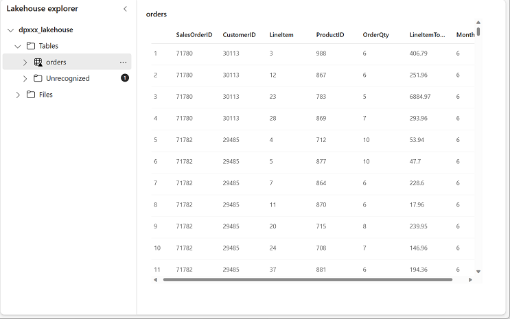

---
lab:
  title: Erstellen und Verwenden eines Dataflows (Gen2) in Microsoft Fabric
  module: Ingest Data with Dataflows Gen2 in Microsoft Fabric
---

# Erstellen eines Dataflows (Gen2) in Microsoft Fabric

In Microsoft Fabric stellen Dataflows (Gen2) eine Verbindung mit verschiedenen Datenquellen her und führen Transformationen in Power Query Online durch. Diese können dann in Datenpipelines zum Erfassen von Daten in einem Lakehouse- oder einem anderen Analysespeicher, oder zum Definieren eins Datasets für einen Power BI-Bericht verwendet werden.

Dieses Lab wurde entwickelt, um die verschiedenen Elemente von Dataflows (Gen2) vorzustellen. Das Lab soll keine komplexe Lösung erstellen, die möglicherweise in einem Unternehmen vorhanden ist. Dieses Lab dauert **ungefähr 30 Minuten**.

> **Hinweis:** Sie benötigen eine [Microsoft Fabric-Testversion](https://learn.microsoft.com/fabric/get-started/fabric-trial), um diese Übung durchführen zu können.

## Erstellen eines Arbeitsbereichs

Erstellen Sie vor dem Arbeiten mit Daten in Fabric einen Arbeitsbereich mit aktivierter Fabric-Testversion.

1. Wählen Sie auf der [Microsoft Fabric-Startseite](https://app.fabric.microsoft.com) die Option **Datentechnik mit Synapse** aus.
1. Wählen Sie auf der Menüleiste auf der linken Seite **Arbeitsbereiche** aus (Symbol ähnelt &#128455;).
1. Erstellen Sie einen neuen Arbeitsbereich mit einem Namen Ihrer Wahl, und wählen Sie einen Lizenzierungsmodus mit Fabric-Kapazitäten aus (*Testversion*, *Premium* oder *Fabric*).
1. Wenn Ihr neuer Arbeitsbereich geöffnet wird, sollte er leer sein.

    

## Erstellen eines Lakehouse

Da Sie nun einen Arbeitsbereich besitzen, ist es an der Zeit, ein Data Lakehouse zu erstellen, in dem Daten erfasst werden sollen.

1. Erstellen Sie auf der Startseite **Datentechnik mit Synapse** ein neues **Lakehouse** mit einem Namen Ihrer Wahl.

    Nach etwa einer Minute wird ein neues leeres Lakehouse erstellt.

 

## Erstellen eines Dataflows (Gen2) zum Erfassen von Daten

Nachdem Sie über ein Lakehouse verfügen, müssen Sie nun einige Daten darin erfassen. Eine Möglichkeit dazu ist das Definieren eines Dataflows, der einen Prozess zum *Extrahieren, Transformieren und Laden* (ETL) kapselt.

1. Wählen Sie auf der Startseite für Ihren Arbeitsbereich die Option **Neuer Dataflow Gen2** aus. Nach einigen Sekunden wird wie nachfolgend dargestellt der Power Query-Editor für Ihren neuen Dataflow geöffnet:

 

2. Wählen Sie **Importieren aus einer Text-/CSV-Datei** aus, und erstellen Sie eine neue Datenquelle mit den folgenden Einstellungen:
 - **Verknüpfung zur Datei**: *Ausgewählt*
 - **Dateipfad oder URL**: `https://raw.githubusercontent.com/MicrosoftLearning/dp-data/main/orders.csv`
 - **Verbindung**: Neue Verbindung erstellen
 - **Datengateway**: (keiner)
 - **Authentifizierungsart**: Anonym

3. Wählen Sie **Weiter** aus, um eine Vorschau der Dateidaten anzuzeigen, und **erstellen** Sie dann die Datenquelle. Der Power Query-Editor zeigt wie folgt die Datenquelle und eine anfängliche Reihe von Abfrageschritten zum Formatieren der Daten an:

 

4. Wählen Sie im Menüband der Symbolleiste die Registerkarte **Spalte hinzufügen**. Wählen Sie dann **Benutzerdefinierte Spalte** und erstellen Sie eine neue Spalte.

5. Legen Sie den *Neuen Spaltennamen* auf `MonthNo` fest, legen Sie den *Datentyp* auf **Ganze Zahl** fest und fügen Sie dann die folgende Formel hinzu: `Date.Month([OrderDate])` – wie hier gezeigt:

 

6. Wählen Sie **OK** aus, um die Spalte zu erstellen und zu sehen, wie der Schritt zum Hinzufügen der benutzerdefinierten Spalte zur Abfrage hinzugefügt wird. Die resultierende Spalte wird im Datenbereich angezeigt:

 

> **Tipp:** Beachten Sie im Bereich „Abfrageeinstellungen“ auf der rechten Seite, dass die **angewendeten Schritte** jeden Transformationsschritt enthalten. Unten können Sie auch die Schaltfläche **Diagrammfluss** umschalten, um das visuelle Diagramm der Schritte zu aktivieren.
>
> Schritte können nach oben oder unten verschoben oder durch Auswählen des Zahnradsymbols bearbeitet werden. Sie können jeden Schritt auswählen, um zu sehen, wie die Transformationen im Vorschaubereich angewendet werden.

7. Überprüfen Sie und vergewissern Sie sich, dass der Datentyp für die Spalte **OrderDate** auf **Datum** und der Datentyp für die neu erstellte Spalte **MonthNo** auf **Ganze Zahl** festgelegt ist.

## Hinzufügen eines Datenziels für einen Dataflow

1. Wählen Sie auf der Symbolleiste die Registerkarte **Start** aus, und wählen Sie dann im Dropdownmenü **Datenziel hinzufügen** die Option **Lakehouse** aus.

   > **Hinweis:** Wenn diese Option ausgegraut ist, verfügen Sie möglicherweise bereits über einen Datenzielsatz. Überprüfen Sie das Datenziel unten im Bereich der „Abfrageeinstellungen“ auf der rechten Seite des Power Query-Editors. Wenn ein Ziel bereits festgelegt ist, können Sie es mit dem Zahnradsymbol ändern.

2. Bearbeiten Sie die Verbindung im Dialogfeld **Herstellen einer Verbindung mit dem Datenziel**, und melden Sie sich mit Ihrem Power BI-Unternehmenskonto an, um die Identität festzulegen, die der Dataflow für den Zugriff auf das Lakehouse verwendet.

 

3. Wählen Sie **Weiter** aus, und suchen Sie in der Liste der verfügbaren Arbeitsbereiche nach Ihrem Arbeitsbereich. Wählen Sie in der Liste das Lakehouse aus, das Sie zu Beginn dieser Übung in Ihrem Arbeitsbereich erstellt haben. Geben Sie dann eine neue Tabelle mit dem Namen **orders** an:

   

4. Wählen Sie auf der Seite **Zieleinstellungen wählen**die Option **Anfügen** aus und dann **Einstellungen speichern**.
    > **Hinweis:** Sie sollten den *Power Query-Editor* zum Aktualisieren von Datentypen verwenden. Sie können dies aber auch auf dieser Seite tun, wenn Sie möchten.

    

5. Öffnen Sie in der Menüleiste die Option **Ansicht** und wählen Sie **Diagrammansicht** aus. Beachten Sie, dass das Ziel **Lakehouse** in der Abfrage im Power Query-Editor als Symbol angegeben wird.

   

6. Wählen Sie **Veröffentlichen** aus, um den Bericht zu veröffentlichen. Warten Sie dann, bis der **Dataflow 1**-Dataflow in Ihrem Arbeitsbereich erstellt wird.

7. Nach der Veröffentlichung können Sie mit der rechten Maustaste auf den Dataflow in Ihrem Arbeitsbereich klicken, **Eigenschaften** auswählen und Ihren Dataflow umbenennen.

## Hinzufügen eines Dataflows zu einer Pipeline

Sie können einen Dataflow als Aktivität in eine Pipeline einschließen. Pipelines werden zum Orchestrieren von Datenerfassungs- und Verarbeitungsaktivitäten verwendet. Dadurch können Sie Dataflows mit anderen Arten von Vorgängen in einem einzelnen geplanten Prozess kombinieren. Pipelines können in verschiedenen Umgebungen erstellt werden, z. B. in Data Factory.

1. Stellen Sie in Ihrem Fabric-fähigen Arbeitsbereich sicher, dass Sie sich weiterhin in **Datentechnik** befinden. Wählen Sie **Neu** und **Datenpipeline** aus, und erstellen Sie dann eine neue Pipeline mit dem Namen **Daten laden**, wenn Sie dazu aufgefordert werden.

   Der Pipeline-Editor wird geöffnet.

   

   > **Tipp**: Wenn der Assistent „Daten kopieren“ automatisch geöffnet wird, schließen Sie ihn.

2. Wählen Sie **Pipelineaktivität hinzufügen** aus, und fügen Sie der Pipeline eine **Dataflow**-Aktivität hinzu.

3. Wählen Sie bei ausgewählter **neuer Dataflow1**-Aktivität auf der Registerkarte **Einstellungen** in der Dropdownliste **Dataflow** die Option **Dataflow 1** (der zuvor erstellte Dataflow) aus.

   

4. Speichern Sie auf der Registerkarte **Start** die Pipeline mithilfe des Symbols **&#128427;** (*Speichern*).
5. Verwenden Sie die Schaltfläche **&#9655; Ausführen**, um die Pipeline auszuführen, und warten Sie, bis sie abgeschlossen ist. Dies kann einige Minuten dauern.

   

6. Wählen Sie auf der Menüleiste auf der linken Seite Ihr Lakehouse aus.
7. Wählen Sie im Menü **...** für **Tabellen** die Option **Aktualisieren** aus. Erweitern Sie dann die **Tabellen**, und wählen Sie die **Auftragstabelle** aus, die von Ihrem Dataflow erstellt wurde.

   

> **Tipp**: Verwenden Sie den Power BI Desktop *Dataflows-Connector*, um eine direkte Verbindung mit den Datentransformationen herzustellen, die mit Ihrem Dataflow durchgeführt wurden.
>
> Mit diesem Desktop können Sie auch zusätzliche Transformationen vornehmen, ein neues Dataset veröffentlichen und spezialisierte Datasets an das Zielpublikum verteilen.
>
>

## Bereinigen von Ressourcen

Wenn Sie die Untersuchung von Dataflows in Microsoft Fabric abgeschlossen haben, können Sie den Arbeitsbereich löschen, den Sie für diese Übung erstellt haben.

1. Navigieren Sie in Ihrem Browser zu Microsoft Fabric.
1. Wählen Sie auf der Leiste auf der linken Seite das Symbol für Ihren Arbeitsbereich aus, um alle darin enthaltenen Elemente anzuzeigen.
1. Wählen Sie auf der Seite des Arbeitsbereichs die **Arbeitsbereichseinstellungen** aus.
1. Wählen Sie unten im Abschnitt **Allgemein** die Option **Diesen Arbeitsbereich entfernen** aus.
1. Speichern Sie die Änderungen nicht in Power BI Desktop, oder löschen Sie die PBIX-Datei, wenn sie bereits gespeichert wurde.
