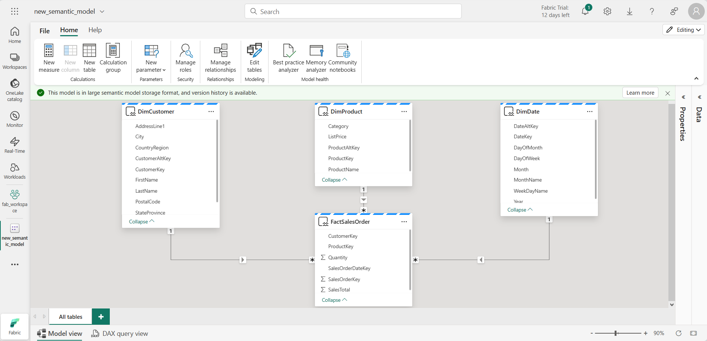

---
lab:
  title: Analysieren von Daten in einem Data Warehouse
  module: Get started with data warehouses in Microsoft Fabric
---

# Analysieren von Daten in einem Data Warehouse

In Microsoft Fabric stellt ein Data Warehouse eine relationale Datenbank für umfangreiche Analysen bereit. Im Gegensatz zum standardmäßigen schreibgeschützten SQL-Endpunkt für Tabellen, die in einem Lakehouse definiert sind, bietet ein Data Warehouse vollständige SQL-Semantik, einschließlich der Möglichkeit zum Einfügen, Aktualisieren und Löschen von Daten in den Tabellen.

Dieses Lab dauert ungefähr **30** Minuten.

> **Hinweis:** Sie benötigen eine [Microsoft Fabric-Testversion](https://learn.microsoft.com/fabric/get-started/fabric-trial), um diese Übung abzuschließen.

## Erstellen eines Arbeitsbereichs

Erstellen Sie vor dem Arbeiten mit Daten in Fabric einen Arbeitsbereich mit aktivierter Fabric-Testversion.

1. Wählen Sie auf der [Microsoft Fabric-Startseite](https://app.fabric.microsoft.com/home?experience=fabric) unter `https://app.fabric.microsoft.com/home?experience=fabric` die Option **Data Warehouse mit Synapse** aus.
1. Wählen Sie auf der Menüleiste auf der linken Seite **Arbeitsbereiche** aus (Symbol ähnelt &#128455;).
1. Erstellen Sie einen neuen Arbeitsbereich mit einem Namen Ihrer Wahl, und wählen Sie einen Lizenzierungsmodus mit Fabric-Kapazitäten aus (*Testversion*, *Premium* oder *Fabric*).
1. Wenn Ihr neuer Arbeitsbereich geöffnet wird, sollte er leer sein.

    

## Erstellen eines Data Warehouse

Da Sie nun einen Arbeitsbereich besitzen, ist es an der Zeit, ein Data Warehouse zu erstellen. Die Startseite von „Data Warehouse mit Synapse“ enthält eine Verknüpfung zum Erstellen eines neuen Warehouse:

1. Erstellen Sie auf der Startseite von **Data Warehouse mit Synapse** ein neues **Warehouse** mit einem Namen Ihrer Wahl.

    Nach einer Minute wird ein neues Warehouse erstellt:

    

## Erstellen von Tabellen und Einfügen von Daten

Ein Warehouse ist eine relationale Datenbank, in der Sie Tabellen und andere Objekte definieren können.

1. Wählen Sie in Ihrem neuen Warehouse die Kachel **Tabellen mit T-SQL erstellen** aus, und ersetzen Sie den SQL-Standardcode durch die folgende CREATE TABLE-Anweisung:

    ```sql
   CREATE TABLE dbo.DimProduct
   (
       ProductKey INTEGER NOT NULL,
       ProductAltKey VARCHAR(25) NULL,
       ProductName VARCHAR(50) NOT NULL,
       Category VARCHAR(50) NULL,
       ListPrice DECIMAL(5,2) NULL
   );
   GO
    ```

2. Verwenden Sie die Schaltfläche **&#9655; Ausführen**, um das SQL-Skript auszuführen, das eine neue Tabelle namens **DimProduct** im **dbo**-Schema des Data Warehouse erstellt.
3. Verwenden Sie die Schaltfläche **Aktualisieren** auf der Symbolleiste, um Metriken zu aktualisieren. Erweitern Sie dann im Bereich **Explorer** **Schemas** > **dbo** > **Tabellen**, und überprüfen Sie, ob die Tabelle **DimProduct** erstellt wurde.
4. Verwenden Sie auf der Registerkarte **Start** die Schaltfläche **Neue SQL-Abfrage**, um eine neue Abfrage zu erstellen, und geben Sie die folgende INSERT-Anweisung ein:

    ```sql
   INSERT INTO dbo.DimProduct
   VALUES
   (1, 'RING1', 'Bicycle bell', 'Accessories', 5.99),
   (2, 'BRITE1', 'Front light', 'Accessories', 15.49),
   (3, 'BRITE2', 'Rear light', 'Accessories', 15.49);
   GO
    ```

5. Führen Sie die neue Abfrage aus, um drei Zeilen in die **DimProduct-Tabelle** einzufügen.
6. Wenn die Abfrage abgeschlossen ist, wählen Sie unten auf der Seite im Data Warehouse die Registerkarte **Daten** aus. Wählen Sie im Bereich **Explorer** die Tabelle **DimProduct** aus, und vergewissern Sie sich, dass die drei Zeilen der Tabelle hinzugefügt wurden.
7. Verwenden Sie auf der Registerkarte **Start** die Schaltfläche **Neue SQL-Abfrage**, um eine neue Abfrage zu erstellen. Kopieren Sie dann den Transact-SQL-Code aus `https://raw.githubusercontent.com/MicrosoftLearning/dp-data/main/create-dw.txt`, und fügen Sie ihn in den neuen Abfragebereich ein.
<!-- I had to remove the GO command in this query as well -->
8. Führen Sie die Abfrage aus, die ein einfaches Data Warehouse-Schema erstellt und einige Daten lädt. Die Ausführung des Skripts sollte etwa 30 Sekunden dauern.
9. Verwenden Sie die Schaltfläche **Aktualisieren** auf der Symbolleiste, um Metriken zu aktualisieren. Überprüfen Sie dann im Bereich **Explorer**, ob das **dbo**-Schema im Data Warehouse jetzt die folgenden vier Tabellen enthält:
    - **DimCustomer**
    - **DimDate**
    - **DimProduct**
    - **FactSalesOrder**

    > **Tipp**: Wenn das Laden des Schemas eine Weile dauert, aktualisieren Sie einfach die Browserseite.

## Definieren eines Datenmodells

Ein relationales Data Warehouse besteht in der Regel aus *Fakt-* und *Dimensionstabellen*. Die Faktentabellen enthalten numerische Measures, die Sie aggregieren können, um die Geschäftsleistung zu analysieren (z. B. Umsatz), und die Dimensionstabellen enthalten Attribute der Entitäten, mit denen Sie die Daten aggregieren können (z. B. Produkt, Kunde oder Zeit). In einem Microsoft Fabric-Data Warehouse können Sie diese Schlüssel verwenden, um ein Datenmodell zu definieren, das die Beziehungen zwischen den Tabellen kapselt.

1. Wählen Sie unten auf der Seite im Data Warehouse die Registerkarte **Modell** aus.
2. Ordnen Sie im Modellbereich die Tabellen in Ihrem Data Warehouse neu an, sodass sich die Tabelle **FactSalesOrder** wie im Folgenden in der Mitte befindet:

    

3. Ziehen Sie das Feld **ProductKey** aus der **Tabelle FactSalesOrder**, und legen Sie es im Feld **ProductKey** in der Tabelle **DimProduct** ab. Bestätigen Sie dann die folgenden Beziehungsdetails:
    - **Tabelle 1**: FactSalesOrder
    - **Spalte**: ProductKey
    - **Tabelle 2**: DimProduct
    - **Spalte**: ProductKey
    - **Kardinalität**: Viele-zu-eins (*:1)
    - **Kreuzfilterrichtung**: Einzeln
    - **Diese Beziehung aktivieren**: Ausgewählt
    - **Referentielle Integrität voraussetzen**: Nicht ausgewählt

4. Wiederholen Sie den Vorgang, um n:1-Beziehungen zwischen den folgenden Tabellen zu erstellen:
    - **FactSalesOrder.CustomerKey** &#8594; **DimCustomer.CustomerKey**
    - **FactSalesOrder.SalesOrderDateKey** &#8594; **DimDate.DateKey**

    Wenn alle Beziehungen definiert wurden, sollte das Modell wie folgt aussehen:

    

## Abfragen von Data Warehouse-Tabellen

Da das Data Warehouse eine relationale Datenbank ist, können Sie SQL verwenden, um die zugehörigen Tabellen abzufragen.

### Abfragen von Fakten- und Dimensionstabellen

Die meisten Abfragen in einem relationalen Data Warehouse umfassen das Aggregieren und Gruppieren von Daten (mithilfe von Aggregatfunktionen und GROUP BY-Klauseln) für verwandte Tabellen (mithilfe von JOIN-Klauseln).

1. Erstellen Sie eine neue SQL-Abfrage, und führen Sie den folgenden Code aus:

    ```sql
   SELECT  d.[Year] AS CalendarYear,
            d.[Month] AS MonthOfYear,
            d.MonthName AS MonthName,
           SUM(so.SalesTotal) AS SalesRevenue
   FROM FactSalesOrder AS so
   JOIN DimDate AS d ON so.SalesOrderDateKey = d.DateKey
   GROUP BY d.[Year], d.[Month], d.MonthName
   ORDER BY CalendarYear, MonthOfYear;
    ```

    Beachten Sie, dass Sie mit den Attributen in der Zeitdimension die Measures in der Faktentabelle auf mehreren Hierarchieebenen – in diesem Fall Jahr und Monat – aggregieren können. Dies ist ein gängiges Muster in Data Warehouses.

2. Ändern Sie die Abfrage wie folgt, um der Aggregation eine zweite Dimension hinzuzufügen.

    ```sql
   SELECT  d.[Year] AS CalendarYear,
           d.[Month] AS MonthOfYear,
           d.MonthName AS MonthName,
           c.CountryRegion AS SalesRegion,
          SUM(so.SalesTotal) AS SalesRevenue
   FROM FactSalesOrder AS so
   JOIN DimDate AS d ON so.SalesOrderDateKey = d.DateKey
   JOIN DimCustomer AS c ON so.CustomerKey = c.CustomerKey
   GROUP BY d.[Year], d.[Month], d.MonthName, c.CountryRegion
   ORDER BY CalendarYear, MonthOfYear, SalesRegion;
    ```

3. Führen Sie die geänderte Abfrage aus, und überprüfen Sie die Ergebnisse, die jetzt nach Jahr, Monat und Vertriebsregion aggregierte Umsätze enthalten.

## Erstellen einer Ansicht

Ein Data Warehouse in Microsoft Fabric verfügt über viele der Funktionen, die Sie möglicherweise aus relationalen Datenbanken kennen. Sie können beispielsweise Datenbankobjekte wie *Ansichten* und *gespeicherte Prozeduren* erstellen, um SQL-Logik zu kapseln.

1. Ändern Sie die zuvor erstellte Abfrage wie folgt, um eine Ansicht zu erstellen (beachten Sie, dass Sie die ORDER BY-Klausel entfernen müssen, um eine Ansicht zu erstellen).

    ```sql
   CREATE VIEW vSalesByRegion
   AS
   SELECT  d.[Year] AS CalendarYear,
           d.[Month] AS MonthOfYear,
           d.MonthName AS MonthName,
           c.CountryRegion AS SalesRegion,
          SUM(so.SalesTotal) AS SalesRevenue
   FROM FactSalesOrder AS so
   JOIN DimDate AS d ON so.SalesOrderDateKey = d.DateKey
   JOIN DimCustomer AS c ON so.CustomerKey = c.CustomerKey
   GROUP BY d.[Year], d.[Month], d.MonthName, c.CountryRegion;
    ```

2. Führen Sie die Abfrage aus, um die Ansicht zu erstellen. Aktualisieren Sie dann das Data Warehouse-Schema, und vergewissern Sie sich, dass die neue Ansicht im Bereich **Explorer** aufgeführt ist.
3. Erstellen Sie eine neue SQL-Abfrage, und führen Sie die folgende SELECT-Anweisung aus:

    ```SQL
   SELECT CalendarYear, MonthName, SalesRegion, SalesRevenue
   FROM vSalesByRegion
   ORDER BY CalendarYear, MonthOfYear, SalesRegion;
    ```

### Erstellen einer visuellen Abfrage

Anstatt SQL-Code zu schreiben, können Sie den grafischen Abfrage-Designer verwenden, um die Tabellen in Ihrem Data Warehouse abzufragen. Diese Benutzeroberfläche ähnelt der von Power Query Online, bei der Sie Datentransformationsschritte ohne Code erstellen können. Für komplexere Aufgaben können Sie die Sprache M (Mashup) von Power Query verwenden.

1. Wählen Sie auf der Registerkarte **Start** die Option **Neue visuelle Abfrage** aus.

1. Ziehen Sie **FactSalesOrder** auf den **Canvas**. Im Bereich **Vorschau** unten wird eine Vorschau der Tabelle angezeigt.

1. Ziehen Sie **DimProduct** auf den **Canvas**. Die Abfrage enthält nun zwei Tabellen.

2. Verwenden Sie die Schaltfläche **(+)** in der Tabelle **FactSalesOrder** auf dem Canvas, um **Abfragen zusammenzuführen**.


1. Wählen Sie im Fenster **Abfragen zusammenführen** die Option **DimProduct** als richtige Tabellen zum Mergen aus. Wählen Sie in beiden Abfragen **ProductKey** aus, behalten Sie den Standardtyp **Linke äußere Verknüpfung** bei, und klicken Sie auf **OK**.

2. Beachten Sie in der **Vorschau**, dass die neue Spalte **DimProduct** der Tabelle „FactSalesOrder“ hinzugefügt wurde. Erweitern Sie die Spalte, indem Sie auf den Pfeil rechts neben dem Spaltennamen klicken. Wählen Sie **ProductName** aus, und klicken Sie auf **OK**.

    

1. Wenn Sie Daten für ein einzelnes Produkt anhand einer Manageranforderung untersuchen möchten, können Sie jetzt die Spalte **ProductName** verwenden, um die Daten in der Abfrage zu filtern. Filtern Sie die Spalte **ProductName**, um nur **Cable Lock**-Daten anzuzeigen.

1. Hier können Sie die Ergebnisse dieser einzelnen Abfrage analysieren, indem Sie **Ergebnisse visualisieren** oder **In Excel öffnen** auswählen. Sie können nun genau sehen, was der Manager angefordert hat, sodass wir die Ergebnisse nicht weiter analysieren müssen.

### Visualisieren Ihrer Daten

Sie können die Daten ganz einfach in einer einzelnen Abfrage oder in Ihrem Data Warehouse visualisieren. Blenden Sie vor dem Visualisieren Spalten und bzw. oder Tabellen aus, die für Berichts-Designer nicht geeignet sind.

1. Wählen Sie im Bereich **Explorer** die Ansicht **Modell** aus. 

1. Blenden Sie die folgenden Spalten in den Fakten- und Dimensionstabellen aus, die zum Erstellen eines Berichts nicht erforderlich sind. Beachten Sie, dass dadurch die Spalten nicht aus dem Modell entfernt werden, sondern sie einfach aus der Ansicht im Berichtscanvas ausgeblendet werden.
   1. FactSalesOrder
      - **SalesOrderDateKey**
      - **CustomerKey**
      - **ProductKey**
   1. DimCustomer
      - **CustomerKey**
      - **CustomerAltKey**
   1. DimDate
      - **DateKey**
      - **DateAltKey**
   1. DimProduct
      - **ProductKey**
      - **ProductAltKey** 

1. Jetzt können Sie einen Bericht erstellen und dieses Dataset für andere Personen verfügbar machen. Wählen Sie im Startmenü die Option **Neuer Bericht** aus. Dadurch wird ein neues Fenster geöffnet, in dem Sie einen Power BI-Bericht erstellen können.

1. Erweitern Sie **FactSalesOrder** im Bereich **Daten**. Beachten Sie, dass die Spalten, die Sie ausgeblendet haben, nicht mehr sichtbar sind. 

1. Wählen Sie **SalesTotal** aus. Dadurch wird die Spalte dem **Berichtscanvas** hinzugefügt. Da es sich bei der Spalte um einen numerischen Wert handelt, ist das Standardvisual ein **Säulendiagramm**.
1. Stellen Sie sicher, dass das Säulendiagramm auf dem Canvas aktiv ist (mit einem grauen Rahmen und Handles), und wählen Sie dann **Kategorie** aus der **DimProduct**-Tabelle aus, um dem Säulendiagramm eine Kategorie hinzuzufügen.
1. Ändern Sie im Bereich **Visualisierungen** den Diagrammtyp von einem Säulendiagramm in ein **gruppiertes Balkendiagramm**. Ändern Sie dann die Größe des Diagramms nach Bedarf, um sicherzustellen, dass die Kategorien lesbar sind.

    

1. Wählen Sie im Bereich **Visualisierungen** die Registerkarte **Visual formatieren** aus, und ändern Sie auf der Unterregisterkarte **Allgemein** im Abschnitt **Titel** den **Text** in **Gesamtumsatz nach Kategorie**.

1. Klicken Sie im Menü **Datei** auf **Speichern**. Speichern Sie dann den Bericht als **Umsatzbericht** in dem Arbeitsbereich, den Sie zuvor erstellt haben.

1. Navigieren Sie im Menühub auf der linken Seite zurück zum Arbeitsbereich. Beachten Sie, dass Sie jetzt drei Elemente in Ihrem Arbeitsbereich gespeichert haben: Ihr Data Warehouse, das Standarddataset und den Bericht, den Sie erstellt haben.

    

## Bereinigen von Ressourcen

In dieser Übung haben Sie ein Data Warehouse erstellt, das mehrere Tabellen enthält. Sie haben SQL verwendet, um Daten in die Tabellen einzufügen und abzufragen und haben auch das visuelle Abfragetool verwendet. Schließlich haben Sie das Datenmodell für das Standarddataset des Data Warehouse verbessert und als Quelle für einen Bericht verwendet.

Wenn Sie Ihr Data Warehouse erkundet haben, können Sie den Arbeitsbereich löschen, den Sie für diese Übung erstellt haben.

1. Wählen Sie auf der Leiste auf der linken Seite das Symbol für Ihren Arbeitsbereich aus, um alle darin enthaltenen Elemente anzuzeigen.
2. Wählen Sie im Menü **...** auf der Symbolleiste die **Arbeitsbereichseinstellungen** aus.
3. Wählen Sie im Abschnitt **Allgemein** die Option **Diesen Arbeitsbereich entfernen** aus.
