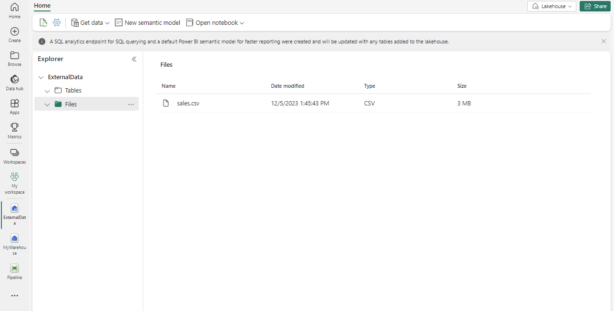

---
lab:
  title: Laden von Daten in ein Data Warehouse mit T-SQL
  module: Load data into a warehouse in Microsoft Fabric
---

# Laden von Daten in ein Data Warehouse mit T-SQL

In Microsoft Fabric stellt ein Data Warehouse eine relationale Datenbank für umfangreiche Analysen bereit. Im Gegensatz zum standardmäßigen schreibgeschützten SQL-Endpunkt für Tabellen, die in einem Lakehouse definiert sind, bietet ein Data Warehouse vollständige SQL-Semantik, einschließlich der Möglichkeit zum Einfügen, Aktualisieren und Löschen von Daten in den Tabellen.

Dieses Lab dauert ungefähr **30** Minuten.

> **Hinweis:** Sie benötigen eine [Microsoft Fabric-Testversion](https://learn.microsoft.com/fabric/get-started/fabric-trial), um diese Übung abzuschließen.

## Erstellen eines Arbeitsbereichs

Erstellen Sie vor dem Arbeiten mit Daten in Fabric einen Arbeitsbereich mit aktivierter Fabric-Testversion.

1. Wählen Sie auf der [Microsoft Fabric-Startseite](https://app.fabric.microsoft.com/home?experience=fabric) unter `https://app.fabric.microsoft.com/home?experience=fabric` die Option **Data Warehouse**.
1. Wählen Sie auf der Menüleiste auf der linken Seite **Arbeitsbereiche** aus (Symbol ähnelt &#128455;).
1. Erstellen Sie einen neuen Arbeitsbereich mit einem Namen Ihrer Wahl, und wählen Sie einen Lizenzierungsmodus mit Fabric-Kapazitäten aus (*Testversion*, *Premium* oder *Fabric*).
1. Wenn Ihr neuer Arbeitsbereich geöffnet wird, sollte er leer sein.

    

## Erstellen eines Lakehouse und Hochladen von Dateien

Da wir in unserem Szenario keine verfügbaren Daten haben, müssen wir Daten erfassen, die zum Laden des Warehouse verwendet werden. Sie erstellen ein Data Lakehouse für die Datendateien, die Sie zum Laden des Warehouse verwenden möchten.

1. Wählen Sie **+ Neues Objekt** und erstellen Sie ein neues **Lakehouse** mit einem Namen Ihrer Wahl.

    Nach etwa einer Minute wird ein neues leeres Lakehouse erstellt. Sie müssen einige Daten für die Analyse in das Data Lakehouse einfügen. Es gibt mehrere Möglichkeiten, dies zu tun, aber in dieser Übung laden Sie eine CSV-Datei auf Ihrem lokalen Computer (oder ggf. einer Lab-VM) herunter, extrahieren sie und laden sie dann in Ihr Lakehouse hoch.

1. Laden Sie die Dateien für diese Übung von `https://github.com/MicrosoftLearning/dp-data/raw/main/sales.csv` herunter.

1. Kehren Sie zur Webbrowser-Registerkarte mit Ihrem Lakehouse zurück, und wählen Sie im Menü **...** für den Ordner **Dateien** im Bereich **Explorer** die Optionen **Hochladen** und **Dateien hochladen** aus. Laden Sie dann die Datei **sales.csv** von Ihrem lokalen Computer (oder ggf. Ihrer Lab-VM) in das Lakehouse hoch.

1. Nachdem die Dateien hochgeladen wurden, wählen Sie **Dateien** aus. Vergewissern Sie sich, dass die CSV-Datei wie hier gezeigt hochgeladen wurde:

    

## Erstellen einer Tabelle im Lakehouse

1. Wählen Sie im Menü **...** für die Datei **sales.csv** im Bereich **Explorer** **In Tabellen laden** aus und dann **Neue Tabelle**.

1. Geben Sie die folgenden Informationen im Dialogfeld **Datei in neue Tabelle laden** an.
    - **Name der neuen Tabelle:** staging_sales
    - **Kopfzeile für Spaltennamen:** Ausgewählt
    - **Trennzeichen:** ,

1. Wählen Sie **Laden** aus.

## Erstellen eines Warehouse

Nachdem Sie nun über einen Arbeitsbereich, ein Lakehouse und die Sales-Tabelle mit den benötigten Daten verfügen, können Sie ein Data Warehouse erstellen. Die Startseite von „Data Warehouse mit Synapse“ enthält eine Verknüpfung zum Erstellen eines neuen Warehouse:

1. Erstellen Sie auf der **Data Warehouse**-Startseite ein neues **Warehouse** mit einem Namen Ihrer Wahl.

    Nach einer Minute wird ein neues Warehouse erstellt:

    

## Erstellen einer Faktentabelle, Dimensionen und Ansichten

Erstellen wir nun die Faktentabellen und Dimensionen für die Sales-Daten. Außerdem erstellen Sie eine Ansicht, die auf ein Lakehouse zeigt. Dadurch wird der Code in der gespeicherten Prozedur vereinfacht, die zum Laden verwendet wird.

1. Wählen Sie in Ihrem Arbeitsbereich das von Ihnen erstellte Warehouse aus.

1. Wählen Sie in der Warehouse-Symbolleiste **Neue SQL-Abfrage** aus, kopieren Sie dann die folgende Abfrage und führen Sie sie aus.

    ```sql
    CREATE SCHEMA [Sales]
    GO
        
    IF NOT EXISTS (SELECT * FROM sys.tables WHERE name='Fact_Sales' AND SCHEMA_NAME(schema_id)='Sales')
        CREATE TABLE Sales.Fact_Sales (
            CustomerID VARCHAR(255) NOT NULL,
            ItemID VARCHAR(255) NOT NULL,
            SalesOrderNumber VARCHAR(30),
            SalesOrderLineNumber INT,
            OrderDate DATE,
            Quantity INT,
            TaxAmount FLOAT,
            UnitPrice FLOAT
        );
    
    IF NOT EXISTS (SELECT * FROM sys.tables WHERE name='Dim_Customer' AND SCHEMA_NAME(schema_id)='Sales')
        CREATE TABLE Sales.Dim_Customer (
            CustomerID VARCHAR(255) NOT NULL,
            CustomerName VARCHAR(255) NOT NULL,
            EmailAddress VARCHAR(255) NOT NULL
        );
        
    ALTER TABLE Sales.Dim_Customer add CONSTRAINT PK_Dim_Customer PRIMARY KEY NONCLUSTERED (CustomerID) NOT ENFORCED
    GO
    
    IF NOT EXISTS (SELECT * FROM sys.tables WHERE name='Dim_Item' AND SCHEMA_NAME(schema_id)='Sales')
        CREATE TABLE Sales.Dim_Item (
            ItemID VARCHAR(255) NOT NULL,
            ItemName VARCHAR(255) NOT NULL
        );
        
    ALTER TABLE Sales.Dim_Item add CONSTRAINT PK_Dim_Item PRIMARY KEY NONCLUSTERED (ItemID) NOT ENFORCED
    GO
    ```

    > **Wichtig:** In einem Data Warehouse sind Fremdschlüsseleinschränkungen auf Tabellenebene nicht immer erforderlich. Fremdschlüsseleinschränkungen können zwar dazu beitragen, die Datenintegrität zu gewährleisten, sie können aber auch den ETL-Prozess (Extrahieren, Transformieren, Laden) aufwendiger machen und das Laden von Daten verlangsamen. Die Entscheidung, Fremdschlüsseleinschränkungen in einem Data Warehouse zu verwenden, sollte auf einer sorgfältigen Abwägung der Nachteile auf Datenintegrität und Leistung beruhen.

1. Navigieren Sie im **Explorer** zu **Schemas >> Sales >> Tabellen**. Beachten Sie die soeben erstellten Tabellen *Fact_Sales*, *Dim_Customer* und *Dim_Item*.

1. Öffnen Sie den Editor **Neue SQL-Abfrage**, kopieren Sie die folgende Abfrage und führen Sie sie aus. Aktualisieren Sie *<your lakehouse name>* mit dem von Ihnen erstellten Lakehouse.

    ```sql
    CREATE VIEW Sales.Staging_Sales
    AS
    SELECT * FROM [<your lakehouse name>].[dbo].[staging_sales];
    ```

1. Navigieren Sie im **Explorer** zu **Schemas >> Sales >> Ansichten**. Beachten Sie die Ansicht *Staging_Sales*, die Sie erstellt haben.

## Laden von Daten in das Warehouse

Da die Fakt- und Dimensionstabellen erstellt wurden, erstellen wir nun eine gespeicherte Prozedur, um die Daten aus unserem Lakehouse in das Warehouse zu laden. Aufgrund des beim Erstellen des Lakehouse automatisch erstellten SQL-Endpunkts können Sie direkt über T-SQL und datenbankübergreifende Abfragen auf die Daten in Ihrem Lakehouse zugreifen.

Aus Gründen der Einfachheit in dieser Fallstudie verwenden Sie den Kundennamen und Elementnamen als Primärschlüssel.

1. Erstellen Sie einen neuen Editor unter **Neue SQL-Abfrage**, kopieren Sie die folgende Abfrage und führen Sie sie aus.

    ```sql
    CREATE OR ALTER PROCEDURE Sales.LoadDataFromStaging (@OrderYear INT)
    AS
    BEGIN
        -- Load data into the Customer dimension table
        INSERT INTO Sales.Dim_Customer (CustomerID, CustomerName, EmailAddress)
        SELECT DISTINCT CustomerName, CustomerName, EmailAddress
        FROM [Sales].[Staging_Sales]
        WHERE YEAR(OrderDate) = @OrderYear
        AND NOT EXISTS (
            SELECT 1
            FROM Sales.Dim_Customer
            WHERE Sales.Dim_Customer.CustomerName = Sales.Staging_Sales.CustomerName
            AND Sales.Dim_Customer.EmailAddress = Sales.Staging_Sales.EmailAddress
        );
        
        -- Load data into the Item dimension table
        INSERT INTO Sales.Dim_Item (ItemID, ItemName)
        SELECT DISTINCT Item, Item
        FROM [Sales].[Staging_Sales]
        WHERE YEAR(OrderDate) = @OrderYear
        AND NOT EXISTS (
            SELECT 1
            FROM Sales.Dim_Item
            WHERE Sales.Dim_Item.ItemName = Sales.Staging_Sales.Item
        );
        
        -- Load data into the Sales fact table
        INSERT INTO Sales.Fact_Sales (CustomerID, ItemID, SalesOrderNumber, SalesOrderLineNumber, OrderDate, Quantity, TaxAmount, UnitPrice)
        SELECT CustomerName, Item, SalesOrderNumber, CAST(SalesOrderLineNumber AS INT), CAST(OrderDate AS DATE), CAST(Quantity AS INT), CAST(TaxAmount AS FLOAT), CAST(UnitPrice AS FLOAT)
        FROM [Sales].[Staging_Sales]
        WHERE YEAR(OrderDate) = @OrderYear;
    END
    ```
1. Erstellen Sie einen neuen Editor unter **Neue SQL-Abfrage**, kopieren Sie die folgende Abfrage und führen Sie sie aus.

    ```sql
    EXEC Sales.LoadDataFromStaging 2021
    ```

    > **Hinweis:** In diesem Fall laden wir nur Daten aus dem Jahr 2021. Sie haben jedoch die Möglichkeit, dies zu ändern, um Daten aus den vorherigen Jahren zu laden.

## Ausführen von Analyseabfragen

Führen wir nun analytische Abfragen aus, um die Daten im Warehouse zu überprüfen.

1. Wählen Sie im oberen Menü **Neue SQL-Abfrage** aus, kopieren Sie die folgende Abfrage und führen Sie sie aus.

    ```sql
    SELECT c.CustomerName, SUM(s.UnitPrice * s.Quantity) AS TotalSales
    FROM Sales.Fact_Sales s
    JOIN Sales.Dim_Customer c
    ON s.CustomerID = c.CustomerID
    WHERE YEAR(s.OrderDate) = 2021
    GROUP BY c.CustomerName
    ORDER BY TotalSales DESC;
    ```

    > **Hinweis:** Diese Abfrage zeigt die Kunden nach Gesamtumsatz für das Jahr 2021 an. Der Kunde mit dem höchsten Gesamtumsatz für das angegebene Jahr ist **Jordan Turner**, mit einem Gesamtumsatz von **14686,69**. 

1. Wählen Sie im oberen Menü **Neue SQL-Abfrage** aus oder verwenden Sie denselben Editor. Kopieren Sie dann die folgende Abfrage und führen Sie sie aus.

    ```sql
    SELECT i.ItemName, SUM(s.UnitPrice * s.Quantity) AS TotalSales
    FROM Sales.Fact_Sales s
    JOIN Sales.Dim_Item i
    ON s.ItemID = i.ItemID
    WHERE YEAR(s.OrderDate) = 2021
    GROUP BY i.ItemName
    ORDER BY TotalSales DESC;

    ```

    > **Hinweis:** Diese Abfrage zeigt die am besten verkauften Elemente nach Gesamtumsatz für das Jahr 2021 an. Diese Ergebnisse deuten darauf hin, dass das Modell *Mountain-200 Bike* in Schwarz- und Silberfarben das beliebteste Element unter den Kunden im Jahr 2021 war.

1. Wählen Sie im oberen Menü **Neue SQL-Abfrage** aus oder verwenden Sie denselben Editor. Kopieren Sie dann die folgende Abfrage und führen Sie sie aus.

    ```sql
    WITH CategorizedSales AS (
    SELECT
        CASE
            WHEN i.ItemName LIKE '%Helmet%' THEN 'Helmet'
            WHEN i.ItemName LIKE '%Bike%' THEN 'Bike'
            WHEN i.ItemName LIKE '%Gloves%' THEN 'Gloves'
            ELSE 'Other'
        END AS Category,
        c.CustomerName,
        s.UnitPrice * s.Quantity AS Sales
    FROM Sales.Fact_Sales s
    JOIN Sales.Dim_Customer c
    ON s.CustomerID = c.CustomerID
    JOIN Sales.Dim_Item i
    ON s.ItemID = i.ItemID
    WHERE YEAR(s.OrderDate) = 2021
    ),
    RankedSales AS (
        SELECT
            Category,
            CustomerName,
            SUM(Sales) AS TotalSales,
            ROW_NUMBER() OVER (PARTITION BY Category ORDER BY SUM(Sales) DESC) AS SalesRank
        FROM CategorizedSales
        WHERE Category IN ('Helmet', 'Bike', 'Gloves')
        GROUP BY Category, CustomerName
    )
    SELECT Category, CustomerName, TotalSales
    FROM RankedSales
    WHERE SalesRank = 1
    ORDER BY TotalSales DESC;
    ```

    > **Hinweis:** Die Ergebnisse dieser Abfrage zeigen den wichtigsten Kunden für jede der folgenden Kategorien an: Fahrrad, Helm und Handschuhe, basierend auf ihrem Gesamtumsatz. Beispielsweise ist **Joan Coleman** die führende Kundin in der Kategorie **Gloves** (Handschuhe).
    >
    > Die Kategorieinformationen wurden aus der Spalte `ItemName` mithilfe von Zeichenfolgenmanipulation extrahiert, da in der Dimensionstabelle keine separate Kategoriespalte vorhanden ist. Bei diesem Ansatz wird davon ausgegangen, dass die Elementnamen einer konsistenten Namenskonvention entsprechen. Wenn die Elementnamen nicht einer konsistenten Namenskonvention folgen, spiegeln die Ergebnisse möglicherweise nicht die richtige Kategorie jedes Elements wider.

In dieser Übung haben Sie ein Lakehouse und ein Data Warehouse mit mehreren Tabellen erstellt. Sie haben Daten erfasst und datenbankübergreifende Abfragen verwendet, um Daten aus dem Lakehouse in das Warehouse zu laden. Darüber hinaus haben Sie das Abfragetool verwendet, um analytische Abfragen auszuführen.

## Bereinigen von Ressourcen

Wenn Sie Ihr Data Warehouse erkundet haben, können Sie den Arbeitsbereich löschen, den Sie für diese Übung erstellt haben.

1. Wählen Sie auf der Leiste auf der linken Seite das Symbol für Ihren Arbeitsbereich aus, um alle darin enthaltenen Elemente anzuzeigen.
1. Wählen Sie **Arbeitsbereichseinstellungen** und scrollen Sie im Abschnitt **Allgemein** nach unten und wählen Sie **Diesen Arbeitsbereich entfernen**.
1. Wählen Sie **Löschen**, um den Arbeitsbereich zu löschen.
