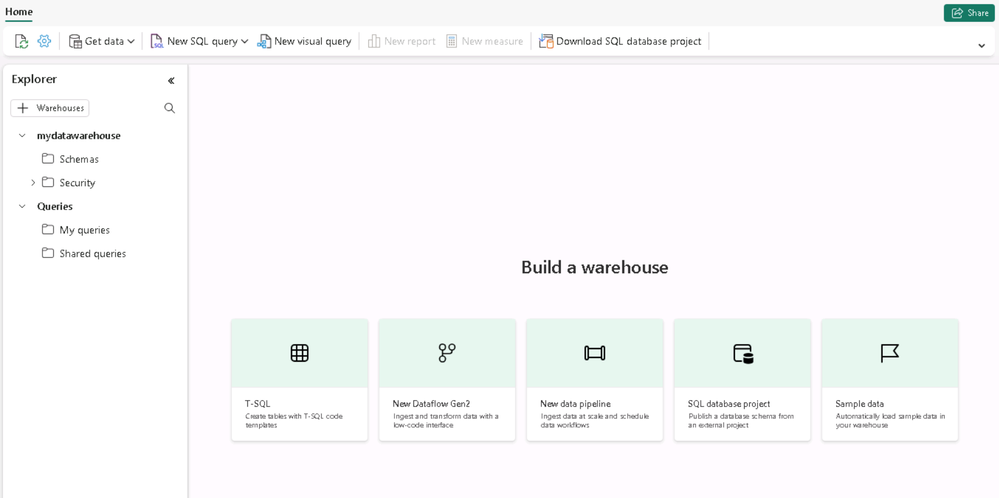

---
lab:
  title: Sichern eines Microsoft Fabric-Data Warehouse
  module: Secure a Microsoft Fabric data warehouse
---

# Sichern eines Microsoft Fabric-Data Warehouse

Gemeinsam steuern Microsoft Fabric-Berechtigungen und granulare SQL-Berechtigungen den Warehouse-Zugriff und Benutzerberechtigungen. In dieser Übung sichern Sie Daten mithilfe präziser Berechtigungen, Sicherheit auf Spaltenebene, Sicherheit auf Zeilenebene und dynamischer Datenmaske.

> **Hinweis:** Um die Übungen in diesem Lab vollständig abzuschließen, benötigen Sie zwei Benutzer: einem Benutzer sollte die Rolle „Arbeitsbereichsadministrator“ zugewiesen sein, und der andere sollte über die Rolle „Arbeitsbereichsbetrachter“ verfügen. Informationen zum Zuweisen von Rollen zu Arbeitsbereichen finden Sie unter [ Gewähren des Zugriffs auf Ihren Arbeitsbereich ](https://learn.microsoft.com/fabric/get-started/give-access-workspaces). Wenn Sie keinen Zugriff auf ein zweites Konto in derselben Organisation haben, können Sie die Übung weiterhin als Arbeitsbereichsadministrator ausführen und die Schritte überspringen, die als Arbeitsbereichbetrachter ausgeführt wurden. Auf den Screenshots der Übung wird gezeigt, worauf ein Arbeitsbereichbetrachter Zugriff hat.

Sie werden ungefähr **45** Minuten für dieses Lab benötigen.

## Erstellen eines Arbeitsbereichs

Erstellen Sie vor dem Arbeiten mit Daten in Fabric einen Arbeitsbereich mit aktivierter Fabric-Testversion.

1. Navigieren Sie in einem Browser unter `https://app.fabric.microsoft.com/home?experience=fabric` zur [Microsoft Fabric-Startseite](https://app.fabric.microsoft.com/home?experience=fabric) und melden Sie sich mit Ihren Fabric-Anmeldeinformationen an.
1. Wählen Sie auf der Menüleiste auf der linken Seite **Arbeitsbereiche** aus (Symbol ähnelt &#128455;).
1. Erstellen Sie einen neuen Arbeitsbereich mit einem Namen Ihrer Wahl, und wählen Sie einen Lizenzierungsmodus mit Fabric-Kapazitäten aus (*Testversion*, *Premium* oder *Fabric*).
1. Wenn Ihr neuer Arbeitsbereich geöffnet wird, sollte er leer sein.

    

> **Hinweis:** Wenn Sie einen Arbeitsbereich erstellen, werden Sie automatisch Mitglied der Rolle „Arbeitsbereichsadministrator“. Sie können der Rolle „Arbeitsbereichsbetrachter“ einen zweiten Benutzer aus Ihrer Umgebung hinzufügen, um die in diesen Übungen konfigurierten Funktionen zu testen. Wählen Sie dazu **Zugriff verwalten** innerhalb des Arbeitsbereichs aus und dann **Personen oder Gruppen hinzufügen**. Dadurch kann der zweite Benutzer den Arbeitsbereichsinhalt anzeigen.

## Erstellen eines Data Warehouse

Erstellen Sie als Nächstes ein Data Warehouse im von Ihnen erstellten Arbeitsbereich:

1. Wählen Sie in der Menüleiste auf der linken Seite **Erstellen** aus. Wählen Sie auf der Seite *Neu* unter dem Abschnitt *Data Warehouse* die Option **Warehouse**. Wählen Sie einen eindeutigen Namen Ihrer Wahl aus.

    >**Hinweis**: Wenn die Option **Erstellen** nicht an die Seitenleiste angeheftet ist, müssen Sie zuerst die Ellipses-Option (**…**) auswählen.

    Nach einer Minute wird ein neues Warehouse erstellt:

    

## Anwenden dynamischer Datenformatierungsregeln auf Spalten in einer Tabelle

Dynamische Datenformatierungsregeln werden auf einzelne Spalten auf Tabellenebene angewendet, sodass alle Abfragen von der Maskierung betroffen sind. Benutzer, die keine explizite Berechtigung zum Anzeigen vertraulicher Daten haben, sehen maskierte Werte in den Abfrageergebnissen, während Benutzer mit einer expliziten Berechtigung zum Anzeigen der Daten diese ungeschwärzt sehen. Es gibt vier Arten von Masken: Standard, E-Mail, Zufalls und benutzerdefinierte Zeichenfolge. In dieser Übung wenden Sie eine Standardmaske, eine E-Mail-Maske und eine Maske für benutzerdefinierte Zeichenfolge an.

1. Wählen Sie in Ihrem neuen Warehouse die Kachel **T-SQL** aus und benutzen Sie die folgende T-SQL-Anweisung, um eine Tabelle zu erstellen und Daten einzufügen und anzuzeigen.  

    ```T-SQL
   CREATE TABLE dbo.Customers
   (   
       CustomerID INT NOT NULL,   
       FirstName varchar(50) MASKED WITH (FUNCTION = 'partial(1,"XXXXXXX",0)') NULL,     
       LastName varchar(50) NOT NULL,     
       Phone varchar(20) MASKED WITH (FUNCTION = 'default()') NULL,     
       Email varchar(50) MASKED WITH (FUNCTION = 'email()') NULL   
   );
   
   INSERT dbo.Customers (CustomerID, FirstName, LastName, Phone, Email) VALUES
   (29485,'Catherine','Abel','555-555-5555','catherine0@adventure-works.com'),
   (29486,'Kim','Abercrombie','444-444-4444','kim2@adventure-works.com'),
   (29489,'Frances','Adams','333-333-3333','frances0@adventure-works.com');
   
   SELECT * FROM dbo.Customers;
    ```

    Wenn Benutzer, die keine unmaskierten Daten sehen dürfen, die Tabelle abfragen, wird in der Spalte **FirstName** der erste Buchstabe der Zeichenfolge mit XXXXXXX und keines der letzten Zeichen angezeigt. In der Spalte **Phone** wird xxxx angezeigt. In der Spalte **Email** wird der erste Buchstabe der E-Mail-Adresse angezeigt, gefolgt von `XXX@XXX.com`. Mit diesem Ansatz wird sichergestellt, dass vertrauliche Daten vertraulich bleiben und Benutzer mit eingeschränktem Zugriff die Tabelle trotzdem abfragen können.

2. Verwenden Sie die Schaltfläche **&#9655; Ausführen**, um das SQL-Skript auszuführen, das eine neue Tabelle mit dem Namen **Customers** im **dbo**-Schema des Data Warehouse erstellt.

3. Erweitern Sie dann im Bereich **Explorer** **Schemas** > **dbo** > **Tabellen**, und vergewissern Sie sich, dass die Tabelle **Customers** erstellt wurde. Die `SELECT`-Anweisung gibt Ihnen unmaskierte Daten zurück, da Sie als Arbeitsbereichsersteller Mitglied der Rolle „Arbeitsbereichsadministrator“ sind, die unmaskierte Daten sehen kann.

    >**Hinweis:** Wenn Sie als Testbenutzer, der Mitglied der Arbeitsbereichsrolle **Betrachter** ist, eine Verbindung herstellen und eine `SELECT`-Anweisung für die Tabelle **Customers** ausführen, werden die folgenden Ergebnisse für die maskierten Daten angezeigt.
   
    
 
    Dem Testbenutzer wurde keine UNMASK-Berechtigung erteilt, sodass Daten, die für die Spalten „FirstName“, „Phone“ und „Email“ zurückgegeben werden, maskiert sind, da diese Spalten in der `CREATE TABLE`-Anweisung mit einer Maske definiert wurden.

## Anwenden von Sicherheitsmaßnahmen auf Zeilenebene

Die Sicherheit auf Zeilenebene (Row-Level Security, RLS) kann verwendet werden, um den Zugriff auf Zeilen basierend auf der Identität oder Rolle des Benutzers zu beschränken, der eine Abfrage ausführt. In dieser Übung beschränken Sie den Zugriff auf Zeilen, indem Sie eine Sicherheitsrichtlinie und ein sicherheitsrelevantes Prädikat erstellen, das als Inlinetabellenwertfunktion definiert ist.

1. Wählen Sie im Warehouse, das Sie in der letzten Übung erstellt haben, das Dropdownmenü **Neue SQL-Abfrage** und wählen Sie **Neue SQL-Abfrage** aus.

2. Erstellen Sie eine Tabelle, und fügen Sie Daten ein. Damit Sie die Sicherheit auf Zeilenebene in einem späteren Schritt testen können, ersetzen Sie `username1@your_domain.com` durch einen Benutzernamen aus Ihrer Umgebung, und ersetzen Sie `username2@your_domain.com` durch Ihren Benutzernamen.

    ```T-SQL
   CREATE TABLE dbo.Sales  
   (  
       OrderID INT,  
       SalesRep VARCHAR(60),  
       Product VARCHAR(10),  
       Quantity INT  
   );
    
   --Populate the table with 6 rows of data, showing 3 orders for each test user. 
   INSERT dbo.Sales (OrderID, SalesRep, Product, Quantity) VALUES
   (1, '<username1>@<your_domain>.com', 'Valve', 5),   
   (2, '<username1>@<your_domain>.com', 'Wheel', 2),   
   (3, '<username1>@<your_domain>.com', 'Valve', 4),  
   (4, '<username2>@<your_domain>.com', 'Bracket', 2),   
   (5, '<username2>@<your_domain>.com', 'Wheel', 5),   
   (6, '<username2>@<your_domain>.com', 'Seat', 5);  
    
   SELECT * FROM dbo.Sales;  
    ```

3. Verwenden Sie die Schaltfläche **&#9655; Ausführen**, um das SQL-Skript auszuführen, das eine neue Tabelle namens **Sales** im **dbo**-Schema des Data Warehouse erstellt.

4. Erweitern Sie dann im Bereich **Explorer** **Schemas** > **dbo** > **Tabellen**, und überprüfen Sie, ob die Tabelle **Sales** erstellt wurde.
5. Erstellen Sie ein neues Schema, ein sicherheitsrelevantes Prädikat, das als Funktion definiert ist, und eine Sicherheitsrichtlinie.  

    ```T-SQL
   --Create a separate schema to hold the row-level security objects (the predicate function and the security policy)
   CREATE SCHEMA rls;
   GO
   
   /*Create the security predicate defined as an inline table-valued function.
   A predicate evaluates to true (1) or false (0). This security predicate returns 1,
   meaning a row is accessible, when a row in the SalesRep column is the same as the user
   executing the query.*/   
   --Create a function to evaluate who is querying the table
   CREATE FUNCTION rls.fn_securitypredicate(@SalesRep AS VARCHAR(60)) 
       RETURNS TABLE  
   WITH SCHEMABINDING  
   AS  
       RETURN SELECT 1 AS fn_securitypredicate_result   
   WHERE @SalesRep = USER_NAME();
   GO   
   /*Create a security policy to invoke and enforce the function each time a query is run on the Sales table.
   The security policy has a filter predicate that silently filters the rows available to 
   read operations (SELECT, UPDATE, and DELETE). */
   CREATE SECURITY POLICY SalesFilter  
   ADD FILTER PREDICATE rls.fn_securitypredicate(SalesRep)   
   ON dbo.Sales  
   WITH (STATE = ON);
   GO
    ```

6. Verwenden Sie die Schaltfläche **&#9655; Ausführen**, um das SQL-Skript auszuführen.
7. Erweitern Sie dann im Bereich **Explorer** **Schemas** > **rls** > **Funktionen** > **Tabellenwertfunktionen**, und überprüfen Sie, ob die Funktion erstellt wurde.
8. Melden Sie sich bei Fabric als der Benutzer an, durch den Sie `<username1>@<your_domain>.com` in der `INSERT`-Anweisung für die Tabelle „Sales“ ersetzt haben. Vergewissern Sie sich, dass Sie als dieser Benutzer angemeldet sind, indem Sie die folgende T-SQL-Datei ausführen.

    ```T-SQL
   SELECT USER_NAME();
    ```

9. Fragen Sie die Tabelle **Sales** ab, um zu bestätigen, dass die Sicherheit auf Zeilenebene wie erwartet funktioniert. Sie sollten nur Daten sehen, die die Bedingungen im sicherheitsrelevanten Prädikat erfüllen, das für den Benutzer definiert ist, als der Sie angemeldet sind:

    ```T-SQL
   SELECT * FROM dbo.Sales;
    ```

    

## Implementieren der Sicherheit auf Spaltenebene

Mithilfe der Sicherheit auf Spaltenebene können Sie festlegen, welche Benutzer auf bestimmte Spalten in einer Tabelle zugreifen können. Sie wird implementiert, indem eine `GRANT`- oder `DENY`-Anweisung für eine Tabelle ausgegeben wird, die eine Liste von Spalten und den Benutzer oder die Rolle angibt, der bzw. die sie lesen kann oder nicht. Um die Zugriffsverwaltung zu optimieren, weisen Sie Rollen anstelle einzelner Benutzer zu. In dieser Übung erstellen Sie eine Tabelle, gewähren Zugriff auf eine Teilmenge von Spalten in der Tabelle und testen, dass eingeschränkte Spalten von einem anderen Benutzer als Ihnen selbst nicht angezeigt werden können.

1. Wählen Sie im Warehouse, das Sie in der vorherigen Übung erstellt haben, das Dropdownmenü **Neue SQL-Abfrage** und dann **Neue SQL-Abfrage** aus.  

2. Erstellen Sie eine Tabelle, und fügen Sie Daten in die Tabelle ein.

    ```T-SQL
   CREATE TABLE dbo.Orders
   (   
       OrderID INT,   
       CustomerID INT,  
       CreditCard VARCHAR(20)      
   );   
   INSERT dbo.Orders (OrderID, CustomerID, CreditCard) VALUES
   (1234, 5678, '111111111111111'),
   (2341, 6785, '222222222222222'),
   (3412, 7856, '333333333333333');   
   SELECT * FROM dbo.Orders;
    ```

3. Verweigern Sie die Berechtigung zum Anzeigen einer Spalte in der Tabelle. Die T-SQL-Anweisung verhindert, dass `<username1>@<your_domain>.com` die Spalte „CreditCard“ in der Tabelle „Orders“ sieht. Ersetzen Sie in der `DENY`-Anweisung `<username1>@<your_domain>.com` durch einen Benutzernamen in Ihrem System, der über **Betrachter**-Berechtigungen für den Arbeitsbereich verfügt.

    ```T-SQL
   DENY SELECT ON dbo.Orders (CreditCard) TO [<username1>@<your_domain>.com];
    ```

4. Testen Sie die Sicherheit auf Spaltenebene, indem Sie sich bei Fabric als der Benutzer anmelden, dem die Auswahlberechtigung verweigert wird.

5. Fragen Sie die Tabelle „Orders“ ab, um zu bestätigen, dass die Sicherheit auf Spaltenebene wie erwartet funktioniert:

    ```T-SQL
   SELECT * FROM dbo.Orders;
    ```

    

    Sie erhalten eine Fehlermeldung, da der Zugriff auf die Spalte „CreditCard“ eingeschränkt wurde. Versuchen Sie, nur die Felder „OrderID“ und „CustomerID“ auszuwählen. Die Abfrage wird erfolgreich ausgeführt.

    ```T-SQL
   SELECT OrderID, CustomerID from dbo.Orders
    ```

## Konfigurieren von granularen SQL-Berechtigungen mit T-SQL

Fabric verfügt über ein Berechtigungsmodell, mit dem Sie den Zugriff auf Daten auf Arbeitsbereichsebene und auf Elementebene steuern können. Wenn Sie eine genauere Kontrolle darüber benötigen, was Benutzer mit sicherungsfähigen Daten in einem Fabric Warehouse tun können, können Sie die standardmäßigen DCL-Befehle (SQL Data Control Language) `GRANT`, `DENY` und `REVOKE` verwenden. In dieser Übung erstellen Sie Objekte, sichern sie mithilfe von `GRANT` und `DENY`, und führen dann Abfragen aus, um die Auswirkung der Anwendung präziser Berechtigungen anzuzeigen.

1. Wählen Sie im Warehouse, das Sie in der vorherigen Übung erstellt haben, die Dropdownliste **Neue SQL-Abfrage** aus. Wählen Sie **Neue SQL-Abfrage** aus.  

2. Erstellen Sie eine gespeicherten Prozedur und eine Tabelle. Führen Sie dann die Prozedur aus, und fragen Sie die Tabelle ab.

    ```T-SQL
   CREATE PROCEDURE dbo.sp_PrintMessage
   AS
   PRINT 'Hello World.';
   GO   
   CREATE TABLE dbo.Parts
   (
       PartID INT,
       PartName VARCHAR(25)
   );
   
   INSERT dbo.Parts (PartID, PartName) VALUES
   (1234, 'Wheel'),
   (5678, 'Seat');
    GO
   
   /*Execute the stored procedure and select from the table and note the results you get
   as a member of the Workspace Admin role. Look for output from the stored procedure on 
   the 'Messages' tab.*/
   EXEC dbo.sp_PrintMessage;
   GO   
   SELECT * FROM dbo.Parts
    ```

3. Wenden Sie als Nächstes `DENY SELECT`-Berechtigungen auf die Tabelle für einen Benutzer an, der Mitglied der Rolle **Arbeitsbereichsbetrachter** ist und `GRANT EXECUTE` auf die Prozedur für denselben Benutzer. Ersetzen Sie `<username1>@<your_domain>.com` durch einen Benutzernamen aus Ihrer Umgebung, der Mitglied der Rolle **Arbeitsbereichsbetrachter** ist.

    ```T-SQL
   DENY SELECT on dbo.Parts to [<username1>@<your_domain>.com];

   GRANT EXECUTE on dbo.sp_PrintMessage to [<username1>@<your_domain>.com];
    ```

4. Melden Sie sich bei Fabric als der Benutzer an, den Sie in den `DENY`-und `GRANT`-Anweisungen anstelle von `<username1>@<your_domain>.com` angegeben haben. Testen Sie dann die granularen Berechtigungen, die Sie angewendet haben, indem Sie die gespeicherte Prozedur ausführen und die Tabelle abfragen.

    ```T-SQL
   EXEC dbo.sp_PrintMessage;
   GO
   
   SELECT * FROM dbo.Parts;
    ```

    

## Bereinigen von Ressourcen

In dieser Übung haben Sie dynamische Datenformatierungsregeln auf Spalten in einer Tabelle angewendet, die Sicherheit auf Zeilenebene angewendet, die Sicherheit auf Spaltenebene implementiert und granulare SQL-Berechtigungen mithilfe von T-SQL konfiguriert.

1. Wählen Sie in der linken Navigationsleiste das Symbol für Ihren Arbeitsbereich aus, um alle darin enthaltenen Elemente anzuzeigen.
2. Wählen Sie auf der oberen Symbolleiste im Menü die Option **Arbeitsbereichseinstellungen** aus.
3. Wählen Sie im Abschnitt **Allgemein** die Option **Diesen Arbeitsbereich entfernen** aus.
