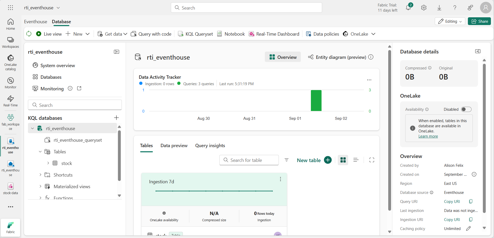

---
lab:
  title: Erste Schritte mit Real-Time Intelligence in Microsoft Fabric
  module: Get started with Real-Time Intelligence in Microsoft Fabric
---

# Erste Schritte mit Real-Time Intelligence in Microsoft Fabric

Microsoft Fabric bietet Echtzeitintelligenz. Sie können damit analytische Lösungen für Echtzeit-Datenströme erstellen. In dieser Übung verwenden Sie die Echtzeitintelligenzfunktionen in Microsoft Fabric, um einen Echtzeitdatenstrom von Börsendaten zu erfassen, zu analysieren und zu visualisieren.

Dieses Lab dauert ungefähr **30** Minuten.

> **Hinweis**: Sie benötigen einen [Microsoft Fabric-Tenant](https://learn.microsoft.com/fabric/get-started/fabric-trial), um diese Übung durchzuführen.

## Erstellen eines Arbeitsbereichs

Bevor Sie mit Daten in Fabric arbeiten, müssen Sie einen Arbeitsbereich mit aktivierter Fabric-Kapazität erstellen.

1. Wählen Sie auf der Menüleiste auf der linken Seite **Arbeitsbereiche** aus (Symbol ähnelt &#128455;).
1. Erstellen Sie einen neuen Arbeitsbereich mit einem Namen Ihrer Wahl, und wählen Sie einen Lizenzierungsmodus mit Fabric-Kapazitäten aus (*Testversion*, *Premium* oder *Fabric*).
1. Wenn Ihr neuer Arbeitsbereich geöffnet wird, sollte er leer sein.

    

## Erstellen eines Eventstreams

Jetzt können Sie Echtzeitdaten aus einer Streamingquelle suchen und erfassen. Sie beginnen im Fabric Echtzeit-Hub.

> **Tipp**: Wenn Sie den Echtzeit-Hub zum ersten Mal verwenden, werden möglicherweise einige *Tipps für die ersten Schritte* angezeigt. Sie können dies schließen.

1. Wählen Sie in der Menüleiste auf der linken Seite den **Echtzeit-Hub** aus.

    Der Echtzeit-Hub bietet eine einfache Möglichkeit, Quellen von Streaming-Daten zu finden und zu verwalten.

    

1. Wählen Sie im Echtzeit-Hub im Abschnitt **Verbinden mit** die Option **Datenquellen** aus.
1. Suchen Sie die Beispiel-Datenquelle **Börsenmarkt**, und wählen Sie **Verbinden** aus. Benennen Sie dann im **Verbindungs**-Assistenten die Quelle als `stock`, und bearbeiten Sie den Standard-Eventstreamnamen, um ihn in `stock-data` zu ändern. Der diesen Daten zugeordnete Standarddatenstrom wird automatisch *stock-data-stream* genannt:

    

1. Wählen Sie **Weiter** aus; warten Sie, bis der Quell- und Eventstream erstellt wurde, und wählen Sie dann **Eventstream öffnen** aus. Der Eventstream zeigt die **Aktien**-Quelle und **stock-data-stream** im Entwurfsbereich an:

   

## Erstellen eines Eventhouses

Der Eventstream erfasst die Echtzeit-Bestandsdaten, macht aber derzeit nichts damit. Erstellen wir ein Eventhouse, in dem die erfassten Daten in einer Tabelle gespeichert werden können.

1. Wählen Sie in der Menüleiste auf der linken Seite **Startseite** aus und erstellen Sie dann auf der Startseite von Real-Time Intelligence ein neues **Eventhouse**, dem Sie einen eindeutigen Namen Ihrer Wahl geben.

    Schließen Sie alle Tipps oder Aufforderungen, die angezeigt werden, bis Sie Ihr neues leeres Eventhouse sehen.

    

1. Beachten Sie im linken Bereich, dass Ihr Eventhouse eine KQL-Datenbank mit demselben Namen wie das Eventhouse enthält. Sie können in dieser Datenbank Tabellen für Ihre Echtzeitdaten anlegen oder bei Bedarf weitere Datenbanken erstellen.
1. Wählen Sie die Datenbank aus und beachten Sie, dass es ein zugehöriges *Queryset* gibt. Diese Datei enthält einige KQL-Beispielabfragen, die Sie verwenden können, um mit der Abfrage der Tabellen in Ihrer Datenbank zu beginnen.

    Allerdings gibt es derzeit keine Tabellen zum Abfragen. Dieses Problem lässt sich beheben, indem Daten aus dem Eventstream in einer neuen Tabelle gespeichert werden.

1. Wählen Sie auf der Hauptseite Ihrer KQL-Datenbank **Daten abrufen**.
1. Wählen Sie als Datenquelle **Eventstream** > **Vorhandener Eventstream**.
1. Erstellen Sie im Bereich **Zieltabelle auswählen oder erstellen** eine neue Tabelle mit dem Namen `stock`. Wählen Sie dann im Bereich **Datenquelle konfigurieren** Ihren Arbeitsbereich und den **stock-data**-Eventstream aus, und nennen Sie die Verbindung `stock-data`.

   

1. Verwenden Sie die Schaltfläche **Weiter**, um die Schritte zum Überprüfen der Daten auszuführen und die Konfiguration dann abzuschließen. Schließen Sie dann das Konfigurationsfenster, um Ihr Eventhouse mit der Bestandstabelle anzuzeigen.

   

    Die Verbindung zwischen dem Datenstrom und der Tabelle wurde erstellt. Überprüfen wir dies im Eventstream.

1. Wählen Sie in der Menüleiste auf der linken Seite den **Echtzeit**-Hub aus und zeigen Sie dann die Seite **Meine Datenströme** an. Es sollten die **Bestands**-Tabelle und der **stock-data-stream**-Datenstrom aufgelistet werden.

   

1. Wählen Sie im Menü **...** für den Datenstrom **stock-data-stream** die Option **Eventstream öffnen** aus.

    Der Eventstream zeigt nun ein Ziel für den Datenstrom an:

   

    > **Tipp**: Wählen Sie das Ziel im Entwurfsbereich aus, und wenn darunter keine Datenvorschau angezeigt wird, wählen Sie **Aktualisieren** aus.

    In dieser Übung haben Sie einen sehr einfachen Eventstream erstellt, der Echtzeitdaten erfasst und diese in eine Tabelle lädt. In einer echten Lösung würden Sie in der Regel Transformationen hinzufügen, um die Daten über Zeitfenster zu aggregieren (z. B. um den Durchschnittspreis jeder Aktie über Fünf-Minuten-Zeiträume zu erfassen).

    Lassen Sie uns nun untersuchen, wie Sie die erfassten Daten abfragen und analysieren können.

## Abfragen der erfassten Daten

Der Eventstream erfasst Echtzeit-Börsendaten und lädt sie in eine Tabelle in Ihrer KQL-Datenbank. Sie können diese Tabelle abfragen, um die erfassten Daten zu sehen.

1. Wählen Sie in der Menüleiste auf der linken Seite Ihre Eventhouse-Datenbank aus.
1. Wählen Sie das *Queryset* für Ihre Datenbank.
1. Ändern Sie im Abfragebereich die erste Beispielabfrage wie hier gezeigt:

    ```kql
    stock
    | take 100
    ```

1. Wählen Sie den Abfragecode aus und führen Sie ihn aus, um 100 Datenzeilen aus der Tabelle anzuzeigen.

    

1. Prüfen Sie die Ergebnisse und ändern Sie dann die Abfrage, um den Durchschnittspreis für jedes Aktiensymbol in den letzten 5 Minuten abzurufen:

    ```kql
    stock
    | where ["time"] > ago(5m)
    | summarize avgPrice = avg(todecimal(bidPrice)) by symbol
    | project symbol, avgPrice
    ```

1. Markieren Sie die geänderte Abfrage und führen Sie sie aus, um die Ergebnisse zu sehen.
1. Warten Sie ein paar Sekunden und führen Sie es erneut aus. Beachten Sie dabei, dass sich die Durchschnittspreise ändern, wenn neue Daten aus dem Echtzeit-Stream zur Tabelle hinzugefügt werden.

## Erstellen von Echtzeitdashboards

Nun, da Sie eine Tabelle haben, die mit Datenströmen gefüllt wird, können Sie ein Echtzeit-Dashboard verwenden, um die Daten zu visualisieren.

1. Wählen Sie im Abfrage-Editor die KQL-Abfrage, die Sie zum Abrufen der durchschnittlichen Aktienkurse der letzten 5 Minuten verwendet haben.
1. Wählen Sie in der Symbolleiste **An Dashboard anheften**. Dann heften Sie die Abfrage **in ein neues Dashboard** mit den folgenden Einstellungen:
    - **Dashboard-Name**: `Stock Dashboard`
    - **Kachelname**: `Average Prices`
1. Erstellen Sie das Dashboard und öffnen Sie es. Diese sollte wie folgt aussehen:

    

1. Wechseln Sie am oberen Rand des Dashboards vom Modus **Betrachten** in den Modus **Bearbeiten**.
1. Wählen Sie das Symbol **Bearbeiten** (*Bleistift*) für die Kachel **Durchschnittspreise**.
1. Ändern Sie im Bereich **Visuelle Formatierung** das **Visuelle** von *Tabelle* in *Säulendiagramm*:

    

1. Wählen Sie oben auf dem Dashboard **Änderungen übernehmen** und sehen Sie sich Ihr modifiziertes Dashboard an:

    

    Jetzt haben Sie eine Live-Visualisierung Ihrer Echtzeit-Aktiendaten.

## Erstellen einer Warnung

Real-Time Intelligence in Microsoft Fabric umfasst eine Technologie namens *Activator*, die auf der Grundlage von Echtzeitereignissen Aktionen auslösen kann. Lassen Sie sich benachrichtigen, wenn der durchschnittliche Aktienkurs um einen bestimmten Betrag steigt.

1. Wählen Sie im Dashboard, das Ihre Aktienkursvisualisierung enthält, in der Symbolleiste die Option **Benachrichtigung einrichten** aus.
1. Erstellen Sie im Bereich **Alarm einrichten** einen Alarm mit den folgenden Einstellungen:
    - **Abfrage ausführen alle**: 5 Minuten
    - **Überprüfen**: Bei jeder Veranstaltung gruppiert nach
    - **Gruppierungsfeld**: Symbol
    - **Wann**: avgPrice
    - **Bedingung**: Erhöht um
    - **Wert:** 100
    - **Aktion**: Senden Sie mir eine E-Mail
    - **Speicherort**:
        - **Arbeitsbereich**: *Ihr Arbeitsbereich*
        - **Artikel**: Neuen Artikel erstellen
        - **Neuer Artikelname**: *Ein eindeutiger Name Ihrer Wahl*

    

1. Erstellen Sie die Warnmeldung und warten Sie, bis sie gespeichert wurde. Schließen Sie dann das Fenster und bestätigen Sie, dass es erstellt wurde.
1. Wählen Sie in der Menüleiste links die Seite für Ihren Arbeitsbereich aus (und speichern Sie alle nicht gespeicherten Änderungen in Ihrem Dashboard, wenn Sie dazu aufgefordert werden).
1. Sehen Sie sich auf der Seite „Arbeitsbereich“ die Elemente an, die Sie in dieser Übung erstellt haben, einschließlich des Aktivators für Ihre Warnmeldung.
1. Öffnen Sie den Aktivator und wählen Sie auf der Seite unter dem Knoten **avgPrice** die eindeutige Kennung für Ihre Warnmeldung aus. Dann sehen Sie sich die Registerkarte **Verlauf** an.

    Möglicherweise wurde Ihre Warnung nicht ausgelöst. In diesem Fall enthält der Verlauf keine Daten. Sollte sich der durchschnittliche Aktienkurs jemals um mehr als 100 ändern, sendet Ihnen der Aktivator eine E-Mail und die Warnung wird in der Historie aufgezeichnet.

## Bereinigen von Ressourcen

In dieser Übung haben Sie ein Eventhouse erstellt, Echtzeitdaten mithilfe eines Eventstreams erfasst, die erfassten Daten in einer KQL-Datenbanktabelle abgefragt, ein Echtzeit-Dashboard zur Visualisierung der Echtzeitdaten erstellt und eine Warnung mithilfe von Activator konfiguriert.

Wenn Sie die Erkundung von Real-Time Intelligence in Fabric abgeschlossen haben, können Sie den für diese Übung erstellten Arbeitsbereich löschen.

1. Wählen Sie auf der Leiste auf der linken Seite das Symbol für Ihren Arbeitsbereich aus.
2. Wählen Sie in der Symbolleiste **Arbeitsbereichseinstellungen** aus.
3. Wählen Sie im Abschnitt **Allgemein** die Option **Diesen Arbeitsbereich entfernen** aus.
