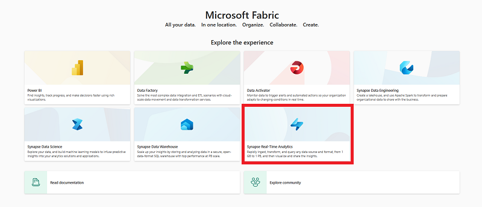

---
lab:
  title: Erste Schritte mit Echtzeitanalysen in Microsoft Fabric
  module: Get started with real-time analytics in Microsoft Fabric
---

# Erste Schritte mit Echtzeitanalysen in Microsoft Fabric

Microsoft Fabric stellt eine Runtime bereit, mit der Sie Daten mithilfe von Kusto-Abfragesprache (Kusto Query Language, KQL) speichern und abfragen können. Kusto ist für Daten optimiert, die eine Zeitreihenkomponente enthalten, z. B. Echtzeitdaten aus Protokolldateien oder von IoT-Geräten.

Dieses Lab dauert ungefähr **30** Minuten.

> **Hinweis:** Sie benötigen eine [Microsoft Fabric-Testversion](https://learn.microsoft.com/fabric/get-started/fabric-trial), um diese Übung durchführen zu können.

## Erstellen eines Arbeitsbereichs

Erstellen Sie vor dem Arbeiten mit Daten in Fabric einen Arbeitsbereich mit aktivierter Fabric-Testversion.

1. Wählen Sie auf der [Microsoft Fabric-Startseite](https://app.fabric.microsoft.com) die Option **Echtzeitanalyse mit Synapse** aus.
1. Wählen Sie auf der Menüleiste auf der linken Seite **Arbeitsbereiche** aus (Symbol ähnelt &#128455;).
1. Erstellen Sie einen neuen Arbeitsbereich mit einem Namen Ihrer Wahl, und wählen Sie einen Lizenzierungsmodus mit Fabric-Kapazitäten aus (*Testversion*, *Premium* oder *Fabric*).
1. Wenn Ihr neuer Arbeitsbereich geöffnet wird, sollte er leer sein.

    

## Herunterladen der Datei für die KQL-Datenbank

Da Sie nun einen Arbeitsbereich besitzen, ist es an der Zeit, die Datendatei herunterzuladen, die analysiert werden soll.

1. Laden Sie die Datendatei für diese Übung von [https://raw.githubusercontent.com/MicrosoftLearning/dp-data/main/sales.csv](https://raw.githubusercontent.com/MicrosoftLearning/dp-data/main/sales.csv) herunter, und speichern Sie diese als **sales.csv** auf Ihrem lokalen Computer (oder ggf. auf Ihrer Lab-VM).
1. Kehren Sie zum Browserfenster mit **Microsoft Fabric** zurück.

## Erstellen einer KQL-Datenbank

Die Kusto-Abfragesprache (Kusto Query Language, KQL) wird verwendet, um statische oder Streamingdaten in einer Tabelle abzufragen, die in einer KQL-Datenbank definiert ist. Zur Analyse der Vertriebsdaten müssen Sie eine Tabelle in einer KQL-Datenbank erstellen und die Daten aus der Datei erfassen.

1. Wählen Sie wie hier gezeigt im **Microsoft Fabric**-Portal **Synapse-Echtzeitanalysen** aus:

    

2. Wählen Sie auf der Seite **Start** für die **Echtzeitanalyse** die Option **KQL-Datenbank** aus, und erstellen Sie eine neue Datenbank mit einem Namen Ihrer Wahl.
3. Wenn die neue Datenbank erstellt wurde, wählen Sie die Option zum Abrufen von Daten aus der **lokalen Datei** aus. Verwenden Sie dann den Assistenten, um die Daten in eine neue Tabelle zu importieren, indem Sie die folgenden Optionen auswählen:
    - **Ziel**:
        - **Datenbank**: *Die von Ihnen erstellte Datenbank ist bereits ausgewählt.*
        - **Table:** *Erstellen Sie eine neue Tabelle mit dem Namen* **sales**, indem Sie auf das +-Zeichen links neben ***Neue Tabelle*** klicken.

        

        - Sie sehen nun den Hyperlink **Dateien hier her ziehen oder nach Dateien suchen** im selben Fenster.

        

        - Suchen oder ziehen Sie ihre **sales.csv** auf den Bildschirm, und warten Sie, bis das Feld "Status" auf ein grünes Kontrollkästchen geändert wird. Wählen Sie dann **Weiter** aus.

        

        - Auf diesem Bildschirm sehen Sie, dass sich die Spaltenüberschriften in der ersten Zeile befinden. Obwohl das System sie erkannt hat, müssen wir den Schieberegler über diesen Zeilen **Erste Zeile ist Spaltenüberschrift** verschieben, um keine Fehler zu erhalten.
        
        

        - Sobald Sie diesen Schieberegler ausgewählt haben, sehen Sie, dass alles gut aussieht. Wählen Sie unten rechts im Bereich die Schaltfläche **Fertig stellen** aus.

        

        - Warten Sie, bis die Schritte im Zusammenfassungsbildschirm abgeschlossen sind, die Folgendes umfassen:
            - Tabelle erstellen (sales)
            - Zuordnung erstellen (sales_mapping)
            - Daten-Queuing
            - Datenerfassung
        - Klicken Sie auf die Schaltfläche **Schließen**.

        

> **Hinweis**: In diesem Beispiel haben Sie eine sehr kleine Menge statischer Daten aus einer Datei importiert, was für diese Übung ausreicht. Tatsächlich können Sie Kusto zur Analyse viel größerer Datenmengen verwenden, unter anderem für Echtzeitdaten aus einer Streamingquelle wie Azure Event Hubs.

## Verwenden von KQL zum Abfragen der Sales-Tabelle

Da Sie über eine Tabelle mit Daten in Ihrer Datenbank verfügen, können Sie nun KQL-Code zur Abfrage dieser Daten verwenden.

1. Stellen Sie sicher, dass die **Sales**-Tabelle hervorgehoben ist. Wählen Sie auf der Menüleiste die Dropdownliste **Abfragetabelle** und dann **Alle 100 Datensätze anzeigen** aus.

2. Ein neuer Bereich mit der Abfrage und dem zugehörigen Ergebnis wird geöffnet. 

3. Ändern Sie die Abfrage wie folgt:

    ```kusto
   sales
   | where Item == 'Road-250 Black, 48'
    ```

4. Führen Sie die Abfrage aus. Überprüfen Sie dann die Ergebnisse, die nur die Zeilen für Verkaufsaufträge für das Produkt *Road-250 Black, 48* enthalten sollten.

5. Ändern Sie die Abfrage wie folgt:

    ```kusto
   sales
   | where Item == 'Road-250 Black, 48'
   | where datetime_part('year', OrderDate) > 2020
    ```

6. Führen Sie die Abfrage aus, und überprüfen Sie die Ergebnisse, die nur Verkaufsaufträge für *Road-250 Black, 48* nach 2020 enthalten sollten.

7. Ändern Sie die Abfrage wie folgt:

    ```kusto
   sales
   | where OrderDate between (datetime(2020-01-01 00:00:00) .. datetime(2020-12-31 23:59:59))
   | summarize TotalNetRevenue = sum(UnitPrice) by Item
   | sort by Item asc
    ```

8. Führen Sie die Abfrage aus, und überprüfen Sie die Ergebnisse, die den Gesamtnettoumsatz für jedes Produkt zwischen dem 1. Januar und dem 31. Dezember 2020 in aufsteigender Reihenfolge des Produktnamens enthalten sollten.
9. Wählen Sie **Als KQL-Abfragesatz speichern** aus, und speichern Sie die Abfrage als **Revenue by Product**.

## Erstellen eines Power BI-Berichts aus einem KQL-Abfrageset

Sie können Ihr KQL-Abfrageset als Grundlage für einen Power BI-Bericht verwenden.

1. Führen Sie im Abfrageworkbench-Editor für Ihren Abfragesatz die Abfrage aus, und warten Sie auf die Ergebnisse.
2. Wählen Sie **Power BI-Bericht erstellen** aus, und warten Sie, bis der Berichts-Editor geöffnet wird.
3. Erweitern Sie im Berichts-Editor im Bereich **Daten** die Option **Kusto-Abfrageergebnis**, und wählen Sie die Felder **Item** und **TotalRevenue** aus.
4. Wählen Sie in der Canvas für den Berichtsentwurf die hinzugefügte Tabellenvisualisierung aus, und wählen Sie dann im Bereich **Visualisierungen** die Option **Gruppiertes Balkendiagramm** aus.

    

5. Wählen Sie im **Power BI**-Fenster im Menü **Datei** die Option **Speichern** aus. Speichern Sie dann den Bericht als **Revenue by Item.pbix** in dem Arbeitsbereich, in dem Ihre Lakehouse- und KQL-Datenbank mithilfe der Vertraulichkeitsbezeichnung **Nicht geschäftlich** definiert sind.
6. Schließen Sie das **Power BI**-Fenster, und wählen Sie auf der Leiste auf der linken Seite das Symbol für Ihren Arbeitsbereich aus.

    Aktualisieren Sie bei Bedarf die Seite „Arbeitsbereich“, um alle darin enthaltenen Elemente anzuzeigen.

7. Beachten Sie in der Liste der Elemente in Ihrem Arbeitsbereich, dass der Bericht **Revenue by Item** aufgeführt ist.

## Bereinigen von Ressourcen

In dieser Übung haben Sie ein Lakehouse und eine KQL-Datenbank erstellt, die die in das Lakehouse hochgeladenen Daten analysiert. Sie haben KQL verwendet, um die Daten abzufragen und einen Abfragesatz zu erstellen, der dann zum Erstellen eines Power BI-Berichts verwendet wurde.

Wenn Sie Ihre KQL-Datenbank erkundet haben, können Sie den Arbeitsbereich löschen, den Sie für diese Übung erstellt haben.

1. Wählen Sie auf der linken Leiste das Symbol für Ihren Arbeitsbereich aus.
2. Wählen Sie im Menü **...** auf der Symbolleiste die **Arbeitsbereichseinstellungen** aus.
3. Wählen Sie im Abschnitt **Andere** die Option **Diesen Arbeitsbereich entfernen** aus.
