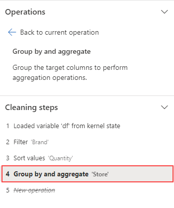

---
lab:
  title: Vorverarbeiten von Daten mit Data Wrangler in Microsoft Fabric
  module: Preprocess data with Data Wrangler in Microsoft Fabric
---

# Vorverarbeiten von Daten mit Data Wrangler in Microsoft Fabric

In diesem Lab erfahren Sie, wie Sie Data Wrangler in Microsoft Fabric verwenden, um Daten vorzuverarbeiten und Code mithilfe einer Bibliothek allgemeiner Data Science-Vorgänge zu generieren.

Dieses Lab dauert ungefähr **30** Minuten.

> **Hinweis:** Sie benötigen eine [Microsoft Fabric-Testversion](https://learn.microsoft.com/fabric/get-started/fabric-trial), um diese Übung abzuschließen.

## Erstellen eines Arbeitsbereichs

Erstellen Sie vor dem Arbeiten mit Daten in Fabric einen Arbeitsbereich mit aktivierter Fabric-Testversion.

1. Navigieren Sie in einem Browser unter `https://app.fabric.microsoft.com/home?experience=fabric` zur [Microsoft Fabric-Startseite](https://app.fabric.microsoft.com/home?experience=fabric) und melden Sie sich mit Ihren Fabric-Anmeldeinformationen an.
1. Wählen Sie auf der Menüleiste auf der linken Seite **Arbeitsbereiche** aus (Symbol ähnelt &#128455;).
1. Erstellen Sie einen neuen Arbeitsbereich mit einem Namen Ihrer Wahl, und wählen Sie einen Lizenzierungsmodus mit Fabric-Kapazitäten aus (*Testversion*, *Premium* oder *Fabric*).
1. Wenn Ihr neuer Arbeitsbereich geöffnet wird, sollte er leer sein.

    

## Erstellen eines Notebooks

Um ein Modell zu trainieren, können Sie ein *Notebook* erstellen. Notebooks bieten eine interaktive Umgebung, in der Sie Code (in mehreren Sprachen) als *Experimente* schreiben und ausführen können.

1. Wählen Sie in der Menüleiste auf der linken Seite **Erstellen** aus. Auf der Seite *Neu* wählen Sie unter dem Abschnitt *Data Science* die Option **Notizbuch** aus. Wählen Sie einen eindeutigen Namen Ihrer Wahl aus.

    >**Hinweis**: Wenn die Option **Erstellen** nicht an die Seitenleiste angeheftet ist, müssen Sie zuerst die Ellipses-Option (**…**) auswählen.

    Nach einigen Sekunden wird ein neues Notebook mit einer einzelnen *Zelle* geöffnet. Notebooks bestehen aus einer oder mehreren Zellen, die *Code* oder *Markdown* (formatierten Text) enthalten können.

1. Wählen Sie die erste Zelle aus (die derzeit eine *Codezelle* ist), und verwenden Sie dann auf der dynamischen Symbolleiste oben rechts die Schaltfläche **M&#8595;** , um die Zelle in eine *Markdownzelle* zu konvertieren.

    Wenn die Zelle in eine Markdownzelle geändert wird, wird der enthaltene Text gerendert.

1. Verwenden Sie bei Bedarf die Schaltfläche **&#128393;** (Bearbeiten), um die Zelle in den Bearbeitungsmodus zu versetzen, löschen Sie anschließend den Inhalt, und geben Sie den folgenden Text ein:

    ```text
   # Perform data exploration for data science

   Use the code in this notebook to perform data exploration for data science.
    ```

## Laden von Daten in einen Dataframe

Jetzt können Sie Code ausführen, um Daten abzurufen. Sie arbeiten mit dem [**OJ Sales-Dataset**](https://learn.microsoft.com/en-us/azure/open-datasets/dataset-oj-sales-simulated?tabs=azureml-opendatasets?azure-portal=true) aus Azure Open Datasets. Nachdem Sie die Daten geladen haben, konvertieren Sie sie in einen Pandas Dataframe, eine Struktur, die von Data Wrangler unterstützt wird.

1. Verwenden Sie in Ihrem Notebook das Symbol **+ Code** unter der neuesten Zelle, um dem Notebook eine neue Codezelle hinzuzufügen.

    > **Tipp**: Um das Symbol **+ Code** anzuzeigen, zeigen Sie mit dem Mauszeiger direkt links unter die Ausgabe der aktuellen Zelle. Alternativ können Sie auf der Menüleiste auf der Registerkarte **Bearbeiten** die Option **+ Codezelle hinzufügen** auswählen.

1. Geben Sie den folgenden Code ein, um das Dataset in einen Datenrahmen zu laden.

    ```python
   # Azure storage access info for open dataset diabetes
   blob_account_name = "azureopendatastorage"
   blob_container_name = "ojsales-simulatedcontainer"
   blob_relative_path = "oj_sales_data"
   blob_sas_token = r"" # Blank since container is Anonymous access
    
   # Set Spark config to access  blob storage
   wasbs_path = f"wasbs://%s@%s.blob.core.windows.net/%s" % (blob_container_name, blob_account_name, blob_relative_path)
   spark.conf.set("fs.azure.sas.%s.%s.blob.core.windows.net" % (blob_container_name, blob_account_name), blob_sas_token)
   print("Remote blob path: " + wasbs_path)
    
   # Spark reads csv
   df = spark.read.csv(wasbs_path, header=True)
    ```

1. Verwenden Sie die Schaltfläche **&#9655; Zelle ausführen** links neben der Zelle, um diese auszuführen. Alternativ können Sie `SHIFT` + `ENTER` auf Ihrer Tastatur drücken, um eine Zelle auszuführen.

    > **Hinweis**: Da Sie Spark-Code zum ersten Mal in dieser Sitzung ausführen, muss der Spark-Pool gestartet werden. Dies bedeutet, dass die erste Ausführung in der Sitzung etwa eine Minute dauern kann. Nachfolgende Ausführungen erfolgen schneller.

1. Verwenden Sie das Symbol **+ Code** unterhalb der Zellenausgabe, um dem Notebook eine neue Codezelle hinzuzufügen, und geben Sie darin den folgenden Code ein:

    ```python
   import pandas as pd

   df = df.toPandas()
   df = df.sample(n=500, random_state=1)
    
   df['WeekStarting'] = pd.to_datetime(df['WeekStarting'])
   df['Quantity'] = df['Quantity'].astype('int')
   df['Advert'] = df['Advert'].astype('int')
   df['Price'] = df['Price'].astype('float')
   df['Revenue'] = df['Revenue'].astype('float')
    
   df = df.reset_index(drop=True)
   df.head(4)
    ```

1. Wenn der Zellenbefehl abgeschlossen ist, überprüfen Sie die Ausgabe unterhalb der Zelle, die wie folgt aussehen sollte:

    |   |WeekStarting|Speicher|Marke|Menge|Anzeige|Preis|Umsatz|
    |---|---|---|---|---|---|---|---|
    |0|1991-10-17|947|minute.maid|13306|1|2,42|32200.52|
    |1|1992-03-26|1.293|dominicks|18596|1|1,94|36076.24|
    |2|1991-08-15|2278|dominicks|17457|1|2.14|37357.98|
    |3|1992-09-03|2175|tropicana|9652|1|2,07|19979.64|
    |…|…|…|…|…|…|…|…|

    Die Ausgabe zeigt die ersten vier Zeilen des Datasets OJ Sales.

## Zusammenfassungsstatistiken anzeigen

Nachdem wir die Daten geladen haben, besteht der nächste Schritt darin, sie mithilfe von Data Wrangler vorzuverarbeiten. Die Vorverarbeitung ist ein wichtiger Schritt in jedem Machine Learning-Workflow. Es umfasst das Bereinigen der Daten und die Transformation in ein Format, das in ein Machine Learning-Modell eingespeist werden kann.

1. Wählen Sie im Menüband des Notebooks die Option **Daten** und dann die Dropdownliste **Data Wrangler starten** aus.

1. Wählen Sie das Dataset `df` aus. Beim Starten von Data Wrangler wird im Bereich **Zusammenfassung** eine beschreibende Übersicht über den angezeigten Dataframe generiert.

1. Wählen Sie das Feature **Einnahmen** und beobachten Sie die Datenverteilung dieses Features.

1. Überprüfen Sie die Details der **Zusammenfassung** im Seitenbereich und sehen Sie sich die Statistikwerte genauer an.

    

    Welche Erkenntnisse können Sie daraus ziehen? Der durchschnittliche Umsatz liegt bei etwa **33.459,54 US-Dollar** mit einer Standardabweichung von **8.032,23 US-Dollar**. Dies bedeutet, dass die Einnahmen in einem Bereich von etwa **8.032,23 US-Dollar** um den Mittelwert herum verteilt sind.

## Formatieren von Textdaten

Nun wenden wir einige Transformationen auf das **Brand**-Feature an.

1. Wählen Sie im **Data Wrangler**-Dashboard im Raster die Funktion `Brand` aus.

1. Navigieren Sie zum Bereich **Vorgänge**, erweitern Sie **Suchen und Ersetzen** und wählen Sie dann **Suchen und Ersetzen** aus.

1. Ändern Sie im Bereich **Suchen und Ersetzen** die folgenden Eigenschaften:

    - **Alter Wert:** „`.`“
    - **Neuer Wert:** „` `“ (Leerzeichen)

    Die Ergebnisse des Vorgangs werden automatisch in der Vorschau im Anzeigeraster angezeigt.

1. Wählen Sie **Übernehmen**.

1. Kehren Sie zum Bereich **Vorgänge** und erweitern Sie **Format**.

1. Wählen Sie **Erstes Zeichen groß schreiben** aus. Schalten Sie **Alle Wörter groß schreiben** ein und wählen Sie dann **Anwenden** aus.

1. Wählen Sie **Code zu Notebook hinzufügen** aus. Darüber hinaus können Sie den Code auch kopieren und das transformierte Dataset als CSV-Datei speichern.

    >**Hinweis:** Der Code wird automatisch in die Notebookzelle kopiert und kann verwendet werden.

1. Ersetzen Sie die Zeilen 10 und 11 durch den Code `df = clean_data(df)`, da der in Data Wrangler generierte Code den ursprünglichen Dataframe nicht überschreibt. Der finale Codeblock sollte wie folgt aussehen:

    ```python
   def clean_data(df):
       # Replace all instances of "." with " " in column: 'Brand'
       df['Brand'] = df['Brand'].str.replace(".", " ", case=False, regex=False)
       # Capitalize the first character in column: 'Brand'
       df['Brand'] = df['Brand'].str.title()
       return df
    
   df = clean_data(df)
    ```

1. Führen Sie die Codezelle aus und überprüfen Sie die Variable `Brand`.

    ```python
   df['Brand'].unique()
    ```

    Das Ergebnis sollte die Werte *Minute Maid*, *Dominicks* und *Tropicana* anzeigen.

Sie haben gelernt, wie Sie Textdaten grafisch bearbeiten und mithilfe von Data Wrangler ganz einfach Code generieren.

## Anwenden der Transformation mit One-Hot-Encoder

Als Nächstes generieren wir den Code, um die Transformation für die One-Hot-Codierung im Rahmen der Vorverarbeitungsschritte auf unsere Daten anzuwenden. Um unser Szenario praktischer zu gestalten, generieren wir zunächst einige Beispieldaten. So können wir eine reale Situation simulieren und erhalten ein funktionsfähiges Feature.

1. Starten Sie Data Wrangler im oberen Menü für den `df`-Dataframe.

1. Wählen Sie im Raster das Feature `Brand` aus.

1. Erweitern Sie im Bereich **Vorgänge** die Option **Formeln** und wählen Sie dann **One-Hot-Encode** aus.

1. Wählen Sie im Bereich **One-hot encode** die Option **Anwenden** aus.

    Gehen Sie zum Ende des Data Wrangler-Anzeigerasters. Sie sehen, dass drei neue Features hinzugefügt (`Brand_Dominicks`, `Brand_Minute Maid` und `Brand_Tropicana`) und das Feature `Brand` entfernt wurden.

1. Beenden Sie Data Wrangler, ohne den Code zu generieren.

## Sortier- und Filtervorgänge

Stellen Sie sich vor, wir müssen die Umsatzdaten für ein bestimmtes Geschäft überprüfen und dann die Produktpreise sortieren. In den folgenden Schritten verwenden wir Data Wrangler, um den `df`-Dataframe zu filtern und zu analysieren.

1. Starten Sie Data Wrangler für den `df`-Dataframe.

1. Erweitern Sie im Bereich **Vorgänge** die Option **Sortieren und Filtern**.

1. Wählen Sie **Filter** aus.

1. Fügen Sie im Bereich **Filter** die folgende Bedingung hinzu:

    - **Zielspalte**: `Store`
    - **Vorgang**: `Equal to`
    - **Wert**: `1227`
    - **Aktion**: `Keep matching rows`

1. Wählen Sie **Übernehmen** und sehen Sie sich die Änderungen im Data Wrangler-Anzeigeraster an.

1. Wählen Sie das Feature **Umsatz** aus und sehen Sie sich dann die Details der **Zusammenfassung** im Seitenbereich genauer an.

    Welche Erkenntnisse können Sie daraus ziehen? Die Abweichung ist **-0,751**, was auf eine leichte Linksverschiebung (negative Abweichung) hinweist. Das bedeutet, dass der linke Ausläufer der Verteilung etwas länger ist als der rechte Ausläufer. Mit anderen Worten: Es gibt eine Reihe von Zeiträumen, in denen die Einnahmen deutlich unter dem Durchschnitt liegen.

1. Kehren Sie zum Bereich **Vorgänge** zurück und erweitern Sie **Sortieren und Filtern**.

1. Wählen Sie **Werte sortieren** aus.

1. Wählen Sie im Bereich **Werte sortieren** die folgenden Eigenschaften aus:

    - **Spaltenname**: `Price`
    - **Sortierreihenfolge**: `Descending`

1. Wählen Sie **Übernehmen**.

    Der höchste Produktpreis für das Geschäft **1227** beträgt **2,68 US-Dollar**. Bei einer geringen Anzahl von Datensätzen ist es einfacher, den höchsten Produktpreis zu ermitteln, aber stellen Sie sich die Komplexität vor, wenn Sie es mit Tausenden von Ergebnissen zu tun haben.

## Schritte durchsuchen und entfernen

Angenommen, Sie haben einen Fehler gemacht und müssen die Sortierung, die Sie im vorherigen Schritt erstellt haben, entfernen. Führen Sie die folgenden Schritte aus, um sie zu entfernen:

1. Navigieren Sie zum Bereich **Schritte bereinigen**.

1. Wählen Sie den Schritt **Werte sortieren** aus.

1. Wählen Sie das Löschsymbol aus, um den Schritt zu entfernen.

    

    > **Wichtig:** Die Rasteransicht und Zusammenfassung sind auf den aktuellen Schritt beschränkt.

    Sie sehen, dass die Änderungen auf den vorherigen Schritt zurückgesetzt werden, nämlich auf den Schritt **Filtern**.

1. Beenden Sie Data Wrangler, ohne den Code zu generieren.

## Aggregatdaten

Angenommen, wir müssen den durchschnittlichen Umsatz jeder Marke analysieren. In den folgenden Schritten verwenden wir Data Wrangler, um einen „Gruppieren nach“-Vorgang für den `df`-Dataframe auszuführen.

1. Starten Sie Data Wrangler für den `df`-Dataframe.

1. Kehren Sie zum Bereich **Vorgänge** zurück und wählen Sie **Gruppieren nach und aggregieren** aus.

1. Wählen Sie im Bereich **Spalten, nach denen gruppiert werden soll** die Funktion `Brand` aus.

1. Wählen Sie **Aggregation hinzufügen** aus.

1. Wählen Sie in der Eigenschaft **Zu aggregierende Spalte** das Feature `Revenue` aus.

1. Wählen Sie für die Eigenschaft **Aggregationstyp** `Mean` aus.

1. Wählen Sie **Übernehmen**.

1. Wählen Sie **Kopieren in die Zwischenablage** aus.

1. Beenden Sie Data Wrangler, ohne den Code zu generieren.

1. Kombinieren Sie den Code aus der Variablentransformation `Brand` mit dem Code, der durch den Aggregationsschritt in der Funktion `clean_data(df)` generiert wird. Der finale Codeblock sollte wie folgt aussehen:

    ```python
   def clean_data(df):    
       # Replace all instances of "." with " " in column: 'Brand'    
       df['Brand'] = df['Brand'].str.replace(".", " ", case=False, regex=False)    
       # Capitalize the first character in column: 'Brand'    
       df['Brand'] = df['Brand'].str.title()
        
       # Performed 1 aggregation grouped on column: 'Brand'    
       df = df.groupby(['Brand']).agg(Revenue_mean=('Revenue', 'mean')).reset_index()    
        
       return df    
        
   df = clean_data(df)
    ```

1. Führen Sie den Zellcode aus.

1. Überprüfen Sie die Daten im Dataframe.

    ```python
   print(df)
    ```

    Ergebnisse:

    |   |Marke|Revenue_mean|
    |---|---|---|
    |0|Dominicks|33206.330958|
    |1|Minute Maid|33532.999632|
    |2|Tropicana|33637.863412|

Sie haben den Code für einige der Vorverarbeitungsvorgänge generiert und den Code als Funktion zurück in das Notebook kopiert, die Sie dann ausführen, wiederverwenden oder nach Bedarf ändern können.

## Speichern des Notebooks und Beenden der Spark-Sitzung

Nachdem Sie die Vorverarbeitung Ihrer Daten für die Modellierung abgeschlossen haben, können Sie das Notebook unter einem aussagekräftigen Namen speichern und die Spark-Sitzung beenden.

1. Verwenden Sie in der Menüleiste des Notebooks das Symbol ⚙️ **Einstellungen**, um die Einstellungen des Notebooks anzuzeigen.
2. Legen Sie den **Namen** des Notebooks auf **Daten mit Data Wrangler vorverarbeiten** fest und schließen Sie den Bereich „Einstellungen“.
3. Wählen Sie im Notebookmenü **Sitzung beenden** aus, um die Spark-Sitzung zu beenden.

## Bereinigen von Ressourcen

In dieser Übung haben Sie ein Notebook erstellt und Data Wrangler verwendet, um Daten für ein Machine Learning-Modell zu untersuchen und vorzuverarbeiten.

Wenn Sie die Vorverarbeitungsschritte abgeschlossen haben, können Sie den Arbeitsbereich, den Sie für diese Übung erstellt haben, löschen.

1. Wählen Sie auf der Leiste auf der linken Seite das Symbol für Ihren Arbeitsbereich aus, um alle darin enthaltenen Elemente anzuzeigen.
2. Wählen Sie im Menü **...** auf der Symbolleiste die **Arbeitsbereichseinstellungen** aus.
3. Wählen Sie im Abschnitt **Allgemein** die Option **Diesen Arbeitsbereich entfernen** aus.
