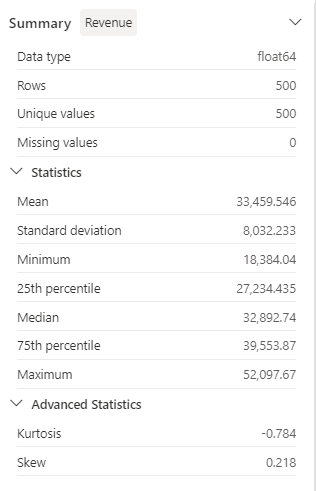

---
lab:
  title: Vorverarbeiten von Daten mit Data Wrangler in Microsoft Fabric
  module: Preprocess data with Data Wrangler in Microsoft Fabric
---

# Verwenden von Notebooks zum Trainieren eines Modells in Microsoft Fabric

In diesem Lab erfahren Sie, wie Sie Data Wrangler in Microsoft Fabric verwenden, um Daten vorzuverarbeiten und Code mithilfe einer Bibliothek gängiger Data Science-Vorgänge zu generieren.

Dieses Lab dauert ungefähr **30** Minuten.

> **Hinweis:** Sie benötigen eine Microsoft Fabric-Lizenz, um diese Übung durchführen zu können. Weitere Informationen zum Aktivieren einer kostenlosen Fabric-Testlizenz finden Sie unter [Erste Schritte mit Fabric](https://learn.microsoft.com/fabric/get-started/fabric-trial). Dazu benötigen Sie ein *Schul-* , *Geschäfts-* oder Unikonto von Microsoft. Wenn Sie über kein Microsoft-Konto verfügen, können Sie sich [für eine kostenlose Testversion von Microsoft Office 365 E3 oder höher registrieren](https://www.microsoft.com/microsoft-365/business/compare-more-office-365-for-business-plans).

## Erstellen eines Arbeitsbereichs

Erstellen Sie vor dem Arbeiten mit Daten in Fabric einen Arbeitsbereich mit aktivierter Fabric-Testversion.

1. Melden Sie sich bei [Microsoft Fabric](https://app.fabric.microsoft.com) unter `https://app.fabric.microsoft.com` an, und wählen Sie **Power BI** aus.
2. Wählen Sie auf der Menüleiste auf der linken Seite **Arbeitsbereiche** aus (Symbol ähnelt &#128455;).
3. Erstellen Sie einen neuen Arbeitsbereich mit einem Namen Ihrer Wahl, und wählen Sie einen Lizenzierungsmodus mit Fabric-Kapazitäten aus (*Testversion*, *Premium* oder *Fabric*).
4. Beim Öffnen Ihres neuen Arbeitsbereichs sollte dieser wie im Folgenden gezeigt leer sein:

    

## Erstellen eines Lakehouse und Hochladen von Dateien

Nachdem Sie nun über einen Arbeitsbereich verfügen, können Sie zu *Data Science* im Portal wechseln und ein Data Lakehouse für die zu analysierenden Datendateien erstellen.

1. Wählen Sie unten links im Power BI-Portal das **Power BI**-Symbol aus, und wechseln Sie zu **Datentechnik**.
1. Erstellen Sie auf der Startseite **Datentechnik** ein neues **Lakehouse** mit einem Namen Ihrer Wahl.

    Nach etwa einer Minute wird ein neues Lakehouse ohne **Tabellen** oder **Dateien** erstellt. Sie müssen einige Daten für die Analyse in das Data Lakehouse einfügen. Es gibt mehrere Möglichkeiten, dies zu tun, aber in dieser Übung laden Sie einfach einen Ordner mit Textdateien auf Ihrem lokalen Computer (oder ggf. einer Lab-VM) herunter, extrahieren sie und laden sie dann in Ihr Lakehouse hoch.

1. Voraussetzungen: Laden Sie die `dominicks_OJ.csv`-CSV-Datei für diese Übung von [https://raw.githubusercontent.com/MicrosoftLearning/dp-data/main/XXXXX.csv](https://raw.githubusercontent.com/MicrosoftLearning/dp-data/main/XXXXX.csv) herunter, und speichern Sie sie.


1. Kehren Sie zur Webbrowser-Registerkarte mit Ihrem Lakehouse zurück, und wählen Sie im Menü **...** für den Knoten **Dateien** im Bereich **Lake-Ansicht** die Optionen **Hochladen** und **Dateien hochladen** aus. Laden Sie dann die Datei **dominicks_OJ.csv** von Ihrem lokalen Computer (oder ggf. Ihrer Lab-VM) in das Lakehouse hoch.
6. Erweitern Sie nach dem Hochladen der Dateien den Eintrag **Dateien**, und überprüfen Sie, ob die CSV-Datei hochgeladen wurde.

## Erstellen eines Notebooks

Um ein Modell zu trainieren, können Sie ein *Notebook* erstellen. Notebooks bieten eine interaktive Umgebung, in der Sie Code (in mehreren Sprachen) als *Experimente* schreiben und ausführen können.

1. Wählen Sie unten links im Power BI-Portal das **Datentechnik**-Symbol aus, und wechseln Sie zu **Data Science**.

1. Erstellen Sie auf der **Data Science**-Startseite ein neues **Notebook**.

    Nach einigen Sekunden wird ein neues Notebook mit einer einzelnen *Zelle* geöffnet. Notebooks bestehen aus einer oder mehreren Zellen, die *Code* oder *Markdown* (formatierten Text) enthalten können.

1. Wählen Sie die erste Zelle aus (die derzeit eine *Codezelle* ist), und verwenden Sie dann auf der dynamischen Symbolleiste oben rechts die Schaltfläche **M&#8595;** , um die Zelle in eine *Markdownzelle* zu konvertieren.

    Wenn die Zelle in eine Markdownzelle geändert wird, wird der enthaltene Text gerendert.

1. Verwenden Sie die Schaltfläche **&#128393;** (Bearbeiten), um die Zelle in den Bearbeitungsmodus zu versetzen, löschen Sie dann den Inhalt und geben Sie den folgenden Text ein:

    ```text
   # Train a machine learning model and track with MLflow

   Use the code in this notebook to train and track models.
    ``` 

## Laden von Daten in einen Dataframe

Jetzt können Sie Code ausführen, um Daten aufzubereiten und ein Modell zu trainieren. Um mit Daten zu arbeiten, verwenden Sie *Dataframes*. Dataframes in Spark ähneln Pandas-Dataframes in Python und bieten eine gemeinsame Struktur für die Arbeit mit Daten in Zeilen und Spalten.

1. Wählen Sie im Bereich **Lakehouse hinzufügen** die Option **Hinzufügen** aus, um ein Lakehouse hinzuzufügen.
1. Wählen Sie **Vorhandenes Lakehouse** und **Hinzufügen** aus.
1. Wählen Sie das Lakehouse aus, das Sie in einem vorherigen Abschnitt erstellt haben.
1. Erweitern Sie den Ordner **Dateien**, sodass die CSV-Datei neben dem Notebook-Editor aufgeführt wird.
1. Wählen Sie im Menü **...** für **churn.csv** die Option **Daten laden** > **Pandas** aus. Dem Notebook sollte eine neue Codezelle mit folgendem Code hinzugefügt werden:

    ```python
    import pandas as pd
    df = pd.read_csv("/lakehouse/default/" + "Files/dominicks_OJ.csv") 
    display(df.head(5))
    ```

    > **Tipp**: Sie können den Bereich mit den Dateien auf der linken Seite ausblenden, indem Sie das **<<** -Symbol verwenden. Dies hilft Ihnen, sich auf das Notebook zu konzentrieren.

1. Verwenden Sie die Schaltfläche **&#9655; Zelle ausführen** links neben der Zelle, um diese auszuführen.

    > **Hinweis**: Da Sie Spark-Code zum ersten Mal in dieser Sitzung ausführen, muss der Spark-Pool gestartet werden. Dies bedeutet, dass die erste Ausführung in der Sitzung etwa eine Minute dauern kann. Nachfolgende Ausführungen erfolgen schneller.

## Anzeigen der Zusammenfassungsstatistik

Beim Starten von Data Wrangler wird eine beschreibende Übersicht über den Dataframe im Bereich „Zusammenfassung“ generiert. 

1. Wählen Sie im oberen Menü **Daten** und dann die Dropdownliste **Data Wrangler** aus, um das Dataset `df` zu durchsuchen.

    

1. Wählen Sie die Spalte **Large HH** aus, und beobachten Sie, wie einfach Sie die Datenverteilung dieses Features bestimmen können.

    

    Beachten Sie, dass dieses Feature einer normalen Verteilung folgt.

1. Sehen Sie sich den Seitenbereich „Zusammenfassung“ an, und beachten Sie die Perzentilbereiche. 

    

    Sie können sehen, dass die meisten Daten zwischen **0,098** und **0,132** liegen und dass 50 % der Datenwerte innerhalb dieses Bereichs liegen.

## Formatieren von Textdaten

Nun wenden wir einige Transformationen auf das **Brand**-Feature an.

1. Wählen Sie auf der Seite **Data Wrangler** das Feature `Brand` aus.

1. Navigieren Sie zum Bereich **Vorgänge**, erweitern Sie **Suchen und Ersetzen**, und wählen Sie dann **Suchen und Ersetzen** aus.

1. Ändern Sie im Bereich **Suchen und Ersetzen** die folgenden Eigenschaften:
    
    - **Alter Wert:** „.“
    - **Neuer Wert:** „ “ (Leerzeichen)

    

    Die Ergebnisse des Vorgangs werden automatisch als Vorschau im Anzeigeraster angezeigt.

1. Wählen Sie **Übernehmen**.

1. Erweitern Sie dann im Bereich **Vorgänge** die Option **Format**.

1. Wählen Sie **Konvertieren von Text in Großbuchstaben** aus.

1. Wählen Sie im Bereich **Konvertieren von Text in Großbuchstaben** die Option **Anwenden** aus.

1. Wählen Sie **Code zu Notebook hinzufügen** aus. Darüber hinaus können Sie das transformierte Dataset auch als CSV-Datei speichern.

    Beachten Sie, dass der Code automatisch in die Notebookzelle kopiert wird und einsatzbereit ist.

1. Führen Sie den Code aus.

> **Wichtig:** Der generierte Code überschreibt den ursprünglichen Dataframe nicht. 

Sie haben gelernt, wie Sie mithilfe von Data Wrangler-Vorgängen auf einfache Weise Code generieren und Textdaten bearbeiten können. 

## Anwenden der One-Hot-Encoder-Transformation

Nun generieren wir den Code, um die One-Hot-Encoder-Transformation als Vorverarbeitungsschritt anzuwenden.

1. Wählen Sie im oberen Menü **Daten** und dann die Dropdownliste **Data Wrangler** aus, um das Dataset `df` zu durchsuchen.

1. Erweitern Sie dann im Bereich **Vorgänge** die Option **Formeln**.

1. Wählen Sie **One-Hot-Codierung** aus.

1. Wählen Sie im Bereich **One-Hot-Codierung** die Option **Anwenden** aus.

    Navigieren Sie zum Ende des Data Wrangler-Anzeigerasters. Beachten Sie, dass drei neue Features hinzugefügt und das `Brand`-Feature entfernt wurde.

1. Wählen Sie **Code zu Notebook hinzufügen** aus.

1. Führen Sie den Code aus.

## Sortier- und Filtervorgänge

1. Wählen Sie im oberen Menü **Daten** und dann die Dropdownliste **Data Wrangler** aus, um das Dataset `df` zu durchsuchen.

1. Erweitern Sie im Bereich **Vorgänge** die Option **Sortieren und Filtern**.

1. Wählen Sie **Filtern** aus.

1. Fügen Sie im Bereich **Filter** die folgende Bedingung hinzu:
    
    - **Zielspalte:** Store
    - **Vorgang:** Gleich
    - **Wert:** 2

1. Wählen Sie **Übernehmen**.

    Beachten Sie, dass die Änderungen im Data Wrangler-Anzeigeraster geändert werden.

1. Erweitern Sie im Bereich **Vorgänge** die Option **Sortieren und Filtern**.

1. Select **Sort values**

1. Fügen Sie im Bereich **Preis** die folgende Bedingung hinzu:
    
    - **Spaltenname:** Price
    - **Sortierreihenfolge:** Absteigend

1. Wählen Sie **Übernehmen**.

    Beachten Sie, dass die Änderungen im Data Wrangler-Anzeigeraster geändert werden.

## Aggregieren von Daten

1. Kehren Sie zum Bereich **Vorgänge** zurück, und wählen Sie **Gruppieren nach und aggregieren** aus.

1. Wählen Sie in der Eigenschaft **Spalten, nach denen gruppiert werden soll:** das Feature `Store` aus.

1. Wählen Sie **Aggregation hinzufügen** aus.

1. Wählen Sie in der Eigenschaft **Zu aggregierende Spalte** das Feature `Quantity` aus.

1. Wählen Sie **Count** für die Eigenschaft **Aggregationstyp** aus.

1. Wählen Sie **Übernehmen**. 

    Beachten Sie, dass die Änderungen im Data Wrangler-Anzeigeraster geändert werden.

## Durchsuchen und Entfernen von Schritten

Angenommen, Sie haben einen Fehler gemacht und müssen die Aggregation entfernen, die Sie im vorherigen Schritt erstellt haben. Führen Sie die folgenden Schritte aus, um sie zu entfernen:

1. Erweitern Sie den Bereich **Bereinigungsschritte**.

1. Wählen Sie den Schritt **Gruppieren nach und aggregieren** aus.

1. Wählen Sie das Löschsymbol zum Entfernen aus.

    

    > **Wichtig:** Die Rasteransicht und Zusammenfassung sind auf den aktuellen Schritt beschränkt.

    Beachten Sie, dass die Änderungen auf den vorherigen Schritt zurückgesetzt werden, nämlich auf den Schritt **Sortierwerte**.

1. Wählen Sie **Code zu Notebook hinzufügen** aus.

1. Führen Sie den Code aus.

Sie haben den Code für einige der Vorverarbeitungsvorgänge generiert und als Funktion im Notebook gespeichert, die Sie dann bei Bedarf wiederverwenden oder ändern können.

## Speichern des Notebooks und Beenden der Spark-Sitzung

Nachdem Sie die Vorverarbeitung der Daten für die Modellerstellung abgeschlossen haben, können Sie das Notebook mit einem aussagekräftigen Namen speichern und die Spark-Sitzung beenden.

1. Verwenden Sie in der Menüleiste des Notebooks das Symbol ⚙️ **Einstellungen**, um die Einstellungen des Notebooks anzuzeigen.
2. Legen Sie den **Namen** des Notebooks auf **Preprocess data with Data Wrangler** fest, und schließen Sie den Einstellungsbereich.
3. Wählen Sie im Notebookmenü **Sitzung beenden** aus, um die Spark-Sitzung zu beenden.

## Bereinigen von Ressourcen

In dieser Übung haben Sie ein Notebook erstellt und Data Wrangler verwendet, um Daten für ein Machine Learning-Modell zu untersuchen und vorzuverarbeiten.

Wenn Sie den Vorverarbeitungsschritt abgeschlossen haben, können Sie den Arbeitsbereich löschen, den Sie für diese Übung erstellt haben.

1. Wählen Sie auf der Leiste auf der linken Seite das Symbol für Ihren Arbeitsbereich aus, um alle darin enthaltenen Elemente anzuzeigen.
2. Wählen Sie im Menü **...** auf der Symbolleiste die **Arbeitsbereichseinstellungen** aus.
3. Wählen Sie im Abschnitt **Andere** die Option **Diesen Arbeitsbereich entfernen** aus.
