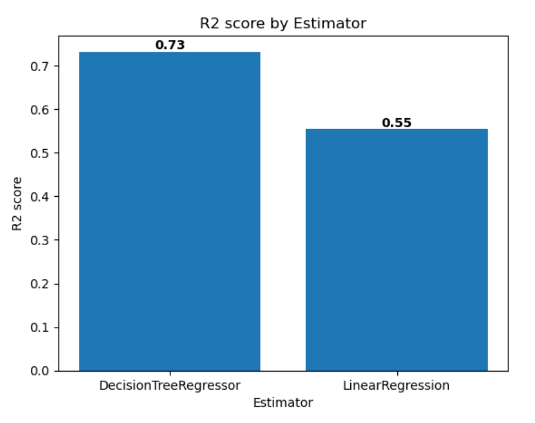

---
lab:
  title: Trainieren und Nachverfolgen von Machine Learning-Modellen mit MLflow in Microsoft Fabric
  module: Train and track machine learning models with MLflow in Microsoft Fabric
---

# Trainieren und Nachverfolgen von Machine Learning-Modellen mit MLflow in Microsoft Fabric

In diesem Lab trainieren Sie ein Machine Learning-Modell, um ein quantitatives Measure für Diabetes vorherzusagen. Sie trainieren ein Regressionsmodell mit Scikit-learn und verfolgen und vergleichen Ihre Modelle mit MLflow.

Bei diesem Lab sammeln Sie praktische Erfahrung mit maschinellem Lernen und der Modellnachverfolgung und lernen, wie Sie in Microsoft Fabric mit *Notebooks*, *Experimenten* und *Modellen* arbeiten.

Dieses Lab dauert ungefähr **25** Minuten.

> **Hinweis:** Sie benötigen eine [Microsoft Fabric-Testversion](https://learn.microsoft.com/fabric/get-started/fabric-trial), um diese Übung abzuschließen.

## Erstellen eines Arbeitsbereichs

Erstellen Sie vor dem Arbeiten mit Daten in Fabric einen Arbeitsbereich mit aktivierter Fabric-Testversion.

1. Navigieren Sie in einem Browser unter `https://app.fabric.microsoft.com` zur Willkommensseite von Microsoft Fabric, und melden Sie sich bei Bedarf mit Ihren Fabric-Anmeldeinformationen an.
1. Wählen Sie auf der Willkommensseite von Fabric die Option **Synapse Data Science** aus.
1. Wählen Sie auf der Menüleiste auf der linken Seite **Arbeitsbereiche** aus (Symbol ähnelt &#128455;).
1. Erstellen Sie einen neuen Arbeitsbereich mit einem Namen Ihrer Wahl, und wählen Sie einen Lizenzierungsmodus mit Fabric-Kapazitäten aus (*Testversion*, *Premium* oder *Fabric*).
1. Wenn Ihr neuer Arbeitsbereich geöffnet wird, sollte er leer sein.

    

## Erstellen eines Notebooks

Um ein Modell zu trainieren, können Sie ein *Notebook* erstellen. Notebooks sind eine interaktive Umgebung, in der Sie Code (in mehreren Sprachen) schreiben und ausführen können.

1. Erstellen Sie auf der Startseite von **Data Science mit Synapse** ein neues **Notebook**.

    Nach einigen Sekunden wird ein neues Notebook mit einer einzelnen *Zelle* geöffnet. Notebooks bestehen aus einer oder mehreren Zellen, die *Code* oder *Markdown* (formatierten Text) enthalten können.

1. Wählen Sie die erste Zelle aus (die derzeit eine *Codezelle* ist), und verwenden Sie dann auf der dynamischen Symbolleiste oben rechts die Schaltfläche **M&#8595;** , um die Zelle in eine *Markdownzelle* zu konvertieren.

    Wenn die Zelle in eine Markdownzelle geändert wird, wird der enthaltene Text gerendert.

1. Verwenden Sie bei Bedarf die Schaltfläche **&#128393;** (Bearbeiten), um die Zelle in den Bearbeitungsmodus zu versetzen, löschen Sie anschließend den Inhalt, und geben Sie den folgenden Text ein:

    ```text
   # Train a machine learning model and track with MLflow
    ```

## Laden von Daten in einen Dataframe

Jetzt können Sie Code ausführen, um Daten abzurufen und ein Modell zu trainieren. Sie arbeiten mit dem [Diabetesdataset](https://learn.microsoft.com/azure/open-datasets/dataset-diabetes?tabs=azureml-opendatasets?azure-portal=true) aus Azure Open Datasets. Nachdem Sie die Daten geladen haben, konvertieren Sie diese in einen Pandas-Dataframe. Dabei handelt es sich um eine gängige Struktur für die Arbeit mit Daten in Zeilen und Spalten.

1. Verwenden Sie in Ihrem Notebook das Symbol **+ Code** unter der neuesten Zellenausgabe, um dem Notebook eine neue Codezelle hinzuzufügen.

    > **Tipp**: Um das Symbol **+ Code** anzuzeigen, zeigen Sie mit dem Mauszeiger direkt links unter die Ausgabe der aktuellen Zelle. Alternativ können Sie auf der Menüleiste auf der Registerkarte **Bearbeiten** die Option **+ Codezelle hinzufügen** auswählen.

1. Geben Sie dann den folgenden Code ein:

    ```python
   # Azure storage access info for open dataset diabetes
   blob_account_name = "azureopendatastorage"
   blob_container_name = "mlsamples"
   blob_relative_path = "diabetes"
   blob_sas_token = r"" # Blank since container is Anonymous access
    
   # Set Spark config to access  blob storage
   wasbs_path = f"wasbs://%s@%s.blob.core.windows.net/%s" % (blob_container_name, blob_account_name, blob_relative_path)
   spark.conf.set("fs.azure.sas.%s.%s.blob.core.windows.net" % (blob_container_name, blob_account_name), blob_sas_token)
   print("Remote blob path: " + wasbs_path)
    
   # Spark read parquet, note that it won't load any data yet by now
   df = spark.read.parquet(wasbs_path)
    ```

1. Verwenden Sie die Schaltfläche **&#9655; Zelle ausführen** links neben der Zelle, um diese auszuführen. Alternativ können Sie **SHIFT** + **ENTER** auf Ihrer Tastatur drücken, um eine Zelle auszuführen.

    > **Hinweis**: Da Sie Spark-Code zum ersten Mal in dieser Sitzung ausführen, muss der Spark-Pool gestartet werden. Dies bedeutet, dass die erste Ausführung in der Sitzung etwa eine Minute dauern kann. Nachfolgende Ausführungen erfolgen schneller.

1. Verwenden Sie das Symbol **+ Code** unterhalb der Zellenausgabe, um dem Notebook eine neue Codezelle hinzuzufügen, und geben Sie darin den folgenden Code ein:

    ```python
   display(df)
    ```

1. Wenn der Zellenbefehl abgeschlossen ist, überprüfen Sie die Ausgabe unterhalb der Zelle, die wie folgt aussehen sollte:

    |AGE|SEX|BMI|BP|S1|S2|S3|S4|S5|S6|J|
    |---|---|---|--|--|--|--|--|--|--|--|
    |59|2|32,1|101.0|157|93.2|38.0|4,0|4.8598|87|151|
    |48|1|21.6|87,0|183|103.2|70,0|3.0|3.8918|69|75|
    |72|2|30.5|93.0|156|93.6|41.0|4,0|4.6728|85|141|
    |24|1|25.3|84.0|198|131.4|40.0|5.0|4.8903|89|206|
    |50|1|23.0|101.0|192|125,4|52.0|4,0|4.2905|80|135|
    | ... | ... | ... | ... | ... | ... | ... | ... | ... | ... | ... |

    Die Ausgabe zeigt die Zeilen und Spalten des Diabetesdatasets.

1. Die Daten werden als Spark-Dataframe geladen. Scikit-learn erwartet, dass das Eingabedataset ein Pandas-Dataframe ist. Führen Sie den folgenden Code aus, um Ihr Dataset in einen Pandas-Dataframe zu konvertieren:

    ```python
   import pandas as pd
   df = df.toPandas()
   df.head()
    ```

## Trainieren eines Machine Learning-Modells

Nachdem Sie die Daten geladen haben, können Sie sie verwenden, um ein Machine Learning-Modell zu trainieren und ein quantitatives Measure für Diabetes vorherzusagen. Sie trainieren ein Regressionsmodell mithilfe der Scikit-learn-Bibliothek und verfolgen das Modell mit MLflow nach.

1. Führen Sie den folgenden Code aus, um die Daten in ein Trainings- und Testdataset aufzuteilen und die Features von der Bezeichnung zu trennen, die Sie vorhersagen möchten:

    ```python
   from sklearn.model_selection import train_test_split
    
   X, y = df[['AGE','SEX','BMI','BP','S1','S2','S3','S4','S5','S6']].values, df['Y'].values
    
   X_train, X_test, y_train, y_test = train_test_split(X, y, test_size=0.30, random_state=0)
    ```

1. Fügen Sie dem Notebook eine weitere neue Codezelle hinzu, geben Sie den folgenden Code darin ein, und führen Sie ihn aus:

    ```python
   import mlflow
   experiment_name = "experiment-diabetes"
   mlflow.set_experiment(experiment_name)
    ```

    Mit dem Code wird ein MLflow-Experiment namens **experiment-diabetes** erstellt. Ihre Modelle werden in diesem Experiment nachverfolgt.

1. Fügen Sie dem Notebook eine weitere neue Codezelle hinzu, geben Sie den folgenden Code darin ein, und führen Sie ihn aus:

    ```python
   from sklearn.linear_model import LinearRegression
    
   with mlflow.start_run():
      mlflow.autolog()
    
      model = LinearRegression()
      model.fit(X_train, y_train)
    
      mlflow.log_param("estimator", "LinearRegression")
    ```

    Der Code trainiert ein Regressionsmodell mithilfe der linearen Regression. Parameter, Metriken und Artefakte werden automatisch mit MLflow protokolliert. Darüber hinaus protokollieren Sie einen Parameter namens **estimator** mit dem Wert *LinearRegression*.

1. Fügen Sie dem Notebook eine weitere neue Codezelle hinzu, geben Sie den folgenden Code darin ein, und führen Sie ihn aus:

    ```python
   from sklearn.tree import DecisionTreeRegressor
    
   with mlflow.start_run():
      mlflow.autolog()
    
      model = DecisionTreeRegressor(max_depth=5) 
      model.fit(X_train, y_train)
    
      mlflow.log_param("estimator", "DecisionTreeRegressor")
    ```

    Der Code trainiert ein Regressionsmodell mithilfe von Entscheidungsstrukturregressoren. Parameter, Metriken und Artefakte werden automatisch mit MLflow protokolliert. Darüber hinaus protokollieren Sie einen Parameter namens **estimator** mit dem Wert *DecisionTreeRegressor*.

## Verwenden von MLflow zum Suchen und Anzeigen Ihrer Experimente

Wenn Sie Modelle mit MLflow trainiert und nachverfolgt haben, können Sie die MLflow-Bibliothek verwenden, um Ihre Experimente und die zugehörigen Details abzurufen.

1. Verwenden Sie den folgenden Code, um alle Experimente aufzulisten:

    ```python
   import mlflow
   experiments = mlflow.search_experiments()
   for exp in experiments:
       print(exp.name)
    ```

1. Ein bestimmtes Experiment können Sie anhand seines Namens abrufen:

    ```python
   experiment_name = "experiment-diabetes"
   exp = mlflow.get_experiment_by_name(experiment_name)
   print(exp)
    ```

1. Mithilfe eines Experimentnamens können Sie alle Aufträge dieses Experiments abrufen:

    ```python
   mlflow.search_runs(exp.experiment_id)
    ```

1. Um Auftragsausführungen und -ausgaben einfacher zu vergleichen, können Sie die Suche so konfigurieren, dass die Ergebnisse sortiert werden. Die folgende Zelle sortiert die Ergebnisse nach *start_time* und zeigt nur maximal zwei Ergebnisse:

    ```python
   mlflow.search_runs(exp.experiment_id, order_by=["start_time DESC"], max_results=2)
    ```

1. Schließlich können Sie die Auswertungsmetriken mehrerer Modelle nebeneinander zeichnen, um Modelle einfach zu vergleichen:

    ```python
   import matplotlib.pyplot as plt
   
   df_results = mlflow.search_runs(exp.experiment_id, order_by=["start_time DESC"], max_results=2)[["metrics.training_r2_score", "params.estimator"]]
   
   fig, ax = plt.subplots()
   ax.bar(df_results["params.estimator"], df_results["metrics.training_r2_score"])
   ax.set_xlabel("Estimator")
   ax.set_ylabel("R2 score")
   ax.set_title("R2 score by Estimator")
   for i, v in enumerate(df_results["metrics.training_r2_score"]):
       ax.text(i, v, str(round(v, 2)), ha='center', va='bottom', fontweight='bold')
   plt.show()
    ```

    Die Ausgabe sollte dem folgenden Bild entsprechen:

    

## Erkunden der Experimente

Mit Microsoft Fabric können Sie alle Ihre Experimente nachverfolgen und visuell untersuchen.

1. Navigieren Sie über die Menüleiste auf der linken Seite zu Ihrem Arbeitsbereich.
1. Wählen Sie das Experiment **experiment-diabetes** aus, um es zu öffnen.

    > **Tipp:** Wenn keine protokollierten Experimentausführungen angezeigt werden, aktualisieren Sie die Seite.

1. Wählen Sie die Registerkarte **Ansicht** aus.
1. Wählen Sie **Ausführungsliste** aus.
1. Wählen Sie die beiden neuesten Ausführungen aus, indem Sie jedes Kontrollkästchen aktivieren.

    Dadurch werden Ihre beiden letzten Ausführungen im Bereich **Metrikvergleich** miteinander verglichen. Standardmäßig werden die Metriken nach Ausführungsname gezeichnet.

1. Wählen Sie die Schaltfläche **&#128393;** (Bearbeiten) des Diagramms aus, um die mittlere absolute Abweichung für jede Ausführung zu visualisieren.
1. Ändern Sie den **Visualisierungstyp** in **Balken**.
1. Ändern Sie die **X-Achse** in **estimator**.
1. Wählen Sie **Ersetzen** aus, und erkunden Sie das neue Diagramm.
1. Optional können Sie diese Schritte für die anderen Diagramme im Bereich **Metrikvergleich** wiederholen.

Indem Sie die Leistungsmetriken pro protokolliertem Schätzer darstellen, können Sie überprüfen, welcher Algorithmus zu einem besseren Modell geführt hat.

## Speichern des Modells

Nach dem Vergleichen von Machine Learning-Modellen, die Sie experimentübergreifend trainiert haben, können Sie das Modell mit der besten Leistung auswählen. Um das Modell mit der besten Leistung zu verwenden, speichern Sie das Modell, und verwenden Sie es, um Vorhersagen zu generieren.

1. Stellen Sie in der Experimentübersicht sicher, dass die Registerkarte **Ansicht** ausgewählt ist.
1. Wählen Sie **Ausführungsdetails** aus.
1. Wählen Sie die Ausführung mit dem höchsten Training R2-Score aus.
1. Wählen Sie **Speichern** im Feld **Ausführung als Modell speichern** aus (möglicherweise müssen Sie nach rechts scrollen, um das Feld anzuzeigen).
1. Wählen Sie im neu geöffneten Popupfenster die Option **Neues Modell erstellen** aus.
1. Wählen Sie den Ordner **Modell** aus.
1. Nennen Sie das Modell `model-diabetes`, und wählen Sie **Speichern** aus.
1. Wählen Sie **ML-Modell anzeigen** in der Benachrichtigung aus, die beim Erstellen des Modells oben rechts auf dem Bildschirm angezeigt wird. Sie können das Fenster auch aktualisieren. Das gespeicherte Modell ist unter **Modellversionen** verknüpft.

Beachten Sie, dass das Modell, das Experiment und die Experimentausführung verknüpft sind, sodass Sie überprüfen können, wie das Modell trainiert wird.

## Speichern des Notebooks und Beenden der Spark-Sitzung

Nachdem Sie das Training und die Auswertung der Modelle abgeschlossen haben, können Sie das Notebook unter einem aussagekräftigen Namen speichern und die Spark-Sitzung beenden.

1. Kehren Sie zu Ihrem Notebook zurück und verwenden Sie auf der Menüleiste des Notebooks das Symbol ⚙️ **Einstellungen**, um die Einstellungen des Notebooks anzuzeigen.
2. Legen Sie den **Namen** des Notebooks auf **Trainieren und Vergleichen von Modellen** fest, und schließen Sie dann den Einstellungsbereich.
3. Wählen Sie im Notebookmenü **Sitzung beenden** aus, um die Spark-Sitzung zu beenden.

## Bereinigen von Ressourcen

In dieser Übung haben Sie ein Notebook erstellt und ein Machine Learning-Modell trainiert. Sie haben Scikit-learn verwendet, um das Modell zu trainieren, und MLflow, um seine Leistung zu verfolgen.

Wenn Sie mit dem Modell und den Experimenten fertig sind, können Sie den Arbeitsbereich löschen, den Sie für diese Übung erstellt haben.

1. Wählen Sie auf der Leiste auf der linken Seite das Symbol für Ihren Arbeitsbereich aus, um alle darin enthaltenen Elemente anzuzeigen.
2. Wählen Sie auf der Seite des Arbeitsbereichs die **Arbeitsbereichseinstellungen** aus.
3. Wählen Sie unten im Abschnitt **Allgemein** die Option **Diesen Arbeitsbereich entfernen** aus.
