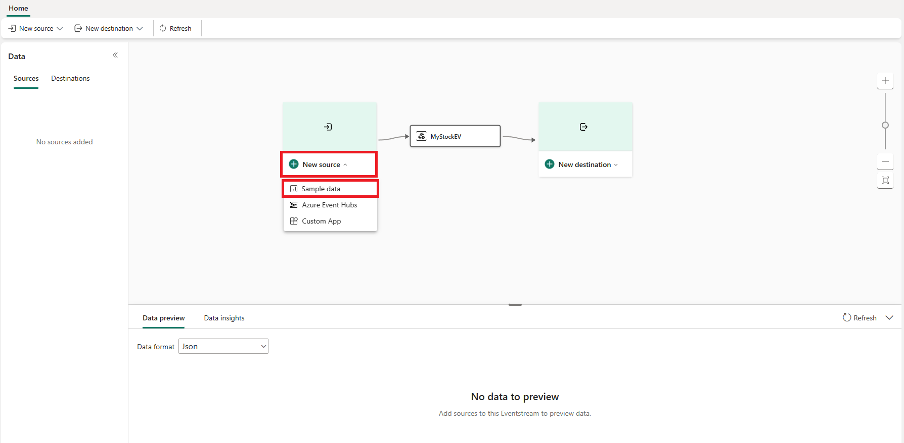
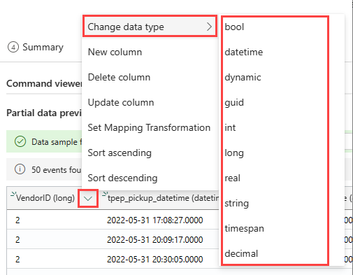
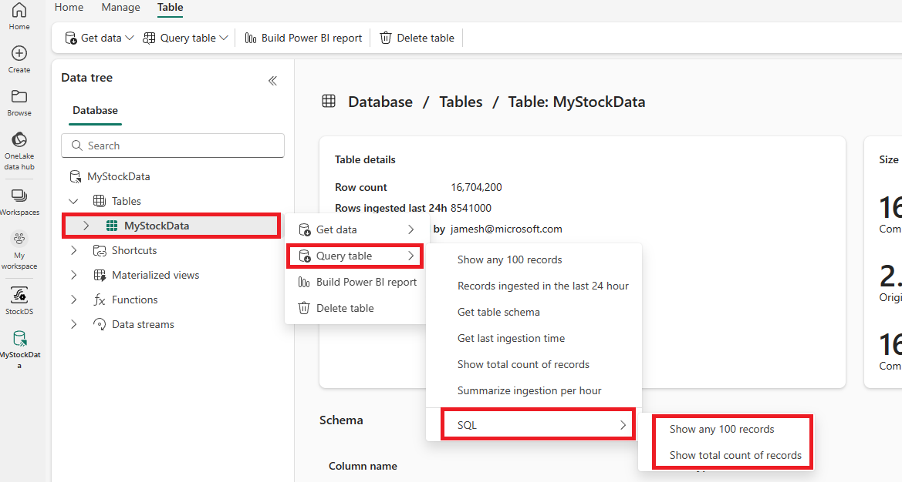

---
lab:
  title: Erste Schritte mit Echtzeitanalysen in Microsoft Fabric
  module: Get started with Real-Time Analytics in Microsoft Fabric
---
# Erste Schritte mit Eventstream in Real-Time Analytics (RTA)

Eventstream ist ein No-Code-Feature in Microsoft Fabric, das Echtzeitereignisse erfasst, transformiert und an verschiedene Ziele sendet. Sie können dem Eventstream Ereignisdatenquellen, Routingziele und den Ereignisprozessor hinzufügen, wenn die Transformation erforderlich ist. EventStore von Microsoft Fabric ist eine Überwachungsoption, die Ereignisse aus dem Cluster verwaltet und eine Möglichkeit bietet, den Status Ihres Clusters oder Ihrer Workload zu einem bestimmten Zeitpunkt nachzuvollziehen. Der EventStore-Dienst kann nach Ereignissen abgefragt werden, die in Ihrem Cluster für jede Entität und jeden Entitätstyp verfügbar sind. Dies bedeutet, dass Sie Ereignisse auf verschiedenen Ebenen abfragen können (z. B. Cluster, Knoten, Anwendungen, Dienste, Partitionen und Partitionsreplikate). Der EventStore-Dienst hat auch die Möglichkeit, Ereignisse in Ihrem Cluster zu korrelieren. Durch den Blick auf Ereignisse, die gleichzeitig von unterschiedlichen Entitäten geschrieben wurden und sich möglicherweise gegenseitig beeinträchtigt haben, kann der EventStore-Dienst diese Ereignisse verknüpfen und beim Identifizieren von Ursachen für Aktivitäten in Ihrem Cluster helfen. Eine weitere Option zur Überwachung und Diagnose von Microsoft Fabric-Clustern ist das Aggregieren und Sammeln von Ereignissen mithilfe von EventFlow.

Dieses Lab dauert ungefähr **30** Minuten.

> **Hinweis:** Sie benötigen eine Microsoft Fabric-Lizenz, um diese Übung durchführen zu können. Weitere Informationen zum Aktivieren einer kostenlosen Fabric-Testlizenz finden Sie unter [Erste Schritte mit Fabric](https://learn.microsoft.com/fabric/get-started/fabric-trial). Dazu benötigen Sie ein *Schul-* , *Geschäfts-* oder Unikonto von Microsoft. Wenn Sie über kein Microsoft-Konto verfügen, können Sie sich [für eine kostenlose Testversion von Microsoft Office 365 E3 oder höher registrieren](https://www.microsoft.com/microsoft-365/business/compare-more-office-365-for-business-plans).

## Erstellen eines Arbeitsbereichs

Erstellen Sie vor dem Arbeiten mit Daten in Fabric einen Arbeitsbereich mit aktivierter Fabric-Testversion.

1. Melden Sie sich bei [Microsoft Fabric](https://app.fabric.microsoft.com) unter `https://app.fabric.microsoft.com` an, und wählen Sie **Power BI** aus.
2. Wählen Sie auf der Menüleiste auf der linken Seite **Arbeitsbereiche** aus (Symbol ähnelt &#128455;).
3. Erstellen Sie einen neuen Arbeitsbereich mit einem Namen Ihrer Wahl, und wählen Sie einen Lizenzierungsmodus mit Fabric-Kapazitäten aus (*Testversion*, *Premium* oder *Fabric*).
4. Beim Öffnen Ihres neuen Arbeitsbereichs sollte dieser wie im Folgenden gezeigt leer sein:

   
5. Wählen Sie unten links im Power BI-Portal das **Power BI**-Symbol aus, und wechseln Sie zu **Echtzeitanalyse**.

## Szenario

Mit Fabric-Ereignisstreams können Sie Ihre Ereignisdaten ganz einfach an einem Ort verwalten. Sie können Echtzeitereignisdaten in dem gewünschten Format sammeln, transformieren und an verschiedene Ziele senden. Sie können Ihre Ereignisstreams auch problemlos mit Azure Event Hubs, der KQL-Datenbank und einem Lakehouse verbinden.

Dieses Lab basiert auf Beispielstreamingdaten, die als Stock Market-Daten bezeichnet werden. Die Stock Market-Beispieldaten sind ein Dataset einer Börse mit einer voreingestellten Schemaspalte (z. B. Uhrzeit, Symbol, Preis und Volumen). Sie verwenden diese Beispieldaten, um Echtzeitereignisse von Aktienkursen zu simulieren und sie mit verschiedenen Zielen wie der KQL-Datenbank zu analysieren.

Verwenden Sie die Streaming- und Abfragefunktionen für Echtzeitanalysen, um wichtige Fragen zur Aktienstatistik zu beantworten. In diesem Szenario nutzen Sie den Assistenten in vollem Umfang, anstatt einige Komponenten unabhängig voneinander zu erstellen (z. B. die KQL-Datenbank).

In diesem Tutorial lernen Sie Folgendes:

- Erstellen einer KQL-Datenbank
- Aktivieren des Kopierens von Daten in OneLake
- Erstellen eines Ereignisstreams
- Das Streamen von Daten aus einem Ereignisstream in Ihre KQL-Datenbank
- Untersuchen von Daten mit KQL und SQL

## Erstellen einer KQL-Datenbank

1. Wählen Sie unter **Echtzeitanalyse** das Feld **KQL-Datenbank** aus.

   

2. Sie werden aufgefordert, einen **Namen** für die KQL-Datenbank festzulegen.

   

3. Geben Sie der KQL-Datenbank einen Namen, den Sie sich gut merken können (z. B. **MyStockData**), und klicken Sie auf **Erstellen**.

1. Wählen Sie im Bereich **Datenbankdetails** das Bleistiftsymbol aus, um die Verfügbarkeit in OneLake zu aktivieren.

   

2. Stellen Sie sicher, dass Sie die Schaltfläche auf **Aktiv** umgeschaltet haben, und klicken Sie dann auf **Fertig**.

   

## Erstellen eines Eventstreams

1. Wählen Sie auf der Menüleiste **Echtzeitanalyse** aus (Symbol ähnelt dem ).
2. Wählen Sie unter **Neu** die Option **Eventstream (Vorschau)** aus.

   

3. Sie werden aufgefordert, Ihren Ereignisstream zu **benennen**. Geben Sie dem Ereignisstream einen Namen, den Sie sich gut merken können (z. B. **MyStockES**), und wählen Sie die Schaltfläche **Erstellen** aus.

   

## Einrichten einer Ereignisstreamquelle und eines Ereignisstreamziels

1. Klicken Sie im Eventstream-Canvas in der Dropdownliste auf **Neue Quelle**, und wählen Sie dann **Beispieldaten** aus.

   

2. Geben Sie wie in der folgenden Tabelle gezeigt die Werte für Ihre Beispieldaten ein, und wählen Sie dann **Hinzufügen** aus.

   | Feld       | Empfohlener Wert |
   | ----------- | ----------------- |
   | Quellname | StockData         |
   | Beispieldaten | Stock Market      |

3. Fügen Sie nun ein Ziel hinzu, indem Sie **Neues Ziel** und dann **KQL-Datenbank** auswählen.

   

4. Verwenden Sie bei der Konfiguration der KQL-Datenbank die folgende Tabelle, um die Konfiguration abzuschließen.

   | Feld            | Empfohlener Wert                              |
   | ---------------- | ---------------------------------------------- |
   | Zielname | MyStockData                                    |
   | Arbeitsbereich        | Arbeitsbereich, in dem Sie eine KQL-Datenbank erstellt haben |
   | KQL-Datenbank     | MyStockData                                    |

3. Wählen Sie **Erstellen und konfigurieren** aus.

## Konfigurieren der Datenerfassung

1. Klicken Sie auf der Dialogfeldseite **Daten erfassen** auf **Neue Tabelle**, und geben Sie „MyStockData“ ein.

   

2. Wählen Sie die Option **Weiter: Quelle** aus.
3. Bestätigen Sie auf der Seite **Quelle** den **Namen der Datenverbindung**, und wählen Sie dann **Weiter: Schema** aus.

   

4. Die eingehenden Daten werden für Beispieldaten dekomprimiert, behalten Sie also den dekomprimierten Status als Komprimierungstyp bei.
5. Wählen Sie in der Dropdownliste **Datenformat** die Option **JSON** aus.

   

6. Danach kann es erforderlich sein, einige oder alle Datentypen von Ihrem eingehenden Stream in Ihre Zieltabellen zu ändern.
7. Gehen Sie hierfür wie folgt vor: **Pfeil nach unten > Datentyp ändern**. Überprüfen Sie dann, ob die Spalten den richtigen Datentyp aufweisen:

   

8. Wenn Sie fertig sind, wählen Sie **Weiter: Zusammenfassung** aus.

Warten Sie, bis alle Schritte mit grünen Häkchen gekennzeichnet sind. Der Seitentitel **Fortlaufende Erfassung von Eventstream eingerichtet** sollte angezeigt werden. Wählen Sie anschließend **Schließen** aus, um zu Ihrer Eventstream-Seite zurückzukehren.

> **Hinweis**: Es kann erforderlich sein, die Seite zu aktualisieren, um Ihre Tabelle anzuzeigen, nachdem die Ereignisstreamverbindung hergestellt wurde.

## KQL-Abfragen

Die Kusto-Abfragesprache (Kusto Query Language, KQL) ist eine schreibgeschützte Anforderung zur Verarbeitung von Daten und zur Rückgabe der Ergebnisse. Die Anforderung wird in Klartext mit einem Datenflussmodell formuliert, das leicht zu lesen, zu erstellen und zu automatisieren ist. Abfragen werden immer im Kontext einer bestimmten Tabelle oder Datenbank ausgeführt. Eine Abfrage besteht mindestens aus einem Quelldatenverweis und einem oder mehreren Abfrageoperatoren, die nacheinander angewendet werden. Dies wird visuell durch die Verwendung eines senkrechten Strichs (|) zum Trennen von Operatoren angegeben. Weitere Informationen zur Kusto-Abfragesprache finden Sie unter [Übersicht über die Kusto-Abfragesprache (KQL)](https://learn.microsoft.com/en-us/azure/data-explorer/kusto/query/?context=%2Ffabric%2Fcontext%2Fcontext).

> **Hinweis**: Der KQL-Editor enthält sowohl Syntax- als auch IntelliSense-Hervorhebungen, mit denen Sie sich schnell Kenntnisse im Zusammenhang mit der Kusto-Abfragesprache (KQL) aneignen können.

1. Navigieren Sie zu Ihrer neu erstellten und aktualisierten KQL-Datenbank namens **MyStockData**.
2. Wählen Sie in der Datenstruktur das Menü „Mehr“ (...) für die Tabelle „MyStockData“ aus. Gehen Sie dann wie folgt vor: „Tabelle abfragen > Alle 100 Datensätze anzeigen“.

   

3. Die Beispielabfrage wird im Bereich **Untersuchen Ihrer Daten** geöffnet, wobei der Tabellenkontext bereits aufgefüllt ist. Diese erste Abfrage verwendet den take-Operator, um eine Beispielanzahl von Datensätzen zurückzugeben. Zudem ist sie nützlich, um einen ersten Überblick über die Datenstruktur und mögliche Werte zu erhalten. Die automatisch aufgefüllten Beispielabfragen werden automatisch ausgeführt. Sie können die Abfrageergebnisse im Ergebnisbereich anzeigen.

   

4. Kehren Sie zur Datenstruktur zurück, um die nächste Abfrage auszuwählen, die den where- und den between-Operator verwendet, um Datensätze zurückzugeben, die in den letzten 24 Stunden erfasst wurden.

   

> **Hinweis**: Beachten Sie, dass die Volumen der Streamingdaten die Abfragegrenzwerte überschreiten. Dieses Verhalten kann abhängig von der Datenmenge variieren, die in Ihre Datenbank gestreamt wird.

Sie können weiterhin mit den integrierten Abfragefunktionen navigieren, um sich mit Ihren Daten vertraut zu machen.

## SQL-Beispielabfragen

Der Abfrage-Editor unterstützt die Verwendung von T-SQL zusätzlich zur Kusto-Abfragesprache (KQL) als primäre Abfragesprache. T-SQL kann für Tools nützlich sein, die KQL nicht verwenden können. Weitere Informationen finden Sie unter [Abfragen von Daten mithilfe von T-SQL](https://learn.microsoft.com/en-us/azure/data-explorer/t-sql).

1. Wählen Sie in der Datenstruktur das Menü **Mehr** (...) für die Tabelle „MyStockData“ aus. Gehen Sie dann wie folgt vor: **Tabelle abfragen > SQL > Alle 100 Datensätze anzeigen**.

   

2. Platzieren Sie den Cursor an einer beliebigen Stelle in der Abfrage, und wählen Sie **Ausführen** aus, oder drücken Sie **UMSCHALT+EINGABETASTE**.

   

Sie können weiterhin mit den integrierten Funktionen navigieren und sich mit den Daten mithilfe von SQL oder KQL vertraut machen. Sie haben das Ende der Lerneinheit erreicht.

## Bereinigen von Ressourcen

In dieser Übung haben Sie eine KQL-Datenbank erstellt und das kontinuierliche Streaming mit einem Ereignisstream eingerichtet. Danach haben Sie die Daten mit KQL und SQL abgefragt. Wenn Sie die Untersuchung Ihrer KQL-Datenbank abgeschlossen haben, können Sie den Arbeitsbereich löschen, den Sie für diese Übung erstellt haben.
1. Wählen Sie auf der Leiste auf der linken Seite das Symbol für Ihren Arbeitsbereich aus.
2. Wählen Sie im Menü „...“ auf der Symbolleiste die Option „Arbeitsbereichseinstellungen“ aus.
3. Wählen Sie im Abschnitt Andere die Option Diesen Arbeitsbereich entfernen aus.
