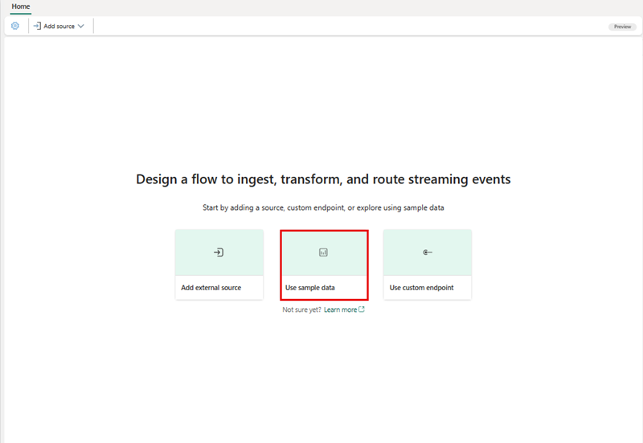
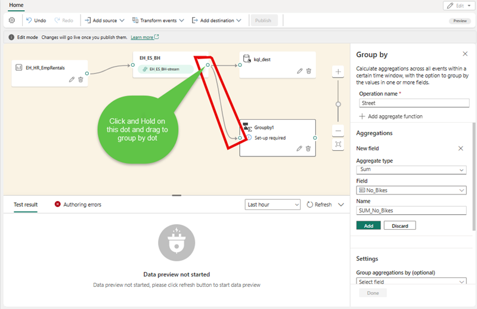
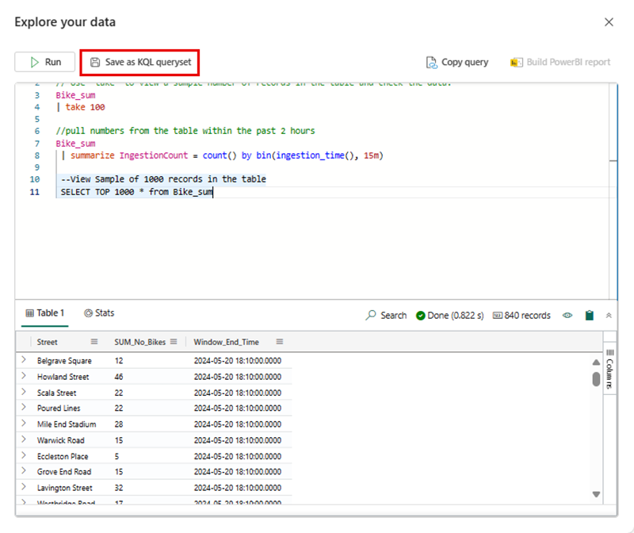

---
lab:
  title: Erste Schritte mit Eventstream in Microsoft Fabric
  module: Get started with Eventstream in Microsoft Fabric
---
# Erste Schritte mit Eventstreams in Real-Time Intelligence

Eventstream ist ein No-Code-Feature in Microsoft Fabric, das Echtzeitereignisse erfasst, transformiert und an verschiedene Ziele sendet. Sie können dem Eventstream Ereignisdatenquellen, Routingziele und den Ereignisprozessor hinzufügen, wenn die Transformation erforderlich ist. EventStore von Microsoft Fabric ist eine Überwachungsoption, die Ereignisse aus dem Cluster verwaltet und eine Möglichkeit bietet, den Status Ihres Clusters oder Ihrer Workload zu einem bestimmten Zeitpunkt nachzuvollziehen. Der EventStore-Dienst kann nach Ereignissen abgefragt werden, die in Ihrem Cluster für jede Entität und jeden Entitätstyp verfügbar sind. Dies bedeutet, dass Sie Ereignisse auf verschiedenen Ebenen abfragen können (z. B. Cluster, Knoten, Anwendungen, Dienste, Partitionen und Partitionsreplikate). Der EventStore-Dienst hat auch die Möglichkeit, Ereignisse in Ihrem Cluster zu korrelieren. Durch den Blick auf Ereignisse, die gleichzeitig von unterschiedlichen Entitäten geschrieben wurden und sich möglicherweise gegenseitig beeinträchtigt haben, kann der EventStore-Dienst diese Ereignisse verknüpfen und beim Identifizieren von Ursachen für Aktivitäten in Ihrem Cluster helfen. Eine weitere Option zur Überwachung und Diagnose von Microsoft Fabric-Clustern ist das Aggregieren und Sammeln von Ereignissen mithilfe von EventFlow.

Dieses Lab dauert ungefähr **30** Minuten.

> **Hinweis:** Sie benötigen eine [Microsoft Fabric-Testversion](https://learn.microsoft.com/fabric/get-started/fabric-trial), um diese Übung durchführen zu können.

## Erstellen eines Arbeitsbereichs

Erstellen Sie vor dem Arbeiten mit Daten in Fabric einen Arbeitsbereich mit aktivierter Fabric-Testversion.

1. Melden Sie sich bei [Microsoft Fabric](https://app.fabric.microsoft.com) unter `https://app.fabric.microsoft.com` an, und wählen Sie **Power BI** aus.
2. Wählen Sie auf der Menüleiste auf der linken Seite **Arbeitsbereiche** aus (Symbol ähnelt &#128455;).
3. Erstellen Sie einen neuen Arbeitsbereich mit einem Namen Ihrer Wahl, und wählen Sie einen Lizenzierungsmodus mit Fabric-Kapazitäten aus (*Testversion*, *Premium* oder *Fabric*).
4. Beim Öffnen Ihres neuen Arbeitsbereichs sollte dieser wie im Folgenden gezeigt leer sein:

   
5. Wählen Sie unten links im Power BI-Portal das **Power BI**-Symbol aus, und wechseln Sie zur Benutzeroberfläche von **Real-Time Intelligence**.

## Szenario

Mit Fabric-Ereignisstreams können Sie Ihre Ereignisdaten ganz einfach an einem Ort verwalten. Sie können Echtzeitereignisdaten in dem gewünschten Format sammeln, transformieren und an verschiedene Ziele senden. Sie können Ihre Ereignisstreams auch problemlos mit Azure Event Hubs, der KQL-Datenbank und einem Lakehouse verbinden.

Dieses Lab basiert auf Beispielstreamingdaten, die als Stock Market-Daten bezeichnet werden. Die Stock Market-Beispieldaten sind ein Dataset einer Börse mit einer voreingestellten Schemaspalte (z. B. Uhrzeit, Symbol, Preis und Volumen). Sie verwenden diese Beispieldaten, um Echtzeitereignisse von Aktienkursen zu simulieren und sie mit verschiedenen Zielen wie der KQL-Datenbank zu analysieren.

Verwenden Sie die Streaming- und Abfragefunktionen von Real-Time Intelligence, um wichtige Fragen zur Aktienstatistik zu beantworten. In diesem Szenario nutzen Sie den Assistenten in vollem Umfang, anstatt einige Komponenten unabhängig voneinander zu erstellen (z. B. die KQL-Datenbank).

In diesem Tutorial lernen Sie Folgendes:

- Ein Eventhouse erstellen
- Erstellen einer KQL-Datenbank
- Aktivieren des Kopierens von Daten in OneLake
- Erstellen eines Ereignisstreams
- Das Streamen von Daten aus einem Ereignisstream in Ihre KQL-Datenbank
- Untersuchen von Daten mit KQL und SQL

## Vorbereiten einer Real-Time Intelligence-Eventhouse

1. Wählen Sie die Option „Real-Time Intelligence“ in Microsoft Fabric aus.
1. Wählen Sie „Eventhouse“ in der Menüleiste aus, und geben Sie Ihrem Eventhouse einen Namen.
    
    

## Erstellen einer KQL-Datenbank

1. Wählen Sie innerhalb des **Real-Time Intelligence-Eventhouse** das Feld **KQL-Datenbank +** aus.
1. Sie können die Datenbank benennen und eine **Neue Datenbank (Standard)** auswählen oder eine **Neue Verknüpfungsdatenbank (Follower)** erstellen.
1. Klicken Sie auf **Erstellen**.

     >**Hinweis:** Mit der Funktion „Follower-Datenbank“ können Sie eine Datenbank, die sich in einem anderen Cluster befindet, an Ihren Azure Data Explorer-Cluster anfügen. Die Follower-Datenbank wird im schreibgeschützten Modus angefügt, sodass Sie die Daten anzeigen und Abfragen für die Daten ausführen können, die in der Leader-Datenbank erfasst wurden. Die Follower-Datenbank synchronisiert Änderungen in den Leader-Datenbanken. Aufgrund der Synchronisierung gibt es bei der Datenverfügbarkeit eine Zeitverzögerung von einigen Sekunden bis zu einigen Minuten. Die Länge der Zeitverzögerung hängt von der Gesamtgröße der Metadaten in der Leader-Datenbank ab. Die Leader- und Follower-Datenbanken verwenden dasselbe Speicherkonto zum Abrufen der Daten. Der Speicher befindet sich im Besitz der Leader-Datenbank. Die Follower-Datenbank zeigt die Daten an, ohne sie erfassen zu müssen. Da die angefügte Datenbank eine schreibgeschützte Datenbank ist, können die Daten, Tabellen und Richtlinien in der Datenbank nicht geändert werden, mit Ausnahme der Cacherichtlinie, Prinzipale und Berechtigungen.

   

4. Sie werden aufgefordert, einen **Namen** für die KQL-Datenbank festzulegen.

   

5. Geben Sie der KQL-Datenbank einen Namen, den Sie sich gut merken können (z. B. **Eventhouse-HR**), und klicken Sie auf **Erstellen**.

6. Wählen Sie im Bereich **Datenbankdetails** das Bleistiftsymbol aus, um die Verfügbarkeit in OneLake zu aktivieren.

   

7. Stellen Sie sicher, dass Sie die Schaltfläche auf **Aktiv** umgeschaltet haben, und klicken Sie dann auf **Fertig**.

   

## Erstellen eines Eventstreams

1. Wählen Sie in der Menüleiste **Real-Time Intelligence** aus (das Symbol ähnelt dem ).
2. Wählen Sie unter **Neu** die Option **EventStream**.

   

3. Sie werden aufgefordert, Ihren Ereignisstream zu **benennen**. Geben Sie dem EventStream einen Namen, den Sie sich merken können, z. B. **MyStockES**, wählen Sie die Option **Erweiterte Funktionen (Vorschau)** und wählen Sie die Schaltfläche **Erstellen**.

   

     >**Note:**  Die Erstellung Ihres neuen Eventstreams im Arbeitsbereich wird in Kürze abgeschlossen. Nach der Einrichtung werden Sie automatisch zum primären Editor weitergeleitet und können dort mit der Integration von Quellen in Ihren Eventstream beginnen.

## Einrichten einer Eventstreamquelle

1. Klicken Sie im Eventstream-Canvas in der Dropdownliste auf **Neue Quelle**, und wählen Sie dann **Beispieldaten** aus.

    

2.  Geben Sie im Fenster **Quelle hinzufügen** Ihrer Quelle einen Namen und wählen Sie **Fahrräder (reflexkompatibel)**.
3.  Wählen Sie die Schaltfläche **Hinzufügen** aus.

    

4. Nachdem Sie auf **Hinzufügen** geklickt haben, wird Ihr Stream zugeordnet, und Sie werden automatisch zur **Eventstream-Canvas** weitergeleitet.

   
 
 > **Note:** Nachdem Sie die Beispieldatenquelle erstellt haben, wird sie ihrem Eventstream auf dem Canvas im Bearbeitungsmodus hinzugefügt. Wählen Sie zum Implementieren dieser neu hinzugefügten Beispieldaten **Veröffentlichen** aus.

## Hinzufügen von Transformationsereignissen oder einer Zielaktivität

1. Nach der Veröffentlichung können Sie **Ereignisse transformieren oder Ziel hinzufügen** auswählen und dann **KQL-Datenbank** als Option auswählen.

   

2. Es wird ein neues Seitenpanel geöffnet, das Ihnen viele Optionen bietet. Geben Sie die erforderlichen Details Ihrer KQL-Datenbank ein.

   

    - **Datenerfassungsmodus:** Es gibt zwei Möglichkeiten, Daten in der KQL-Datenbank zu erfassen:
        - ***Direkte Erfassung:*** Daten werden direkt in einer KQL-Tabelle ohne Transformation erfasst.
        - ***Ereignisverarbeitung vor der Erfassung:*** Transformieren Sie die Daten mit dem Ereignisprozessor, bevor Sie sie an eine KQL-Tabelle senden.      
        
        > **Warnung:** Sie können den Erfassungsmodus **NICHT** bearbeiten, nachdem dem Eventstream das KQL-Datenbankziel hinzugefügt wurde.     

   - **Name des Ziels**: Geben Sie einen Namen für das Eventstream-Ziel ein, z. B. „kql-dest“.
   - **Arbeitsbereich**: Dies ist der Arbeitsbereich, in dem sich Ihre KQL-Datenbank befindet.
   - **KQL-Datenbank**: Name Ihrer KQL-Datenbank
   - **Zieltabelle**: Name Ihrer KQL-Tabelle. Sie können auch einen Namen eingeben, um eine neue Tabelle zu erstellen, z. B. „bike-count“.
   - **Dateneingabeformat:** Wählen Sie JSON als Datenformat für Ihre KQL-Tabelle aus.

3. Wählen Sie **Speichern**. 
4. Wählen Sie **Veröffentlichen** aus.

## Transformieren der Ereignisse

1. Wählen Sie in der **Eventstream**-Canvas **Ereignisse transformieren** aus.

    

    A. Klicken Sie auf **Gruppieren nach**.

    B. Klicken Sie auf **Bearbeiten**, das vom ***Bleistiftsymbol*** dargestellt wird.

    C. Nachdem Sie das Transformationsereignis **Gruppieren nach** erstellt haben, müssen Sie es vom **Eventstream** mit **Gruppieren nach** verbinden. Sie erreichen dies ohne Code, indem Sie rechts im **Eventstream** auf den Punkt klicken und ihn zu dem Punkt links im neuen Feld **Gruppieren nach** ziehen. 

        

2. Füllen Sie die Eigenschaften im Einstellungsabschnitt **Gruppieren nach** aus:
    - **Vorgangsname:** Geben Sie einen Namen für dieses Transformationsereignis ein.
    - **Aggregationstyp:** Sum
    - **Feld:** No_Bikes
    - **Name:** SUM_No_Bikes
    - **Aggregation gruppieren nach**: Straße
      
3. Klicken Sie auf **Hinzufügen** und dann auf **Speichern**.

4. Auf die gleiche Weise können Sie mit dem Mauszeiger auf den Pfeil zwischen dem **Eventstream** und ***kql_dest*** zeigen und auf das ***Papierkorbsymbol** klicken. Sie können dann das Ereignis **Gruppieren nach** mit **kql-dest** verbinden.

   

    > **Note:**  [HINWEIS:] Wenn Sie Connectors hinzufügen oder entfernen, müssen Sie die Zielobjekte erneut konfigurieren.

5. Wählen Sie den Bleistift unter **kql-dest** aus und erstellen Sie eine neue Zieltabelle mit dem Namen **Bike_sum**, die die Ausgabe des Ereignisses **Gruppieren nach** erhalten soll.

## KQL-Abfragen

Die Kusto-Abfragesprache (Kusto Query Language, KQL) ist eine schreibgeschützte Anforderung zur Verarbeitung von Daten und zur Rückgabe der Ergebnisse. Die Anforderung wird in Klartext mit einem Datenflussmodell formuliert, das leicht zu lesen, zu erstellen und zu automatisieren ist. Abfragen werden immer im Kontext einer bestimmten Tabelle oder Datenbank ausgeführt. Eine Abfrage besteht mindestens aus einem Quelldatenverweis und einem oder mehreren Abfrageoperatoren, die nacheinander angewendet werden. Dies wird visuell durch die Verwendung eines senkrechten Strichs (|) zum Trennen von Operatoren angegeben. Weitere Informationen zur Kusto-Abfragesprache finden Sie unter [Übersicht über die Kusto-Abfragesprache (KQL)](https://learn.microsoft.com/en-us/azure/data-explorer/kusto/query/?context=%2Ffabric%2Fcontext%2Fcontext).

> **Hinweis**: Der KQL-Editor enthält sowohl Syntax- als auch IntelliSense-Hervorhebungen, mit denen Sie sich schnell Kenntnisse im Zusammenhang mit der Kusto-Abfragesprache (KQL) aneignen können.

1. Navigieren Sie zu Ihrer neu erstellten und aktualisierten KQL-Datenbank:

    A.  Auswählen von **kql-dest** 

    B. Klicken Sie auf den Link **Element öffnen** in der Zeile **Verwandtes Element**.

   

1. Wählen Sie in der Datenstruktur das Menü „Mehr“ (...) für die Tabelle ***Bike_sum*** aus. Gehen Sie dann wie folgt vor: „Tabelle abfragen > Alle 100 Datensätze anzeigen“.

   

3. Die Beispielabfrage wird im Bereich **Untersuchen Ihrer Daten** geöffnet, wobei der Tabellenkontext bereits aufgefüllt ist. Diese erste Abfrage verwendet den `take`-Operator, um eine Beispielanzahl von Datensätzen zurückzugeben. Zudem ist sie nützlich, um einen ersten Überblick über die Datenstruktur und mögliche Werte zu erhalten. Die automatisch aufgefüllten Beispielabfragen werden automatisch ausgeführt. Sie können die Abfrageergebnisse im Ergebnisbereich anzeigen.

   

4. Kehren Sie zur Datenstruktur zurück, um die nächste Abfrage **Aufnahme pro Stunde zusammenfassen** auszuwählen, die den Operator `summarize` verwendet, um die Anzahl der in einem bestimmten Intervall aufgenommenen Datensätze zu zählen.

   

> **Hinweis:** Möglicherweise wird eine Warnung angezeigt, dass Sie die Abfragegrenzwerte überschritten haben. Dieses Verhalten variiert abhängig von der Datenmenge, die in Ihre Datenbank gestreamt wird.

Sie können weiterhin mit den integrierten Abfragefunktionen navigieren, um sich mit Ihren Daten vertraut zu machen.

## Abfragen mit Copilot

Der Abfrage-Editor unterstützt die Verwendung von T-SQL zusätzlich zur Kusto-Abfragesprache (KQL) als primäre Abfragesprache. T-SQL kann für Tools nützlich sein, die KQL nicht verwenden können. Weitere Informationen finden Sie unter [Abfragen von Daten mithilfe von T-SQL](https://learn.microsoft.com/en-us/azure/data-explorer/t-sql).

1. Wählen Sie in der Datenstruktur das Menü **Mehr** (...) für die Tabelle „MyStockData“ aus. Gehen Sie dann wie folgt vor: **Tabelle abfragen > SQL > Alle 100 Datensätze anzeigen**.

   

2. Platzieren Sie den Cursor an einer beliebigen Stelle in der Abfrage, und wählen Sie **Ausführen** aus, oder drücken Sie **UMSCHALT+EINGABETASTE**.

   

Sie können weiterhin mit den integrierten Funktionen navigieren und sich mit den Daten mithilfe von SQL oder KQL vertraut machen. 

## Features mit Abfrageset

Abfragesets in KQL-Datenbanken (Kusto Query Language) werden für verschiedene Zwecken verwendet, hauptsächlich zum Ausführen von Abfragen sowie zum Anzeigen und Anpassen von Abfrageergebnissen zu Daten aus einer KQL-Datenbank. Sie sind eine Schlüsselkomponente in den Datenabfragefunktionen von Microsoft Fabric zum:

 - **Ausführen von Abfragen:** Führen Sie KQL-Abfragen aus, um Daten aus einer KQL-Datenbank abzurufen.
 - **Anpassen von Ergebnissen:** Zeigen Sie die Abfrageergebnisse an, und ändern Sie diese, sodass die Daten einfacher analysiert und interpretiert werden können.
 - **Exportieren und Freigeben von Abfragen:** Erstellen Sie mehrere Registerkarten innerhalb eines Abfragesets, um Abfragen für später zu speichern oder für anderen freizugeben, um Daten gemeinsam zu untersuchen.
 - **Unterstützen von SQL-Funktionen:** Die Abfragesets in KQL unterstützen auch viele SQL-Funktionen und bieten so Flexibilität bei der Datenabfrage.
 - **Verwenden von Copilot:** Nachdem Sie Abfragen als KQL-Abfrageset gespeichert haben, können Sie sie anzeigen.

Das Speichern eines Abfragesets ist einfach und kann auf mehrere Arten erfolgen. 

1. Sie können in Ihrer **KQL-Datenbank** bei Verwendung des Tools **Erkunden Sie Ihre Daten** einfach auf **Als KQL-Abfrageset speichern** klicken.

   

2. Alternativ können Sie auf der Landing Page von Real-Time Intelligence auf **KQL-Abfrageset** klicken und Ihr **Abfrageset** dann benennen.

   

3. Sobald Sie sich auf der **Landing Page des Abfragesets** befinden, wird in der Symbolleiste eine Schaltfläche für **Copilot** angezeigt. Wählen Sie sie aus, um den **Copilot-Bereich** zu öffnen und Fragen zu den Daten zu stellen.

    

4. Im **Copilot-Bereich** geben Sie einfach Ihre Frage ein, und **Copilot** generiert die KQL-Abfrage, die Sie dann ***kopieren*** oder in das Fenster mit Ihrem Abfrageset **einfügen** können. 

    

5. Ab diesem Punkt können Sie einzelne Abfragen erstellen und diese mithilfe der Schaltfläche **An das Dashboard anheften** oder **Power BI-Bericht erstellen** in Dashboards oder Power BI-Berichten verwenden.

## Bereinigen von Ressourcen

In dieser Übung haben Sie eine KQL-Datenbank erstellt und das kontinuierliche Streaming mit einem Ereignisstream eingerichtet. Danach haben Sie die Daten mit KQL und SQL abgefragt. Wenn Sie die Untersuchung Ihrer KQL-Datenbank abgeschlossen haben, können Sie den Arbeitsbereich löschen, den Sie für diese Übung erstellt haben.
1. Wählen Sie auf der Leiste auf der linken Seite das Symbol für Ihren Arbeitsbereich aus.
2. Wählen Sie im Menü **...** auf der Symbolleiste die **Arbeitsbereichseinstellungen** aus.
3. Wählen Sie im Abschnitt **Allgemein** die Option **Diesen Arbeitsbereich entfernen** aus.
.
