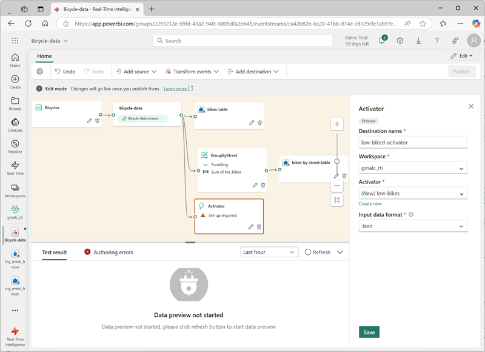

---
lab:
  title: Erfassen Sie Echtzeitdaten mit Eventstream in Microsoft Fabric
  module: Ingest real-time data with Eventstream in Microsoft Fabric
---
# Erfassen Sie Echtzeitdaten mit Eventstream in Microsoft Fabric

Eventstream ist eine Funktion in Microsoft Fabric, die Echtzeitereignisse erfasst, umwandelt und an verschiedene Ziele weiterleitet. Sie können dem Eventstream Ereignisdatenquellen, Ziele und Transformationen hinzufügen.

In dieser Übung erfassen Sie Daten aus einer Beispieldatenquelle, die einen Stream von Ereignissen im Zusammenhang mit Beobachtungen von Fahrradsammelstellen in einem Bike-Sharing-System ausgibt, in dem Menschen in einer Stadt Fahrräder mieten können.

Dieses Lab dauert ungefähr **30** Minuten.

> **Hinweis**: Sie benötigen einen [Microsoft Fabric-Tenant](https://learn.microsoft.com/fabric/get-started/fabric-trial), um diese Übung durchzuführen.

## Erstellen eines Arbeitsbereichs

Bevor Sie mit Daten in Fabric arbeiten, müssen Sie einen Arbeitsbereich mit aktivierter Fabric-Kapazität erstellen.

1. Wählen Sie auf der [Microsoft Fabric-Startseite](https://app.fabric.microsoft.com/home?experience=fabric) unter `https://app.fabric.microsoft.com/home?experience=fabric` die Option **Real-Time Intelligence** aus.
1. Wählen Sie auf der Menüleiste auf der linken Seite **Arbeitsbereiche** aus (Symbol ähnelt &#128455;).
1. Erstellen Sie einen neuen Arbeitsbereich mit einem Namen Ihrer Wahl, und wählen Sie einen Lizenzierungsmodus mit Fabric-Kapazitäten aus (*Testversion*, *Premium* oder *Fabric*).
1. Wenn Ihr neuer Arbeitsbereich geöffnet wird, sollte er leer sein.

    

## Erstellen eines Eventhouses

Jetzt, da Sie einen Arbeitsbereich haben, können Sie mit der Erstellung der Stoffobjekte beginnen, die Sie für Ihre Real-Time Intelligence-Lösung benötigen. wir beginnen mit der Erstellung eines Eventhouses.

1. Wählen Sie in der Menüleiste auf der linken Seite **Startseite** aus und erstellen Sie dann auf der Startseite von Real-Time Intelligence ein neues **Eventhouse**, dem Sie einen eindeutigen Namen Ihrer Wahl geben.
1. Schließen Sie alle Tipps oder Aufforderungen, die angezeigt werden, bis Sie Ihr neues leeres Eventhouse sehen.

    

1. Beachten Sie im linken Bereich, dass Ihr Eventhouse eine KQL-Datenbank mit demselben Namen wie das Eventhouse enthält.
1. Wählen Sie die KQL-Datenbank aus, um sie anzuzeigen.

    Derzeit enthält die Datenbank keine Tabellen. In der Übung verwenden Sie dann noch einen Ereignisstream, um Daten aus einer Echtzeitquelle in eine Tabelle zu laden.

## Erstellen eines Eventstreams

1. Wählen Sie auf der Hauptseite Ihrer KQL-Datenbank **Daten abrufen**.
2. Wählen Sie für die Datenquelle **Eventstream** > **Neuer Eventstream**. Benennen Sie den Eventstream `Bicycle-data`.

    Die Erstellung Ihres neuen Eventstreams im Arbeitsbereich wird in wenigen Augenblicken abgeschlossen sein. Nach der Einrichtung werden Sie automatisch zum primären Editor weitergeleitet und können dort mit der Integration von Quellen in Ihren Eventstream beginnen.

    

## Quellen hinzufügen

1. Wählen Sie im Eventstream-Canvas **Beispieldaten verwenden** aus.
2. Nennen Sie die Quelle `Bicycles` und wählen Sie die Beispieldaten **Fahrräder**.

    Ihr Stream wird gemappt und Sie werden automatisch auf dem **Eventstream-Canvas** angezeigt.

   

## Ziel hinzufügen

1. Verwenden Sie das Symbol **+** rechts neben dem Knoten **Fahrraddaten**, um einen neuen Knoten **Eventhouse** hinzuzufügen.
1. Verwenden Sie das Symbol *Bleistift* im neuen Eventhouse-Knoten, um ihn zu bearbeiten.
1. Im Bereich **Eventhouse** konfigurieren Sie die folgenden Einrichtungsoptionen.
   - **Datenerfassungsmodus:**: Ereignisverarbeitung vor der Erfassung
   - **Zielname:**`bikes-table`
   - **Arbeitsbereich:***Wählen Sie den Arbeitsbereich, den Sie zu Beginn dieser Übung erstellt haben*
   - **Eventhouse**: *Wählen Sie Ihr Eventhouse*
   - **KQL-Datenbank:***Wählen Sie Ihre KQL-Datenbank*
   - **Zieltabelle:** Erstellen Sie eine neue Tabelle namens `bikes`
   - **Eingabe-Datenformat:** JSON

   

1. Wählen Sie im Bereich **Eventhouse** die Option **Speichern**. 
1. Wählen Sie auf der Symbolleiste **Veröffentlichen** aus.
1. Warten Sie etwa eine Minute, bis das Datenziel aktiv wird. Wählen Sie dann den Knoten **bikes-table** im Entwurfscanvas aus und sehen Sie sich den Bereich **Datenvorschau** darunter an, um die neuesten erfassten Daten zu sehen:

   

1. Warten Sie ein paar Minuten und verwenden Sie dann die Schaltfläche **Aktualisieren**, um den Bereich **Datenvorschau** zu aktualisieren. Der Stream läuft ununterbrochen, sodass der Tabelle möglicherweise neue Daten hinzugefügt wurden.
1. Unter dem Eventstream Design Canvas sehen Sie auf der Registerkarte **Dateneinsichten** Details zu den erfassten Datenereignissen.

## Erfasste Daten abfragen

Der von Ihnen erstellte Eventstream übernimmt Daten aus der Beispielquelle für Fahrraddaten und lädt sie in die Datenbank in Ihrem Eventhouse. Sie können die erfassten Daten analysieren, indem Sie die Tabelle in der Datenbank abfragen.

1. Wählen Sie in der Menüleiste auf der linken Seite Ihre KQL-Datenbank aus.
1. Auf der Registerkarte **Datenbank** in der Symbolleiste für Ihre KQL-Datenbank verwenden Sie die Schaltfläche **Aktualisieren**, um die Ansicht zu aktualisieren, bis Sie die Tabelle **Fahrräder** unter der Datenbank sehen. Wählen Sie dann die Tabelle **Fahrräder**.

   

1. Wählen Sie im Menü ** …** für die Tabelle **Fahrräder** die Option **Tabelle abfragen** > **Datensätze, die in den letzten 24 Stunden erfasst wurden**.
1. Im Abfragebereich sehen Sie, dass die folgende Abfrage erstellt und ausgeführt wurde und die Ergebnisse darunter angezeigt werden:

    ```kql
    // See the most recent data - records ingested in the last 24 hours.
    bikes
    | where ingestion_time() between (now(-1d) .. now())
    ```

1. Wählen Sie den Abfragecode aus und führen Sie ihn aus, um 100 Datenzeilen aus der Tabelle anzuzeigen.

    

## Ereignisdaten umwandeln

Die Daten, die Sie erfasst haben, sind von der Quelle her unverfälscht. In vielen Szenarien möchten Sie vielleicht die Daten im Eventstream umwandeln, bevor Sie sie in ein Ziel laden.

1. Wählen Sie in der Menüleiste auf der linken Seite den Eventstream **Fahrraddaten**.
1. Wählen Sie in der Symbolleiste **Bearbeiten**, um den Eventstream zu bearbeiten.
1. Wählen Sie im Menü **Ereignisse umwandeln** die Option **Gruppieren nach**, um dem Eventstream einen neuen Knoten **Gruppieren nach** hinzuzufügen.
1. Ziehen Sie eine Verbindung vom Ausgang des Knotens **Fahrraddaten** zum Eingang des neuen Knotens **Gruppieren nach**. Verwenden Sie dann das Symbol *Bleistift* im Knoten **Gruppieren nach**, um sie zu bearbeiten.

   

1. Konfigurieren Sie die Eigenschaften des Einstellungsbereichs **Gruppieren nach**:
    - **Vorgangsname:** GroupByStreet
    - **Aggregat-Typ:***Wählen Sie* Summe
    - **Feld:***Wählen Sie* No_Bikes. *Wählen Sie dann **Hinzufügen**, um die Funktion* SUMME von No_Bikes zu erstellen.
    - **Gruppierung der Aggregationen nach (optional):** Straße
    - **Zeitfenster**: Rollierend
    - **Dauer**: 5 Sekunden
    - **Offset**: 0 Sekunden

    > **Hinweis**: Diese Konfiguration veranlasst den Eventstream, alle 5 Sekunden die Gesamtzahl der Fahrräder in jeder Straße zu berechnen.
      
1. Speichern Sie die Konfiguration und kehren Sie zum Eventstream-Canvas zurück, wo ein Fehler angezeigt wird (denn Sie müssen die Ausgabe der Transformation irgendwo speichern!).

1. Verwenden Sie das Symbol **+** rechts neben dem Knoten **GroupByStreet**, um einen neuen Knoten **Eventhouse** hinzuzufügen.
1. Konfigurieren Sie den neuen Eventhouse-Knoten mit den folgenden Optionen:
   - **Datenerfassungsmodus:**: Ereignisverarbeitung vor der Erfassung
   - **Zielname:**`bikes-by-street-table`
   - **Arbeitsbereich:***Wählen Sie den Arbeitsbereich, den Sie zu Beginn dieser Übung erstellt haben*
   - **Eventhouse**: *Wählen Sie Ihr Eventhouse*
   - **KQL-Datenbank:***Wählen Sie Ihre KQL-Datenbank*
   - **Zieltabelle:** Erstellen Sie eine neue Tabelle namens `bikes-by-street`
   - **Eingabe-Datenformat:** JSON

    

1. Wählen Sie im Bereich **Eventhouse** die Option **Speichern**. 
1. Wählen Sie auf der Symbolleiste **Veröffentlichen** aus.
1. Warten Sie etwa eine Minute, bis die Änderungen aktiv werden.
1. Wählen Sie im Entwurfscanvas den Knoten **bikes-by-street-table** aus und sehen Sie sich den Bereich **Datenvorschau** unterhalb des Canvas an.

    

    Beachten Sie, dass die transformierten Daten das von Ihnen angegebene Gruppierungsfeld (**Straße**), die von Ihnen angegebene Aggregation (**SUMME_keine_Fahrräder**) und ein Zeitstempelfeld enthalten, das das Ende des 5-Sekunden-Taumelfensters angibt, in dem das Ereignis aufgetreten ist (**Fenster_End_Zeit**).

## Abfrage der transformierten Daten

Jetzt können Sie die Fahrraddaten abfragen, die von Ihrem Eventstream umgewandelt und in eine Tabelle geladen wurden

1. Wählen Sie in der Menüleiste auf der linken Seite Ihre KQL-Datenbank aus.
1. 1. Verwenden Sie auf der Registerkarte **Datenbank** in der Symbolleiste für Ihre KQL-Datenbank die Schaltfläche **Aktualisieren**, um die Ansicht zu aktualisieren, bis Sie die Tabelle **Fahrräder-nach-Straße** unter der Datenbank sehen.
1. Wählen Sie im Menü ** …** für die Tabelle **Fahrräder-nach-Straße** die Option **Daten abfragen** > **Zeige alle 100 Datensätze**.
1. Beachten Sie im Abfragebereich, dass die folgende Abfrage erstellt und ausgeführt wird:

    ```kql
    ['bikes-by-street']
    | take 100
    ```

1. Ändern Sie die KQL-Abfrage, um die Gesamtzahl der Fahrräder pro Straße innerhalb jedes 5-Sekunden-Fensters abzurufen:

    ```kql
    ['bikes-by-street']
    | summarize TotalBikes = sum(tolong(SUM_No_Bikes)) by Window_End_Time, Street
    | sort by Window_End_Time desc , Street asc
    ```

1. Wählen Sie die geänderte Abfrage aus und führen Sie sie aus.

    Die Ergebnisse zeigen die Anzahl der Fahrräder, die in jeder Straße innerhalb eines Zeitraums von 5 Sekunden beobachtet wurden.

    

<!--
## Add an Activator destination

So far, you've used an eventstream to load data into tables in an eventhouse. You can also direct streams to an activator and automate actions based on values in the event data.

1. In the menu bar on the left, return to the **Bicycle-data** eventstream. Then in the eventstream page, on the toolbar, select **Edit**.
1. In the **Add destination** menu, select **Activator**. Then drag a connection from the output of the **Bicycle-data** stream to the input of the new Activator destination.
1. Configure the new Activator destination with the following settings:
    - **Destination name**: `low-bikes-activator`
    - **Workspace**: *Select your workspace*
    - **Activator**: *Create a **new** activator named `low-bikes`*
    - **Input data format**: Json

    

1. Save the new destination.
1. In the menu bar on the left, select your workspace to see all of the items you have created so far in this exercise - including the new **low-bikes** activator.
1. Select the **low-bikes** activator to view its page, and then on the activator page select **Get data**.
1. On the **select a data source** dialog box, scroll down until you see **Data streams** and then select the **Bicycle-data-stream**.

    

1. Use the **Next**,  **Connect**, and **Finish** buttons to connect the stream to the activator.

    > **Tip**: If the data preview obscures the **Next** button, close the dialog box, select the stream again, and click **Next** before the preview is rendered.

1. When the stream has been connected, the activator page displays the **Events** tab:

    

1. Add a new rule, and configure its definition with the following settings:
    - **Monitor**:
        - **Event**: Bicycle-data-stream-event
    - **Condition**
        - **Condition 1**:
            - **Operation**: Numeric state: Is less than or equal to
            - **Column**: No_Bikes
            - **Value**: 3
            - **Default type**: Same as window size
    - **Action**:
        - **Type**: Email
        - **To**: *The email address for the account you are using in this exercise*
        - **Subject**: `Low bikes`
        - **Headline**: `The number of bikes is low`
        - **Message**: `More bikes are needed.`
        - **Context**: *Select the **Neighborhood**, **Street**, and **No-Bikes** columns.

    

1. Save and start the rule.
1. View the **Analytics** tab for the rule, which should show each instance if the condition being met as the stream of events is ingested by your eventstream.

    Each instance will result in an email being sent notifying you of low bikes, which will result in a large numbers of emails, so...

1. On the toolbar, select **Stop** to stop the rule from being processed.

-->

## Bereinigen von Ressourcen

In dieser Übung haben Sie ein Eventhouse erstellt und mithilfe eines Eventstreams Tabellen in dessen Datenbank pipettiert.

Wenn Sie die Untersuchung Ihrer KQL-Datenbank abgeschlossen haben, können Sie den Arbeitsbereich löschen, den Sie für diese Übung erstellt haben.

1. Wählen Sie auf der Leiste auf der linken Seite das Symbol für Ihren Arbeitsbereich aus.
2. Wählen Sie in der Symbolleiste **Arbeitsbereichseinstellungen** aus.
3. Wählen Sie im Abschnitt **Allgemein** die Option **Diesen Arbeitsbereich entfernen** aus.
.
