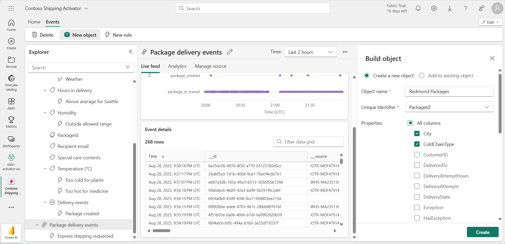

# Verwenden vom Data Activator in Fabric

Data Activator in Microsoft Fabric ergreift Maßnahmen auf der Grundlage dessen, was in Ihren Daten geschieht. Mit einer Activator-Instanz können Sie Ihre Daten überwachen und Trigger erstellen, um auf Ihre Datenänderungen zu reagieren.

Dieses Lab dauert ungefähr **30** Minuten.

> **Hinweis:** Sie benötigen eine [Microsoft Fabric-Testversion](https://learn.microsoft.com/fabric/get-started/fabric-trial), um diese Übung durchführen zu können.

## Szenario

In diesem Szenario sind Sie ein*e Datenanalyst*in für ein Unternehmen, das eine Reihe von Produkten verkauft und versendet.  Sie sind für die Daten aller Sendungen und Verkäufe an die Stadt Redmond verantwortlich. Sie möchten eine Warnungsregel erstellen, die die Pakete überwacht, die ausgeliefert werden sollen. Eine Kategorie von Produkten, die Sie versenden, sind Medikamente, die während des Transports bei einer bestimmten Temperatur gekühlt werden müssen. Sie möchten eine Warnung erstellen, die eine E-Mail an die Versandabteilung sendet, wenn die Temperatur eines Pakets, das ein Medikament enthält, über oder unter einem bestimmten Schwellenwert liegt. Die ideale Temperatur sollte zwischen 0,5 und 5 Grad liegen. Da die Activator-Ereignisse bereits einen ähnlichen Trigger haben, erstellen Sie einen speziell für die Pakete, die an die Stadt Redmond geliefert werden. Legen wir los.

## Erstellen eines Arbeitsbereichs

Erstellen Sie vor dem Arbeiten mit Daten in Fabric einen Arbeitsbereich mit aktivierter Fabric-Testversion.

1. Navigieren Sie in einem Browser unter `https://app.fabric.microsoft.com/home?experience=fabric-developer` zur [Microsoft Fabric-Startseite](https://app.fabric.microsoft.com/home?experience=fabric-developer) und melden Sie sich mit Ihren Fabric-Anmeldeinformationen an.
1. Wählen Sie auf der Menüleiste auf der linken Seite **Arbeitsbereiche** aus (Symbol ähnelt &#128455;).
1. Erstellen Sie einen neuen Arbeitsbereich mit einem Namen Ihrer Wahl, und wählen Sie einen Lizenzierungsmodus mit Fabric-Kapazitäten aus (*Testversion*, *Premium* oder *Fabric*).
1. Wenn Ihr neuer Arbeitsbereich geöffnet wird, sollte er leer sein.

    

In diesem Lab verwenden Sie Activator in Fabric, um Trigger basierend auf Datenänderungen zu erstellen. Activator von Fabric stellt Ihnen bequem ein Beispieldataset zur Verfügung, mit dem Sie die Möglichkeiten von Activator erkunden können. Sie verwenden diese Beispieldaten, um das Streaming einiger Echtzeitdaten zu analysieren und einen Trigger zu erstellen, um eine E-Mail zu versenden, wenn eine Bedingung erfüllt ist.

> **Hinweis:** Der Activator-Beispielprozess erzeugt im Hintergrund einige Zufallsdaten. Je komplexer Ihre Bedingungen und Filter sind, desto mehr Zeit dauert es, sie auszulösen. Wenn im Graphen keine Daten angezeigt werden, warten Sie ein paar Minuten und aktualisieren Sie die Seite. Sie müssen jedoch nicht warten, bis die Daten in den Graphen angezeigt werden, um mit dem Lab fortzufahren.

## Erstellen einer Activator-Instanz

Als Nächstes erstellen Sie eine Activator-Instanz in dem Arbeitsbereich, den Sie erstellt haben:

1. Wählen Sie in der Menüleiste auf der linken Seite **Erstellen** aus. Wählen Sie auf der Seite *Neu* unter dem Abschnitt *Echtzeitintelligenz* die Option **Activator** aus.

    >**Hinweis**: Wenn die Option **Erstellen** nicht an die Seitenleiste angeheftet ist, müssen Sie zuerst die Ellipses-Option (**…**) auswählen.

    Nach etwa einer Minute wird eine neue Activator-Instanz erstellt:

    

    In einer realen Produktivumgebung würden Sie Ihre eigenen Daten verwenden. Für dieses Lab verwenden Sie jedoch die von Activator bereitgestellten Beispieldaten. 

1. Wählen Sie die Kachel **Beispiel ausprobieren** aus, um Ihre Activator-Instanz mit Beispieldaten aufzufüllen.

    Standardmäßig wird die Activator-Instanz mit dem Namen *Activator YYYY-MM-DD hh:mm:ss* erstellt. Da in Ihrem Arbeitsbereich möglicherweise mehrere Activator-Instanzen vorhanden sind, sollten Sie den Standardnamen in einen aussagekräftigeren ändern.

1. Wählen Sie das Pulldownmenü neben dem aktuellen Activator-Namen in der oberen linken Ecke aus, und ändern Sie den Namen für unser Beispiel in ***Contoso Shipping Activator***.

    

Unser Activator-Projekt wird jetzt erstellt, und wir können mit dem Navigieren durch seine Objekte, Eigenschaften und Regeln beginnen.

## Machen Sie sich mit dem Activator-Startbildschirm vertraut.

Untersuchen wir die Eventstreamdaten, auf denen dieses Beispiel basiert.

1. Scrollen Sie im Bereich **Explorer** nach unten, und wählen Sie den Stream **Package delivery events** aus.

    Diese Ereignisse zeigen den Echtzeitstatus von Paketen, die von einem Logistikunternehmen geliefert werden.

    

1. Überprüfen Sie die Daten in der Livetabelle **Ereignisdetails**. Jeder Datenpunkt enthält Informationen zu eingehenden Ereignissen. Möglicherweise müssen Sie scrollen, um alles anzuzeigen.

    Im Bereich **Explorer** werden Objekte angezeigt, die Daten aus Eventstreams verwenden. Diese Objekte verfügen über Eigenschaften, aus denen Regeln erstellt werden können. In diesem Beispiel ist **Paket** das Objekt, das aus dem Eventstream **Package delivery events** (Paketzustellungsereignisse) erstellt wurde.

1. Wählen Sie im Bereich **Explorer** unter der Eigenschaft **Temperature** die Regel **Too hot for medicine** (Zu heiß für Medikamente) aus.
1. Überprüfen Sie im Bereich **Definition** die Funktionsweise der Regel. Im Abschnitt **Überwachen** ist die Eigenschaft **Temperature** als das zu überwachende Attribut ausgewählt. Die Temperaturwerte stammen aus der Spalte „Temperatur“ in der Tabelle **Ereignisdetails**, die wir zuvor im Eventstream gesehen haben. 

     

1. Im Abschnitt **Bedingung** wird die Regelbedingung zum Überwachen der Temperaturen angezeigt, die über 20 Grad Celsius liegen.
1. Im Abschnitt **Eigenschaftsfilter** wird ein angepasster Filter angezeigt, der sicherstellt, dass unsere Regel nur für Pakete gilt, die Medikamente enthalten. In der Eventstreamtabelle betrachtet die Regel die Spalte**SpecialCare**, die hier als Eigenschaft *Special care contents* dargestellt wird. In der Eigenschaft *Special care contents* haben einige der Pakete den Wert „Medicine“ (Medikament).
1. Schließlich haben wir den Abschnitt **Aktion**. Unsere Regel sendet eine Teams-Nachricht, wenn die Bedingung erfüllt wird. Sie können sie auch so festlegen, dass stattdessen eine E-Mail gesendet wird.
1. Wählen Sie den gewünschten Aktionstyp aus, überprüfen Sie, ob Sie die empfangende Person sind, und wählen Sie dann **Testaktion senden** aus. Sie sollten die im Feld **Nachricht** festgelegte Nachricht mit Details zum Trigger erhalten, etwa Aktivierungszeit und Paket-ID.

## Erstellen eines -Objekts

In einem realen Szenario ist es möglicherweise nicht erforderlich, ein neues Objekt für diesen Eventstream zu erstellen, da das Activator-Beispiel bereits ein Objekt namens *Paket* enthält. Für dieses Lab erstellen wir jedoch ein neues Objekt, um zu veranschaulichen, wie ein Objekt erstellt wird. Wir erstellen ein neues Objekt mit dem Namen *Redmond-Pakete*.

1. Wählen Sie den Eventstream für **Paketzustellungsereignisse** und dann auf dem Menüband **Neues Objekt** aus.

1. Geben Sie im Bereich **Objekt erstellen** rechts die folgenden Werte ein:
    - **Objektname**: `Redmond Packages`
    - **Eindeutiger Bezeichner**: **PackageId**
    - **Properties:** **City**, **ColdChainType**, **SpecialCare**, **Temperature**

1. Klicken Sie auf **Erstellen**.

    

Im Bereich **Explorer** wurde ein neues Objekt mit dem Namen **Redmond Packages** hinzugefügt. Jetzt erstellen Sie Ihre Regel.

## Erstellen einer Regel

Sehen wir uns an, was Ihre Regel tun soll: *Sie möchten eine Warnungsregel erstellen, die eine E-Mail an die Versandabteilung sendet, wenn die Temperatur eines Pakets, das ein Medikament enthält, über oder unter einem bestimmten Schwellenwert liegt. Die ideale Temperatur sollte unter 20 Grad liegen. Da das Paketobjekt bereits eine ähnliche Regel enthält, erstellen Sie eine speziell für die Pakete, die an die Stadt Redmond geliefert werden.*

1. Wählen Sie die Eigenschaft **Temperature** im Objekt *Redmond Packages* und dann auf dem Menüband die Schaltfläche **Neue Regel** aus, sofern noch nicht geschehen.
1. Geben Sie im Bereich **Regel erstellen** die folgenden Werte ein:
    - **Bedingung:** Steigt über
    - **Wert**: `20`
    - **Häufigkeit**: Jedes Mal, wenn die Bedingung erfüllt wird
    - **Aktion**: Senden Sie mir eine E-Mail

1. Klicken Sie auf **Erstellen**.
1. Eine neue Regel mit dem Standardnamen *Temperaturwarnung* wird erstellt. Ändern Sie den Namen in ***Medicine temp out of range*** (Medikamententemperatur außerhalb des Bereichs), indem Sie das Stiftsymbol neben dem Namen der Regel im mittleren Bereich auswählen.

    

    Bisher haben Sie die Eigenschaft und Bedingung definiert, für die die Regel ausgelöst werden soll. Das sind aber noch nicht alle erforderlichen Parameter. Sie müssen weiterhin sicherstellen, dass der Trigger nur für die *Stadt* **Redmond** und für die erforderliche Art der*besonderen Behandlung* für **Medikamente** ausgelöst wird. Fahren wir fort und fügen wir einige Filter für diese Bedingungen hinzu.  

1. Erweitern Sie im Bereich **Definition** den Abschnitt **Eigenschaftsfilter**.
1. Legen Sie im Feld **Filter 1** das Attribut auf **City** und den Vorgang auf **Ist gleich** fest, und wählen Sie **Redmond** als Wert aus.
1. Wählen Sie **Filter hinzufügen** aus, und fügen Sie dann einen neuen Filter mit dem Attribut **SpecialCare** hinzu, legen Sie ihn auf **Ist gleich** fest, und geben Sie **Medikament** als Wert ein.
1. Fügen wir noch einen weiteren Filter hinzu, um sicherzustellen, dass das Medikament gekühlt wird. Wählen Sie die Schaltfläche **Filter hinzufügen** aus, legen Sie das Attribut ***ColdChainType*** fest, legen Sie es auf **Ist gleich** fest, und geben Sie **Gekühlt** als Wert ein.

    

    Sie haben es fast geschafft! Jetzt müssen Sie nur noch definieren, welche Aktion ausgeführt werden soll, wenn der Trigger ausgelöst wird. In diesem Fall möchten Sie, dass eine E-Mail an die Versandabteilung gesendet wird.

1. Geben Sie im Abschnitt **Aktion** die folgenden Werte ein:
    - **Typ:** E-Mail
    - **An**: Ihr aktuelles Benutzerkonto sollte standardmäßig ausgewählt sein. Dies sollte für dieses Lab ausreichen.
    - **Betreff**: *Medikamentenpaket nach Redmond außerhalb des zulässigen Temperaturbereichs*
    - **Überschrift**: *Temperatur zu hoch*
    - **Kontext**: Wählen Sie aus der Liste der Kontrollkästchen die Eigenschaft *Temperature* aus.

    

1. Wählen Sie **Speichern und starten**.

    Sie haben nun in Ihrer Activator-Instanz eine Regel erstellt und aktiviert. Die Regel sollte mehrmals jede Stunde ausgelöst werden.

1. Nachdem Sie überprüft haben, ob die Regel funktioniert, können Sie sie über die Schaltfläche **Beenden** auf dem Menüband deaktivieren.

## Bereinigen von Ressourcen

In dieser Übung haben Sie eine Activator-Instanz mit einer Warnungsregel erstellt. Sie sollten jetzt mit der Activator-Benutzeroberfläche vertraut sein und wissen, wie Sie Objekte, Eigenschaften und Regeln erstellen.

Wenn Sie Activator erkundet haben, können Sie den Arbeitsbereich löschen, den Sie für diese Übung erstellt haben.

1. Wählen Sie in der linken Navigationsleiste das Symbol für Ihren Arbeitsbereich aus, um alle darin enthaltenen Elemente anzuzeigen.
2. Wählen Sie auf der oberen Symbolleiste im Menü die Option **Arbeitsbereichseinstellungen** aus.
3. Wählen Sie im Abschnitt **Allgemein** die Option **Diesen Arbeitsbereich entfernen** aus.
