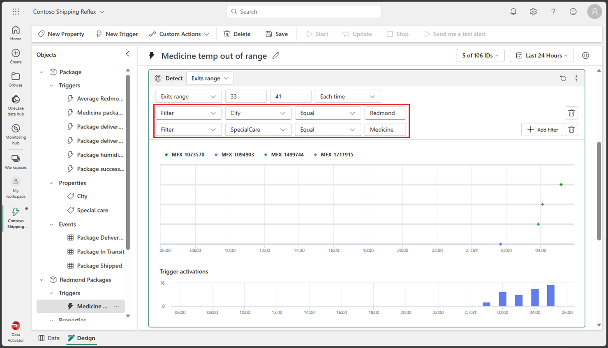
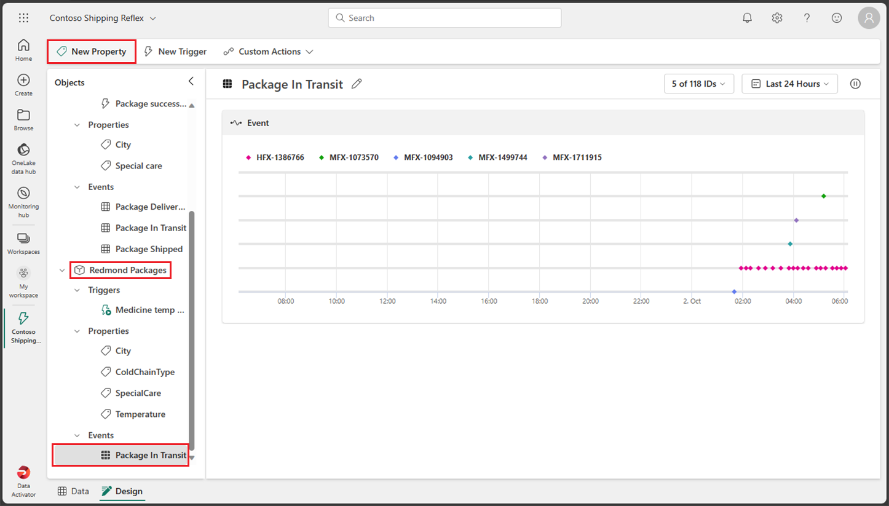

---
lab:
  title: Verwenden vom Data Activator in Fabric
  module: Get started with Data Activator in Microsoft Fabric
---

# Verwenden vom Data Activator in Fabric

Data Activator in Microsoft Fabric ergreift Maßnahmen auf der Grundlage dessen, was in Ihren Daten geschieht. Mit Data Activator können Sie Ihre Daten überwachen und Trigger erstellen, um auf Ihre Datenänderungen zu reagieren.

Dieses Lab dauert ungefähr **30** Minuten.

> **Hinweis:** Sie benötigen eine [Microsoft Fabric-Testversion](https://learn.microsoft.com/fabric/get-started/fabric-trial), um diese Übung durchführen zu können.

## Erstellen eines Arbeitsbereichs

Erstellen Sie vor dem Arbeiten mit Daten in Fabric einen Arbeitsbereich mit aktivierter Fabric-Testversion.

1. Wählen Sie auf der [Microsoft Fabric-Startseite](https://app.fabric.microsoft.com) die Option **Data Activator** aus.
1. Wählen Sie auf der Menüleiste auf der linken Seite **Arbeitsbereiche** aus (Symbol ähnelt &#128455;).
1. Erstellen Sie einen neuen Arbeitsbereich mit einem Namen Ihrer Wahl, und wählen Sie einen Lizenzierungsmodus mit Fabric-Kapazitäten aus (*Testversion*, *Premium* oder *Fabric*).
1. Wenn Ihr neuer Arbeitsbereich geöffnet wird, sollte er leer sein.

    

In diesem Lab verwenden Sie den Data Activator in Fabric, um einen *Reflex* zu erstellen. Data Activator stellt Ihnen bequem einen Beispieldatensatz zur Verfügung, mit dem Sie die Möglichkeiten von Data Activator erkunden können. Sie verwenden diese Beispieldaten, um einen *Reflex* zu erstellen, der einige Echtzeitdaten analysiert und einen Trigger erstellt, um eine E-Mail zu versenden, wenn eine Bedingung erfüllt ist.

> **Hinweis**: Der Data Activator-Beispielprozess erzeugt im Hintergrund einige Zufallsdaten. Je komplexer Ihre Bedingungen und Filter sind, desto mehr Zeit dauert es, sie auszulösen. Wenn im Graphen keine Daten angezeigt werden, warten Sie ein paar Minuten und aktualisieren Sie die Seite. Sie müssen jedoch nicht warten, bis die Daten in den Graphen angezeigt werden, um mit dem Lab fortzufahren.

## Szenario

In diesem Szenario sind Sie ein*e Datenanalyst*in für ein Unternehmen, das eine Reihe von Produkten verkauft und versendet.  Sie sind für die Daten aller Sendungen und Verkäufe an die Stadt Redmond verantwortlich. Sie möchten einen Reflex erstellen, der die Pakete überwacht, die ausgeliefert werden sollen. Eine Kategorie von Produkten, die Sie versenden, sind Medikamente, die während des Transports bei einer bestimmten Temperatur gekühlt werden müssen. Sie möchten einen Reflex erstellen, der eine E-Mail an die Versandabteilung sendet, wenn die Temperatur eines Pakets, das ein Medikament enthält, über oder unter einem bestimmten Schwellenwert liegt. Die ideale Temperatur sollte zwischen 0,5 und 5 Grad liegen. Da die Reflex-Ereignisse bereits einen ähnlichen Trigger haben, erstellen Sie einen speziell für die Pakete, die an die Stadt Redmond geliefert werden. Legen wir los.

## Erstellen eines Reflexes

1. Suchen Sie unten rechts nach dem Data Activator-Symbol, um sich zu vergewissern, dass Sie sich auf dem Data Activator-Startbildschirm befinden. Erstellen Sie einen neuen Reflex, indem Sie die Schaltfläche **Reflex (Vorschau)** auswählen.

    

1. In einer realen Produktivumgebung würden Sie Ihre eigenen Daten verwenden. Für dieses Lab verwenden Sie jedoch die von Data Activator bereitgestellten Beispieldaten. Wählen Sie die Schaltfläche **Beispieldaten verwenden** aus, um die Erstellung Ihres Reflex abzuschließen.

    

1. Standardmäßig erstellt Data Activator Ihren Reflex mit dem Namen *Reflex JJJJ-MM-TT hh:mm:ss*. Da in Ihrem Arbeitsbereich möglicherweise mehrere Reflexe vorhanden sind, sollten Sie den Standardnamen von Reflex in einen aussagekräftigeren ändern. Wählen Sie das Pulldown-Menü neben dem aktuellen Reflex-Namen in der oberen linken Ecke und ändern Sie den Namen für unser Beispiel in ***Contoso Versand-Reflex***.

    

Unser Reflex wurde jetzt erstellt und wir können damit beginnen, Trigger und Aktionen hinzuzufügen.

## Machen Sie sich mit dem Reflex-Startbildschirm vertraut

Der Startbildschirm des Reflex ist in zwei Abschnitte unterteilt, den *Entwurfsmodus* den *Datenmodus*. Sie können den Modus über die entsprechende Registerkarte unten links auf dem Bildschirm auswählen.  Auf der Registerkarte *Entwurfsmodus* definieren Sie Ihre Objekte mit Ihren Triggern, Eigenschaften und Ereignissen. Auf der Registerkarte *Datenmodus* können Sie Ihre Datenquellen hinzufügen und die von Ihrem Reflex verarbeiteten Daten anzeigen. Sehen wir uns die Registerkarte *Entwurfsmodus* an, die standardmäßig geöffnet werden sollte, wenn Sie Ihren Reflex erstellen.

### Entwurfsmodus

Wenn Sie sich derzeit nicht im *Entwurfsmodus* befinden, wählen Sie unten links auf dem Bildschirm die Registerkarte **Entwurf** aus.

Um sich mit dem *Entwurfsmodus* vertraut zu machen, wählen Sie die verschiedenen Bildschirmabschnitte, Trigger, Eigenschaften und Ereignisse aus. In den folgenden Abschnitten werden die einzelnen Abschnitte ausführlicher behandelt.

### Datenmodus

Wenn Sie sich derzeit nicht im *Datenmodus* befinden, wählen Sie unten links auf dem Bildschirm die Registerkarte **Daten** aus. In einem realen Beispiel würden Sie hier Ihre eigenen Datenquellen aus Ihren EventStreams- und Power BI-Visuals hinzufügen. Für dieses Lab verwenden Sie die von Data Activator bereitgestellten Beispieldaten. Das Beispiel ist bereits mit drei EventStreams eingerichtet, die den Paketübermittlungsstatus überwachen.

Wählen Sie jedes der verschiedenen Ereignisse aus und beobachten Sie die Daten, die im Stream verwendet werden.

Es ist an der Zeit, unserem Reflex einen Trigger hinzuzufügen. Zunächst erstellen wir aber ein neues Objekt.

## Erstellen eines -Objekts

In einem realen Szenario ist es möglicherweise nicht erforderlich, ein neues Objekt für diesen Reflex zu erstellen, da das Data Activator-Beispiel bereits ein Objekt namens *Paket* enthält. Für dieses Lab erstellen wir jedoch ein neues Objekt, um zu veranschaulichen, wie ein Objekt erstellt wird. Wir erstellen ein neues Objekt mit dem Namen *Redmond-Pakete*.

1. Wenn Sie sich derzeit nicht im *Datenmodus* befinden, wählen Sie unten links auf dem Bildschirm die Registerkarte **Daten** aus.

1. Wählen Sie das Ereignis ***Paket auf dem Transportweg*** aus. Achten Sie genau auf die Werte in den Spalten *PaketId*, *Temperatur*, *KühlkettenArt*, *Stadt* und *BesondereBehandlung*. Sie werden diese Spalten verwenden, um Ihren Trigger zu erstellen.

1. Wenn das Dialogfeld *Daten zuweisen* auf der rechten Seite noch nicht geöffnet ist, wählen Sie rechts auf dem Bildschirm die Schaltfläche **Daten zuweisen** aus.

    

1. Wählen Sie im Dialogfeld *Daten zuweisen* die Registerkarte ***Zu neuem Objekt zuweisen*** aus und geben Sie die folgenden Werte ein:

    - **Objektname**: *Redmond-Pakete*
    - **Schlüsselspalte zuweisen**: *PaketId*
    - **Eigenschaften zuweisen**: *Stadt, KühlkettenArt, BesondereBehandlung, Temperatur*

    

1. Wählen Sie **Speichern** und dann **Speichern und zum Entwurfsmodus wechseln** aus.

1. Sie sollten sich jetzt wieder im *Entwurfsmodus* befinden. Ein neues Objekt mit dem Namne ***Redmond-Pakete*** wurde hinzugefügt. Wählen Sie dieses neue Objekt aus, erweitern Sie dessen *Ereignisse* und wählen Sie das Ereignis **Paket auf dem Transportweg** aus.

    

Jetzt erstellen Sie Ihren Trigger.

## Trigger erstellen

Sehen wir uns an, was Ihr Trigger tun soll: *Sie möchten einen Reflex erstellen, der eine E-Mail an die Versandabteilung sendet, wenn die Temperatur eines Pakets, das ein Medikament enthält, einen bestimmten Schwellenwert über- oder unterschreitet. Die ideale Temperatur sollte zwischen 0,5 und 5 Grad liegen. Da die Reflex-Ereignisse bereits einen ähnlichen Trigger enthalten, werden Sie einen speziell für die Pakete erstellen, die an die Stadt Redmond versandt werden.*

1. Wählen Sie im Ereignis *Paket während der Übertragung* des **Redmond-Pakete**-Objekts im oberen Menü die Schaltfläche **Neuer Trigger** aus. Es wird ein neuer Trigger mit dem Standardnamen *Unbenannt* erstellt. Ändern Sie den Namen in ***Medikamententemperatur außerhalb des Bereichs***, um Ihren Trigger näher zu definieren.

    

1. Jetzt wählen Sie die Eigenschaft oder Ereignisspalte, die Ihren Reflex auslöst. Da Sie beim Erstellen des Objekts mehrere Eigenschaften erstellt haben, wählen Sie die Schaltfläche **Vorhandene Eigenschaft** und dann die Eigenschaft ***Temperatur*** aus. 

    

    Wenn Sie diese Eigenschaft auswählen, sollte ein Graph mit historischen Beispieltemperaturwerten zurückgegeben werden.

    

1. Nun müssen Sie entscheiden, welche Art von Bedingung Sie mit dieser Eigenschaft auslösen möchten. In diesem Fall möchten Sie Ihren Reflex auslösen, wenn die Temperatur über 5 oder unter 0,5 Grad liegt. Da wir nach einem numerischen Bereich suchen, wählen Sie die Schaltfläche **Numerisch** aus und wählen Sie die Bedingung **Außerhalb des Bereichs** aus.

    

1. Nun müssen Sie die Werte für Ihre Bedingung eingeben. Geben Sie ***0,5*** und ***5*** als Bereichswerte ein. Da Sie die Bedingung *Außerhalb des numerischen Bereichs* auswählen, sollte der Trigger ausgelöst werden, wenn die Temperatur unter *0,5* Grad oder über *5* Grad liegt.

    

1. Bisher haben Sie die Eigenschaft und Bedingung definiert, für die der Trigger ausgelöst werden soll. Das sind aber noch nicht alle erforderlichen Parameter. Sie müssen weiterhin sicherstellen, dass der Trigger nur für die *Stadt* **Redmond** und für die erforderliche Art der*besonderen Behandlung* für **Medikamente** ausgelöst wird. Fahren wir fort und fügen wir einige Filter für diese Bedingungen hinzu.  Wählen Sie die Schaltfläche **Filter hinzufügen** aus, legen Sie die Eigenschaft auf ***Stadt*** fest, legen Sie die Beziehung auf ***Gleich*** fest, und geben Sie ***Redmond*** als Wert ein. Fügen Sie dann einen neuen Filter mit der ***SpecialCare***-Eigenschaft hinzu, legen Sie ihn auf ***Gleich*** fest, und geben Sie ***Medizin*** als Wert ein.

    

1. Fügen wir noch einen weiteren Filter hinzu, um sicherzustellen, dass das Medikament gekühlt wird. Wählen Sie die Schaltfläche **Filter hinzufügen** aus, legen Sie die ***ColdChainType***-Eigenschaft fest, legen Sie sie auf ***Gleich*** fest, und geben Sie ***Gekühlt*** als Wert ein.

    

1. Sie haben es fast geschafft! Jetzt müssen Sie nur noch definieren, welche Aktion ausgeführt werden soll, wenn der Trigger ausgelöst wird. In diesem Fall möchten Sie, dass eine E-Mail an die Versandabteilung gesendet wird. Wählen Sie die Schaltfläche **E-Mail** aus.

    

1. Geben Sie für Ihre E-Mail-Aktion die folgenden Werte ein:

    - **Senden an**: Ihr aktuelles Benutzerkonto sollte standardmäßig ausgewählt sein. Dies sollte für dieses Lab ausreichen.
    - **Betreff**: *Medikamentenpaket nach Redmond außerhalb des zulässigen Temperaturbereichs*
    - **Überschrift**: *Temperatur zu hoch oder zu niedrig*
    - **Zusätzliche Informationen**: Wählen Sie aus der Liste der Kontrollkästchen die Eigenschaft *Temperatur* aus.

    

1. Wählen Sie **Speichern** und dann im oberen Menü **Aktivieren** aus.

Sie haben nun in Data Activator einen Trigger erstellt und aktiviert.

## Aktualisieren und Beenden eines Triggers

Das einzige Problem bei diesem Trigger besteht darin, dass der Trigger zwar eine E-Mail mit der Temperatur gesendet hat, jedoch nicht die *PaketId* des Pakets. Fahren wir fort und aktualisieren wir den Trigger, dass er die *PaketId* sendet.

1. Wählen Sie im Ereignis **Paket auf dem Transportweg** das Objekt **Redmond-Pakete** aus und wählen Sie im oberen Menü die Option **Neue Eigenschaft** aus.

    

1. Fügen Sie die Eigenschaft **PaketId** hinzu, indem Sie die Spalte im Ereignis *Paket auf dem Transportweg* auswählen. Vergessen Sie nicht, den Eigenschaftennamen von *Unbenannt* in *PaketId* zu ändern.

    

1. Aktualisieren wir unsere Triggeraktion. Wählen Sie den Trigger **Medikamententemperatur außerhalb des Bereichs** aus, scrollen Sie zum Abschnitt **Aktion** hinunter, wählen Sie **Zusätzliche Informationen** aus und fügen Sie die Eigenschaft **PaketId** hinzu. Achtung: Wählen Sie die Schaltfläche **Speichern** NOCH NICHT aus.

    

1. Da Sie den Trigger aktualisiert haben, sollten Sie diesen jetzt aktualisieren und nicht speichern. Für dieses Lab tun wir das Gegenteil und wählen die Schaltfläche **Speichern** anstelle der Schaltfläche **Aktualisieren** aus, um zu sehen, was dann passiert. Der Grund, warum Sie die Schaltfläche *Aktualisieren* auswählen sollten, ist folgender: Beim *Aktualisieren* des Triggers wird der Trigger nicht nur gespeichert – es wird auch der aktuell ausgeführte Trigger mit den neuen Bedingungen aktualisiert. Wenn Sie einfach die Schaltfläche *Speichern* auswählen, werden die neuen Bedingungen erst vom derzeit ausgeführten Trigger angewendet, wenn Sie den Trigger aktualisieren. Wählen Sie nun die Schaltfläche **Speichern** aus.

1. Da Sie *Speichern* anstelle von *Aktualisieren* ausgewählt haben, sehen Sie jetzt am oberen Bildschirmrand die Meldung *„Ein Eigenschaftsupdate ist verfügbar. Führen Sie jetzt eine Aktualisierung durch, um sicherzustellen, dass der Trigger die neuesten Änderungen verwendet.“* . In der Nachricht gibt es auch eine *Aktualisieren*-Schaltfläche. Wählen Sie nun die Schaltfläche **Aktualisieren** aus.

    

1. Um den Trigger zu beenden, wählen Sie im oberen Menü die Schaltfläche **Beenden** aus.

## Bereinigen von Ressourcen

In dieser Übung haben Sie in Data Activator einen Reflex mit einem Trigger erstellt. Sie sollten jetzt mit der Data Activator-Benutzeroberfläche vertraut sein und wissen, wie Sie einen Reflex und die zugehörigen Objekte, Trigger und Eigenschaften erstellen.

Wenn Sie Ihren Data Activator-Reflex erkundet haben, können Sie den Arbeitsbereich löschen, den Sie für diese Übung erstellt haben.

1. Wählen Sie auf der Leiste auf der linken Seite das Symbol für Ihren Arbeitsbereich aus, um alle darin enthaltenen Elemente anzuzeigen.
2. Wählen Sie im Menü **...** auf der Symbolleiste die **Arbeitsbereichseinstellungen** aus.
3. Wählen Sie im Abschnitt **Allgemein** die Option **Diesen Arbeitsbereich entfernen** aus.
