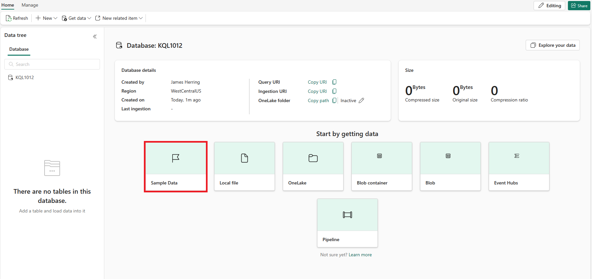

---
lab:
  title: Abfragen von Daten aus einer KQL-Datenbank
  module: Query data from a Kusto Query database in Microsoft Fabric
---

# Erste Schritte beim Abfragen einer Kusto-Datenbank in Microsoft Fabric

Ein KQL-Abfrageset ist ein Tool, mit dem Sie Abfragen ausführen, ändern und Abfrageergebnisse aus einer KQL-Datenbank anzeigen können. Sie können jede Registerkarte im KQL-Abfrageset mit einer anderen KQL-Datenbank verknüpfen und Ihre Abfragen für die zukünftige Verwendung speichern oder für die Datenanalyse freigeben. Sie können die KQL-Datenbank auch für eine beliebige Registerkarte wechseln, sodass Sie die Abfrageergebnisse aus verschiedenen Datenquellen vergleichen können.

In dieser Übung sind Sie eine Analystin bzw. ein Analyst und damit beauftragt, ein Beispieldataset mit Rohdaten zu Taxifahrten in New York abzufragen, aus dem Sie zusammenfassende Statistiken (Profilerstellung) der Daten aus der Fabric-Umgebung ziehen. Sie verwenden KQL zum Abfragen dieser Daten und Sammeln von Informationen, um Erkenntnisse zu den Daten zu gewinnen.

Das KQL-Abfrageset verwendet die Kusto-Abfragesprache, die mit vielen SQL-Funktionen kompatibel ist, um Abfragen zu erstellen. Weitere Informationen zur [Kusto-Abfragesprache (KQL)](https://learn.microsoft.com/en-us/azure/data-explorer/kusto/query/?context=%2Ffabric%2Fcontext%2Fcontext).

Sie werden ungefähr **25** Minuten für dieses Lab benötigen.

> **Hinweis:** Sie benötigen eine [Microsoft Fabric-Testversion](https://learn.microsoft.com/fabric/get-started/fabric-trial), um diese Übung abzuschließen.

## Erstellen eines Arbeitsbereichs

Erstellen Sie vor dem Arbeiten mit Daten in Fabric einen Arbeitsbereich mit aktivierter Fabric-Testversion.

1. Wählen Sie auf der Startseite [Microsoft Fabric](https://app.fabric.microsoft.com) **Real-Time Intelligence** aus.
1. Wählen Sie auf der Menüleiste auf der linken Seite **Arbeitsbereiche** aus (Symbol ähnelt &#128455;).
1. Erstellen Sie einen neuen Arbeitsbereich mit einem Namen Ihrer Wahl, und wählen Sie einen Lizenzierungsmodus mit Fabric-Kapazitäten aus (*Testversion*, *Premium* oder *Fabric*).
1. Wenn Ihr neuer Arbeitsbereich geöffnet wird, sollte er leer sein.

    

In diesem Lab verwenden Sie Real-Time Intelligence in Fabric, um eine KQL-Datenbank aus einem Beispiel-Eventstream zu erstellen. Echtzeitintelligenz bietet bequem ein Beispiel-Dataset, mit dem Sie die Funktionen von Real-Time Intelligence erkunden können. Sie verwenden diese Beispieldaten, um KQL/SQL-Abfragen und Abfragesätze zu erstellen, die Echtzeitdaten analysieren und andere Verwendungen in nachgelagerten Prozessen ermöglichen.

## Erstellen einer KQL-Datenbank

1. Wählen Sie innerhalb der **Real-Time Intelligence** das **KQL-Datenbankfeld** aus.

   

1. Sie werden aufgefordert, einen **Namen** für die KQL-Datenbank anzugeben.

   

1. Geben Sie der KQL-Datenbank einen Namen, den Sie sich gut merken können (z. B. **TaxiData**), und wählen Sie **Erstellen** aus.

1. Wählen Sie im Bereich **Datenbankdetails** das Bleistiftsymbol aus, um die Verfügbarkeit in OneLake zu aktivieren.

   

   Verwenden Sie dann den Schieberegler, um die Verfügbarkeit zu aktivieren.

   
   
1. Wählen Sie das Feld mit **Beispieldaten** aus den Optionen von ***Rufen Sie zunächst Daten ab*** aus.

   

   Wählen Sie das dann Feld **Automotive operations analytics** aus den Optionen für Beispieldaten aus.

   

1. Nachdem die Daten geladen wurden, können wir überprüfen, ob die KQL-Datenbank mit Daten gefüllt ist.

   

1. Sobald die Daten geladen wurden, überprüfen Sie, ob die Daten in die KQL-Datenbank geladen wurden. Wählen Sie dazu die Auslassungspunkte rechts neben der Tabelle aus, navigieren Sie zur **Abfragetabelle** und wählen Sie **100 Datensätze anzeigen** aus.

    

   > **HINWEIS:** Wenn Sie dies zum ersten Mal ausführen, kann die Zuordnung von Computeressourcen mehrere Sekunden dauern.


    

## Einführung in Kusto-Abfragesprache (Kusto Query Language, KQL) und deren Syntax

Kusto-Abfragesprache (KQL) ist eine Abfragesprache, die zum Analysieren von Daten im Microsoft Azure Data Explorer verwendet wird, der Teil von Azure Fabric ist. KQL ist einfach und intuitiv konzipiert, sodass Anfänger sie leicht lernen und verwenden können. Gleichzeitig ist es sehr flexibel und anpassbar, so dass fortgeschrittene Benutzer*innen komplexe Abfragen und Analysen durchführen können.

KQL basiert auf einer Syntax ähnlich wie SQL, aber mit einigen wichtigen Unterschieden. KQL verwendet beispielsweise einen Pipeoperator (|) anstelle eines Semikolons (;) zum Trennen von Befehlen und verwendet einen anderen Satz von Funktionen und Operatoren zum Filtern und Bearbeiten von Daten.

Eines der wichtigsten Features von KQL ist die Fähigkeit, große Datenmengen schnell und effizient zu verarbeiten. Durch diese Funktion ist es ideal für die Analyse von Protokollen, Telemetriedaten und anderen Arten von Big Data. KQL unterstützt auch eine Vielzahl von Datenquellen, einschließlich strukturierter und unstrukturierter Daten, was sie zu einem vielseitigen Tool für die Datenanalyse macht.

Im Kontext von Microsoft Fabric kann KQL zum Abfragen und Analysieren von Daten aus verschiedenen Quellen wie Anwendungsprotokollen, Leistungsmetriken und Systemereignissen verwendet werden. Dies kann Ihnen helfen, Einblicke in die Integrität und Leistung Ihrer Anwendungen und Infrastruktur zu erhalten und Probleme und Optimierungsmöglichkeiten zu identifizieren.

Insgesamt ist KQL eine leistungsstarke und flexible Abfragesprache, mit der Sie schnell und einfach Einblicke in Ihre Daten gewinnen können, unabhängig davon, ob Sie mit Microsoft Fabric oder anderen Datenquellen arbeiten. Mit seiner intuitiven Syntax und seinen leistungsstarken Funktionen ist KQL einen näheren Blick wert.

In diesem Modul konzentrieren wir uns auf die Grundlagen von Abfragen gegen eine KQL-Datenbank, wobei wir zuerst KQL und dann T-SQL verwenden. Wir konzentrieren uns auf die grundlegenden Elemente der T-SQL-Syntax, die für Abfragen verwendet werden wie:

**SELECT**-Abfragen, die zum Abrufen von Daten aus einer oder mehreren Tabellen verwendet werden. Beispielsweise können Sie eine SELECT-Abfrage verwenden, um die Namen und Gehälter aller Mitarbeiter in einem Unternehmen abzurufen.

**WHERE**-Abfragen, die verwendet werden, um die Daten basierend auf bestimmten Bedingungen zu filtern. Beispielsweise können Sie eine WHERE-Abfrage verwenden, um die Namen von Mitarbeitern abzurufen, die in einer bestimmten Abteilung arbeiten oder ein Gehalt haben, das über einem bestimmten Betrag liegt.

**GROUP BY**-Abfragen, die verwendet werden, um die Daten anhand einer oder mehrerer Spalten zu gruppieren und Aggregatfunktionen für sie auszuführen. Sie können beispielsweise eine GROUP BY-Abfrage verwenden, um das durchschnittliche Gehalt der Mitarbeiter nach Abteilung oder Land zu erhalten.

**ORDER BY**-Abfragen, die verwendet werden, um die Daten nach einer oder mehreren Spalten in aufsteigender oder absteigender Reihenfolge zu sortieren. Beispielsweise können Sie eine ORDER BY-Abfrage verwenden, um die Namen der Mitarbeiter nach ihren Gehältern oder nach ihren Nachnamen sortiert abzurufen.

   > **ACHTUNG:** Sie können keine Power BI-Berichte aus Abfragesets mit **T-SQL** erstellen, da Power BI T-SQL nicht als Datenquelle unterstützt. **Power BI unterstützt nur KQL als native Abfragesprache für Abfragesets**. Wenn Sie T-SQL zum Abfragen Ihrer Daten in Microsoft Fabric verwenden möchten, müssen Sie den T-SQL-Endpunkt verwenden, der Microsoft SQL Server emuliert und Ihnen das Ausführen von T-SQL-Abfragen an Ihren Daten ermöglicht. Der T-SQL-Endpunkt weist jedoch einige Einschränkungen und Unterschiede zum nativen SQL Server auf und unterstützt das Erstellen oder Veröffentlichen von Berichten in Power BI nicht.

> **HINWEIS:** Neben der zuvor gezeigten Methode, ein Abfragefenster aufzurufen, können Sie im Hauptfenster der KQL-Datenbank auch auf die Schaltfläche **Daten erkunden** klicken.

   

## `SELECT` Daten aus unserem Beispieldataset mithilfe von KQL

1. In dieser Abfrage werden 100 Datensätze aus der Tabelle „Trips“ abgerufen. Wir verwenden das Schlüsselwort `take`, um das Modul aufzufordern, 100 Datensätze zurückzugeben.

    ```kusto
    
    Trips
    | take 100
    ```

    > **HINWEIS:** Das Pipe-Zeichen (`|`) wird für zwei Zwecke in KQL verwendet, einschließlich der Trennung von Abfrageoperatoren in einer tabellarischen Ausdrucksanweisung. Er wird auch als logischer OR-Operator in eckigen oder runden Klammern verwendet, um anzugeben, dass Sie eines der durch das Pipe-Zeichen getrennten Elemente angeben können.

1. Wir können genauer sein, indem wir mit dem Schlüsselwort `project` bestimmte Attribute hinzufügen, die wir abfragen möchten, und dann mit dem Schlüsselwort `take` der Engine mitteilen, wie viele Datensätze sie zurückgeben soll.

    > **HINWEIS:** Die Verwendung von `//` kennzeichnet Kommentare, die im Microsoft Fabric-Abfragetool ***Untersuchen Ihrer Daten*** verwendet werden.

    ```kusto
    
    // Use 'project' and 'take' to view a sample number of records in the table and check the data.
    Trips 
    | project vendor_id, trip_distance
    | take 10
    ```

1. Eine weitere gängige Methode in der Analyse ist das Umbenennen von Spalten im Abfragesatz, um sie benutzerfreundlicher zu gestalten. Dies kann erreicht werden, indem Sie den neuen Spaltennamen gefolgt von dem Gleichheitszeichen und der Spalte verwenden, die wir umbenennen möchten.

    ```kusto
    
    Trips 
    | project vendor_id, ["Trip Distance"] = trip_distance
    | take 10
    ```

1. Eventuell möchten wir auch die Fahrten zusammenfassen, um zu sehen, wie viele Meilen zurückgelegt wurden:

    ```kusto
    
    Trips
    | summarize ["Total Trip Distance"] = sum(trip_distance)
    ```

## `GROUP BY` Daten aus unserem Beispieldataset mithilfe von KQL

1. Dann können wir `group by` für den Abholort durchführen, indem wir den `summarize`-Operator verwenden. Wir können auch den `project`-Operator verwenden, mit dem wir die Spalten, die Sie in Ihre Ausgabe aufnehmen möchten, auswählen und umbenennen können. In diesem Fall gruppieren wir innerhalb des Taxisystems von New York nach Stadtbezirken, um unseren Benutzer*innen die zurückgelegte Gesamtstrecke für jeden Stadtbezirk anzuzeigen.

```kusto

Trips
| summarize ["Total Trip Distance"] = sum(trip_distance) by pickup_boroname
| project Borough = pickup_boroname, ["Total Trip Distance"]
```

1. In diesem Fall haben wir einen leeren Wert, was nie gut für die Analyse ist. Wir können die Funktion `case` zusammen mit den Funktionen `isempty` und `isnull` verwenden, um diese leeren Werte zur Nachverfolgung in einer eigenen Kategorie mit dem Titel ***Nicht identifiziert*** zu erfassen.

```kusto

Trips
| summarize ["Total Trip Distance"] = sum(trip_distance) by pickup_boroname
| project Borough = case(isempty(pickup_boroname) or isnull(pickup_boroname), "Unidentified", pickup_boroname), ["Total Trip Distance"]
```

## `ORDER BY` Daten aus unserem Beispieldataset mithilfe von KQL

Um unsere Daten besser zu verstehen, sortieren wir sie in der Regel nach einer Spalte. Dieser Vorgang wird in KQL entweder mit einem `sort by`- oder einem `order by`-Operator durchgeführt, die beide auf dieselbe Weise funktionieren.
 
```kusto

// using the sort by operators
Trips
| summarize ["Total Trip Distance"] = sum(trip_distance) by pickup_boroname
| project Borough = case(isempty(pickup_boroname) or isnull(pickup_boroname), "Unidentified", pickup_boroname), ["Total Trip Distance"]
| sort by Borough asc 

// order by operator has the same result as sort by
Trips
| summarize ["Total Trip Distance"] = sum(trip_distance) by pickup_boroname
| project Borough = case(isempty(pickup_boroname) or isnull(pickup_boroname), "Unidentified", pickup_boroname), ["Total Trip Distance"]
| sort by Borough asc 
```

## `WHERE` -Klausel zum Filtern von Daten in unserer KQL-Beispielabfrage

Im Gegensatz zu SQL wird die `WHERE`-Klausel sofort in unserer KQL-Abfrage aufgerufen. Wir können weiterhin die logischen Operatoren `and` und `or` in der Where-Klausel verwenden. Der Vorgang wird in der Tabelle als wahr oder falsch ausgewertet und kann ein einfacher oder komplexer Ausdruck mit mehreren Spalten, Operatoren und Funktionen sein.

```kusto

// let's filter our dataset immediately from the source by applying a filter directly after the table.
Trips
| where pickup_boroname == "Manhattan"
| summarize ["Total Trip Distance"] = sum(trip_distance) by pickup_boroname
| project Borough = case(isempty(pickup_boroname) or isnull(pickup_boroname), "Unidentified", pickup_boroname), ["Total Trip Distance"]
| sort by Borough asc

```

## Verwenden von T-SQL zum Abfragen von Zusammenfassungsinformationen

KQL Database unterstützt T-SQL nicht von Haus aus, aber es bietet einen T-SQL-Endpunkt, der Microsoft SQL Server emuliert und es Ihnen ermöglicht, T-SQL-Abfragen über Ihre Daten durchzuführen. Der T-SQL-Endpunkt weist jedoch einige Einschränkungen und Unterschiede zum nativen SQL Server auf. Er unterstützt zum Beispiel nicht das Erstellen, Ändern oder Löschen von Tabellen oder das Einfügen, Aktualisieren oder Löschen von Daten. Außerdem werden einige T-SQL-Funktionen und -Syntaxen nicht unterstützt, die nicht mit KQL kompatibel sind. Es wurde erstellt, um Systemen, die KQL nicht unterstützt haben, die Verwendung von T-SQL zum Abfragen der Daten in einer KQL-Datenbank zu ermöglichen. Sie sollten daher KQL als primäre Abfragesprache für die KQL-Datenbank verwenden, da diese mehr Möglichkeiten und Leistung bietet als T-SQL. Sie können auch einige SQL-Funktionen verwenden, die von KQL unterstützt werden, z. B. count, sum, avg, min, max usw. 

## `SELECT`-Daten aus unserem Beispieldataset mithilfe von T-SQL

1. In dieser Abfrage rufen wir die ersten 100 Datensätze aus der Tabelle `Trips` mit der `TOP`-Klausel ab. 

    ```sql
    // We can use the TOP clause to limit the number of records returned
    
    SELECT TOP 100 * from Trips
    ```

1. Wenn Sie `//` verwenden (ein Kommentar im Tool ***Daten erkunden*** in der KQL-Datenbank), können Sie es bei der Ausführung von T-SQL-Abfragen nicht hervorheben, sondern sollten die Standard-Notation `--` für SQL-Kommentare verwenden. Dieser doppelte Bindestrich sagt der KQL Engine auch, dass sie T-SQL im Azure Data Explorer erwarten soll.

    ```sql
    -- instead of using the 'project' and 'take' keywords we simply use a standard SQL Query
    SELECT TOP 10 vendor_id, trip_distance
    FROM Trips
    ```

1. Auch hier sehen Sie, dass T-SQL-Standardfeatures mit der Abfrage einwandfrei funktionieren, bei der wir „trip_distance“ in einen benutzerfreundlicheren Namen umbenennen.

    ```sql
    
    -- No need to use the 'project' or 'take' operators as standard T-SQL Works
    SELECT TOP 10 vendor_id, trip_distance as [Trip Distance]
    from Trips
    ```

1. Eventuell möchten wir auch die Fahrten zusammenfassen, um zu sehen, wie viele Meilen zurückgelegt wurden:

    ```sql
    Select sum(trip_distance) as [Total Trip Distance]
    from Trips
    ```
     >**HINWEIS:** Die Verwendung von Anführungszeichen ist in T-SQL im Vergleich zu KQL-Abfragen nicht erforderlich. Beachten Sie außerdem, dass die Befehle `summarize` und `sort by` in T-SQL nicht verfügbar sind.

## `GROUP BY`-Daten aus unserem Beispieldataset mithilfe von T-SQL

1. Dann können wir `group by` für den Abholort durchführen, indem wir den `GROUP BY`-Operator verwenden. Wir können auch den `AS`-Operator verwenden, mit dem wir die Spalten, die Sie in Ihre Ausgabe aufnehmen möchten, auswählen und umbenennen können. In diesem Fall gruppieren wir innerhalb des Taxisystems von New York nach Stadtbezirken, um unseren Benutzer*innen die zurückgelegte Gesamtstrecke für jeden Stadtbezirk anzuzeigen.

    ```sql
    SELECT pickup_boroname AS Borough, Sum(trip_distance) AS [Total Trip Distance]
    FROM Trips
    GROUP BY pickup_boroname
    ```

1. In diesem Fall haben wir einen leeren Wert, was nie gut für die Analyse ist. Wir können die Funktion `CASE` zusammen mit den Funktionen `IS NULL` und `''`, um diese leeren Werte zur Nachverfolgung in einer eigenen Kategorie mit dem Titel ***Nicht identifiziert*** zu erfassen. 

    ```sql
    
    SELECT CASE
             WHEN pickup_boroname IS NULL OR pickup_boroname = '' THEN 'Unidentified'
             ELSE pickup_boroname
           END AS Borough,
           SUM(trip_distance) AS [Total Trip Distance]
    FROM Trips
    GROUP BY CASE
               WHEN pickup_boroname IS NULL OR pickup_boroname = '' THEN 'Unidentified'
               ELSE pickup_boroname
             END;
    ```

## `ORDER BY`-Daten aus unserem Beispieldataset mithilfe von T-SQL

1. Um unsere Daten besser zu verstehen, sortieren wir sie in der Regel nach einer Spalte. Dieser Vorgang wird in T-SQL mit einem `ORDER BY` Operator durchgeführt. In T-SQL gibt es keinen ***SORT BY***-Operator.
 
    ```sql
    -- Group by pickup_boroname and calculate the summary statistics of trip_distance
    SELECT CASE
             WHEN pickup_boroname IS NULL OR pickup_boroname = '' THEN 'unidentified'
             ELSE pickup_boroname
           END AS Borough,
           SUM(trip_distance) AS [Total Trip Distance]
    FROM Trips
    GROUP BY CASE
               WHEN pickup_boroname IS NULL OR pickup_boroname = '' THEN 'unidentified'
               ELSE pickup_boroname
             END
    -- Add an ORDER BY clause to sort by Borough in ascending order
    ORDER BY Borough ASC;
    ```
    ## Die `WHERE`-Klausel zum Filtern von Daten in unserer T-SQL-Beispielabfrage
    
1. Im Gegensatz zu KQL würde unsere `WHERE`-Klausel am Ende der T-SQL-Anweisung stehen. In diesem Fall haben wir jedoch eine `GROUP BY`-Klausel, für die wir die `HAVING`-Anweisung verwenden müssen, und wir verwenden den neuen Namen der Spalte, in diesem Fall **Borough**, als Spaltennamen, nach dem gefiltert wird.

    ```sql
    -- Group by pickup_boroname and calculate the summary statistics of trip_distance
    SELECT CASE
             WHEN pickup_boroname IS NULL OR pickup_boroname = '' THEN 'unidentified'
             ELSE pickup_boroname
           END AS Borough,
           SUM(trip_distance) AS [Total Trip Distance]
    FROM Trips
    GROUP BY CASE
               WHEN pickup_boroname IS NULL OR pickup_boroname = '' THEN 'unidentified'
               ELSE pickup_boroname
             END
    -- Add a having clause due to the GROUP BY statement
    HAVING Borough = 'Manhattan'
    -- Add an ORDER BY clause to sort by Borough in ascending order
    ORDER BY Borough ASC;
    
    ```

## Bereinigen von Ressourcen

In dieser Übung haben Sie eine KQL-Datenbank erstellt und ein Beispieldataset für Abfragen eingerichtet. Danach haben Sie die Daten mit KQL und SQL abgefragt. Wenn Sie die Untersuchung Ihrer KQL-Datenbank abgeschlossen haben, können Sie den Arbeitsbereich löschen, den Sie für diese Übung erstellt haben.
1. Wählen Sie auf der Leiste auf der linken Seite das **Symbol** für Ihren Arbeitsbereich aus.
2. Wählen Sie auf der Symbolleiste im Menü „...“ die Option **Arbeitsbereichseinstellungen** aus.
3. Wählen Sie im Abschnitt **Allgemein** die Option **Diesen Arbeitsbereich entfernen** aus.
