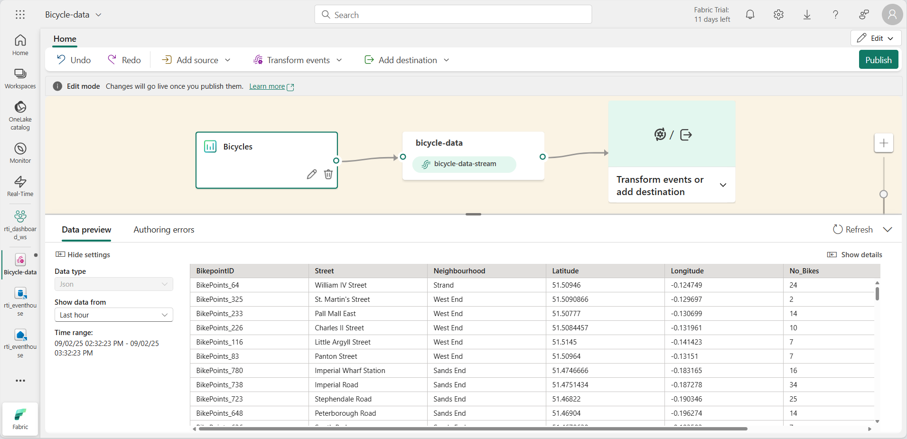
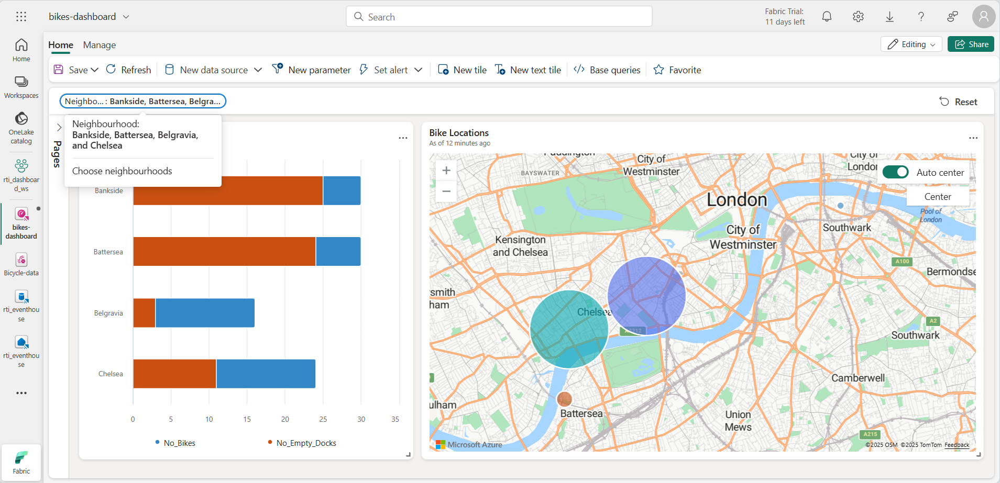

---
lab:
  title: Erste Schritte mit Echtzeit-Dashboards in Microsoft Fabric
  module: Get started with Real-Time Dashboards in Microsoft Fabric
---

# Erste Schritte mit Real-Time-Dashboards in Microsoft Fabric

Mithilfe von Echtzeit-Dashboards in Microsoft Fabric können Sie Streamingdaten mithilfe des Kusto-Abfragesprache (KQL) visualisieren und untersuchen.  In dieser Übung erfahren Sie, wie Sie ein Echtzeit-Dashboard auf der Grundlage einer Echtzeit-Datenquelle erstellen und verwenden.

Dieses Lab dauert ungefähr **25** Minuten.

> **Hinweis**: Sie benötigen einen [Microsoft Fabric-Tenant](https://learn.microsoft.com/fabric/get-started/fabric-trial), um diese Übung durchzuführen.

## Erstellen eines Arbeitsbereichs

Bevor Sie mit Daten in Fabric arbeiten, müssen Sie einen Arbeitsbereich mit aktivierter Fabric-Kapazität erstellen.

1. Navigieren Sie in einem Browser unter `https://app.fabric.microsoft.com/home?experience=fabric` zur [Microsoft Fabric-Startseite](https://app.fabric.microsoft.com/home?experience=fabric) und melden Sie sich mit Ihren Fabric-Anmeldeinformationen an.
1. Wählen Sie auf der Menüleiste auf der linken Seite **Arbeitsbereiche** aus (Symbol ähnelt &#128455;).
1. Erstellen Sie einen neuen Arbeitsbereich mit einem Namen Ihrer Wahl, und wählen Sie einen Lizenzierungsmodus mit Fabric-Kapazitäten aus (*Testversion*, *Premium* oder *Fabric*).
1. Wenn Ihr neuer Arbeitsbereich geöffnet wird, sollte er leer sein.

    

## Ein Eventhouse erstellen

Jetzt, da Sie einen Arbeitsbereich haben, können Sie mit der Erstellung der Stoffobjekte beginnen, die Sie für Ihre Real-Time Intelligence-Lösung benötigen. wir beginnen mit der Erstellung eines Eventhouses.

1. Wählen Sie in der Menüleiste auf der linken Seite **Erstellen** aus. Wählen Sie auf der Seite *Neu* unter dem Abschnitt *Real-Time-Inteligence* die Option **Eventhouse** aus. Wählen Sie einen eindeutigen Namen Ihrer Wahl aus.

    >**Hinweis**: Wenn die Option **Erstellen** nicht an die Seitenleiste angeheftet ist, müssen Sie zuerst die Ellipses-Option (**…**) auswählen.

1. Schließen Sie alle Tipps oder Aufforderungen, die angezeigt werden, bis Sie Ihr neues leeres Eventhouse sehen.

    

1. Beachten Sie im linken Bereich, dass Ihr Eventhouse eine KQL-Datenbank mit demselben Namen wie das Eventhouse enthält.
1. Wählen Sie die KQL-Datenbank aus, um sie anzuzeigen.

## Erstellen eines Ereignisstreams

Derzeit enthält die Datenbank keine Tabellen. Wir verwenden einen Eventstream, um Daten aus einer Echtzeitquelle in eine Tabelle zu laden.

1. Wählen Sie auf der Hauptseite Ihrer KQL-Datenbank **Daten abrufen**.
2. Wählen Sie für die Datenquelle **Eventstream** > **Neuer Eventstream**. Benennen Sie den Eventstream `Bicycle-data`.

    

    Die Erstellung Ihres neuen Eventstreams im Arbeitsbereich wird in wenigen Augenblicken abgeschlossen sein. Sobald Sie sich angemeldet haben, werden Sie automatisch weitergeleitet, um eine Datenquelle für Ihren Eventstream auszuwählen.

1. Wählen Sie **Beispieldaten verwenden** aus.
1. Geben Sie den Quellnamen `Bicycles` ein und wählen Sie die Beispieldaten **Fahrräder** aus.

    Ihr Stream wird gemappt und Sie werden automatisch auf dem **Eventstream-Canvas** angezeigt.

   

1. Wählen Sie in der Dropdown-Liste **Ziel hinzufügen** die Option **Eventhouse** aus.
1. Im Bereich **Eventhouse** konfigurieren Sie die folgenden Einrichtungsoptionen.
   - **Datenerfassungsmodus:**: Ereignisverarbeitung vor der Erfassung
   - **Zielname:**`bikes-table`
   - **Arbeitsbereich:***Wählen Sie den Arbeitsbereich, den Sie zu Beginn dieser Übung erstellt haben*
   - **Eventhouse**: *Wählen Sie Ihr Eventhouse*
   - **KQL-Datenbank:***Wählen Sie Ihre KQL-Datenbank*
   - **Zieltabelle:** Erstellen Sie eine neue Tabelle namens `bikes`
   - **Eingabe-Datenformat:** JSON

   

1. Wählen Sie im Bereich **Eventhouse** die Option **Speichern**. 
1. Verbinden Sie die Ausgabe des Knotens ** Fahrräder-Daten** mit dem Knoten ** Fahrräder-Tabelle** und wählen Sie dann **Veröffentlichen**.
1. Warten Sie etwa eine Minute, bis das Datenziel aktiv wird. Wählen Sie dann den Knoten **bikes-table** im Entwurfscanvas aus und sehen Sie sich den Bereich **Datenvorschau** darunter an, um die neuesten erfassten Daten zu sehen:

   

1. Warten Sie ein paar Minuten und verwenden Sie dann die Schaltfläche **Aktualisieren**, um den Bereich **Datenvorschau** zu aktualisieren. Der Stream läuft ununterbrochen, sodass der Tabelle möglicherweise neue Daten hinzugefügt wurden.

## Erstellen von Echtzeitdashboards

Jetzt, wo Sie einen Stream von Echtzeitdaten haben, der in eine Tabelle im Eventhouse geladen wird, können Sie ihn mit einem Echtzeit-Dashboard visualisieren.

1. Wählen Sie in der Menüleiste auf der linken Seite **Erstellen** aus. Wählen Sie auf der Seite *Neu* im Abschnitt *Echtzeitintelligenz* die Option **Echtzeitdashboard** aus, und geben Sie den Namen `bikes-dashboard` dafür ein.

    >**Hinweis**: Wenn die Option **Erstellen** nicht an die Seitenleiste angeheftet ist, müssen Sie zuerst die Ellipses-Option (**…**) auswählen. 

    Es wird ein neues leeres Dashboard erstellt.


    

1. Wählen Sie auf der Symbolleiste **Neue Datenquelle** und dann **Eventhouse/KQL-Datenbank** aus. Wählen Sie dann Ihr Eventhouse und erstellen Sie eine neue Datenquelle mit den folgenden Einstellungen:
    - **Anzeigename**: `Bike Rental Data`
    - **Datenbank**: *Die Standard-Datenbank in Ihrem Eventhouse*.
    - **Durchgangsidentität**: *Ausgewählt*

1. Wählen Sie **Hinzufügen**.
1. Wählen Sie auf der Dashboardentwurfscanvas die Option **Kachel hinzufügen** aus.
1. Stellen Sie im Abfrage-Editor sicher, dass die Quelle **Fahrradverleihdaten** ausgewählt ist und geben Sie den folgenden KQL-Code ein:

    ```kql
    bikes
        | where ingestion_time() between (ago(30min) .. now())
        | summarize latest_observation = arg_max(ingestion_time(), *) by Neighbourhood
        | project Neighbourhood, latest_observation, No_Bikes, No_Empty_Docks
        | order by Neighbourhood asc
    ```

1. Führen Sie die Abfrage aus, die die Anzahl der Fahrräder und leeren Fahrradstellplätze anzeigt, die in den letzten 30 Minuten in den einzelnen Stadtteilen beobachtet wurden.
1. Übernehmen Sie die Änderungen, um die Daten in einer Tabelle in der Kachel auf dem Dashboard anzuzeigen.

   

1. Wählen Sie auf der Kachel das Symbol **Bearbeiten** aus (das wie ein Bleistift aussieht). Legen Sie dann im Bereich **Visuelle Formatierung** die folgenden Eigenschaften fest:
    - **Kachelname**: Fahrräder und Docks
    - **Visueller Typ**: Balkendiagramm
    - **Visuelles Format**: Gestapeltes Balkendiagramm
    - **Y-Spalten**: No_Bikes, No-Empty_Docks
    - **X-Spalte**: Nachbarschaft
    - **Serienspalten**: ableiten
    - **Legende Standort**: Unten

    Ihre bearbeitete Zeit sollte wie folgt aussehen:

   

1. Übernehmen Sie die Änderungen und ändern Sie dann die Größe der Kachel so, dass sie die gesamte Höhe der linken Seite des Dashboards einnimmt.

1. Wählen Sie in der Symbolleiste **Neue Kachel**.
1. Stellen Sie im Abfrage-Editor sicher, dass die Quelle **Fahrradverleihdaten** ausgewählt ist und geben Sie den folgenden KQL-Code ein:

    ```kql
    bikes
        | where ingestion_time() between (ago(30min) .. now())
        | summarize latest_observation = arg_max(ingestion_time(), *) by Neighbourhood
        | project Neighbourhood, latest_observation, Latitude, Longitude, No_Bikes
        | order by Neighbourhood asc
    ```

1. Führen Sie die Abfrage aus, die den Standort und die Anzahl der Fahrräder anzeigt, die in den letzten 30 Minuten in den einzelnen Nachbarschaften beobachtet wurden.
1. Übernehmen Sie die Änderungen, um die Daten in einer Tabelle in der Kachel auf dem Dashboard anzuzeigen.
1. Wählen Sie auf der Kachel das Symbol **Bearbeiten** aus (das wie ein Bleistift aussieht). Legen Sie dann im Bereich **Visuelle Formatierung** die folgenden Eigenschaften fest:
    - **Kachelname**: Bike Locations
    - **Visueller Typ**: Karte
    - **Bestimmen Sie den Standort durch**: Breitengrad und Längengrad
    - **Breitengradspalte**: Breitengrad
    - **Längengradspalte**: Längengrad
    - **Bezeichnungsspalte**: Nachbarschaft
    - **Größe**: Anzeigen
    - **Spaltengröße**: No_Bikes

1. Übernehmen Sie die Änderungen und passen Sie dann die Größe der Kartenkachel so an, dass sie die rechte Seite des verfügbaren Platzes auf dem Dashboard ausfüllt:

   

## Erstellen einer Basisabfrage

Ihr Dashboard enthält zwei visuelle Darstellungen, die auf ähnlichen Abfragen beruhen. Um Doppelarbeit zu vermeiden und Ihr Dashboard pflegeleichter zu machen, können Sie die gemeinsamen Daten in einer einzigen *Basisabfrage* zusammenfassen.

1. Wählen Sie in der Symbolleiste des Dashboards **Basisabfragen**. Wählen Sie dann **+Hinzufügen** aus.
1. Setzen Sie im Editor der Basisabfrage den **Variablennamen** auf `base_bike_data` und stellen Sie sicher, dass die Quelle **Fahrradverleihdaten** ausgewählt ist. Geben Sie dann die folgende Abfrage ein:

    ```kql
    bikes
        | where ingestion_time() between (ago(30min) .. now())
        | summarize latest_observation = arg_max(ingestion_time(), *) by Neighbourhood
    ```
1. Führen Sie die Abfrage aus und überprüfen Sie, ob sie alle Spalten zurückgibt, die für die beiden visuellen Darstellungen im Dashboard (und einige andere) benötigt werden.

   

1. Wählen Sie **Fertig** und schließen Sie dann den Bereich **Basisabfragen**.
1. Bearbeiten Sie das Balkendiagramm **Fahrräder und Docks**, und ändern Sie die Abfrage in den folgenden Code:

    ```kql
    base_bike_data
    | project Neighbourhood, latest_observation, No_Bikes, No_Empty_Docks
    | order by Neighbourhood asc
    ```

1. Wenden Sie die Änderungen an, und überprüfen Sie, ob das Balkendiagramm noch Daten für alle Stadtteile anzeigt.

1. Bearbeiten Sie die Karte **Fahrradstandorte**, und ändern Sie die Abfrage in den folgenden Code:

    ```kql
    base_bike_data
    | project Neighbourhood, latest_observation, No_Bikes, Latitude, Longitude
    | order by Neighbourhood asc
    ```

1. Wenden Sie die Änderungen an und überprüfen Sie, ob die Karte noch Daten für alle Stadtteile anzeigt.

## Hinzufügen eines Parameters

Ihr Dashboard zeigt derzeit die neuesten Fahrrad-, Dock- und Standortdaten für alle Stadtteile an. Fügen Sie nun einen Parameter hinzu, damit Sie einen bestimmten Stadtteil auswählen können.

1. Wählen Sie in der Symbolleiste des Dashboards auf der Registerkarte **Verwalten** die Option **Parameter**.
1. Beachten Sie alle vorhandenen Parameter, die automatisch erstellt wurden (zum Beispiel einen *Zeitbereich*-Parameter). Dann **Löschen** Sie sie.
1. Wählen Sie **+ Hinzufügen**.
1. Fügen Sie einen Parameter mit den folgenden Einstellungen hinzu:
    - **Bezeichnung:** `Neighbourhood`
    - **Parametertyp**: Mehrfachauswahl
    - **Beschreibung:** `Choose neighbourhoods`
    - **Variablenname**: `selected_neighbourhoods`
    - **Datentyp**: Zeichenfolge
    - **Auf Seiten anzeigen**: Alle auswählen
    - **Quelle**: Abfrage
    - **Datenquelle**: Fahrradverleih-Daten
    - **Abfrage bearbeiten**

        ```kql
        bikes
        | distinct Neighbourhood
        | order by Neighbourhood asc
        ```

    - **Wertspalte**: Nachbarschaft
    - **Beschriftungsspalte**: Übereinstimmung der Wertauswahl
    - **Den Wert „Alles auswählen“ hinzufügen**: *Ausgewählt*
    - **„Alles auswählen“ sendet leere Zeichenfolge**: *Ausgewählt*
    - **Automatisches Zurücksetzen auf Standardwert**: Ausgewählt
    - **Standardwert**: Alle auswählen

1. Wählen Sie **Fertig** aus, um den Parameter zu erstellen.

    Jetzt, da Sie einen Parameter hinzugefügt haben, müssen Sie die Basisabfrage ändern, um die Daten nach den ausgewählten Stadtteilen zu filtern.

1. Wählen Sie in der Symbolleiste **Basisabfragen**. Wählen Sie dann die Abfrage **base_bike_data** aus und bearbeiten Sie sie, um der **where**-Klausel eine **and**-Bedingung hinzuzufügen, um auf der Grundlage der ausgewählten Parameterwerte zu filtern, wie im folgenden Code gezeigt:

    ```kql
    bikes
        | where ingestion_time() between (ago(30min) .. now())
          and (isempty(['selected_neighbourhoods']) or Neighbourhood  in (['selected_neighbourhoods']))
        | summarize latest_observation = arg_max(ingestion_time(), *) by Neighbourhood
    ```

1. Wählen Sie **Fertig**, um die Basisabfrage zu speichern.

1. Verwenden Sie auf dem Dashboard den Parameter **Stadtteil**, um die Daten auf der Grundlage der von Ihnen ausgewählten Stadtteile zu filtern.

   

1. Wählen Sie **Zurücksetzen**, um die ausgewählten Parameterfilter zu entfernen.

## Seite hinzufügen

Ihr Dashboard besteht derzeit aus einer einzigen Seite. Sie können weitere Seiten hinzufügen, um mehr Daten bereitzustellen.

1. Erweitern Sie auf der linken Seite des Dashboards den Bereich **Seiten**, und wählen Sie **+ Seite hinzufügen**.
1. Nennen Sie die neue Seite **Seite 2**. Wählen Sie sie dann aus.
1. Wählen Sie auf der neuen Seite **+ Kachel hinzufügen**
1. Geben Sie im Abfrage-Editor für die neue Kachel die folgende Abfrage ein:

    ```kql
    base_bike_data
    | project Neighbourhood, latest_observation
    | order by latest_observation desc
    ```

1. Wenden Sie die Änderungen an. Ändern Sie dann die Größe der Kachel so, dass sie die Höhe des Dashboards ausfüllt.

   

## Automatische Aktualisierung konfigurieren

Sie können das Dashboard manuell aktualisieren, aber es kann sinnvoll sein, die Daten in einem bestimmten Intervall automatisch zu aktualisieren.

1. Wählen Sie auf der Symbolleiste des Dashboards auf der Registerkarte **Verwalten** die Option **Automatisch aktualisieren** aus.
1. Konfigurieren Sie im Bereich **Automatische Aktualisierung** die folgenden Einstellungen:
    - **Aktiviert**: *Ausgewählt*
    - **Minimalzeitintervall**: Alle Aktualisierungsintervalle zulassen
    - **Standard-Aktualisierungsrate**: 30 Minuten
1. Übernehmen Sie die Einstellungen für die automatische Aktualisierung.

## Speichern und teilen des Dashboards

Jetzt haben Sie ein nützliches Dashboard, das Sie speichern und mit anderen Benutzern teilen können.

1. Wählen Sie in der Symbolleiste des Dashboards **Speichern**.
1. Wenn das Dashboard gespeichert ist, wählen Sie **Freigeben**.
1. Wählen Sie im Dialogfeld **Freigeben** die Option **Link kopieren** aus und kopieren Sie den Link zum Dashboard in die Zwischenablage.
1. Öffnen Sie eine neue Browser-Registerkarte und fügen Sie den kopierten Link ein, um zum gemeinsamen Dashboard zu navigieren. Melden Sie sich erneut mit Ihren Fabric-Anmeldedaten an, wenn Sie dazu aufgefordert werden.
1. Erkunden Sie das Dashboard und sehen Sie sich die neuesten Informationen über Fahrräder und leere Fahrradstellplätze in der Stadt an.

## Bereinigen von Ressourcen

Wenn Sie Ihr Dashboard fertig erforscht haben, können Sie den Arbeitsbereich, den Sie für diese Übung erstellt haben, löschen.

1. Wählen Sie auf der Leiste auf der linken Seite das **Symbol** für Ihren Arbeitsbereich aus.
2. Wählen Sie in der Symbolleiste **Arbeitsbereichseinstellungen**.
3. Wählen Sie im Abschnitt **Allgemein** die Option **Diesen Arbeitsbereich entfernen** aus.
