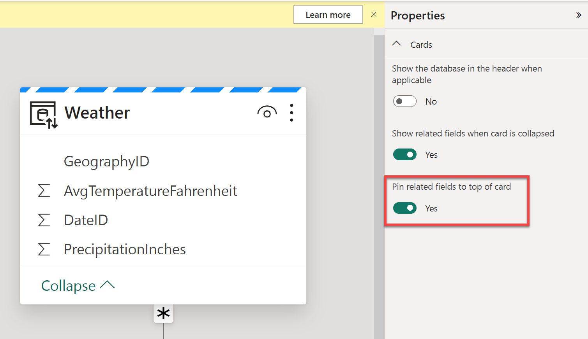

---
lab:
  title: Erstellen und Untersuchen eines Semantikmodells
  module: Understand scalability in Power BI
---

# Erstellen und Untersuchen eines Semantikmodells

In dieser Übung verwenden Sie Microsoft Fabric, um ein Datenmodell für die Ny Taxi-Beispieldaten in einem Data Warehouse zu entwickeln.

Sie üben Folgendes:

- Erstellen eines benutzerdefinierten Semantikmodells aus einem Fabric-Data Warehouse
- Erstellen von Beziehungen und Organisieren des Modelldiagramms
- Untersuchen der Daten in Ihrem Semantikmodell direkt in Fabric

Dieses Lab dauert ungefähr **30** Minuten.

> **Hinweis:** Sie benötigen eine [Microsoft Fabric-Testversion](https://learn.microsoft.com/fabric/get-started/fabric-trial), um diese Übung durchführen zu können.

## Erstellen eines Arbeitsbereichs

Erstellen Sie vor dem Arbeiten mit Daten in Fabric einen Arbeitsbereich mit aktivierter Fabric-Testversion.

1. Navigieren Sie in einem Browser unter `https://app.fabric.microsoft.com/home?experience=fabric` zur [Microsoft Fabric-Startseite](https://app.fabric.microsoft.com/home?experience=fabric) und melden Sie sich mit Ihren Fabric-Anmeldeinformationen an.
1. Wählen Sie auf der Menüleiste auf der linken Seite **Arbeitsbereiche** aus (Symbol ähnelt &#128455;).
1. Erstellen Sie einen neuen Arbeitsbereich mit einem Namen Ihrer Wahl, und wählen Sie einen Lizenzierungsmodus mit Fabric-Kapazitäten aus (*Testversion*, *Premium* oder *Fabric*).
1. Wenn Ihr neuer Arbeitsbereich geöffnet wird, sollte er leer sein.

## Erstellen eines Data Warehouse und Laden von Beispieldaten

Da Sie nun einen Arbeitsbereich besitzen, ist es an der Zeit, ein Data Warehouse zu erstellen:

1. Wählen Sie in der Menüleiste auf der linken Seite **Erstellen** aus. Wählen Sie auf der Seite *Neu* unter dem Abschnitt *Data Warehouse* die Option **Warehouse**. Wählen Sie einen eindeutigen Namen Ihrer Wahl aus.

    >**Hinweis**: Wenn die Option **Erstellen** nicht an die Seitenleiste angeheftet ist, müssen Sie zuerst die Ellipses-Option (**…**) auswählen.

    Nach einer Minute wird ein neues Warehouse erstellt:
    
    

1. In der Mitte der Data Warehouse-Benutzeroberfläche werden verschiedene Möglichkeiten zum Laden von Daten in Ihr Warehouse angezeigt. Wählen Sie **Beispieldaten** aus, um NYC Taxi-Daten in Ihr Data Warehouse zu laden. Dies dauert einige Minuten.

1. Nachdem Ihre Beispieldaten geladen wurden, verwenden Sie den Bereich **Explorer** auf der linken Seite, um zu sehen, welche Tabellen und Ansichten bereits im Beispiel-Data Warehouse vorhanden sind.

1. Wählen Sie auf dem Menüband die Registerkarte **Berichterstellung** und dann **Neues Semantikmodell** aus. Auf diese Weise können Sie ein neues Semantikmodell nur mit bestimmten Tabellen und Ansichten aus Ihrem Data Warehouse erstellen, das von Datenteams und vom Unternehmen zum Erstellen von Berichten verwendet werden kann.

1. Geben Sie dem Semantikmodell den Namen **Taxi Revenue**, stellen Sie sicher, dass es sich im soeben erstellten Arbeitsbereich befindet, und wählen Sie die folgenden Tabellen aus:
   - Datum
   - Reise
   - Geografie
   - Weather
     
   
     
## Erstellen von Beziehungen zwischen Tabellen

Jetzt erstellen Sie Beziehungen zwischen den Tabellen, um Ihre Daten genau zu analysieren und zu visualisieren. Wenn Sie sich mit dem Erstellen von Beziehungen in Power BI-Desktop auskennen, sieht dies vertraut aus.

1. Navigieren Sie zurück zu Ihrem Arbeitsbereich, und vergewissern Sie sich, dass Ihr neues Semantikmodell „Taxi Revenue“ angezeigt wird. Beachten Sie, dass der Elementtyp **Semantikmodell** ist, im Gegensatz zu **Semantikmodell (Standard)**, das beim Erstellen eines Data Warehouse automatisch erstellt wird.

     *Hinweis: Ein Standardsemantikmodell wird automatisch erstellt, wenn Sie einen Warehouse- oder SQL-Analyse-Endpunkt in Microsoft Fabric erstellen, und es erbt die Geschäftslogik vom übergeordneten Lakehouse oder Warehouse. Ein Semantikmodell, das Sie selbst erstellen (wie wir es hier getan haben), ist ein benutzerdefiniertes Modell, das Sie gemäß Ihren spezifischen Anforderungen und Präferenzen entwerfen und ändern können. Sie können ein benutzerdefiniertes Semantikmodell erstellen, indem Sie Power BI Desktop, den Power BI-Dienst oder andere Tools verwenden, die eine Verbindung mit Microsoft Fabric herstellen.*

1. Wählen Sie auf dem Menüband **Datenmodell öffnen** aus.

    Nun erstellen Sie Beziehungen zwischen den Tabellen. Wenn Sie sich mit dem Erstellen von Beziehungen in Power BI-Desktop auskennen, sieht dies vertraut aus.

    *Nach dem Konzept des Sternschemas unterteilen wir die Tabellen in unserem Modell in eine Faktentabelle und Dimensionstabellen. In diesem Modell ist die Tabelle **Trip** unsere Faktentabelle, und unsere Dimensionen sind **Date**, **Geography** und **Weather**.*

1. Erstellen Sie mithilfe der Spalte **DateID** eine Beziehung zwischen der Tabelle **Date** und der Tabelle **Trip**.

    **Wählen Sie die Spalte „DateID“** in der Tabelle **Date** aus, und *ziehen Sie sie auf die Spalte „DateID“ in der Tabelle „Trip“, und legen Sie sie dort ab*.

    Stellen Sie sicher, dass die Beziehung zwischen der Tabelle **Date** und der Tabelle **Trip** eine Beziehung vom Typ **1:n** ist.

1. Erstellen Sie zwei weitere Beziehungen zur **Trip**-Faktentabelle wie folgt:

   - **Geography [GeographyID]** zu **Trip [DropoffGeographyID]** (1:Viele)
   - **Weather [GeographyID]** zuo **Trip [DropoffGeographyID]** (1:Viele)

    > **Hinweis**: Sie müssen die Standardkardinalität der Beziehung für beide Beziehungen in **1:Viele** ändern.

1. Ziehen Sie die Tabellen an die entsprechende Position, sodass sich die Faktentabelle **Trip** am unteren Rand des Diagramms befindet und die verbleibenden Tabellen (d. h. die Dimensionstabellen) um die Faktentabelle herum angeordnet sind.

    

    *Die Erstellung des Sternschemamodells ist jetzt abgeschlossen. Es gibt viele Modellierungskonfigurationen, die jetzt angewendet werden können, z. B. Hinzufügen von Hierarchien, Berechnungen und Festlegen von Eigenschaften wie Spaltensichtbarkeit.*

    > **Tipp**: Schalten Sie im Eigenschaftenbereich des Fensters *Zugehörige Felder am Anfang der Karte anheften* auf „Ja“ um. So können Sie (und andere Personen, die Berichte auf der Grundlage dieses Modells erstellen) auf einen Blick erkennen, welche Felder in Beziehungen verwendet werden. Sie können auch mithilfe des Eigenschaftenbereichs mit den Feldern in Ihren Tabellen interagieren. Wenn Sie beispielsweise überprüfen möchten, ob Datentypen ordnungsgemäß festgelegt sind, können Sie ein Feld auswählen und das Format im Eigenschaftenbereich überprüfen.

     

## Untersuchen Ihrer Daten

Sie verfügen jetzt über ein Semantikmodell, das anhand Ihres Warehouse erstellt wurde und für das Beziehungen eingerichtet wurden, die für die Berichterstellung erforderlich sind. Sehen Sie sich die Daten mithilfe des Features **Daten durchsuchen** an.

1. Navigieren Sie zurück zu Ihrem Arbeitsbereich, und wählen Sie Ihr **Semantikmodell „Taxi Revenue“** aus.

1. Wählen Sie im Fenster auf dem Menüband **Diese Daten durchsuchen** aus. Hier sehen Sie sich Ihre Daten im Tabellenformat an. So können Sie Ihre Daten gezielt untersuchen, ohne einen vollständigen Power BI-Bericht zu erstellen.

1. Fügen Sie **YearName** und **MonthName** zu den Zeilen hinzu, und untersuchen Sie die **durchschnittliche Anzahl der Fahrgäste** (average number of passengers), die **durchschnittliche Anzahl von Fahrten** (average trip amount) und die **durchschnittliche Fahrtdauer** (average trip duration) im Feld „Werte“.

    *Wenn Sie ein numerisches Feld in den Bereich „Untersuchen“ ziehen und dort ablegen, wird standardmäßig die Zahl zusammengefasst. Wenn Sie die Aggregation von **Zusammenfassen** in **Durchschnitt** ändern möchten, wählen Sie das Feld aus, und ändern Sie die Aggregation im Popupfenster.*

    

1. Wenn Sie diese Daten nicht nur als Matrix, sondern als Visual betrachten möchten, wählen Sie unten im Fenster **Visual** aus. Wählen Sie ein Balkendiagramm aus, um diese Daten schnell zu visualisieren.

   *Ein Balkendiagramm ist nicht die beste Möglichkeit zum Anzeigen dieser Daten. Experimentieren Sie im Abschnitt „Daten neu anordnen“ des Bereichs „Daten“ auf der rechten Bildschirmseite mit den verschiedenen Visuals und den angezeigten Feldern.*

1. Sie können diese Ansicht zur Datenuntersuchung jetzt in Ihrem Arbeitsbereich speichern, indem Sie in der oberen linken Ecke auf die Schaltfläche **Speichern** klicken. Sie haben auch die Möglichkeit, die Ansicht **freizugeben**, indem Sie in der oberen rechten Ecke **Freigeben** auswählen. Auf diese Weise können Sie die Datenuntersuchung mit Kollegen teilen.

1. Nachdem Sie Ihre Untersuchung gespeichert haben, navigieren Sie zurück zu Ihrem Arbeitsbereich, um Ihr Data Warehouse, das Standardsemantikmodell, das von Ihnen erstellte Semantikmodell und Ihre Untersuchung anzuzeigen.

    
