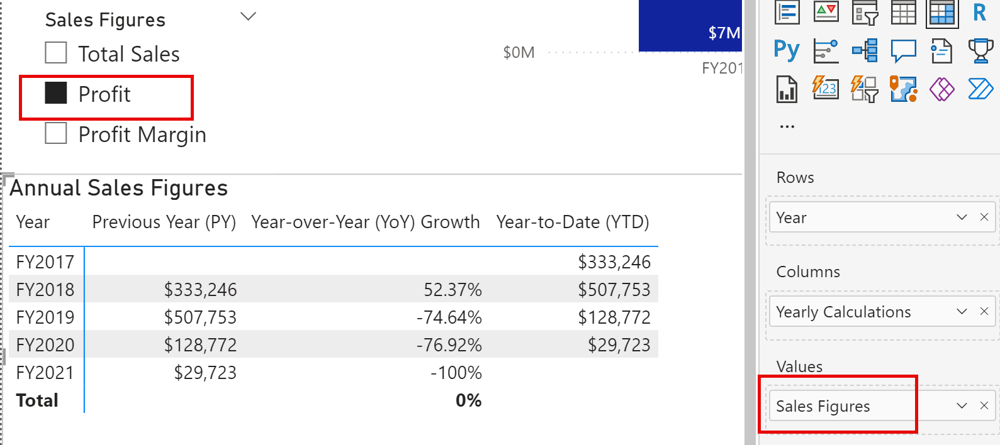

---
lab:
  title: Design skalierbarer semantischer Modelle
  module: Design scalable semantic models
---

# Design skalierbarer semantischer Modelle

In dieser Übung werden Sie mit DAX-Funktionen arbeiten, um die Flexibilität und Effizienz von Datenmodellen zu erhöhen, insbesondere durch Funktionen wie Berechnungsgruppen und Feldparameter. Wenn Sie diese Funktionen zusammen verwenden, können Sie interaktive Berichte erstellen, ohne dass mehrere visuelle Darstellungen oder komplexe DAX-Ausdrücke erforderlich sind, und so äußerst flexible und skalierbare semantische Modelle erstellen.

In dieser Übung lernen Sie Folgendes:

- Verwenden Sie DAX-Funktionen, um das Verhalten von Beziehungen zu ändern.
- Erstellen Sie Berechnungsgruppen und wenden Sie diese in dynamischen Zeitintelligenzberechnungen an.
- Erstellen Sie Feldparameter zur dynamischen Auswahl und Anzeige verschiedener Felder und Kennzahlen.

Dieses Lab dauert ungefähr **30** Minuten.

## Vor der Installation

1. Laden Sie die [Verkaufsanalyse-Starterdatei](https://github.com/MicrosoftLearning/mslearn-fabric/raw/main/Allfiles/Labs/15/15-scalable-semantic-models.zip) von `https://github.com/MicrosoftLearning/mslearn-fabric/raw/main/Allfiles/Labs/15/15-scalable-semantic-models.zip` herunter und speichern Sie sie lokal.

2. Extrahieren Sie den Ordner in den Ordner **C:\Users\Student\Downloads\15-scalable-semantic-models**.

3. Öffnen Sie die Datei **15-Starter-Sales Analysis.pbix**.

    > Ignorieren und schließen Sie alle Warnungen, die Sie auffordern, die Änderungen zu übernehmen - wählen Sie nicht *Änderungen verwerfen*.

## Arbeiten mit Beziehungen

In dieser Aufgabe werden Sie eine vorentwickelte Power BI Desktop-Lösung öffnen, um das Datenmodell kennenzulernen. Anschließend erkunden Sie das Verhalten aktiver Modellbeziehungen.

1. Auf dem Power BI Desktop links wechseln Sie zur Ansicht **Modell**.

    

2. Verwenden Sie das Modelldiagramm, um den Modellentwurf zu überprüfen.

    

3. Beachten Sie, dass es drei Beziehungen zwischen den Tabellen **Datum** und **Vertrieb** gibt.

    

    > Die Spalte **Datum** in der Tabelle **Datum** ist eine eindeutige Spalte, die die „eine“ Seite der Beziehungen darstellt. Filter, die auf eine beliebige Spalte der Tabelle **Datum** angewendet werden, werden über eine der Beziehungen auf die Tabelle **Umsätze** übertragen.*

4. Zeigen Sie mit dem Mauszeiger auf die drei Beziehungen, um die "viele"-Seitenspalte in der Tabelle **Vertrieb** hervorzuheben.

5. Beachten Sie, dass die Beziehung zwischen **Date** und **OrderDate** aktiv ist. Der aktuelle Modellentwurf zeigt, dass die Tabelle **Datum** eine Dimension mit unterschiedlichen Rollen ist. Diese Dimension kann die Rolle des Bestelldatums, des Fälligkeitsdatums oder des Versanddatums spielen. Welche Rolle hängt von den analytischen Anforderungen des Berichts ab.

> Wir werden später DAX verwenden, um diese inaktiven Beziehungen zu nutzen, ohne eine weitere Tabelle zu erstellen, nur um zwei aktive Beziehungen für verschiedene Datumsspalten zu erhalten.

### Visualisieren von Umsatzdaten nach Datum

In dieser Aufgabe visualisieren Sie den Gesamtumsatz nach Jahr und verwenden inaktive Beziehungen.

1. Wechseln Sie zur **Berichtansicht**.

    

2. Um ein Tabellendiagramm hinzuzufügen wählen Sie im Bereich **Visualisierungen** das visuelle Symbol **Tabelle**.

    

3. Um der visuellen Tabelle Spalten hinzuzufügen, erweitern Sie zuerst im **Datenbereich** (rechts) die Tabelle **Datum**.

4. Ziehen Sie die Spalte **Jahr** und legen Sie sie in der Tabelle Visual ab.

5. Erweitern Sie die Tabelle **Umsätze** und ziehen Sie dann die Spalte **Gesamtumsatz** in die Tabelle Visual.

6. Überprüfen Sie die visuelle Tabelle.


> Die Tabelle Visual zeigt die Summe der Spalte **Gesamtumsatz**, gruppiert nach Jahr. Aber was bedeutet **Jahr**? Da eine aktive Beziehung zwischen den Tabellen **Datum** und **Umsatz** und der Spalte **Bestelldatum** besteht, bedeutet **Jahr** das Geschäftsjahr, in dem die Bestellungen getätigt wurden.

### Verwenden inaktiver Beziehungen

In dieser Aufgabe werden Sie die Funktion `USERELATIONSHIP` verwenden, um eine inaktive Beziehung zu aktivieren.

1. Klicken Sie im Bereich **Daten** mit der rechten Maustaste auf die Tabelle **Vertrieb**, und wählen Sie dann die Option **Neues Measure** aus.

    

2. Ersetzen Sie den Text in der Formelleiste (unter der Registerkarte) mit der folgenden Measure-Definition und drücken Sie dann die **Eingabetaste**.

    ```DAX
    Sales Shipped =
    CALCULATE (
    SUM ('Sales'[Sales]),
    USERELATIONSHIP('Date'[Date], 'Sales'[ShipDate])
    )
    ```

    > Diese Formel verwendet die Funktion CALCULATE, um den Filterkontext zu ändern. Es ist die Funktion USERELATIONSHIP, die die Beziehung **ShipDate** nur für diese Maßnahme aktiv macht.

3. Fügen Sie das Meaure**Sales Shipped** zum Tabellenvisual hinzu.

4. Ändern Sie die Größe des Tabellenvisuals, sodass alle Spalten angezeigt werden. Beachten Sie, dass die Zeile **Gesamt** die gleiche ist, aber der Umsatzbetrag für jedes Jahr in **Gesamtumsatz** und **Versandter Umsatz** unterschiedlich ist. Diese Differenz ist darauf zurückzuführen, dass die Aufträge in einem bestimmten Jahr eingehen, aber erst im darauf folgenden Jahr ausgeliefert werden oder noch gar nicht ausgeliefert sind.


> Eine Möglichkeit, mit Rollenspieldimensionen zu arbeiten, ist die Erstellung von Maßnahmen, die Beziehungen vorübergehend als aktiv kennzeichnen. Es kann jedoch mühsam werden, wenn man für viele Maßnahmen Rollenspielversionen erstellen muss. Wenn es beispielsweise 10 verkaufsbezogene Maßnahmen und drei Termine für Rollenspiele gibt, könnte dies bedeuten, dass 30 Maßnahmen erstellt werden. Das Erstellen mit Berechnungsgruppen erleichtert den Prozess.

## Erstellen von Berechnungsgruppen

In dieser Aufgabe erstellen Sie eine Berechnungsgruppe für die Zeitintelligenzanalyse.

1. Wechseln Sie zur Ansicht**Modell**.

2. Wählen Sie in der Modellansicht **Berechnungsgruppe** aus, um eine neue Berechnungsgruppentabelle, eine Gruppenspalte und ein Element zu erstellen. Wenn ein Warnfenster erscheint, wählen Sie **Ja**, um die Erstellung der Berechnungsgruppe zu bestätigen.

   

    > Hinweis: Eine implizite Maßnahme liegt vor, wenn Sie in der Berichtsansicht eine Datenspalte aus dem Datenbereich direkt im Visual verwenden. Sie können das Visual als SUM, AVERAGE, MIN, MAX oder eine andere einfache Aggregation aggregieren, die zu einem impliziten Measure wird. Sobald Sie eine Berechnungsgruppe erstellt haben, erstellt Power BI Desktop keine impliziten Kennzahlen mehr, d. h. Sie müssen Kennzahlen explizit erstellen, um Datenspalten zu aggregieren.

3. Benennen Sie die Berechnungsgruppe in *Zeitberechnungen* und die Berechnungsspalte in *Jahresberechnungen* um.

4. Wählen Sie auf der Registerkarte **Modell** des Fensters **Daten** das automatisch mit Ihrer Berechnungsgruppe erstellte Berechnungselement aus.

5. Ersetzen Sie die Formel des Artikels durch die folgende und bestätigen Sie sie:

    ```DAX
   Year-to-Date (YTD) = CALCULATE(SELECTEDMEASURE(), DATESYTD('Date'[Date]))
    ```

6. Klicken Sie mit der rechten Maustaste auf das Feld **Berechnungselemente** und wählen Sie **Neues Berechnungselement**.

7. Verwenden Sie die folgende DAX-Formel für das neue Element:

    ```DAX
   Previous Year (PY) = CALCULATE(SELECTEDMEASURE(), PREVIOUSYEAR('Date'[Date]))
    ```

8. Erstellen Sie ein drittes Element mit der folgenden DAX-Formel:

    ```DAX
   Year-over-Year (YoY) Growth = 
   VAR MeasurePriorYear =
   CALCULATE(
       SELECTEDMEASURE(),
       SAMEPERIODLASTYEAR('Date'[Date])
   )
   RETURN
   DIVIDE(
       (SELECTEDMEASURE() - MeasurePriorYear),
       MeasurePriorYear
   )
    ```

Das letzte Berechnungselement sollte nur prozentuale Werte liefern und benötigt daher eine dynamische Formatzeichenfolge, um das Format der betroffenen Kennzahlen zu ändern.

9. Aktivieren Sie im Bereich **Eigenschaften** des Elements YoY die Funktion **Dynamische Formatzeichenfolge**.

10. Vergewissern Sie sich in der DAX-Formelleiste, dass das Feld links daneben als **Format** eingestellt ist, und schreiben Sie die folgende Formatzeichenfolge: `"0.##%"`

11. Stellen Sie sicher, dass Ihre Berechnungsgruppe wie folgt aussieht:

    

### Anwenden einer Berechnungsgruppe auf Kennzahlen

In dieser Aufgabe visualisieren Sie, wie sich die Berechnungspositionen auf die Kennzahlen in einem Visual auswirken.

1. Wechseln Sie zur **Berichtansicht**.

2. Wählen Sie am unteren Rand des Canvas die Registerkarte **Übersicht**.

3. Wählen Sie die bereits im Canvas erstellte Matrixdarstellung aus und ziehen Sie die **Jahresberechnungen**-Berechnungsspalte aus dem Bereich **Daten** in das Feld **Spalten** im Bereich **Visualisierungen**.

    

4. Beachten Sie, dass die Matrix jetzt eine Reihe von Verkaufszahlen für jeden Berechnungsartikel enthält. 

   

> Die gleichzeitige Darstellung all dieser Informationen in einem Visual kann schwer zu lesen sein, daher wäre es praktisch, das Visual auf jeweils eine Verkaufszahl zu beschränken. Dazu können wir einen Feldparameter verwenden.

## Erstellen von Feldparametern

In dieser Aufgabe erstellen Sie Feldparameter, um Visuals zu ändern.

1. Wählen Sie die Registerkarte **Modellierung** in der oberen Multifunktionsleiste aus, klappen Sie dann die Schaltfläche **Neuer Parameter** auf und wählen Sie **Felder** aus.

    

2. Benennen Sie den Parameter im Fenster Parameter in **Umsatzzahlen** um, stellen Sie sicher, dass die Option **Slicer zu dieser Seite hinzufügen** aktiviert ist, und fügen Sie die folgenden Felder aus der Tabelle **Umsätze** hinzu:

   - Gesamtumsatz
   - „Profit“ (Gewinn)
   - Profit Margin
   - Aufträge

    

3. Klicken Sie auf **Erstellen**.

4. Sobald der Slicer erstellt ist, können Sie die Matrix auswählen und alle Felder aus **Werte** im Bereich Visualisierungen entfernen und stattdessen den Feldparameter Umsatzzahlen hinzufügen.

    

5. Überprüfen Sie die verschiedenen Umsatzzahlen im Slicer und wie sich die Matrix ändert, wenn eine davon ausgewählt wird.

6. Sehen Sie sich an, wie das Feld Gewinn mit dem Slicer für den Feldparameter Umsatzzahlen ausgewählt wird. Es handelt sich um dieselbe Matrix wie oben, d. h. Sie sehen die drei Berechnungspositionen (PY, YoY, YTD), die jedoch aufgrund des Slicers nur auf den Gewinn angewendet werden.

    

### Bearbeiten eines Feldparameters

In dieser Aufgabe werden Sie den Parameter des Feldes **Umsatzzahlen** bearbeiten, indem Sie seinen DAX-Ausdruck direkt ändern.

1. Wählen Sie die Registerkarte **Leistung der Vertriebsmitarbeitenden** am unteren Rand des Canvas. Beachten Sie das Balkendiagramm (gruppiert), um das Diagramm zwischen Umsatz nach Monat und Ziel nach Monat umzuschalten.

    > Beim Erstellen der Textmarken-Schaltflächen können Sie den Visualtyp mit jeder Option ändern, wenn Sie zwischen vielen Measures wechseln müssen, müssen Sie für jede schaltfläche eine Textmarke erstellen und dies kann sehr zeitaufwändig sein. Stattdessen können wir einen Feldparameter mit allen Kennzahlen, die wir analysieren wollen, verwenden und schnell zwischen ihnen wechseln.

    

2. Wählen Sie das Balkendiagramm-Visual aus und ersetzen Sie das Feld **Gesamtumsatz** in **X-Achse** durch den Feldparameter **Umsatzzahlen**.

3. Erstellen Sie ein **Slicer**-Visual und ziehen Sie den Parameter **Umsatzzahlen** in den Bereich **Feld**.

Für dieses Visual müssen Sie noch das Ziel nach Monat auswerten, das nicht im Feldparameter enthalten ist.

4. Wählen Sie den Parameter **Umsatzzahlen** im Datenbereich aus und fügen Sie das Feld „Ziel“ in den DAX-Ausdruck des Parameters ein (siehe unten):

    ```DAX
   Sales Figures = {
    ("Total Sales", NAMEOF('Sales'[Total Sales]), 0),
    ("Profit", NAMEOF('Sales'[Profit]), 1),
    ("Profit Margin", NAMEOF('Sales'[Profit Margin]), 2),
    ("Orders", NAMEOF('Sales'[Orders]), 3),
    ("Target", NAMEOF('Targets'[Target]), 4)
   }
    ```

5. Bestätigen Sie die Änderungen und überprüfen Sie, ob sich das Visual ändert, wenn Sie die verschiedenen Umsatzzahlen auswählen.

6. Löschen Sie die Textmarken-Schaltflächen, und beobachten Sie den endgültigen Zustand der Berichtsseite.

    

## Lab abgeschlossen

Um die Übung abzuschließen, schließen Sie Power BI Desktop, ohne die Datei zu speichern.
