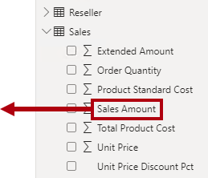
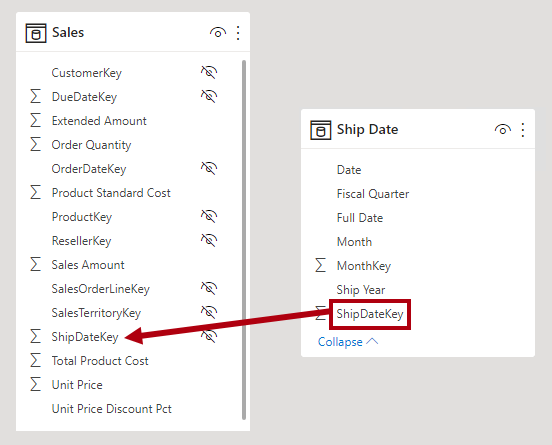
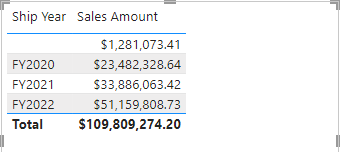
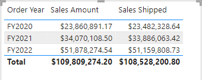
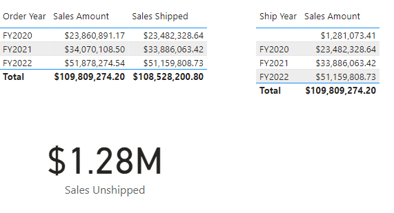

---
lab:
  title: Arbeiten mit Modellbeziehungen
  module: Design and build tabular models
---

# Arbeiten mit Modellbeziehungen

In dieser Übung arbeiten Sie mit Modellbeziehungen, um die Anforderungen für Dimensionen mit unterschiedlichen Rollen zu erfüllen. Dabei arbeiten Sie mit aktiven und inaktiven Beziehungen sowie mit Data Analysis Expressions (DAX)-Funktionen, die das Verhalten von Beziehungen verändern.

In dieser Übung lernen Sie Folgendes:

- Interpretieren von Beziehungseigenschaften im Modelldiagramm.
- Festlegen der Beziehungseigenschaften.
- Verwenden von DAX-Funktionen, die das Beziehungsverhalten ändern.

Dieses Lab dauert ungefähr **45** Minuten.

> **Hinweis:** Sie benötigen eine [Microsoft Fabric-Testversion](https://learn.microsoft.com/fabric/get-started/fabric-trial), um diese Übung durchführen zu können.

## Erkunden von Modellbeziehungen

In dieser Übung öffnen Sie eine vordefinierte Power BI Desktop-Lösung, um mehr über das Datenmodell zu erfahren. Anschließend erkunden Sie das Verhalten aktiver Modellbeziehungen.

### Herunterladen der Starterdatei

1. Laden Sie die [Verkaufsanalyse-Starterdatei](https://aka.ms/fabric-relationships-starter) aus `https://aka.ms/fabric-relationships-starter` herunter, und speichern Sie sie auf Ihrem lokalen Computer (in einem beliebigen Ordner).

1. Navigieren Sie zu der heruntergeladenen Datei, und öffnen Sie sie in Power BI Desktop.
    >Hinweis: Ignorieren und schließen Sie die Warnung, in der Sie aufgefordert werden, Änderungen anzuwenden.

### Überprüfen Sie das Datenmodell

1. Auf dem Power BI Desktop wechseln Sie zur Ansicht **Modell**.

    
2. Verwenden Sie das Modelldiagramm, um den Modellentwurf zu überprüfen.

    

    *Das Modell besteht aus sechs Dimensionstabellen und einer Faktentabelle. In der Tabelle **Vertrieb** werden die Verkaufsauftragsdetails gespeichert. Es ist ein klassisches Starschema-Design.*

3. Beachten Sie, dass es drei Beziehungen zwischen den Tabellen **Datum** und **Vertrieb** gibt.

    

    *Die Spalte **DateKey** in der Tabelle **Datum** ist eine eindeutige Spalte, die die eine Seite der Beziehungen darstellt. Filter, die auf irgendeine Spalte der Tabelle **Datum** angewendet werden, übertragen auf die Tabelle **Vertrieb** mithilfe einer der Beziehungen.*

4. Zeigen Sie mit dem Mauszeiger auf die drei Beziehungen, um die "viele"-Seitenspalte in der Tabelle **Vertrieb** hervorzuheben.

5. Beachten Sie, dass die Beziehung zur Spalte **OrderDateKey** eine durchgezogene Linie ist, während die anderen Beziehungen durch eine gepunktete Linie dargestellt werden.

    *Eine durchgezogene Linie stellt eine aktive Beziehung dar. Es kann nur ein aktiver Beziehungspfad zwischen zwei Modelltabellen vorhanden sein, und der Pfad wird standardmäßig verwendet, um Filter zwischen Tabellen zu verteilen. Umgekehrt stellt eine gepunktete Linie eine inaktive Beziehung dar. Inaktive Beziehungen werden nur verwendet, wenn sie explizit von DAX-Formeln aufgerufen werden.*

    *Der aktuelle Modellentwurf gibt an, dass die Tabelle **Datum** eine Rolle spielt. Diese Dimension kann die Rolle des Bestelldatums, des Fälligkeitsdatums oder des Versanddatums spielen. Welche Rolle hängt von den analytischen Anforderungen des Berichts ab.*

    *In dieser Übung erfahren Sie, wie Sie ein Modell entwerfen, um Rollenspieldimensionen zu unterstützen.*

### Visualisieren von Datumsdaten

In dieser Aufgabe visualisieren Sie Verkaufsdaten nach Datum und wechseln den aktiven Status von Beziehungen.

1. Wechseln Sie zur **Berichtansicht**.

    

2. Um ein Tabellendiagramm hinzuzufügen wählen Sie im Bereich **Visualisierungen** das visuelle Symbol **Tabelle**.

    

3. Um der visuellen Tabelle Spalten hinzuzufügen, erweitern Sie zuerst im **Datenbereich** (rechts) die Tabelle **Datum**.

    

4. Ziehen Sie die Spalte **Geschäftsjahr**, und legen Sie sie in die visuelle Tabelle ab.

    

5. Erweitern Sie die Tabelle **Vertrieb** ", und ziehen Sie dann die Spalte **Umsatzbetrag** in die visuelle Tabelle.

    

6. Überprüfen Sie die visuelle Tabelle.

    

    *Die Visuelle Tabelle zeigt die Summe der Spalte **Umsatzbetrag** gruppiert nach Jahr. Was bedeutet aber **das Geschäftsjahr** ? Da es eine aktive Beziehung zwischen den Tabellen **Datum** und **Umsatz** zur Spalte **OrderDateKey** gibt, **bedeutet Geschäftsjahre** das Geschäftsjahr, in dem die Bestellungen getätigt wurden.*

    *Um zu verdeutlichen, welches Geschäftsjahr es ist, ist es ratsam, das visuelle Feld umzubenennen (oder einen Titel zum visuellen Element hinzuzufügen).*

7. Wählen Sie im Bereich **Visualisierungen** für das Tabellenvisual den Abwärtspfeil im Well **Spalten** aus und wählen Sie **Umbenennen für dieses Visual** aus.

    

8. Ersetzen Sie den Text durch **Bestelljahre**, und drücken Sie die **Eingabetaste**.

    

    *Hinweis: Sie können visuelle Felder noch schneller umbenennen, indem Sie auf den Namen doppelklicken.*

9. Beachten Sie, dass die visuelle Spaltenüberschrift der Tabelle auf den neuen Namen aktualisiert wird.

    

### Ändern des aktiven Status der Beziehung

In dieser Aufgabe ändern Sie den aktiven Status von zwei Beziehungen.

1. Auf dem Menüband **Modellierung** wählen Sie **Verwalten von Beziehungen** aus.

    

2. Deaktivieren Sie im Fenster **Beziehungen verwalten** für die Beziehung zwischen den Tabellen **Umsatz** und **Datum** für die **Spalte OrderDateKey** (dritte in der Liste) das Kontrollkästchen **Aktiv**.

    

3. Aktivieren Sie das Kontrollkästcen **Aktiv** für die Beziehung zwischen den Tabellen **Umsatz** und **Datum** für die Spalte **ShipDateKey** (zuletzt in der Liste).

    

4. Wählen Sie **Schließen** aus.

    

    *Diese Konfigurationen haben die aktive Beziehung zwischen den Tabellen **Datum** und **Vertrieb** in die Spalte **ShipDateKey** umgestellt.*

5. Überprüfen Sie das Tabellendiagramm, in dem jetzt Verkaufsbeträge nach Versandjahren gruppiert sind.

    

6. Benennen Sie die erste Spalte als**Versandjahr**um.

    

    *Die erste Zeile stellt eine leere Gruppe dar, da einige Bestellungen noch nicht ausgeliefert wurden. Mit anderen Worten, es gibt Leerzeichen in der Spalte **ShipDateKey** der Tabelle **Vertrieb** .*

7. Im Fenster **Beziehungen verwalten**, setzen Sie die **OrderDateKey** Beziehung zurück auf aktiv indem Sie die folgenden Schritte verwenden:

    - Öffnen des Fensters **Beziehungen verwalten**

    - Deaktivieren des Kontrollkästchens **Aktiv** für die **ShipDateKey-** Beziehung (zuletzt in der Liste)

    - Aktivieren Sie das Kontrollkästchen **Aktiv** für die **OrderDateKey-** Beziehung (dritte in der Liste)

    - Schließen des Fensters **Beziehungen verwalten**

    - Benennen Sie das erste visuelle Feld in der visuellen Tabelle in **Bestelljahr**um.

    

    *In der nächsten Übung erfahren Sie, wie Sie eine Beziehung in einer DAX-Formel aktivieren.*

## Verwenden inaktiver Beziehungen

In dieser Übung erfahren Sie, wie Sie eine Beziehung in einer DAX-Formel aktivieren.

### Verwenden inaktiver Beziehungen

In dieser Aufgabe verwenden Sie die Funktion USERELATIONSHIP, um eine inaktive Beziehung aktiv zu machen.

1. Klicken Sie im Bereich **Daten** mit der rechten Maustaste auf die Tabelle **Vertrieb**, und wählen Sie dann die Option **Neues Measure** aus.

    

2. Ersetzen Sie den Text in der Formelleiste (unter der Registerkarte) mit der folgenden Measure-Definition und drücken Sie dann die **Eingabetaste**.

    ```DAX
    Sales Shipped =
    CALCULATE (
    SUM ( 'Sales'[Sales Amount] ),
    USERELATIONSHIP ( 'Date'[DateKey], 'Sales'[ShipDateKey] )
    )
    ```

    *Diese Formel verwendet die CALCULATE-Funktion, um den Filterkontext zu ändern. Es ist die USERELATIONSHIP-Funktion, die für diese Berechnung die **ShipDateKey**-Beziehung aktiv macht.*

3. Legen Sie im kontextbezogenen Menüband **Messtools** in der Gruppe **Formatierung** die Dezimalstellen auf **2** fest.

    

4. Fügen Sie das Meaure**Sales Shipped** zum Tabellenvisual hinzu.

    

5. Ändern Sie die Größe des Tabellenvisuals, sodass alle Spalten angezeigt werden.

    

    *Das Erstellen von Measures, die Beziehungen vorübergehend als aktiv festlegen, ist eine Möglichkeit, mit Rollenspieldimensionen zu arbeiten. Es kann jedoch mühsam werden, wenn für viele Maßnahmen Rollenspielversionen erstellt werden müssen. Wenn z. B. 10 umsatzbezogene Measures und drei Rollenspieltermine vorhanden sind, könnte dies bedeuten, dass 30 Measures erstellt werden. Das Erstellen mit Berechnungsgruppen könnte den Prozess vereinfachen.*

    *Ein weiterer Ansatz besteht darin, eine andere Modelltabelle für jede Rollenspieldimension zu erstellen. Sie werden dies in der nächsten Übung tun.*

6. Um das Measure aus dem Tabellen-Visual zu entfernen, drücken Sie im Bereich **Visualisierungen** im Well **Spalten** für das Feld **Versandte Waren** auf **X**.

    

## Hinzufügen einer weiteren Datumstabelle

In dieser Übung fügen Sie eine Datumstabelle hinzu, um die Versanddatumsanalyse zu unterstützen.

### Entfernen Sie alle inaktiven Beziehungen.

In dieser Aufgabe entfernen Sie die vorhandene Beziehung zur Spalte **ShipDateKey**.

1. Wechseln Sie zur Ansicht**Modell**.

    

2. Klicken Sie im Modelldiagramm mit der rechten Maustaste auf die Beziehung **ShipDateKey**, und wählen Sie dann **Löschen** aus.

    

3. Wenn Sie aufgefordert werden, den Löschvorgang zu bestätigen, klicken Sie auf **Ja**.

    *Das Löschen der Beziehung führt zu einem Fehler mit dem Measure **Waren versandt**. Sie schreiben die Measureformel später in dieser Übung neu.*

### Beziehungsoptionen deaktivieren

In dieser Aufgabe deaktivieren Sie zwei Beziehungsoptionen.

1. Wählen Sie auf dem Menüband **Datei**die Option **Optionen und Einstellungen**und dann**Optionen** aus.

    

2. Wählen Sie links im Fenster **Optionen** in der Gruppe **Aktuelle Datei** **Daten laden** aus.

    

3. Deaktivieren Sie im Abschnitt **Beziehungen** die beiden aktivierten Optionen.

    

    *Im Allgemeinen ist es in Ihrer täglichen Arbeit in Ordnung, diese Optionen aktiviert zu halten. Für die Zwecke dieser Übung erstellen Sie jedoch explizit Beziehungen.*

4. Klickan Sie auf **OK**.

    

### Hinzufügen einer weiteren Datumstabelle

In dieser Aufgabe erstellen Sie eine Abfrage, um dem Modell eine weitere Datumstabelle hinzuzufügen.

1. Wählen Sie auf der Registerkarte des Menübands **Start** in der Gruppe **Abfragen** das Symbol **Daten transformieren** aus, wodurch der **Power Query-Editor** geöffnet wird.

    

    *Wenn Sie aufgefordert werden, anzugeben, wie die Verbindung hergestellt werden soll, **bearbeiten Sie die Anmeldeinformationen**.*

    

    *Übernehmen Sie die Standardverbindungseinstellungen für Windows als „Aktuelle Anmeldeinformationen verwenden“, und **stellen Sie dann die Verbindung her**.*

      *Wählen Sie **Ja** aus, um die Warnmeldung zu schließen.*

2. Klicken Sie im Fenster **Power Query-Editor** im Bereich **Abfragen** (links) mit der rechten Maustaste auf die **Datumsabfrage**, und wählen Sie dann **Referenz** aus.

    

    *Eine Referenzabfrage ist eine Abfrage, die eine andere Abfrage als Quelle verwendet. Diese neue Abfrage stellt also das Datum aus der **Datums**-abfrage her.*

3. Ersetzen Sie im Bereich **Abfrage Einstellungen** (rechts) im Feld **Name** den Text durch **Versanddatum**.

    

4. Um die Spalte **DateKey** umzubenennne doppelklicken Sie auf die Spaltenüberschrift **DateKey**.

5. Ersetzen Sie den Text durch **ShipDateKey**, und drücken Sie die **EINGABETASTE**.

    

6. Benennen Sie auch die Spalte**Geschäftsjahr** in**Versandjahr**.

    *Wenn möglich, sollten Sie alle Spalten so umbenennen, dass ihr Name ihre Funktion beschreibt. Um die Dinge einfach zu halten, benennen Sie in diesem Lab nur zwei Spalten um.*

7. Um die Tabelle in das Modell zu laden, wählen Sie auf der Registerkarte **Start **das Symbol** &amp;Anwenden** aus.

    

8. Wenn die Tabelle dem Modell hinzugefügt wurde, ziehen Sie zum Erstellen einer Beziehung aus der Tabelle **Versanddatum** die Spalte **ShipDateKey** "in die Spalte **ShipDateKey** der Tabelle **Vertrieb**.

    

9. Beachten Sie, dass eine aktive Beziehung jetzt zwischen den Tabellen **Versanddatum** und **Vertrieb** vorhanden ist.

### Visualisieren von Versanddatumsdaten

In dieser Aufgabe visualisieren Sie die Versanddatumsdaten in einer neuen Tabellenansicht.

1. Wechseln Sie zur **Berichtansicht**.

    

2. Um das Tabellen Visual zu klonen, wählen Sie zunächst das Visual aus.

3. Klicken Sie auf der Registerkarte **Start** in der Gruppe **Zwischenablage** auf **Kopieren**.

    

4. Um das kopierte visuelle Element einzufügen, wählen Sie auf der Registerkarte **Start** im Menüband in der Gruppe **Zwischenablage** die Option **Einfügen** aus.

    *Tipp: Sie können auch die Tastenkombinatione **STRG+C** und **STRG+V** verwenden.*

    

5. Verschieben Sie das visuelle Element der neuen Tabelle rechts neben der vorhandenen Tabellenanzeige.

6. Wählen Sie das neue Tabellenvisual aus und entfernen Sie dann im Bereich **Visualisierungen** im Well **Spalten** das Feld **Bestelljahr**.

    

7. Erweitern Sie im Bereich **Daten** die Tabelle **Versanddatum**.

8. Wenn Sie dem Tabellen-Visual ein neues Feld aus der Tabelle **Versanddatum** hinzufügen wollen, ziehen Sie das Feld **Versandjahr** in das Well **Spalten** über dem Feld **Umsatzbetrag**.

    

9. Vergewissern Sie sich, dass die neue Tabelle den Umsatzbetrag nach Versandjahr gruppiert anzeigt.

    

    *Das Modell verfügt jetzt über zwei Datumstabellen, die jeweils eine aktive Beziehung zur Tabelle **Vertrieb** aufweisen. Der Vorteil dieses Designansatzes besteht darin, dass es flexibel ist. Es ist jetzt möglich, alle Measures und zusammenfassungsfähigen Felder mit einer der beiden Datumstabellen zu verwenden.*

    *Es gibt jedoch einige Nachteile. Jede Rollenspieltabelle trägt zu einer größeren Modellgröße bei– obwohl die Dimensionstabelle in der Regel nicht in Bezug auf Zeilen groß ist. Für jede Rollenspieltabelle sind außerdem Modellkonfigurationen erforderlich, z. B. das Markieren der Datumstabelle, das Erstellen von Hierarchien und andere Einstellungen. Darüber hinaus tragen zusätzliche Tabellen zu einer möglichen überwältigenden Anzahl von Feldern bei. Benutzer finden es möglicherweise schwieriger, die benötigten Modellressourcen zu finden.*

    *Schließlich ist es nicht möglich, eine Kombination aus Filtern in einem visuellen Element zu erzielen. Es ist z. B. nicht möglich, bestellte und ausgelieferte Verkäufe in demselben visuellen Element zu kombinieren, ohne ein Maß zu erstellen. Sie erstellen dieses Measure in der nächsten Übung.*

## Erkunden anderer Beziehungsfunktionen

In dieser Übung arbeiten Sie mit anderen DAX-Beziehungsfunktionen.

### Erkunden anderer Beziehungsfunktionen

In dieser Aufgabe arbeiten Sie mit den Funktionen CROSSFILTER und TREATAS zusammen, um das Beziehungsverhalten bei Berechnungen zu ändern.

1. Wählen Sie im Bereich **Daten** in der Tabelle**Vertrieb** das Meaure **Versandte Umsätze** aus.

    

2. Ersetzen Sie in der Formelgrundlage den Text durch die folgende Definition:

    ```dax
    Sales Shipped =
    CALCULATE (
    SUM ( 'Sales'[Sales Amount] ),
    CROSSFILTER ( 'Date'[DateKey], 'Sales'[OrderDateKey], NONE ),
    TREATAS (
    VALUES ( 'Date'[DateKey] ),
    'Ship Date'[ShipDateKey]
        )
    )
    ```

    *Mit dieser Formel wird die Funktion CALCULATE verwendet, um die Spalte **Umsatzbetrag** mithilfe von geänderten Beziehungsverhalten zu addieren. Die CROSSFILTER-Funktion deaktiviert die aktive Beziehung zur Spalte **OrderDateKey** (diese Funktion kann auch die Filterrichtung ändern). Die TREATAS-Funktion erstellt eine virtuelle Beziehung, indem die In-Context- **DateKey**-Werte auf die **ShipDateKey**-Spalte angewendet werden.*

3. Fügen Sie das überarbeitete Measure **Versandte Umsätze** zur ersten visuellen Tabelle hinzu.

    

4. Überprüfen Sie die visuelle Darstellung der ersten Tabelle.

    

5. Beachten Sie, dass keine LEERE Gruppe vorhanden ist.

    *Da in der Spalte **OrderDateKey** keine LEERZEICHEN vorhanden sind, wurde keine LEERZEICHEN-Gruppe generiert. Das Anzeigen von nicht versandten Verkäufen erfordert einen anderen Ansatz.*

### Anzeigen von nicht versandten Verkäufen

In dieser Aufgabe erstellen Sie ein Measure, um den nicht versandten Verkaufsbetrag anzuzeigen.

1. Erstellen Sie ein Measure namens **Sales Unshipped** in der Tabelle **Sales**, und verwenden Sie dabei die folgende Definition:

    ```DAX
    Sales Unshipped =
    CALCULATE (
    SUM ( 'Sales'[Sales Amount] ),
    ISBLANK ( 'Sales'[ShipDateKey] )
    )
    ```

    *Mit dieser Formel wird die Spalte **Umsatzbetrag** addiert, in der die Spalte **ShipDateKey**  LEER ist.*

2. Formatieren Sie das Measure mit zwei Dezimalstellen.

3. Wenn Sie der Seite ein neues visuelles Element hinzufügen möchten, wählen Sie zuerst einen leeren Bereich der Berichtsseite aus.

4. Wählen Sie im Bereich **Visualisierungen** das Symbol **Karte** aus.

    

5. Ziehen Sie das Measure **Sales Unshipped** in die visuelle Karte.

    

6. Überprüfen Sie, ob der gerenderte Bericht wie folgt aussieht:

    

### Abschluss

Um die Übung abzuschließen, schließen Sie Power BI Desktop, ohne die Datei zu speichern.
