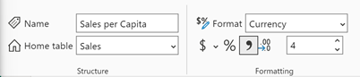
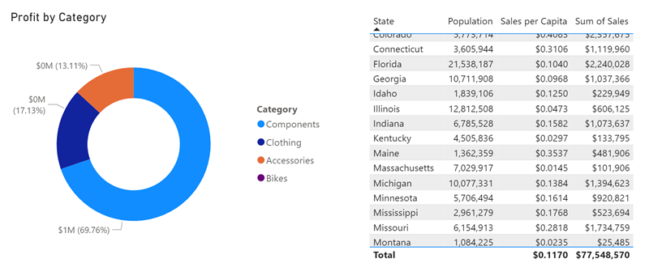
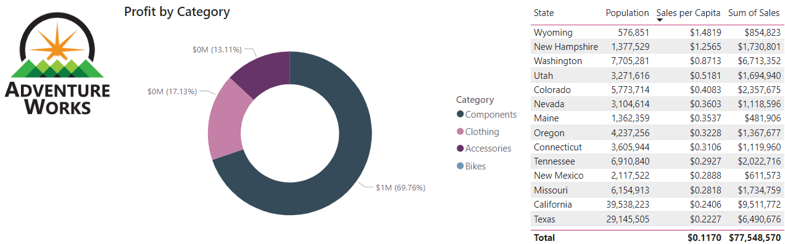

---
lab:
  title: "Erstellen wiederverwendbarer Power\_BI-Ressourcen"
  module: Create reusable Power BI assets
---

# Erstellen wiederverwendbarer Power BI-Ressourcen

In dieser Übung erstellen Sie wiederverwendbare Ressourcen zur Unterstützung des semantischen Modells und der Berichtsentwicklung. Zu diesen Ressourcen gehören Power BI-Projekt- und Vorlagendateien und freigegebene Semantikmodelle. Am Ende werden Sie die Herkunftsansicht erkunden, um zu sehen, wie diese Elemente im Power BI-Dienst miteinander in Beziehung stehen.

   > Hinweis: Diese Übung erfordert keine Fabric-Lizenz und kann in einer Power BI- oder Microsoft Fabric-Umgebung durchgeführt werden.

Diese Übung dauert ca. **30** Minuten.

## Vor der Installation

Bevor Sie mit dieser Übung beginnen können, müssen Sie einen Webbrowser öffnen und die folgende URL eingeben, um den ZIP-Ordner herunterzuladen:

`https://github.com/MicrosoftLearning/mslearn-fabric/raw/refs/heads/main/Allfiles/Labs/16b/16-reusable-assets.zip`

Extrahieren Sie den Ordner in den Ordner **C:\Users\Student\Downloads\16-reusable-assets**.

## Veröffentlichen eines Berichts im Power BI-Dienst

In dieser Aufgabe verwenden Sie einen vorhandenen Bericht, um ein freigegebenes Semantikmodell für die Wiederverwendung zu erstellen, um andere Berichte zu entwickeln.

1. Navigieren Sie in einem Webbrowser zum Fabric-Dienst und melden Sie sich dort an: [https://app.fabric.microsoft.com](https://app.fabric.microsoft.com)
1. Navigieren Sie zur Power BI-Oberfläche, und erstellen Sie einen neuen Arbeitsbereich mit einem eindeutigen Namen Ihrer Wahl.

    

1. Wählen Sie im oberen Menüband Ihres neuen Arbeitsbereichs **Hochladen > Durchsuchen**.
1. Navigieren Sie im neuen Dialogfeld „Datei-Explorer“ zur Starterdatei *.pbix* und wählen Sie sie aus. Wählen Sie dann zum Hochladen **Öffnen** aus.
1. Beachten Sie, wie Sie jetzt zwei verschiedene Elemente im Arbeitsbereich mit demselben Namen haben:

    - Report
    - Semantikmodell

1. Öffnen Sie den Bericht, und beachten Sie das verwendete Farbdesign. *Das werden Sie in einer späteren Aufgabe ändern.*
1. Sie können nun Ihren Webbrowser schließen.

> Power BI *.pbix*-Dateien enthalten sowohl das semantische Modell als auch die Berichtsgrafiken. Wenn Sie Berichte im Dienst veröffentlichen, werden diese Elemente getrennt. Diese Trennung wird später wieder angezeigt.

## Erstellen eines neuen Power-BI-Projekts

In dieser Aufgabe erstellen Sie einen Bericht, indem Sie eine Verbindung mit dem veröffentlichten Semantikmodell herstellen und als Power BI-Projektdatei (*PBIP*) speichern. Power BI Project-Dateien speichern die Berichts- und Semantikmodelldetails in Flachdateien, die mit der Quellcodeverwaltung arbeiten. Sie können Visual Studio Code verwenden, um diese Dateien zu ändern, oder Git, um Änderungen zu verfolgen.

1. Öffnen Sie auf Ihrem Desktop die Power BI Desktop-App und erstellen Sie einen leeren Bericht.

    > Wenn Sie dazu aufgefordert werden, melden Sie sich mit demselben Konto an, das im Fabric-Dienst verwendet wird.

1. Wählen Sie **Datei** > **Optionen und Einstellungen** > **Optionen** > **Vorschaufunktionen** und wählen Sie die Option **Semantisches Modell im TMDL-Format speichern** und **OK**.

    > Dies ermöglicht die Option, das semantische Modell mithilfe der Tabular Model Definition Language (TMDL) zu speichern, die derzeit eine Vorschaufunktion ist.

1. Wenn Sie aufgefordert werden, Power BI Desktop neu zu starten, tun Sie dies, bevor Sie die Übung fortsetzen.

    

1. Wählen Sie **Speichern unter** und wählen Sie den Dateityp aus, indem Sie beim Benennen der Datei auf den Pfeil im Dropdown-Menü klicken.
1. Wählen Sie die Dateiendung **.pbip** aus, geben Sie einen Namen für Ihren Bericht ein und speichern Sie ihn in einem Ordner, den Sie sich merken können.

    

1. Beachten Sie oben im Power BI Desktop-Fenster, dass neben dem Namen Ihres Berichts **(Power BI Project)** steht.
1. Navigieren Sie im Menüband „Startseite“ zu **Daten abrufen > Power BI-Semantikmodelle**, um eine Verbindung zu dem veröffentlichten semantischen Modell herzustellen.

    

1. Sobald die Verbindung hergestellt ist, sollten Sie im Datenbereich 9 Tabellen sehen.
1. **Speichern** Sie Ihre Datei erneut.

### Überprüfen der Details der Power BI-Projektdatei

Sehen wir uns an, wie sich Änderungen in Power BI Desktop in den .tmdl-Dateien widerspiegeln.

1. Navigieren Sie von Ihrem Desktop aus mit dem Datei-Explorer zu dem Ordner, in dem Sie die **.pbip**-Datei gespeichert haben.
1. Sie sollten die folgenden Elemente sehen:

    - Datei „YourReport.pbip“
    - YourReport.Report-Ordner
    - YourReport.SemanticModel-Ordner
    - .gitignore („Git Ignore“-Quelldatei)

## Hinzufügen einer neuen Tabelle zu Ihrem Bericht

In dieser Aufgabe fügen Sie eine neue Tabelle hinzu, weil das semantische Modell nicht alle Daten enthält, die Sie benötigen.

1. Navigieren Sie in Power BI Desktop zu **Daten abrufen > Web**, um die neuen Daten hinzuzufügen.
1. Beachten Sie die Meldung, dass eine DirectQuery-Verbindung erforderlich ist. Wählen Sie **Lokales Modell hinzufügen**, um fortzufahren.
1. In einem neuen Dialogfeld werden eine Datenbank und Tabellen angezeigt, die Sie auswählen können. Wählen Sie „Alle“ und dann **Übermitteln**.

    > Das semantische Modell wird als SQL Server Analysis Server-Datenbank behandelt.

1. Sobald die Verbindung hergestellt ist, wird das Dialogfeld „Aus dem Web“ angezeigt. Lassen Sie das Optionsfeld „Basic“ ausgewählt. Geben Sie den folgenden Dateipfad als URL-Pfad ein.

    `C:\Users\Student\Downloads\16-reusable-assets\us-resident-population-estimates-2020.html`

1. Markieren Sie das Kästchen für **HTML-Tabellen > Tabelle 2** und wählen Sie dann **Daten transformieren**, um fortzufahren.

    

1. Es öffnet sich ein neues Power Query Editor-Fenster mit der Datenvorschau von Tabelle 2.
1. Benennen Sie **Tabelle 2** um in *US-Bevölkerung*.
1. Benennen Sie „STAAT“ in **Staat** und ZAHL in **Bevölkerung** um.
1. Entfernen Sie die Spalte „RANG“.
1. Wählen Sie **Schließen & Anwenden**, um die transformierten Daten in Ihr semantisches Modell zu laden.
1. Klicken Sie auf **OK**, wenn ein Dialogfeld für *Potenzielles Sicherheitsrisiko* angezeigt wird.
1. **Speichern** Sie Ihre Datei.
1. Wenn Sie dazu aufgefordert werden, **führen Sie kein Upgrade** auf das erweiterte Power BI-Berichtsformat durch.

### Überprüfen der Details der Power BI-Projektdatei

In dieser Aufgabe nehmen wir Änderungen an dem Bericht in Power BI Desktop vor und sehen uns die Änderungen in den flachen .tmdl-Dateien an.

1. Suchen Sie im Datei-Explorer den Dateiordner ***YourReport*.SemanticModel**.
1. Öffnen Sie den Definitionsordner, und beachten Sie die verschiedenen Dateien.
1. Öffnen Sie die Datei **relationships.tmdl** in einem Notepad und stellen Sie fest, dass 9 Beziehungen aufgelistet sind. Schließen Sie die -Datei.
1. Zurück in Power BI Desktop, navigieren Sie zur Registerkarte **Modellierung** im Menüband.
1. Wählen Sie **Beziehungen verwalten** und stellen Sie fest, dass es 9 Beziehungen gibt.
1. Erstellen Sie eine neue Beziehung wie folgt:
    - **Von**: Wiederverkäufer mit Staat-Provinz als Schlüsselspalte
    - **Bis**: US-Bevölkerung mit Staat als Schlüsselspalte
    - **Kardinalität**: Viele-zu-Eins (*:1)
    - **Kreuzfilterrichtung**: Beide

    

1. **Speichern** Sie Ihre Datei.
1. Schauen Sie noch einmal in die Datei **relationships.tmdl** und stellen Sie fest, dass eine neue Beziehung hinzugefügt wurde.

> Diese Änderungen in flachen Dateien sind in Versionskontrollsystemen nachvollziehbar, im Gegensatz zu *.pbix*-Dateien, die binär sind.

## Hinzufügen eines Measures und visuellen Elements zu Ihrem Bericht

In dieser Aufgabe fügen Sie ein Measure und ein visuelles Element hinzu, um das semantische Modell zu erweitern und das Measure in einem visuellen Element zu verwenden.

1. Navigieren Sie in Power BI Desktop zum Datenbereich, und wählen Sie die Tabelle „Vertrieb“ aus.
1. Wählen Sie **Neues Measure** im kontextbezogenen Menüband „Tabellentools“.
1. Geben Sie in der Formelleiste den folgenden Code ein und bestätigen Sie ihn:

    ```DAX
    Sales per Capita =
    DIVIDE(
        SUM(Sales[Sales]),
        SUM('US Population'[Population])
    )
    ```

1. Suchen Sie die neue Kennzahl **Umsatz pro Kopf** und ziehen Sie sie auf das Canvas.
1. Ziehen Sie die Felder **Umsatz \| Umsatz**, **US-Bevölkerung \| Staat** und **US-Bevölkerung \| Bevölkerung** auf dasselbe Visual.

   > *In den Labs wird eine verkürzte Notation verwendet, um auf ein Feld zu verweisen. Das sieht folgendermaßen aus: **Sales \| Unit Price**. In diesem Beispiel ist **Sales** der Tabellenname und **Unit Price** der Feldname.*

1. Wählen Sie das Visual und ändern Sie es in eine **Tabelle**.
1. Beachten Sie die inkonsistente Formatierung der Daten für den Umsatz pro Kopf und die Bevölkerung.
1. Wählen Sie jedes Feld im Datenbereich aus, und ändern Sie das Format und die Dezimalstellen.
    - Umsatz pro Kopf: Währung \| 4 Dezimalstellen
    - Bevölkerung: Ganze Zahl \| Komma getrennt \| 0 Dezimalstellen

    

    > Tipp: Wenn Sie versehentlich ein Measure in der falschen Tabelle erstellen, können Sie die Tabelle „Startseite“ ganz einfach ändern, wie in der vorherigen Abbildung dargestellt.

1. Speichern Sie Ihre Datei.

> Die Tabelle sollte wie das folgende Bild mit vier Spalten und korrekt formatierten Zahlen aussehen.


## Konfigurieren einer Power BI-Vorlagendatei (.pbit)

In dieser Aufgabe erstellen Sie eine Vorlagendatei, damit Sie eine einfache Datei für andere freigeben können, um die Zusammenarbeit zu verbessern.

1. Gehen Sie auf die Registerkarte „Einfügen“ im Menüband von Power BI Desktop und wählen Sie **Bilder** aus. Navigieren Sie zu Ihrem Download-Ordner und wählen Sie die Datei `AdventureWorksLogo.jpg`.
1. Positionieren Sie dieses Bild in der oberen linken Ecke.
1. Wählen Sie ein neues Visual aus und fügen Sie **Umsatz \| Gewinn** und **Produkt \| Kategorie** hinzu.

    > Für unseren folgenden Screenshot haben wir ein Ringdiagramm verwendet.

    

1. Beachten Sie, dass in der Legende 4 verschiedene Farben vorhanden sind.
1. Navigieren Sie zur Registerkarte **Ansicht** im Menüband.
1. Klicken Sie auf den Pfeil neben **Designs**, um die Auswahl zu erweitern und alle Optionen zu sehen.
1. Wählen Sie eines der **Barrierefreien Designs** aus, die auf diesen Bericht angewendet werden sollen.

    > Diese Designs werden speziell für Berichtsanzeigen erstellt, um barrierefreier zu werden.

1. Erweitern Sie die Themen erneut und wählen Sie **Aktuelles Design anpassen**.

    

1. Navigieren Sie im Fenster „Design anpassen“ zur Registerkarte **Text**. Ändern Sie die Schriftfamilie für jeden Abschnitt in eine Segoe UI-Schriftart.

    

1. **Übernehmen** Sie die Änderungen, sobald sie abgeschlossen sind.
1. Beachten Sie die verschiedenen Farben in den visuellen Elementen, auf die das neue Design angewendet wurde.

    

1. Wählen Sie **Datei > Speichern unter**, um die *.pbit*-Datei zu erstellen.
1. Ändern Sie den Dateityp in *.pbit* und speichern Sie sie am gleichen Ort wie die *.pbip*-Datei.
1. Geben Sie eine Beschreibung dessen ein, was Benutzende von dieser Vorlage erwarten können, wenn sie sie verwenden, und wählen Sie „OK“.
1. Gehen Sie zurück zum Datei-Explorer und öffnen Sie die *.pbit*-Datei. Weitere Informationen finden Sie in der *.pbip*-Datei.

    > In dieser Übung wollen wir nur eine Standardvorlage für ein Berichtsitzdesign ohne semantisches Modell.

1. Löschen Sie in dieser neuen Datei die beiden Bilder aus dem Canvas.
1. Wählen Sie **Daten transformieren** aus dem Startmenüband aus.
1. Wählen Sie im Power Query-Editor die Abfrage **US-Bevölkerung** und klicken Sie mit der rechten Maustaste, um sie zu löschen.
1. Wählen Sie „Datenquelleneinstellungen“ im Menüband aus und löschen Sie die Datenquelle **DirectQuery to AS – Power BI-Semantikmodell** und klicken Sie auf **Schließen**.
1. **Schließen & Anwenden**
1. Kehren Sie zu den Designs zurück und überprüfen Sie, ob Ihr geändertes barrierefreies Design weiterhin auf den Bericht angewendet wird.
1. Beachten Sie auch die Meldung, dass *Sie noch keine Daten geladen haben* im Datenbereich.
1. **Speichern Sie die Datei** unter demselben Namen als *.pbit*-Datei, mit der Sie die Datei zuvor überschrieben haben.
1. Schließen Sie die unbenannte Datei ohne zu speichern. Sie sollten immer noch Ihre andere *.pbip*-Datei geöffnet haben.

> Jetzt haben Sie eine Vorlage mit einem konsistenten Design ohne vorinstallierte Daten.

## Veröffentlichen und Erkunden Ihrer Assets

In dieser Aufgabe veröffentlichen Sie Ihre Power BI Project-Datei und sehen sich die zugehörigen Elemente in der Herkunftsansicht des Dienstes an.

> Wichtig: Wir haben ein lokales DirectQuery-Modell erstellt, als wir die HTML-Datenquelle hinzugefügt haben. Veröffentlichte Berichte benötigen ein Gateway, um auf die lokalen Daten zuzugreifen, daher erhalten Sie eine Fehlermeldung. Dies wirkt sich nicht auf den Wert dieser Aufgabe aus, kann aber verwirrend sein.

1. Wählen Sie in Ihrer Power BI-Projektdatei **Veröffentlichen**.
1. **Speichern** Sie Ihre Datei, wenn Sie dazu aufgefordert werden.
1. **Aktualisieren Sie nicht** die *PBIR*-Version, wenn Sie dazu aufgefordert werden.
1. Wählen Sie den Arbeitsbereich, den Sie zu Beginn dieser Übung erstellt haben.
1. Wählen Sie **„YourReport.*.pbip*“ in Power BI öffnen**, wenn Sie die Meldung erhalten, dass die Datei zwar veröffentlicht, aber nicht mehr verbunden wurde.

    

1. Sobald Sie sich in Ihrem Arbeitsbereich befinden, können Sie das vorherige semantische Modell und den Bericht sowie Ihr neues semantisches Modell und den Bericht sehen.
1. Wählen Sie in der rechten Ecke unter Arbeitsbereichseinstellungen die **Herkunftsansicht** aus, um zu sehen, wie Ihr neuer Bericht von anderen Datenquellen abhängt.

    

> Wenn semantische Modelle mit anderen semantischen Modellen in Beziehung stehen, nennt man das Verkettung. In diesem Lab wird das semantische Einstiegsmodell mit dem neu erstellten semantischen Modell verknüpft, sodass es für einen speziellen Zweck wiederverwendet werden kann.

## Bereinigen

Sie haben diese Übung erfolgreich abgeschlossen. Sie haben Power BI Projekt- und Vorlagendateien sowie spezielle semantische Modelle und Berichte erstellt. Sie können den Arbeitsbereich und alle lokalen Assets sicher löschen.
