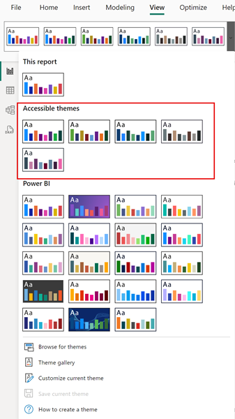

---
lab:
  title: "Erstellen wiederverwendbarer Power\_BI-Ressourcen"
---

# Erstellen wiederverwendbarer Power BI-Ressourcen

In dieser Übung erstellen Sie wiederverwendbare Assets zur Unterstützung der Entwicklung semantischer Modelle und Berichte. Zu diesen Assets gehören Power BI Projekt- und Vorlagendateien sowie gemeinsame semantische Modelle. Am Ende werden Sie in der Lineage-Ansicht sehen, wie diese Elemente im Power BI-Dienst miteinander in Beziehung stehen.

   > Hinweis: Diese Übung erfordert keine Fabric-Lizenz und kann in einer Power BI- oder Microsoft Fabric-Umgebung durchgeführt werden.

Diese Übung dauert ca. **30** Minuten.

## Vor der Installation

Bevor Sie mit dieser Übung beginnen können, müssen Sie einen Webbrowser öffnen und die folgende URL eingeben, um den Zip-Ordner herunterzuladen:

`https://github.com/MicrosoftLearning/mslearn-fabric/raw/Main/Allfiles/Labs/16b/16-reusable-assets.zip`

Extrahieren Sie den Ordner in den Ordner **C:\Users\Student\Downloads\16-reusable-assets**.

## Veröffentlichen Sie einen Bericht im Power BI-Dienst

In dieser Aufgabe verwenden Sie einen bestehenden Bericht, um ein gemeinsames semantisches Modell zu erstellen, das Sie für die Entwicklung anderer Berichte wiederverwenden können.

1. Navigieren Sie in einem Webbrowser zum Fabric-Dienst und melden Sie sich dort an: [https://app.fabric.microsoft.com](https://app.fabric.microsoft.com)
1. Navigieren Sie zum Power BI-Erlebnis und erstellen Sie einen neuen Arbeitsbereich mit einem eindeutigen Namen Ihrer Wahl.

    

1. Wählen Sie in der oberen Multifunktionsleiste Ihres neuen Arbeitsbereichs **Hochladen > Durchsuchen**.
1. Navigieren Sie in dem neuen Dialogfeld Datei-Explorer zu der Start-*.pbix*-Datei und wählen Sie **Öffnen** aus, um sie hochzuladen.
1. Beachten Sie, dass Sie nun zwei verschiedene Objekte mit demselben Namen im Arbeitsbereich haben:

    - Report
    - Semantikmodell

1. Öffnen Sie den Bericht und beachten Sie das verwendete Farbthema. *Das werden Sie in einer späteren Aufgabe ändern.*
1. Sie können nun Ihren Webbrowser schließen.

> Power BI *.pbix* Dateien enthalten sowohl das semantische Modell als auch die Berichtsvisualisierungen. Wenn Sie Berichte für den Dienst veröffentlichen, werden diese Elemente getrennt. Sie werden diese Trennung später noch einmal sehen.

## Erstellen Sie ein neues Power BI-Projekt

In dieser Aufgabe erstellen Sie einen Bericht, indem Sie eine Verbindung zu dem veröffentlichten semantischen Modell herstellen und ihn als Power BI Project-Datei (*.pbip*) speichern. Power BI-Projekdateien speichern die Details von Berichten und semantischen Modellen in flachen Dateien, die mit der Quellcodeverwaltung funktionieren. Sie können Visual Studio Code verwenden, um diese Dateien zu ändern, oder Git, um Änderungen zu verfolgen.

1. Öffnen Sie von Ihrem Desktop aus die Power BI Desktop App und erstellen Sie einen leeren Bericht.

    > Wenn Sie dazu aufgefordert werden, melden Sie sich mit demselben Konto an, das Sie auch für den Fabric-Dienst verwenden.

1. Wählen Sie **Datei** > **Optionen und Einstellungen** > **Optionen** > **Vorschau Funktionen** und wählen Sie die Option **Semantisches Modell im TMDL-Format speichern** und **OK**.

    > Dies ermöglicht die Option, das semantische Modell unter Verwendung der Tabular Model Definition Language (TMDL) zu speichern, was derzeit eine Vorschaufunktion ist.

1. Wenn Sie aufgefordert werden, Power BI Desktop neu zu starten, tun Sie dies, bevor Sie die Übung fortsetzen.

    

1. Wählen Sie **Speichern unter**. Wählen Sie den Dateityp, indem Sie den Pfeil im Dropdown-Menü auswählen, wenn Sie die Datei benennen.
1. Wählen Sie die Dateierweiterung **.*.pbip***, wählen Sie dann einen Namen für Ihren Bericht und speichern Sie ihn in einem Ordner, den Sie sich merken können.

    

1. Beachten Sie oben im Power BI Desktop-Fenster, dass neben dem Namen Ihres Berichts **(Power BI Project)** steht.
1. Navigieren Sie im Menüband „Startseite“ zu **Daten abrufen > Power BI semantische Modelle**, um eine Verbindung zu dem veröffentlichten semantischen Modell herzustellen.

    

1. Sobald Sie verbunden sind, sollten Sie 9 Tabellen im Datenbereich sehen.
1. **Speichern** Sie Ihre Datei erneut.

### Überprüfen Sie die Details der Power BI-Projektdatei

Sehen wir uns an, wie sich Änderungen in Power BI Desktop in den .tmdl-Dateien niederschlagen.

1. Navigieren Sie von Ihrem Desktop aus mit dem Datei-Explorer zu dem Ordner, in dem Sie die *.*.pbip**-Datei gespeichert haben.
1. Sie sollten die folgenden Elemente sehen:

    - YourReport.*.pbip* Datei
    - Ordner YourReport.Report
    - Ordner „YourReport.SemanticModel“
    - Gitignore Git Source File ignorieren

## Fügen Sie eine neue Tabelle zu Ihrem Bericht hinzu

In dieser Aufgabe fügen Sie eine neue Tabelle hinzu, weil das semantische Modell nicht alle Daten enthält, die Sie benötigen.

1. Navigieren Sie in Power BI Desktop zu **Daten holen > Web**, um die neuen Daten hinzuzufügen.
1. Beachten Sie die Meldung, dass eine DirectQuery-Verbindung erforderlich ist. Wählen Sie **Ein lokales Modell hinzufügen**, um fortzufahren.
1. In einem neuen Dialogfeld werden eine Datenbank und Tabellen angezeigt, die Sie auswählen können. Wählen Sie „Alle“ und dann **Senden**.

    > Das semantische Modell wird wie eine SQL Server Analysis-Server-Datenbank behandelt.

1. Sobald die Verbindung hergestellt ist, wird das Dialogfeld „Aus dem Web“ angezeigt. Lassen Sie das Optionsfeld Basic ausgewählt. Geben Sie den folgenden Dateipfad als URL-Pfad ein.

    `"C:\Users\Student\Downloads\16-reusable-assets\us-resident-population-estimates-2020.html"`

1. Markieren Sie das Kästchen für **HTML-Tabellen > Tabelle 2** und wählen Sie dann **Daten umwandeln**, um fortzufahren.

    

1. Es öffnet sich ein neues Power Query Editor-Fenster mit der Datenvorschau von Tabelle 2.
1. Benennen Sie **Tabelle 2** um in *US-Bevölkerung*.
1. Benennen Sie „ZUSTAND“ in **Zustand** und ZAHL in **Bevölkerung** um.
1. Entfernen Sie die Spalte BEWERTUNG.
1. Wählen Sie **Schließen & Anwenden**, um die transformierten Daten in Ihr semantisches Modell zu laden.
1. Klicken Sie auf **OK**, wenn ein Dialogfeld für *Potenzielles Sicherheitsrisiko* angezeigt wird.
1. **Speichern** Sie Ihre Datei.
1. Wenn Sie dazu aufgefordert werden, wählen Sie **Nicht aktualisieren** auf das erweiterte Format von Power BI Report.

### Überprüfen Sie die Details der Power BI-Projektdatei

In dieser Aufgabe nehmen wir Änderungen an dem Bericht in Power BI Desktop vor und sehen uns die Änderungen in den flachen .tmdl-Dateien an.

1. Suchen Sie im Datei-Explorer den Dateiordner ***IhrReport*.SemanticModel**.
1. Öffnen Sie den Definitionsordner und beachten Sie die verschiedenen Dateien.
1. Öffnen Sie die Datei **relationships.tmdl** in einem Notepad und stellen Sie fest, dass 9 Beziehungen aufgelistet sind. Schließen Sie die -Datei.
1. Zurück in Power BI Desktop, navigieren Sie zur Registerkarte **Modellierung** im Menüband.
1. Wählen Sie **Beziehungen verwalten** und stellen Sie fest, dass es 9 Beziehungen gibt.
1. Erstellen Sie eine neue Beziehung wie folgt:
    - **Von**: Wiederverkäufer mit Staat-Provinz als Schlüsselspalte
    - **Bis**: US-Bevölkerung mit Staat als Schlüsselspalte
    - **Kardinalität**: Viele-zu-Eins (*:1)
    - **Richtung des Cross-Filters**: Beide

    

1. **Speichern** Sie Ihre Datei.
1. Schauen Sie noch einmal in die Datei **relationships.tmdl** und stellen Sie fest, dass eine neue Beziehung hinzugefügt wurde.

> Diese Änderungen in flachen Dateien sind in Versionskontrollsystemen nachvollziehbar, im Gegensatz zu *.pbix* Dateien, die binär sind.

## Fügen Sie Ihrem Bericht eine Messung und ein Bild hinzu

In dieser Aufgabe fügen Sie ein Maß und ein Bild hinzu, um das semantische Modell zu erweitern und das Maß in einem Bild zu verwenden.

1. Navigieren Sie in Power BI Desktop zum Bereich Daten und wählen Sie die Tabelle Umsatz.
1. Wählen Sie **Neue Messung** im kontextbezogenen Menüband „Tabellenwerkzeuge“ aus.
1. Geben Sie in der Formelleiste den folgenden Code ein und bestätigen Sie ihn:

    ```DAX
    Sales per Capita =
    DIVIDE(
        SUM(Sales[Sales]),
        SUM('US Population'[Population])
    )
    ```

1. Suchen Sie die neue Kennzahl **Umsatz pro Kopf** und ziehen Sie sie auf das Canvas.
1. Ziehen Sie die Felder **Umsatz \| Umsatz**, **US-Bevölkerung \| Staat** und **US-Bevölkerung \| Bevölkerung** auf dasselbe Visual.

   > *In den Labs wird eine verkürzte Notation verwendet, um auf ein Feld zu verweisen. Das sieht folgendermaßen aus: **Sales \| Unit Price**. In diesem Beispiel ist **Sales** der Tabellenname und **Unit Price** der Feldname.*

1. Wählen Sie das Visual und ändern Sie es in eine **Tabelle**.
1. Beachten Sie die inkonsistente Formatierung der Daten für den Umsatz pro Kopf und die Bevölkerung.
1. Wählen Sie jedes Feld im Bereich Daten aus und ändern Sie das Format und die Dezimalstellen.
    - Umsatz pro Kopf: Währung \| 4 Dezimalstellen
    - Bevölkerung: Ganze Zahl \| Komma getrennt \| 0 Dezimalstellen

    

    > Tipp: Wenn Sie versehentlich eine Kennzahl in der falschen Tabelle erstellen, können Sie die Home-Tabelle ganz einfach ändern, wie in der vorherigen Abbildung gezeigt.

1. Speichern Sie Ihre Datei.

> Ihre Tabelle sollte wie das folgende Bild aussehen: vier Spalten und korrekt formatierte Zahlen.


## Konfigurieren Sie eine Power BI-Vorlagendatei (.pbit)

In dieser Aufgabe erstellen Sie eine Vorlagendatei, damit Sie eine leichte Datei für eine bessere Zusammenarbeit mit anderen teilen können.

1. Gehen Sie auf die Registerkarte „Einfügen“ im Menüband von Power BI Desktop und wählen Sie **Bilder** aus. Navigieren Sie zu Ihrem Download-Ordner und wählen Sie die Datei `AdventureWorksLogo.jpg`.
1. Positionieren Sie dieses Bild in der linken oberen Ecke.
1. Wählen Sie ein neues visuelles Objekt und fügen Sie **Umsatz \|Gewinn** und **Produkt\|kategorie** hinzu.

    > Für unseren folgenden Screenshot haben wir ein Ringdiagramm verwendet.

    

1. Beachten Sie, dass es in der Legende 4 verschiedene Farben gibt.
1. Navigieren Sie zur Registerkarte **Ansicht** in der Multifunktionsleiste.
1. Klicken Sie auf den Pfeil neben **Themes**, um die Auswahl zu erweitern und alle Optionen zu sehen.
1. Wählen Sie eines der **Zugänglichkeitsthemen**, die Sie auf diesen Bericht anwenden möchten.

    > Diese Themen wurden speziell entwickelt, um für die Betrachter von Berichten leichter zugänglich zu sein.

1. Erweitern Sie die Themen erneut und wählen Sie **Aktuelles Thema anpassen**.

    

1. Navigieren Sie im Fenster Thema anpassen zur Registerkarte **Text**. Ändern Sie die Schriftfamilie in eine Segoe UI-Schriftart für jeden der Abschnitte.

    

1. **Übernehmen** Sie die Änderungen, sobald sie abgeschlossen sind.
1. Beachten Sie die unterschiedlichen Farben in den Bildern, wenn das neue Thema angewendet wird.

    

1. Wählen Sie **Datei > Speichern unter**, um die *.pbit* Datei zu erstellen.
1. Ändern Sie den Dateityp in *.pbit* und speichern Sie sie am gleichen Ort wie die Datei *.pbip*.
1. Geben Sie eine Beschreibung dessen ein, was Benutzende von dieser Vorlage erwarten können, wenn sie sie verwenden, und wählen Sie OK.
1. Gehen Sie zurück zum Datei-Explorer und öffnen Sie die Datei *.pbit* und sehen Sie, dass sie genau so aussieht wie die Datei *.pbip*.

    > In dieser Übung wollen wir nur eine Standardvorlage für ein Berichtsthema ohne semantisches Modell.

1. Löschen Sie in dieser neuen Datei die beiden Bildmaterialen aus der Leinwand.
1. Wählen Sie **Daten transformieren** in der Multifunktionsleiste Home.
1. Wählen Sie im Power Query Editor die Abfrage **US-Bevölkerung** und klicken Sie mit der rechten Maustaste, um sie zu löschen.
1. Wählen Sie „Datenquelleneinstellungen“ im Menüband aus und löschen Sie die Datenquelle **DirectQuery to AS – Power BI Semantic Model** und klicken Sie auf **Schließen**.
1. **Schließen & Anwenden**
1. Navigieren Sie zurück zu den Themen und stellen Sie fest, dass Ihr geändertes Barrierefrei-Thema immer noch auf den Bericht angewendet wird.
1. Beachten Sie auch die Meldung, dass *Sie haben noch keine Daten geladen* im Bereich Daten.
1. **Speichern als** eine *.pbit* Datei mit dem gleichen Namen, den Sie zuvor zum Überschreiben der Datei verwendet haben.
1. Schließen Sie die unbenannte Datei ohne zu speichern. Sie sollten immer noch Ihre andere *.pbip* Datei geöffnet haben.

> Jetzt haben Sie eine Vorlage mit einem konsistenten Thema ohne vorinstallierte Daten.

## Veröffentlichen und erkunden Sie Ihre Assets

In dieser Aufgabe veröffentlichen Sie Ihre Power BI Project-Datei und sehen sich die zugehörigen Elemente in der Lineage-Ansicht des Dienstes an.

> Wichtig: Wir haben ein lokales DirectQuery-Modell erstellt, als wir die HTML-Datenquelle hinzugefügt haben. Veröffentlichte Berichte benötigen ein Gateway, um auf die lokalen Daten zuzugreifen, daher erhalten Sie eine Fehlermeldung. Das hat keinen Einfluss auf den Wert dieser Aufgabe, könnte aber verwirrend sein.

1. Wählen Sie in Ihrer Power BI-Projektdatei **Veröffentlichen**.
1. **Speichern** Sie Ihre Datei, wenn Sie dazu aufgefordert werden.
1. **Aktualisieren Sie nicht** die *PBIR*-Version, wenn Sie dazu aufgefordert werden.
1. Wählen Sie den Arbeitsbereich, den Sie zu Beginn dieser Übung erstellt haben.
1. Wählen Sie **Öffnen Sie „IhrBericht.*.pbip*“ in Power BI**, wenn Sie die Meldung erhalten, dass die Datei zwar veröffentlicht, aber nicht mehr verbunden wurde.

    

1. Sobald Sie sich in Ihrem Arbeitsbereich befinden, können Sie das vorherige semantische Modell und den Bericht sowie Ihr neues semantisches Modell und den Bericht sehen.
1. Wählen Sie in der rechten Ecke unter Arbeitsbereichseinstellungen die **Herkunftsansicht** aus, um zu sehen, wie Ihr neuer Bericht von anderen Datenquellen abhängt.

    

> Wenn semantische Modelle mit anderen semantischen Modellen in Beziehung stehen, nennt man das Verkettung. In diesem Lab wird das semantische Einstiegsmodell mit dem neu erstellten semantischen Modell verknüpft, sodass es für einen speziellen Zweck wiederverwendet werden kann.

## Bereinigung

Sie haben diese Übung erfolgreich abgeschlossen. Sie haben Power BI Projekt- und Vorlagendateien sowie spezielle semantische Modelle und Berichte erstellt. Sie können den Arbeitsbereich und alle lokalen Assets sicher löschen.
