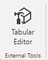
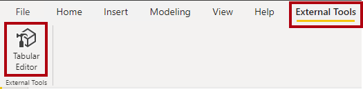
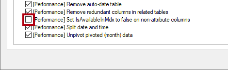
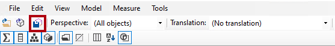
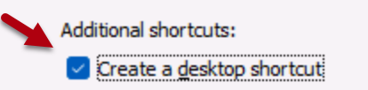
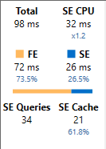

---
lab:
  title: "Verwenden von Tools zum Optimieren der Power\_BI-Leistung"
  module: Optimize enterprise-scale tabular models
---

# Verwenden von Tools zum Optimieren der Power BI-Leistung

## Überblick

**Die geschätzte Dauer dieses Labs beträgt 30 Minuten.**

In diesem Lab erfahren Sie, wie Sie mit zwei externen Tools Datenmodelle und DAX-Abfragen entwickeln, verwalten und optimieren.

In diesem Lab lernen Sie Folgendes zu verwenden:

- Best Practices Analyzer (BPA) in Tabular Editor

- DAX Studio

## Erste Schritte

Für dieses Lab installieren und verwenden Sie Tabular Editor und DAX Studio, um ein semantisches Modell zu optimieren.

## Verwenden des Best Practice Analyzer

In dieser Übung installieren Sie Tabular Editor 2 und laden die Best Practice Analyzer (BPA)-Regeln. Sie überprüfen die BPA-Regeln und beheben dann bestimmte Probleme, die im Datenmodell festgestellt wurden.

*Der BPA ist ein kostenloses Drittanbietertool, das Sie über potenzielle Fehler bei der Modellierung oder Änderungen benachrichtigt, die Sie vornehmen können, um Ihren Modellentwurf und die Leistung zu verbessern. Dazu sind Empfehlungen für die Benennung, die Benutzeroberfläche sowie gängige Optimierungen enthalten, die Sie zur Verbesserung der Leistung anwenden können. Weitere Informationen finden Sie unter [Best Practice-Regeln zur Verbesserung der Leistung Ihres Modells](https://powerbi.microsoft.com/blog/best-practice-rules-to-improve-your-models-performance/).*

### Herunterladen und Installieren von Tabular Editor 2

Laden Sie das Tool Tabular Editor 2 herunter, und installieren Sie es, um die Erstellung von Berechnungsgruppen zu ermöglichen.

***Wichtig:** Falls Sie Tabular Editor 2 bereits in Ihrer VM-Umgebung installiert haben, fahren Sie mit der nächsten Aufgabe fort.*

*Tabular Editor ist ein alternatives Tool zum Erstellen tabellarischer Modelle für Analysis Services und Power BI. Tabular Editor 2 ist ein Open-Source-Projekt, das eine BIM-Datei bearbeiten kann, ohne auf Daten im Modell zuzugreifen.*

1. Vergewissern Sie sich, dass Power BI Desktop geschlossen ist.

1. Navigieren Sie in Microsoft Edge zur Seite „Releases“ für Tabular Editor.

    ```https://github.com/TabularEditor/TabularEditor/releases```

1. Scrollen Sie nach unten zum Abschnitt **Ressourcen**, und wählen Sie die Datei **TabularEditor.Installer.msi** aus. Dadurch wird die Installation der Datei initialisiert.

1. Wählen Sie nach Abschluss des Vorgangs **Datei öffnen** aus, um das Installationsprogramm auszuführen.

1. Wählen Sie im Fenster des Tabular Editor-Installationsprogramms die Option **Next** aus.

1. Wenn Sie der Lizenzvereinbarung zustimmen, wählen Sie im Schritt **License Agreement** die Option **I agree** und dann **Next** aus.

1. Wählen Sie nach dem Schritt **Select Installation Folder** die Option **Next** aus.

1. Wählen Sie im Schritt **Application Shortcuts** die Option **Next** aus.

1. Wählen Sie im Schritt **Confirm Installation** die Option **Next** aus.

    *Wenn Sie dazu aufgefordert werden, wählen Sie **Yes** aus, um zuzulassen, dass die App Änderungen vornimmt.*

1. Klicken Sie nach Abschluss der Installation auf **Schließen**.

    *Tabular Editor ist jetzt installiert und als externes Power BI Desktop-Tool registriert.*

### Öffnen Sie Power BI Desktop.

In dieser Aufgabe öffnen Sie eine vordefinierte Power BI Desktop-Lösung.

1. Laden Sie die [Sales Analysis-Starterdatei](https://aka.ms/fabric-optimize-starter) von `https://aka.ms/fabric-optimize-starter` herunter, und speichern Sie sie an einem Speicherort, den Sie sich merken können.

1. Navigieren Sie zu der heruntergeladenen Datei, und öffnen Sie sie in Power BI Desktop.

1. Wählen Sie die Registerkarte **Externe Tools** des Menübands aus.

    

1. Über diese Registerkarte des Menübands können Sie Tabular Editor starten.

    

    *Später in dieser Übung verwenden Sie Tabular Editor, um mit dem BPA zu arbeiten.*

### Überprüfen Sie das Datenmodell

In dieser Aufgabe überprüfen Sie das Datenmodell.

1. Auf dem Power BI Desktop wechseln Sie zur Ansicht **Modell**.

    

2. Verwenden Sie das Modelldiagramm, um den Modellentwurf zu überprüfen.

    

    *Das Modell umfasst acht Dimensionstabellen und eine Faktentabelle. Die Faktentabelle **Sales** enthält Informationen zu Verkaufsaufträgen. Es ist ein klassischer Sternschemaentwurf, der Schneeflocken-Dimensionstabellen (**Kategorie** > **Unterkategorie** > **Produkt**) für die Dimension „Produkt“ enthält.*

    *In dieser Übung verwenden Sie den BPA, um Modellprobleme zu erkennen und zu beheben.*

### Laden von BPA-Regeln

In dieser Aufgabe laden Sie BPA-Regeln.

*Die BPA-Regeln werden während der Installation von Tabular Editor nicht hinzugefügt. Sie müssen sie herunterladen und installieren.*

1. Wählen Sie auf der Registerkarte **Externe Tools** im Menüband die Option **Tabular Editor** aus.

    

    *Tabular Editor wird in einem neuen Fenster geöffnet und stellt eine Liveverbindung mit dem in Power BI Desktop gehosteten Datenmodell her. Änderungen, die Sie in Tabular Editor am Modell vornehmen, werden erst an Power BI Desktop weitergegeben, wenn Sie sie speichern.*

2. Wählen Sie zum Laden der BPA-Regeln die Registerkarte **C# Script** aus.

    *Hinweis: In älteren Versionen von Tabular Editor wird diese Funktion möglicherweise als Registerkarte „Advanced Scripting“ bezeichnet.*

    

3. Fügen Sie das folgende Skript ein.

    ```csharp
    System.Net.WebClient w = new System.Net.WebClient(); 

    string path = System.Environment.GetFolderPath(System.Environment.SpecialFolder.LocalApplicationData);
    string url = "https://raw.githubusercontent.com/microsoft/Analysis-Services/master/BestPracticeRules/BPARules.json";
    string downloadLoc = path+@"\TabularEditor\BPARules.json";
    w.DownloadFile(url, downloadLoc);
    ```

4. Um das Skript auszuführen, wählen Sie auf der Symbolleiste den Befehl **Run script** aus.

    

    *Wenn Sie die BPA-Regeln verwenden möchten, müssen Sie Tabular Editor schließen und dann erneut öffnen.*

5. Schließen Sie Tabular Editor.

6. Wählen Sie in Power BI Desktop auf der Registerkarte **Externe Tools** des Menübands die Option **Tabular Editor** aus, um Tabular Editor erneut zu öffnen.

    

### Überprüfen der BPA-Regeln

In dieser Aufgabe überprüfen Sie die BPA-Regeln, die Sie in der vorherigen Aufgabe geladen haben.

1. Wählen Sie in Tabular Editor im Menü **Tools** > **Manage BPA Rules** aus.

    

2. Wählen Sie im Fenster **Manage Best Practice Rules** in der Liste **Rule collections** die Option **Rules for the local user** aus.

    

3. Scrollen Sie in der Liste **Rules in collection** in den aufgelisteten Regeln nach unten.

    *Tipp: Ziehen Sie an der unteren rechten Ecke des Fensters, um es zu vergrößern.*

    *Tabular Editor kann das gesamte Modell in Sekundenschnelle anhand sämtlicher Regeln überprüfen und stellt einen Bericht aller Modellobjekte bereit, die die Bedingungen der einzelnen Regeln erfüllen.*

4. Beachten Sie, dass der BPA die Regeln in Kategorien gruppiert.

    *Einige Regeln (z. B. DAX-Ausdrücke) dienen der Leistungsoptimierung, während andere ästhetische Aspekte betreffen (z. B. die Formatierungsregeln).*

5. Beachten Sie die Spalte **Severity**.

    *Je höher der Wert ist, desto wichtiger ist die Regel.*

6. Scrollen Sie zum Ende der Liste, und deaktivieren Sie die Regel **Set IsAvailableInMdx to false on non-attribute columns**.

    

    *Sie können einzelne Regeln oder ganze Regelkategorien deaktivieren. Deaktivierte Regeln werden bei der Überprüfung Ihres Modells nicht vom BPA berücksichtigt. Das Entfernen dieser spezifischen Regel soll veranschaulichen, wie Sie eine Regel deaktivieren.*

7. Klickan Sie auf **OK**.

    

### Beheben von BPA-Problemen

In dieser Aufgabe öffnen Sie den BPA und überprüfen die Ergebnisse der Überprüfungen.

1. Wählen Sie im Menü **Tools** > **Best Practice Analyzer** aus (oder drücken Sie **F10**).

    

2. Maximieren Sie ggf. das Fenster **Best Practice Analyzer**.

3. Sehen Sie sich die nach Kategorie gruppierte Liste der (möglichen) Probleme an.

4. Klicken Sie in der ersten Kategorie mit der rechten Maustaste auf die Tabelle **Product**, und wählen Sie dann **Ignore item** aus.

    

    *Wenn ein Problem nicht wirklich ein Problem ist, können Sie das jeweilige Element ignorieren. Sie können ignorierte Elemente jederzeit anzeigen, indem Sie auf der Symbolleiste den Befehl **Show ignored** auswählen.*

5. Klicken Sie weiter unten in der Liste in der Kategorie **Use the DIVIDE function for division** mit der rechten Maustaste auf **[Profit Margin]**, und wählen Sie dann **Go to object** aus.

    

    *Mit diesem Befehl wechseln Sie zu Tabular Editor, und das Objekt erhält den Fokus. Auf diese Weise können Sie mühelos eine Korrektur des Problems anwenden.*

6. Ändern Sie die DAX-Formel im Ausdrucks-Editor wie folgt, um die effizientere (und sicherere) [DIVIDE](https://docs.microsoft.com/dax/divide-function-dax)-Funktion zu verwenden.

    *Tipp: Alle Formeln können aus der Datei **D:\fabric\Allfiles\Labs\16\Snippets.txt** kopiert und eingefügt werden.*

    ```dax
    DIVIDE ( [Profit], SUM ( 'Sales'[Sales Amount] ) )
    ```

7. Um die Modelländerungen zu speichern, wählen Sie auf der Symbolleiste den Befehl **Save changes to the connected database** aus (oder drücken Sie **STRG+S**).

    

    *Durch das Speichern werden die Änderungen an das Power BI Desktop-Datenmodell gepusht.*

8. Wechseln Sie zurück zum Fenster **Best Practice Analyzer** (das nicht mehr den Fokus hat).

9. Beachten Sie, dass das Problem nicht mehr im BPA aufgelistet ist.

10. Scrollen Sie in der Liste der Probleme nach unten, um nach der Kategorie **Provide format string for "Date" columns** zu suchen.

    

11. Klicken Sie mit der rechten Maustaste auf das Problem **'Date'[Date]**, und wählen Sie dann **Generate fix script** aus.

    

    *Dieser Befehl generiert ein C#-Skript und kopiert es in die Zwischenablage. Sie können auch den Befehl **Apply Fix** verwenden, um das Skript zu generieren und auszuführen. Es kann jedoch sicherer sein, das Skript vor der Ausführung zu überprüfen (und zu ändern).*

12. Wenn Sie benachrichtigt werden, dass der BPA das Korrekturskript in die Zwischenablage kopiert hat, wählen Sie **OK** aus.

13. Wechseln Sie zu Tabular Editor, und wählen Sie die Registerkarte **C# Script** aus.

    *Hinweis: In älteren Versionen von Tabular Editor wird diese Funktion möglicherweise als Registerkarte „Advanced Scripting“ bezeichnet.*

    

14. Klicken Sie zum Einfügen des Skripts mit der rechten Maustaste in den Bereich, und drücken Sie dann **STRG+V**.

    

    *Sie können eine Änderung an der Formatzeichenfolge vornehmen.*

15. Um das Skript auszuführen, wählen Sie auf der Symbolleiste den Befehl **Run script** aus.

    

16. Speichern Sie die Modelländerungen.

17. Wählen Sie im Menü **Tools** > **Exit** aus, um Tabular Editor zu schließen.

18. Speichern Sie die Power BI Desktop-Datei.

    

    *Sie müssen auch die Power BI Desktop-Datei speichern, um sicherzustellen, dass die in Tabular Editor vorgenommenen Änderungen gespeichert werden.*

    *Wählen Sie in der Nachricht zu ausstehenden Änderungen **Später anwenden** aus.*

## Verwenden von DAX Studio

In dieser Übung verwenden Sie DAX Studio, um DAX-Abfragen in der Power BI-Berichtsdatei zu optimieren.

*Laut der DAX Studio-Website ist DAX Studio das ultimative Tool zum Ausführen und Analysieren von DAX-Abfragen für tabellarische Microsoft-Modelle. Es ist ein mit zahlreichen Features ausgestattetes Tool für die Erstellung, Diagnose, Leistungsoptimierung und Analyse von DAX-Abfragen. Zu den Features zählen die Objektsuche, eine integrierte Ablaufverfolgung, Aufschlüsselungen der Abfrageausführung mit detaillierten Statistiken sowie die DAX-Syntaxhervorhebung und -formatierung.*

### Herunterladen von DAX Studio

In dieser Aufgabe laden Sie DAX Studio herunter.

1. Navigieren Sie in Microsoft Edge zur Downloadseite von DAX Studio.

    ```https://daxstudio.org/downloads/```

1. Wählen Sie **DaxStudio_3_X_XX_setup.exe (Installationsprogramm)** aus. Dadurch wird die Dateiinstallation initiiert.
    *Hinweis: Im Laufe der Zeit werden geringfügige Änderungen der DAX Studio-Version vorgenommen. Laden Sie das aktuelle Release herunter.*

1. Wählen Sie nach Abschluss des Vorgangs **Datei öffnen** aus, um das Installationsprogramm auszuführen.

    

1. Wählen Sie im Fenster des DAX Studio-Installationsprogramms **Install for all users (recommended)** aus.

1. Wählen Sie im Fenster „Benutzerkontensteuerung“ die Option „Ja“ aus, um zuzulassen, dass die App Änderungen am Gerät vornimmt.

    

1. Wenn Sie der Lizenzvereinbarung zustimmen, wählen Sie auf der Seite **License Agreement** die Option **I accept the terms in the License Agreement** und dann **Next** aus.

    

1. Wählen Sie **Next** aus, um den standardmäßigen Zielspeicherort zu verwenden.
1. Wählen Sie **Next** aus, um die Standardkomponenten zur Installation auszuwählen.
1. Wählen Sie **Next** aus, um die Verknüpfung im standardmäßigen Startmenüordner zu platzieren.
1. Wählen Sie **Create a desktop shortcut** aus.

    
1. Wählen Sie **Installieren** aus.

1. Aktivieren Sie nach Abschluss der Installation **Launch DAX Studio**, und wählen Sie **Finish** aus. Dadurch wird DAX Studio geöffnet.
    

1. Wählen Sie im Fenster **Connect** die Option **Power BI-/SSDT-Modell** aus.

1. Vergewissern Sie sich, dass in der entsprechenden Dropdownliste das Modell **Sales Analysis - Use tools to optimize Power BI performance** ausgewählt ist.

    

    *Wenn die Starterdatei **Sales Analysis - Use tools to optimize Power BI performance** nicht geöffnet ist, können Sie keine Verbindung herstellen. Stellen Sie sicher, dass die Datei geöffnet ist.*

1. Wählen Sie **Verbinden** aus.

    

1. Maximieren Sie ggf. das DAX Studio-Fenster.

### Verwenden von DAX Studio zum Optimieren einer Abfrage

In dieser Aufgabe optimieren Sie eine Abfrage mithilfe einer verbesserten Measureformel.

*Beachten Sie, dass die Optimierung einer Abfrage bei einem Datenmodell mit geringem Datenvolumen schwierig ist. Der Schwerpunkt dieser Übung liegt auf der Verwendung von DAX Studio und nicht auf der Optimierung von DAX-Abfragen.*

1. Laden Sie in einem Browserfenster die Datei [Monthly Profit Growth.dax](https://aka.ms/fabric-optimize-dax) von `https://aka.ms/fabric-optimize-dax` herunter, und speichern Sie sie auf Ihrem lokalen Computer (in einem beliebigen Ordner).

   

3. Wechseln Sie zum Dax Studio-Fenster, und wählen Sie im Menü **Datei** die Option **Durchsuchen** aus, um zur Datei **Monthly Profit Growth.dax** zu navigieren und sie zu **öffnen**.

    

6. Lesen Sie die Kommentare am Anfang der Datei, und überprüfen Sie dann die folgende Abfrage.

    *Es ist nicht wichtig, dass Sie die Abfrage vollständig verstehen.*

    *Die Abfrage definiert zwei Measures, die das monatliche Gewinnwachstum ermitteln. Derzeit verwendet die Abfrage nur das erste Measure (in Zeile 72). Wenn ein Measure nicht verwendet wird, hat es keinen Einfluss auf die Abfrageausführung.*

7. Um eine Serverablaufverfolgung zum Aufzeichnen detaillierter Zeitinformationen für die Leistungsprofilerstellung auszuführen, wählen Sie auf der Registerkarte **Home** des Menübands in der Gruppe **Traces** die Option **Server Timings** aus.

    

8. Wählen Sie auf der Registerkarte **Home** des Menübands in der Gruppe **Query** das Symbol **Run** aus.

    

9. Überprüfen Sie im unteren Bereich das Abfrageergebnis.

    *Die letzte Spalte zeigt die Measureergebnisse.*

10. Wählen Sie im unteren Bereich die Registerkarte **Server Timings** aus.

    

11. Überprüfen Sie die Statistiken, die auf der linken Seite angezeigt werden.

    

    *Die Statistiken (von oben links nach unten rechts) geben die Ausführungsdauer der Abfrage in Millisekunden und die CPU-Dauer der Speicher-Engine (SE) an. In diesem Fall (Ihre Ergebnisse werden anders aussehen) wurden 73,5 % der Zeit von der Formel-Engine (FE) beansprucht und die restlichen 26,5 % von der SE. Es gab 34 SE-Einzelabfragen und 21 Cachetreffer.*

12. Führen Sie die Abfrage erneut aus. Sie werden feststellen, dass alle SE-Abfragen aus dem SE-Cache stammen.

    *Das liegt daran, dass die Ergebnisse zur Wiederverwendung zwischengespeichert wurden. Mitunter möchten Sie bei Ihren Tests den Cache löschen. Wählen Sie in diesem Fall auf der Registerkarte **Home** des Menübands den Abwärtspfeil für den Befehl **Run** aus.*

    

    *Die zweite Measuredefinition bietet ein effizienteres Ergebnis. Jetzt aktualisieren Sie die Abfrage, um das zweite Measure zu verwenden.*

13. Ersetzen Sie in Zeile 72 das Wort **Bad** durch **Better**.

    

14. Führen Sie die Abfrage aus, und überprüfen Sie die Statistiken zu den Serverzeiten.

    

15. Führen Sie die Abfrage ein zweites Mal aus, um vollständige Cachetreffer zu erzielen.

    

    *In diesem Fall können Sie feststellen, dass die Abfrage mit „better“, die Variablen und eine Zeitintelligenzfunktion verwendet, eine bessere Leistung mit einer um fast 50 % geringeren Abfrageausführungszeit erzielt.*

### Abschluss

Schließen Sie alle Anwendungen, um diese Übung abzuschließen. Es ist nicht erforderlich, die Dateien zu speichern.
