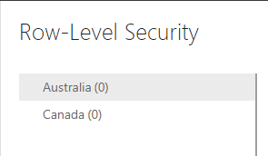
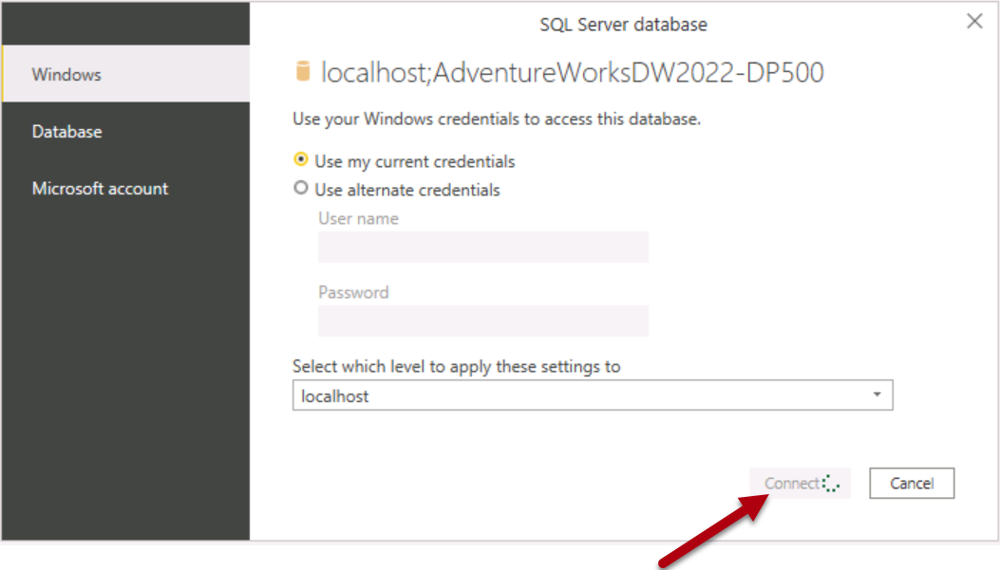
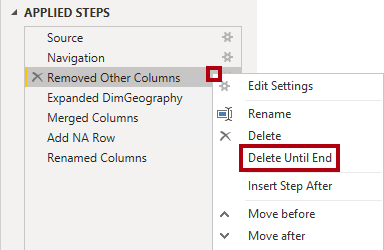
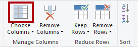
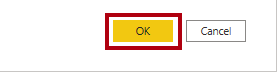
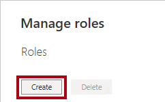

---
lab:
  title: Erzwingen der Sicherheit des Semantikmodells
  module: Design and build tabular models
---

# Erzwingen der Sicherheit des Semantikmodells

In dieser Übung aktualisieren Sie ein vorab entwickeltes Datenmodell, um Sicherheit zu erzwingen. Insbesondere sollen Vertriebsmitarbeitende des Unternehmens Adventure Works nur Verkaufsdaten anzeigen können, die mit der ihnen zugewiesenen Vertriebsregion zusammenhängen.

In dieser Übung lernen Sie Folgendes:

- Erstellen statischer Rollen
- Erstellen von dynamische Rollen.
- Überprüfen der Rollen
- Zuordnen von Sicherheitsprinzipalen zu Rollen des Semantikmodells

Sie werden ungefähr **45** Minuten für dieses Lab benötigen.

> **Hinweis:** Sie benötigen eine [Microsoft Fabric-Testversion](https://learn.microsoft.com/fabric/get-started/fabric-trial), um diese Übung abzuschließen.

## Erste Schritte

In dieser Übung bereiten Sie Ihre Umgebung vor.

### Herunterladen der Power BI-Starterdatei

1. Laden Sie die [Sales Analysis-Starterdatei](https://aka.ms/fabric-security-starter) über `https://aka.ms/fabric-security-starter` herunter, und speichern Sie sie in einem beliebigen Ordner auf Ihrem lokalen Computer.

1. Navigieren Sie zu der heruntergeladenen Datei, und öffnen Sie sie in Power BI Desktop.

1. Wenn Sie dazu aufgefordert werden, melden Sie sich mit einem Geschäfts-, Schul- oder Unikonto an.

### Anmelden beim Power BI-Dienst

In dieser Aufgabe melden Sie sich beim Power BI-Dienst an, starten eine Testlizenz und erstellen einen Arbeitsbereich.

1. Rufen Sie in einem Webbrowser `https://app.powerbi.com/` auf.

2. Schließen Sie den Anmeldevorgang mit dem Konto ab, das Sie auch in Power BI Desktop verwendet haben.

    *Wichtig: Sie müssen dieselben Anmeldeinformationen verwenden, die in Power BI Desktop zum Anmelden verwendet werden.*

    *Tipp: Die Power BI-Webbrowseroberfläche wird als **Power BI-Dienst** bezeichnet.*

### Erstellen eines Arbeitsbereichs

In dieser Aufgabe erstellen Sie einen Arbeitsbereich.

1. Wählen Sie zum Erstellen eines Arbeitsbereichs im Power BI-Dienst im Bereich **Navigation** auf der linken Seite die Option **Arbeitsbereiche** aus, und klicken Sie dann auf **+ Neuer Arbeitsbereich**.

2. Geben Sie im Bereich **Arbeitsbereich erstellen** auf der rechten Seite im Feld **Name** einen Namen für den Arbeitsbereich ein.

    *Der Arbeitsbereichsname muss innerhalb des Mandanten eindeutig sein.*

3. Wählen Sie **Übernehmen**.

    *Nachdem der Arbeitsbereich erstellt wurde, wird er geöffnet. In einer späteren Übung veröffentlichen Sie ein Semantikmodell in diesem Arbeitsbereich.*

### Überprüfen Sie das Datenmodell

In dieser Aufgabe überprüfen Sie das Datenmodell.

1. Auf dem Power BI Desktop links wechseln Sie zur Ansicht **Modell**.

    

2. Verwenden Sie das Modelldiagramm, um den Modellentwurf zu überprüfen.

    

    *Das Modell besteht aus sechs Dimensionstabellen und einer Faktentabelle. Die Faktentabelle **Umsatz** speichert Details zu Kundenaufträgen. Es handelt sich um ein klassisches Sternschema*.

3. Erweitern Sie die Tabelle **Vertriebsgebiet**.

    

4. Beachten Sie, dass die Tabelle eine Spalte **Region** enthält.

    *Die Spalte **Region** speichert die Verkaufsregionen von Adventure Works. In dieser Organisation dürfen Vertriebsmitarbeiter nur Daten sehen, die sich auf ihr zugewiesenes Vertriebsgebiet beziehen. In dieser Übung werden Sie zwei verschiedene Sicherheitstechniken auf Zeilenebene implementieren, um Datenberechtigungen zu erzwingen.*

## Erstellen statischer Rollen

In dieser Übung erstellen und überprüfen Sie statische Rollen, und anschließend erfahren Sie, wie Sie den Rollen des Semantikmodells Sicherheitsprinzipale zuordnen.

### Erstellen statischer Rollen

In dieser Aufgabe werden Sie zwei statische Rollen erstellen.

1. Wechseln Sie zur **Berichtansicht**.

    

2. Beachten Sie in der Legende im visuellen Diagramm mit gestapelten Säulen (vorerst), dass es möglich ist, viele Bereiche anzuzeigen.

    

    *Im Moment sieht das Diagramm noch sehr unübersichtlich aus. Das liegt daran, dass alle Regionen sichtbar sind. Wenn die Lösung die Sicherheit auf Zeilenebene erzwingt, sieht der Berichtsbenutzer*innen nur eine Region.*

3. Um eine Sicherheitsrolle hinzuzufügen, wählen Sie auf der Registerkarte des Menübands **Modellierung** in der Gruppe **Sicherheit** die Option **Rollen verwalten**.

    

4. Wählen Sie im Fenster **Rollen verwalten** die Option **+ Neu**.

5. Um die Rolle zu benennen, ersetzen Sie den markierten Text *Titel* durch **Australien** und drücken dann die **Eingabetaste**.

6. Wählen Sie in der Liste **Tabellen auswählen** die Option **Vertriebsgebiet** und dann im Abschnitt **Filterdaten** die Option **+ Neu** aus.
  
7. Legen Sie in der neuen Regelzeile die folgenden Einstellungen fest:
    * **Spalte**: Region
    * **Bedingung**: Gleich
    * **Wert**: Australien

    

    *Diese Regel filtert die Spalte **Region** nach dem Wert **Australien**.*

10. Um eine weitere Rolle zu erstellen, wählen Sie **+ Neu** im Bereich **Rollen** aus.

11. Wiederholen Sie die Schritte in dieser Aufgabe, um eine Rolle namens **Kanada** zu erstellen, die die Spalte **Region** nach **Kanada** filtert.

    

    *In diesem Lab erstellen Sie nur die beiden Rollen. Berücksichtigen Sie jedoch, dass in einer realen Lösung eine Rolle für jede der 11 Adventure Works-Regionen erstellt werden muss.*

12. Wählen Sie **Speichern**.

### Überprüfen von statischen Rollen

In dieser Aufgabe überprüfen Sie eine der statischen Rollen.

1. Wählen Sie auf der Registerkarte des Menübands **Modellierung** in der Gruppe **Sicherheit** die Option **Anzeigen als**.

    

2. Wählen Sie im Fenster **Als Rollen anzeigen** die Rolle **Australien**.

    

3. Klickan Sie auf **OK**.

    

4. Auf der Berichtsseite sehen Sie, dass das gestapelte Säulendiagramm nur Daten für Australien anzeigt.

    

5. Am oberen Rand des Berichts finden Sie ein gelbes Banner, das die erzwungene Rolle bestätigt.

    

6. Um die Anzeige mit Hilfe der Rolle zu beenden, wählen Sie rechts neben dem gelben Banner **Anzeige beenden**.

    

### Den Bericht veröffentlichen

In dieser Aufgabe wird der Bericht veröffentlicht.

1. Speichern Sie die Power BI Desktop-Datei. Wenn Sie aufgefordert werden, die ausstehenden Änderungen anzuwenden, klicken Sie auf **Später übernehmen**.

    

2. Um den Bericht zu veröffentlichen, wählen Sie auf der Registerkarte **Start** des Menübands **Veröffentlichen** aus.

    

3. Wählen Sie im Fenster **In Power BI veröffentlichen** Ihren Arbeitsbereich und wählen Sie dann **Auswählen**.

    

4. Wenn die Veröffentlichung erfolgreich war, klicken Sie auf **OK**.

    

### Konfigurieren der Sicherheit auf Zeilenebene (*optional*)

In dieser Aufgabe erfahren Sie, wie Sie die Sicherheit auf Zeilenebene im Power BI-Dienst konfigurieren.

Diese Aufgabe setzt das Vorhandensein einer Sicherheitsgruppe **Salespeople_Australia** in dem Mandanten voraus, in dem Sie arbeiten. Diese Sicherheitsgruppe ist nicht automatisch im Mandanten vorhanden. Wenn Sie über Berechtigungen für Ihren Mandanten verfügen, können Sie die folgenden Schritte ausführen. Wenn Sie einen Mandanten verwenden, der Ihnen in der Schulung zur Verfügung gestellt wird, verfügen Sie nicht über die entsprechenden Berechtigungen zum Erstellen von Sicherheitsgruppen. Bitte lesen Sie die Aufgaben durch, beachten Sie jedoch, dass Sie diese nicht abschließen können, wenn die Sicherheitsgruppe nicht vorhanden ist. **Nach dem Durchlesen fahren Sie mit der Aufgabe "Bereinigung" fort.**

1. Wechseln Sie zum Power BI-Dienst (Webbrowser).

2. Auf der Landing Page des Arbeitsbereichs sehen Sie das Semantikmodell **Sales Analysis - Enforce model security**.

    

3. Zeigen Sie auf das Semantikmodell, wählen Sie das Menü mit den Auslassungspunkten (...) aus, wenn dieses eingeblendet wird, und wählen Sie dann **Sicherheit** aus.

    

    *Die Option **Sicherheit** unterstützt die Zuordnung von Microsoft Azure Active Directory (Azure AD)-Sicherheitsprinzipalen, zu denen Sicherheitsgruppen und -benutzer*innen zählen.*

4. Beachten Sie links die Liste der Rollen, und dass **Australien** ausgewählt ist.

    

5. Beginnen Sie im Feld **Mitglieder*innen** mit der Eingabe von **Salespeople_Australia**.

    *Die Schritte 5 bis 8 dienen nur zu Demonstrationszwecken, da sie sich auf die Erstellung oder Existenz einer Salespeople_Australia Sicherheitsgruppe verlassen. Wenn Sie über Berechtigungen und das Wissen zum Erstellen von Sicherheitsgruppen verfügen, können Sie fortfahren. Fahren Sie andernfalls mit der Bereinigungsaufgabe fort.*

    

6. Wählen Sie **Hinzufügen** aus.

    

7. Um die Rollenzuordnung abzuschließen, wählen Sie **Speichern**.

    

    *Jetzt werden alle Mitglieder der **Salespeople_Australia** Sicherheitsgruppe der Rolle **Australien** zugeordnet, wodurch der Datenzugriff auf die Anzeige nur australischer Verkäufe beschränkt wird.*

    *In einer realen Lösung muss jede Rolle einer Sicherheitsgruppe zugeordnet werden.*

    *Dieser Entwurfsansatz ist einfach und effektiv, wenn für jede Region Sicherheitsgruppen vorhanden sind. Es gibt jedoch auch Nachteile: Die Erstellung und Einrichtung sind aufwändiger. Außerdem muss das Semantikmodell beim Onboarding neuer Regionen aktualisiert und erneut veröffentlicht werden.*

    *In der nächsten Übung erstellen Sie eine dynamische Rolle, die datengesteuert ist. Dieser Entwurfsansatz kann dabei helfen, den obigen Nachteilen entgegenzuwirken.*

8. Um zur Landing Page des Arbeitsbereichs zurückzukehren, wählen Sie im Bereich **Navigation** den Arbeitsbereich aus.

### Bereinigen der Lösung

In dieser Aufgabe bereinigen Sie die Lösung, indem Sie das Semantikmodell und die Modellrollen entfernen.

1. Um das Semantikmodell zu entfernen, zeigen Sie auf das Semantikmodell, wählen Sie das Menü mit den Auslassungspunkten (...) aus, wenn dieses eingeblendet wird, und wählen Sie dann **Löschen** aus.

    

    *In der nächsten Übung veröffentlichen Sie ein überarbeitetes Semantikmodell erneut.*

2. Wenn Sie aufgefordert werden, den Löschvorgang zu bestätigen, klicken Sie auf **Löschen**.

    

3. Wechseln Sie zurück zu Power BI Desktop.

4. Um die Sicherheitsrollen zu entfernen, wählen Sie auf der Registerkarte des Menübands **Modellierung** in der Gruppe **Sicherheit** die Option **Rollen verwalten**.

    

5. Um die erste Rolle im Fenster **Rollen verwalten** zu entfernen, markieren Sie die Ellipse neben der Rolle und wählen Sie **Löschen**.

    

6. Entfernen Sie auch die zweite Rolle.

7. Wählen Sie **Speichern**.

## Erstellen einer dynamischen Rolle

In dieser Übung fügen Sie dem Modell eine Tabelle hinzu, erstellen und überprüfen eine dynamische Rolle und ordnen dann der Rolle des Semantikmodells einen Sicherheitsprinzipal zu.

### Hinzufügen der Tabelle „Salesperson“

In dieser Aufgabe fügen Sie dem Modell die Tabelle **Vertriebsmitarbeiter** hinzu.

1. Wechseln Sie zur Ansicht**Modell**.

    

2. Wählen Sie auf dem Menüband **Home** in der Gruppe **Abfragen** das Symbol **Daten transformieren** aus.

    

    *Wenn Sie aufgefordert werden, anzugeben, wie eine Verbindung hergestellt werden soll, **bearbeiten Sie Anmeldeinformationen **und geben Sie an, wie sie sich anmelden.*

    

    *Wählen Sie **Verbinden*** aus.

     

    *Klicken Sie auf der Seite **Verschlüsselungsunterstützung** auf **OK**.*

3. Klicken Sie im Fenster **Power Query-Editor** im Bereich **Abfragen** (auf der linken Seite) mit der rechten Maustaste auf die Abfrage **Customer**, und wählen Sie dann **Duplizieren** aus.

    

    *Da die **Kundenabfrage** bereits Schritte zum Verbinden des Data Warehouse enthält, ist die Duplizierung eine effiziente Möglichkeit, die Entwicklung einer neuen Abfrage zu beginnen.*

4. Ersetzen Sie im Bereich **Abfrageeinstellungen** (auf der rechten Seite) im Feld **Name** den Text durch **Vertriebsmitarbeiter**.

    

5. Klicken Sie in der Liste **Angewandte Schritte** mit der rechten Maustaste auf den Schritt **Entfernte andere Spalten** (dritter Schritt), und wählen Sie dann **Löschen bis Ende**.

    

6. Wenn Sie aufgefordert werden, das Löschen des Schritts zu bestätigen, wählen Sie **Löschen**.

    

7. Um Daten aus einer anderen Data-Warehouse-Tabelle zu beziehen, wählen Sie in der Liste **Angewandte Schritte** im Schritt **Navigation** (zweiter Schritt) das Zahnradsymbol (rechts).

    

8. Wählen Sie im Fenster **Navigation** die Tabelle **DimEmployee**.

    

9. Klickan Sie auf **OK**.

    

10. Klicken Sie auf der Registerkarte **Start** des Menübands in der Gruppe **Spalten verwalten** auf das Symbol **Spalten auswählen**, um unnötige Spalten zu entfernen.

    

11. Deaktivieren Sie im Fenster **Spalten auswählen** das Element **(Alle Spalten auswählen)**, um alle Spalten zu deaktivieren.

    

12. Benennen Sie die folgenden drei Spalten um:

    - EmployeeKey

    - SalesTerritoryKey

    - EmailAddress

13. Klickan Sie auf **OK**.

    

14. Um die Spalte **EmailAdresse** umzubenennen, doppelklicken Sie auf die Spaltenüberschrift **EmailAdresse**.

15. Ersetzen Sie den Text durch **UPN**, und drücken Sie dann die **Eingabetaste**.

    *UPN ist ein Akronym für User Principal Name. Die Werte in dieser Spalte entsprechen den Azure AD-Kontonamen.*

    

16. Um die Tabelle in das Modell zu laden, wählen Sie auf der Registerkarte des Menübands **Start **das Symbol** &amp;Anwenden** aus.

    

17. Nach dem Hinzufügen der Tabelle zum Modell ist zu beachten, dass automatisch eine Beziehung zur Tabelle **Vertriebsgebiet** erstellt wurde.

### Konfigurieren von Beziehungen

In dieser Aufgabe konfigurieren Sie die Eigenschaften der neuen Beziehung.

1. Klicken Sie mit der rechten Maustaste auf die Beziehung zwischen den Tabellen **Verkäufer** und **Verkaufsgebiet**, und wählen Sie dann **Eigenschaften**.

    

2. Wählen Sie im Fenster **Beziehung bearbeiten** in der Dropdownliste **Kreuzfilterrichtung** die Option **Beide** aus.

3. Aktivieren Sie das Kontrollkästchen **Sicherheitsfilter in beide Richtungen anwenden**.

    

     *Da es eine eins-zu-viele-Beziehung zwischen der Tabelle **Vertriebsgebiet** und der Tabelle **Vertriebsmitarbeiter*innen** gibt, werden Filter nur von der Tabelle **Vertriebsgebiet** zur Tabelle **Vertriebsmitarbeiter*inn** übertragen. Um die Weitergabe in die andere Richtung zu erzwingen, muss die Crossfilter-Richtung auf "beide" gesetzt werden.*

4. Klickan Sie auf **OK**.

    

5. Um die Tabelle auszublenden, wählen Sie oben rechts in der Tabelle **Vertriebsmitarbeiter*innen** das Augensymbol.

    

    *Der Zweck der Tabelle **Vertriebsmitarbeiter*innen** ist es, Datenberechtigungen zu erzwingen. Wenn sie ausgeblendet ist, sehen die Berichtsautoren und die Q&A-Erfahrung die Tabelle oder ihre Felder nicht.*

### Erstellen einer dynamischen Rolle

In dieser Aufgabe erstellen Sie eine dynamische Rolle, die Berechtigungen basierend auf Daten im Modell erzwingt.

1. Wechseln Sie zur **Berichtansicht**.

    

2. Um eine Sicherheitsrolle hinzuzufügen, wählen Sie auf der Registerkarte des Menübands **Modellierung** in der Gruppe **Sicherheit** die Option **Rollen verwalten**.

    

3. Wählen Sie im Fenster **Rollen verwalten** die Option **Erstellen** aus.

    

4. Ersetzen Sie den markierten Text durch **Vertriebsmitarbeiter**, um die Rolle zu benennen.

    

    *Diesmal muss nur eine Rolle erstellt werden.*

5. Fügen Sie der Spalte **UPN** der Tabelle **Salesperson** einen Filter hinzu.

    

6. Ersetzen Sie im Feld **Tabellenfilter-DAX-Ausdruck** die Angabe **"Value"** durch `USERPRINCIPALNAME()`.

    

    *Dieser Ausdruck filtert die Spalte **UPN** mit der USERPRINCIPALNAME-Funktion, die den Benutzerprinzipalnamen (UPN) der authentifizierten Benutzer*innen zurückgibt.*

    *Wenn die UPN die Tabelle **Vertriebsmitarbeiter*innen** filtert, filtert sie die Tabelle **Vertriebsgebiet**, die wiederum die Tabelle **Umsatz** filtert. Auf diese Weise sieht der authentifizierte Benutzende nur die Umsatzdaten für das ihm zugewiesene Gebiet.*

7. Wählen Sie **Speichern**.

    

### Überprüfen der dynamischen Rolle

In dieser Aufgabe überprüfen Sie die dynamische Rolle.

1. Wählen Sie auf der Registerkarte **Modellierung** des Menübands in der Gruppe **Sicherheit** die Option **Anzeigen als** aus.

    

2. Aktivieren Sie im Fenster **Als Rollen anzeigen** die Option **Anderer Benutzer**, und geben Sie dann Folgendes in das entsprechende Feld ein: `michael9@adventure-works.com`.

    

    *Für Testzwecke gibt die USERPRINCIPALNAME-Funktion den Wert **Anderer Benutzer** zurück. Diese*r Vertriebsmitarbeiter*in ist der Region **Northeast** zugewiesen.*

3. Wählen Sie die Rolle **Salespeople** aus.

    

4. Klickan Sie auf **OK**.

    

5. Beachten Sie auf der Berichtsseite, dass das Diagramm mit gestapelten Säulen nur Daten für Nordosten anzeigt.

    

6. Am oberen Rand des Berichts finden Sie ein gelbes Banner, das die erzwungene Rolle bestätigt.

    

7. Um die Anzeige mit Hilfe der Rolle zu beenden, wählen Sie rechts neben dem gelben Banner **Anzeige beenden**.

    

### Fertigstellen des Entwurfs

In dieser Aufgabe schließen Sie den Entwurf ab, indem Sie den Bericht veröffentlichen und eine Sicherheitsgruppe der Rolle zuordnen.

*Die Schritte in dieser Aufgabe sind bewusst kurz. Ausführliche Informationen finden Sie in den Aufgabenschritten der vorherigen Übung.*

1. Speichern Sie die Power BI Desktop-Datei.

2. Veröffentlichen Sie den Bericht im Arbeitsbereich, den Sie am Anfang des Labs erstellt haben.

3. Schließen Sie Power BI Desktop.

4. Wechseln Sie zum Power BI-Dienst (Webbrowser).

5. Navigieren Sie zu den Sicherheitseinstellungen für das Semantikmodell **Sales Analysis - Enforce model security**.

6. Ordnen Sie die Sicherheitsgruppe **Salespeople** der Rolle **Salespeople** zu.

    

    *Nun werden alle Mitglieder der Sicherheitsgruppe **Vertreibsmitarbeiter*in** der Rolle **Vertriebsmitarbeiter*in** zugeordnet. Sofern der authentifizierte Benutzer durch eine Zeile in der Tabelle **Verkäufer** repräsentiert wird, wird das zugewiesene Vertriebsgebiet zum Filtern der Umsatztabelle verwendet.*

    *Dieser Entwurfsansatz ist einfach und effektiv, wenn das Datenmodell die Werte für den Benutzerprinzipalnamen speichert. Wenn Vertriebsmitarbeiter hinzugefügt oder entfernt oder verschiedenen Vertriebsgebieten zugewiesen werden, funktioniert dieser Entwurfsansatz einfach.*
