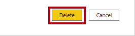
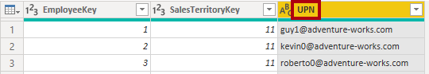
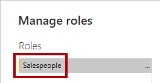
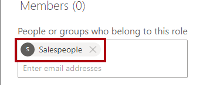

---
lab:
  title: Erzwingen der Sicherheit des Semantikmodells
  module: Design and build tabular models
---

# Erzwingen von Modellsicherheit

## Überblick

**Die geschätzte Dauer dieses Labs beträgt 45 Minuten.**

In diesem Lab aktualisieren Sie ein vorab entwickeltes Datenmodell, um Sicherheit zu erzwingen. Insbesondere sollen Vertriebsmitarbeitende des Unternehmens Adventure Works nur Verkaufsdaten anzeigen können, die mit der ihnen zugewiesenen Vertriebsregion zusammenhängen.

In diesem Lab lernen Sie Folgendes:

- Erstellen statischer Rollen

- Erstellen dynamischer Rollen

- Überprüfen der Rollen

- Zuordnen von Sicherheitsprinzipalen zu Rollen des Semantikmodells

## Erste Schritte

In dieser Übung bereiten Sie Ihre Umgebung vor.

### Herunterladen der Power BI-Starterdatei

1. Öffnen Sie die [Starterdatei zur Vertriebsanalyse](https://github.com/MicrosoftLearning/mslearn-fabric/raw/main/Allfiles/Labs/17/Starter/Sales%20Analysis%20-%20Enforce%20model%20security.pbix), und speichern Sie sie an einem Speicherort, den Sie sich merken können.

1. Navigieren Sie zu der heruntergeladenen Datei, und öffnen Sie sie in Power BI Desktop.

1. Wenn Sie dazu aufgefordert werden, melden Sie sich mit einem Geschäfts-, Schul- oder Unikonto an.

### Anmelden beim Power BI-Dienst

In dieser Aufgabe melden Sie sich beim Power BI-Dienst an, starten eine Testlizenz und erstellen einen Arbeitsbereich.

1. Navigieren Sie in einem Webbrowser zu [app.powerbi.com](https://app.powerbi.com/).

2. Schließen Sie den Anmeldevorgang mit dem Konto ab, das Sie auch in Power BI Desktop verwendet haben.

    *Wichtig: Sie müssen dieselben Anmeldeinformationen verwenden, die in Power BI Desktop zum Anmelden verwendet werden.*

    *Tipp: Die Power BI-Webbrowseroberfläche wird als **Power BI-Dienst** bezeichnet.*

### Erstellen eines Arbeitsbereichs

In dieser Aufgabe erstellen Sie einen Arbeitsbereich.

1. Um einen Arbeitsbereich zu erstellen, wählen Sie im Power BI-Dienst im Bereich **Navigation** auf der linken Seite **Arbeitsbereiche** und dann **Arbeitsbereich erstellen** aus.

    

2. Geben Sie im Bereich **Arbeitsbereich erstellen** (auf der rechten Seite) im Feld **Arbeitsbereichsname** einen Namen für den Arbeitsbereich ein.

    *Der Arbeitsbereichsname muss innerhalb des Mandanten eindeutig sein.*

    

3. Wählen Sie **Speichern**.

    *Nachdem der Arbeitsbereich erstellt wurde, wird er geöffnet. In einer späteren Übung veröffentlichen Sie ein Semantikmodell in diesem Arbeitsbereich.*

### Überprüfen Sie das Datenmodell

In dieser Aufgabe überprüfen Sie das Datenmodell.

1. Auf dem Power BI Desktop wechseln Sie zur Ansicht **Modell**.

    

2. Verwenden Sie das Modelldiagramm, um den Modellentwurf zu überprüfen.

    

    *Das Modell umfasst sechs Dimensionstabellen und eine Faktentabelle. Die Faktentabelle **Sales** enthält Informationen zu Verkaufsaufträgen. Es handelt sich hierbei um einen klassischen Sternschemaentwurf.*

3. Erweitern bzw. öffnen Sie die Tabelle **Sales Territory**.

    

4. Beachten Sie, dass die Tabelle eine Spalte **Region** enthält.

    *In der Spalte **Region** werden die Vertriebsregionen von Adventure Works gespeichert. In dieser Organisation können Vertriebsmitarbeitende nur Daten im Zusammenhang mit der Vertriebsregion anzeigen, die ihnen zugewiesen ist. In diesem Lab implementieren Sie zwei verschiedene Techniken für die Sicherheit auf Zeilenebene, um Datenberechtigungen zu erzwingen.*

## Erstellen statischer Rollen

In dieser Übung erstellen und überprüfen Sie statische Rollen, und anschließend erfahren Sie, wie Sie den Rollen des Semantikmodells Sicherheitsprinzipale zuordnen.

### Erstellen statischer Rollen

In dieser Aufgabe erstellen Sie zwei statische Rollen.

1. Wechseln Sie zur **Berichtansicht**.

    

2. In der Legende des visuellen Elements „Gestapeltes Säulendiagramm“ sehen Sie, dass (im Moment) viele Regionen angezeigt werden können.

    

    *Derzeit sieht das Diagramm überfüllt und unübersichtlich aus. Dies liegt daran, dass alle Regionen sichtbar sind. Wenn die Lösung Sicherheit auf Zeilenebene erzwingt, sehen Berichtsbenutzer*innen nur eine Region.*

3. Wählen Sie zum Hinzufügen einer Sicherheitsrolle auf der Registerkarte **Modellierung** des Menübands in der Gruppe **Sicherheit** die Option **Rollen verwalten** aus.

    

4. Wählen Sie im Fenster **Rollen verwalten** die Option **Erstellen** aus.

    

5. Geben Sie den Namen der Rolle an, indem Sie den markierten Text durch **Australia** ersetzen und dann die **EINGABETASTE** drücken.

    

6. Wählen Sie in der Liste **Tabellen** die Auslassungspunkte (...) für die Tabelle **Sales Territory** und dann **Filter hinzufügen** > **[Region]** aus.

    

7. Ersetzen Sie im Feld **Tabellenfilter-DAX-Ausdruck** den **Wert** durch **Australia**.

    

    *Dieser Ausdruck filtert die Spalte **Region** nach dem Wert **Australia**.*

8. Wählen Sie zum Erstellen einer weiteren Rolle die Option **Erstellen** aus.

    

9. Wiederholen Sie die Schritte in dieser Aufgabe, um eine Rolle namens **Canada** zu erstellen, die die Spalte **Region** nach dem Wert **Canada** filtert.

    

    *In diesem Lab erstellen Sie nur diese beiden Rollen. Bedenken Sie jedoch, dass in einer realen Lösung eine Rolle für jede der elf Adventure Works-Regionen erstellt werden muss.*

10. Wählen Sie **Speichern**.

    

### Überprüfen der statischen Rollen

In dieser Aufgabe überprüfen Sie eine der statischen Rollen.

1. Wählen Sie auf der Registerkarte **Modellierung** des Menübands in der Gruppe **Sicherheit** die Option **Anzeigen als** aus.

    

2. Wählen Sie im Fenster **Als Rollen anzeigen** die Rolle **Australia** aus.

    

3. Klickan Sie auf **OK**.

    

4. Beachten Sie, dass das gestapelte Säulendiagramm auf der Berichtsseite nur Daten für „Australia“ zeigt.

    

5. Das gelbe Banner am oberen Rand des Berichts bestätigt die erzwungene Rolle.

    

6. Wählen Sie zum Beenden der Anzeige anhand der Rolle die Schaltfläche **Anzeige beenden** auf der rechten Seite des gelben Banners aus.

    

### Den Bericht veröffentlichen

In dieser Aufgabe wird der Bericht veröffentlicht.

1. Speichern Sie die Power BI Desktop-Datei.

    

2. Um den Bericht zu veröffentlichen, wählen Sie auf der Registerkarte **Start** des Menübands **Veröffentlichen** aus.

    

3. Wählen Sie im Fenster **In Power BI veröffentlichen** Ihren Arbeitsbereich und dann **Auswählen** aus.

    

4. Warten Sie, bis die Veröffentlichung erfolgreich abgeschlossen wurde, und wählen Sie dann **Alles klar** aus.

    

### Konfigurieren der Sicherheit auf Zeilenebene (*optional*)

In dieser Aufgabe erfahren Sie, wie Sie Sicherheit auf Zeilenebene im Power BI-Dienst konfigurieren.

Diese Aufgabe setzt voraus, dass in dem von Ihnen verwendeten Mandanten eine Sicherheitsgruppe **Salespeople_Australia** vorhanden ist. Diese Sicherheitsgruppe ist NICHT automatisch im Mandanten vorhanden. Wenn Sie über Berechtigungen für Ihren Mandanten verfügen, können Sie die folgenden Schritte ausführen. Falls Sie einen Mandanten verwenden, der Ihnen im Rahmen des Trainings zur Verfügung gestellt wird, besitzen Sie nicht die entsprechenden Berechtigungen zum Erstellen von Sicherheitsgruppen. Lesen Sie in diesem Fall die Aufgaben durch, beachten Sie jedoch, dass Sie die Aufgabenschritte ohne die Sicherheitsgruppe nicht durchführen können. **Fahren Sie mit der Aufgabe „Bereinigen der Lösung“ fort, nachdem Sie die Aufgaben durchgelesen haben.**

1. Wechseln Sie zum Power BI-Dienst (Webbrowser).

2. Auf der Landing Page des Arbeitsbereichs sehen Sie das Semantikmodell **Sales Analysis - Enforce model security**.

    

3. Zeigen Sie auf das Semantikmodell, wählen Sie das Menü mit den Auslassungspunkten (...) aus, wenn dieses eingeblendet wird, und wählen Sie dann **Sicherheit** aus.

    

    *Die Option **Sicherheit** unterstützt die Zuordnung von Microsoft Azure Active Directory (Azure AD)-Sicherheitsprinzipalen, zu denen Sicherheitsgruppen und -benutzer*innen zählen.*

4. Auf der linken Seite wird die Liste der Rollen angezeigt, und **Australia** ist ausgewählt.

    

5. Beginnen Sie im Feld **Mitglieder** mit der Eingabe von **Salespeople_Australia**.

    *Die Schritte 5 bis 8 dienen nur zur Veranschaulichung, da sie die Erstellung oder das Vorhandensein einer Sicherheitsgruppe „Salespeople_Australia“ voraussetzen. Wenn Sie über die notwendigen Berechtigungen verfügen und mit dem Erstellen von Sicherheitsgruppen vertraut sind, können Sie fortfahren. Fahren Sie andernfalls mit der Aufgabe „Bereinigen der Lösung“ fort.*

    

6. Wählen Sie **Hinzufügen** aus.

    

7. Wählen Sie **Speichern** aus, um die Rollenzuordnung abzuschließen.

    

    *Jetzt sind alle Mitglieder der Sicherheitsgruppe **Salespeople_Australia** der Rolle **Australia** zugeordnet, wodurch der Datenzugriff auf die Anzeige von Verkäufen in der Region „Australia“ beschränkt wird.*

    *In einer realen Lösung muss jede Rolle einer Sicherheitsgruppe zugeordnet werden.*

    *Dieser Entwurfsansatz ist einfach und effektiv, wenn für jede Region Sicherheitsgruppen vorhanden sind. Es gibt jedoch auch Nachteile: Die Erstellung und Einrichtung sind aufwändiger. Außerdem muss das Semantikmodell beim Onboarding neuer Regionen aktualisiert und erneut veröffentlicht werden.*

    *In der nächsten Übung erstellen Sie eine dynamische Rolle, die datengesteuert ist. Dieser Entwurfsansatz kann dabei helfen, den obigen Nachteilen entgegenzuwirken.*

8. Wählen Sie im Bereich **Navigation** den Arbeitsbereich aus, um zur Landing Page des Arbeitsbereichs zurückzukehren.

### Bereinigen der Lösung

In dieser Aufgabe bereinigen Sie die Lösung, indem Sie das Semantikmodell und die Modellrollen entfernen.

1. Um das Semantikmodell zu entfernen, zeigen Sie auf das Semantikmodell, wählen Sie das Menü mit den Auslassungspunkten (...) aus, wenn dieses eingeblendet wird, und wählen Sie dann **Löschen** aus.

    

    *In der nächsten Übung veröffentlichen Sie ein überarbeitetes Semantikmodell erneut.*

2. Wenn Sie aufgefordert werden, den Löschvorgang zu bestätigen, klicken Sie auf **Löschen**.

    

3. Wechseln Sie zu Power BI Desktop.

4. Wählen Sie zum Entfernen der Sicherheitsrollen auf der Registerkarte **Modellierung** des Menübands in der Gruppe **Sicherheit** die Option **Rollen verwalten** aus.

    

5. Wählen Sie im Fenster **Rollen verwalten** die Option **Löschen** aus, um die erste Rolle zu entfernen.

    

6. Wenn Sie aufgefordert werden, den Löschvorgang zu bestätigen, wählen Sie **Ja, löschen** aus.

    

7. Entfernen Sie auch die sekundäre Rolle.

8. Wählen Sie **Speichern**.

    

## Erstellen einer dynamischen Rolle

In dieser Übung fügen Sie dem Modell eine Tabelle hinzu, erstellen und überprüfen eine dynamische Rolle und ordnen dann der Rolle des Semantikmodells einen Sicherheitsprinzipal zu.

### Hinzufügen der Tabelle „Salesperson“

In dieser Aufgabe fügen Sie dem Modell die Tabelle **Salesperson** hinzu.

1. Wechseln Sie zur Ansicht**Modell**.

    

2. Wählen Sie auf dem Menüband **Home** in der Gruppe **Abfragen** das Symbol **Daten transformieren** aus.

    

3. Klicken Sie im Fenster **Power Query-Editor** im Bereich **Abfragen** (auf der linken Seite) mit der rechten Maustaste auf die Abfrage **Customer**, und wählen Sie dann **Duplizieren** aus.

    

    *Da die Abfrage **Customer** bereits Schritte zum Verbinden des Data Warehouse enthält, ist die Duplizierung eine effiziente Möglichkeit, um mit der Entwicklung einer neuen Abfrage zu beginnen.*

4. Ersetzen Sie im Bereich **Abfrageeinstellungen** (auf der rechten Seite) den Text im Feld **Name** durch **Salesperson**.

    

5. Klicken Sie in der Liste **Angewendete Schritte** mit der rechten Maustaste auf den Schritt **Andere entfernte Spalten** (dritter Schritt), und wählen Sie dann **Bis zum Ende löschen** aus.

    

6. Wählen Sie **Löschen** aus, wenn Sie aufgefordert werden, den Löschvorgang zu bestätigen.

    

7. Um Daten aus einer anderen Data Warehouse-Tabelle abzurufen, wählen Sie im Schritt **Navigation** (zweiter Schritt) in der Liste **Angewendete Schritte** das Zahnradsymbol (auf der rechten Seite) aus.

    

8. Wählen Sie im Fenster **Navigation** die Tabelle **DimEmployee** aus.

    

9. Klickan Sie auf **OK**.

    

10. Wählen Sie zum Entfernen nicht benötigter Spalten auf der Registerkarte **Start** des Menübands in der Gruppe **Spalten verwalten** das Symbol **Spalten auswählen** aus.

    

11. Deaktivieren Sie im Fenster **Spalten auswählen** das Kontrollkästchen **(Alle Spalten auswählen)**.

    

12. Aktivieren Sie die Kontrollkästchen für die folgenden drei Spalten:

    - EmployeeKey

    - SalesTerritoryKey

    - EmailAddress

13. Klickan Sie auf **OK**.

    

14. Doppelklicken Sie auf die Spaltenüberschrift **EmailAddress**, um die Spalte **EmailAddress** umzubenennen.

15. Ersetzen Sie den Text durch **UPN**, und drücken Sie dann die **EINGABETASTE**.

    *Das Akronym „UPN“ steht für „User Principal Name“, zu Deutsch: „Benutzerprinzipalname“. Die Werte in dieser Spalte entsprechen den Azure AD-Kontonamen.*

    

16. Um die Tabelle in das Modell zu laden, wählen Sie auf der Registerkarte **Start **das Symbol** &amp;Anwenden** aus.

    

17. Beachten Sie, dass beim Hinzufügen der Tabelle zum Modell automatisch eine Beziehung zur Tabelle **Sales Territory** erstellt wurde.

### Konfigurieren der Beziehung

In dieser Aufgabe konfigurieren Sie Eigenschaften der neuen Beziehung.

1. Klicken Sie mit der rechten Maustaste auf die Beziehung zwischen den Tabellen **Salesperson** und **Sales Territory**, und wählen Sie **Eigenschaften** aus.

    

2. Wählen Sie im Fenster **Beziehung bearbeiten** in der Dropdownliste **Kreuzfilterrichtung** die Option **Beide** aus.

3. Aktivieren Sie das Kontrollkästchen **Sicherheitsfilter in beide Richtungen anwenden**.

    

    *Da eine 1:n-Beziehung zwischen der Tabelle **Sales Territory** und der Tabelle **Salesperson** besteht, werden Filter nur von der Tabelle **Sales Territory** an die Tabelle **Salesperson** weitergegeben. Um die Weitergabe in der anderen Richtung zu erzwingen, muss die Kreuzfilterrichtung auf „Beide“ festgelegt werden.*

4. Klickan Sie auf **OK**.

    

5. Wählen Sie zum Ausblenden der Tabelle oben rechts in der Tabelle **Salesperson** das Augensymbol aus.

    

    *Die Tabelle **Salesperson** dient dazu, Datenberechtigungen zu erzwingen. Wenn sie ausgeblendet ist, sind die Tabelle und die zugehörigen Felder weder für Berichtsautor*innen noch in der Q&A-Oberfläche sichtbar.*

### Erstellen einer dynamischen Rolle

In dieser Aufgabe erstellen Sie eine dynamische Rolle, die Berechtigungen basierend auf Daten im Modell erzwingt.

1. Wechseln Sie zur **Berichtansicht**.

    

2. Wählen Sie zum Hinzufügen einer Sicherheitsrolle auf der Registerkarte **Modellierung** des Menübands in der Gruppe **Sicherheit** die Option **Rollen verwalten** aus.

    

3. Wählen Sie im Fenster **Rollen verwalten** die Option **Erstellen** aus.

    

4. Geben Sie den Namen der Rolle an, indem Sie den markierten Text durch **Salespeople** ersetzen.

    

    *In diesem Fall muss nur eine Rolle erstellt werden.*

5. Fügen Sie der Spalte **UPN** der Tabelle **Salesperson** einen Filter hinzu.

    

6. Ersetzen Sie im Feld **Tabellenfilter-DAX-Ausdruck** den **Wert** durch **USERPRINCIPALNAME()**.

    

    *Dieser Ausdruck filtert die Spalte **UPN** mit der USERPRINCIPALNAME-Funktion, die den Benutzerprinzipalnamen (UPN) der authentifizierten Benutzer*innen zurückgibt.*

    *Wenn die Tabelle **Salesperson** nach dem UPN gefiltert wird, wird die Tabelle **Sales Territory** gefiltert, wodurch wiederum die Tabelle **Sales** gefiltert wird. Auf diese Weise sehen die authentifizierten Benutzer*innen nur Verkaufsdaten für die Region, die ihnen zugewiesen ist.*

7. Wählen Sie **Speichern**.

    

### Überprüfen der dynamischen Rolle

In dieser Aufgabe überprüfen Sie die dynamische Rolle.

1. Wählen Sie auf der Registerkarte **Modellierung** des Menübands in der Gruppe **Sicherheit** die Option **Anzeigen als** aus.

    

2. Aktivieren Sie im Fenster **Als Rollen anzeigen** die Option **Anderer Benutzer**, und geben Sie dann Folgendes in das entsprechende Feld ein: `michael9@adventure-works.com`.

    

    *Für Testzwecke gibt die USERPRINCIPALNAME-Funktion den Wert **Anderer Benutzer** zurück. Diese*r Vertriebsmitarbeiter*in ist der Region **Northeast** zugewiesen.*

3. Wählen Sie die Rolle **Salespeople** aus.

    

4. Klickan Sie auf **OK**.

    

5. Wie Sie sehen, zeigt das gestapelte Säulendiagramm auf der Berichtsseite nur Daten für „Northeast“.

    

6. Beachten Sie, dass die erzwungene Rolle im gelben Banner am oberen Rand des Berichts bestätigt wird.

    

7. Wählen Sie zum Beenden der Anzeige anhand der Rolle die Schaltfläche **Anzeige beenden** auf der rechten Seite des gelben Banners aus.

    

### Fertigstellen des Entwurfs

In dieser Aufgabe stellen Sie den Entwurf fertig, indem Sie den Bericht veröffentlichen und der Rolle eine Sicherheitsgruppe zuordnen.

*Die Schritte in dieser Aufgabe wurden bewusst kurz gehalten. Ausführliche Informationen finden Sie in den Aufgabenschritten der vorherigen Übung.*

1. Speichern Sie die Power BI Desktop-Datei.

2. Veröffentlichen Sie den Bericht in dem Arbeitsbereich, den Sie am Anfang des Labs erstellt haben.

3. Schließen Sie Power BI Desktop.

4. Wechseln Sie zum Power BI-Dienst (Webbrowser).

5. Navigieren Sie zu den Sicherheitseinstellungen für das Semantikmodell **Sales Analysis - Enforce model security**.

6. Ordnen Sie die Sicherheitsgruppe **Salespeople** der Rolle **Salespeople** zu.

    

    *Jetzt sind alle Mitglieder der Sicherheitsgruppe **Salespeople** der Rolle **Salespeople** zugeordnet. Die Angabe der authentifizierten Benutzer*innen wird durch eine Zeile in der Tabelle **Salesperson** dargestellt, und die Tabelle „Sales“ wird nach dem zugewiesenen Vertriebsgebiet gefiltert.*

    *Dieser Entwurfsansatz ist einfach und effektiv, wenn das Datenmodell die Werte für Benutzerprinzipalnamen speichert. Dieser Entwurfsansatz funktioniert, wenn Vertriebsmitarbeitende hinzugefügt oder entfernt oder anderen Vertriebsgebieten zugewiesen werden.*
