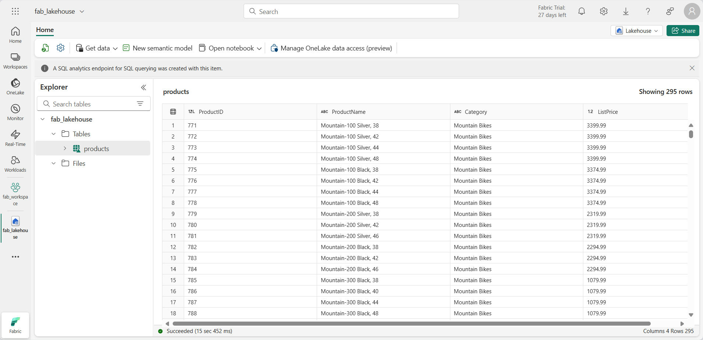

---
lab:
  title: Überwachen der Fabric-Aktivität im Überwachungshub
  module: Monitoring Fabric
---

# Überwachen der Fabric-Aktivität im Überwachungshub

Der *Überwachungshub* in Microsoft Fabric bietet einen zentralen Ort, an dem Sie Aktivitäten überwachen können. Sie können den Überwachungshub verwenden, um Ereignisse zu überprüfen, die sich auf Elemente beziehen, für die Sie eine Berechtigung haben.

Dieses Lab dauert ungefähr **30** Minuten.

> **Hinweis**: Sie benötigen Zugriff auf eine [Microsoft Fabric Mandantschaft](https://learn.microsoft.com/fabric/get-started/fabric-trial), um diese Übung durchzuführen.

## Erstellen eines Arbeitsbereichs

Bevor Sie mit Daten in Fabric arbeiten, erstellen Sie einen Arbeitsbereich in einem Mandanten mit aktivierter Fabric-Kapazität.

1. Wählen Sie auf der [Microsoft Fabric-Homepage](https://app.fabric.microsoft.com/home?experience=fabric) unter `https://app.fabric.microsoft.com/home?experience=fabric` die Option **Datentechnik** aus.
1. Wählen Sie auf der Menüleiste auf der linken Seite **Arbeitsbereiche** aus (Symbol ähnelt &#128455;).
1. Erstellen Sie einen neuen Arbeitsbereich mit einem Namen Ihrer Wahl, und wählen Sie im Bereich **Erweitert** einen Lizenzierungsmodus mit Fabric-Kapazitäten aus (*Testversion*, *Premium* oder *Fabric*).
1. Wenn Ihr neuer Arbeitsbereich geöffnet wird, sollte er leer sein.

    

## Erstellen eines Lakehouse

Jetzt, da Sie einen Arbeitsbereich haben, ist es an der Zeit, ein Data Lakehouse für Ihre Daten zu erstellen.

1. Erstellen Sie auf der Startseite **Datentechnik** ein neues **Lakehouse** mit einem Namen Ihrer Wahl.

    Nach etwa einer Minute wird ein neues Lakehouse erstellt:

    

1. Sehen Sie sich das neue Lakehouse an, und beachten Sie, dass Sie im Bereich **Lakehouse-Explorer** auf der linken Seite Tabellen und Dateien im Lakehouse durchsuchen können:

    Derzeit sind keine Tabellen oder Dateien im Lakehouse vorhanden.

## Erstellen und Überwachen eines Dataflows

In Microsoft Fabric können Sie einen Dataflow (Gen2) verwenden, um Daten aus einer breiten Palette von Quellen aufzunehmen. In dieser Übung werden Sie einen Dataflow verwenden, um Daten aus einer CSV-Datei abzurufen und in eine Tabelle in Ihr Lakehouse zu laden.

1. Wählen Sie auf der Seite **Home** für Ihr Lakehouse im Menü **Daten abrufen** die Option **Neuer Dataflow Gen2**.

   Ein neuer Dataflow mit dem Namen **Dataflow 1** wird erstellt und geöffnet.

    

1. Wählen Sie oben links auf der Dataflow-Seite **Dataflow 1**, um die Details zu sehen und benennen Sie den Dataflow in **Produktdaten abrufen** um.
1. Wählen Sie im Dataflow-Designer die Option **Importieren aus einer Text/CSV-Datei**. Schließen Sie den Assistenten zum Abrufen von Daten ab, um eine Datenverbindung zu erstellen, indem Sie eine Verknüpfung zu `https://raw.githubusercontent.com/MicrosoftLearning/dp-data/main/products.csv` mit anonymer Authentifizierung herstellen. Wenn Sie den Assistenten abgeschlossen haben, wird eine Vorschau der Daten im Dataflow-Designer wie folgt angezeigt:

    

1. Veröffentlichen Sie den Dataflow.
1. Wählen Sie in der Navigationsleiste auf der linken Seite **Monitor**, um den Überwachungsub anzuzeigen und zu sehen, dass Ihr Dataflow in Bearbeitung ist (falls nicht, aktualisieren Sie die Ansicht, bis Sie ihn sehen).

    

1. Warten Sie ein paar Sekunden und aktualisieren Sie dann die Seite, bis der Status des Dataflows **Erfolgreich** lautet.
1. Wählen Sie im Navigationsbereich Ihr Lakehouse aus. Erweitern Sie dann den Ordner **Tabellen**, um zu überprüfen, ob eine Tabelle namens **Produkte** erstellt und vom Dataflow geladen wurde (möglicherweise müssen Sie den Ordner **Tabellen** aktualisieren).

    

## Erstellen und Überwachen eines Spark-Notebooks

In Microsoft Fabric können Sie Notebooks verwenden, um Spark-Code auszuführen.

1. Wählen Sie im Navigationshub**Start** aus. Erstellen Sie auf der Datentechnik-Startseite ein neues **Notebook**.

    Ein neues Notebook mit dem Namen **Notebook 1** wird erstellt und geöffnet.

    

1. Wählen Sie oben links im Notebook **Notebook 1**, um seine Details anzuzeigen, und ändern Sie seinen Namen in **Abfrage Produkte**.
1. Wählen Sie im Notebook-Editor im Bereich **Explorer** die Option **Seehäuser** und fügen Sie das zuvor erstellte Lakehouse hinzu.
1. Wählen Sie im Menü **...** für die Tabelle **Produkte** die Option **Daten laden** > **Spark**. Dadurch wird dem Notebook eine neue Codezelle hinzugefügt, wie hier gezeigt:

    

1. Verwenden Sie die Schaltfläche **&#9655; Alle ausführen**, um alle Zellen im Notebook auszuführen. Es dauert etwa einen Moment, bis die Spark-Sitzung gestartet ist, und dann werden die Ergebnisse der Abfrage unter der Codezelle angezeigt.

    

1. Verwenden Sie in der Symbolleiste die Schaltfläche **&#9723;** (*Sitzung beenden*), um die Spark-Sitzung zu beenden.
1. Wählen Sie in der Navigationsleiste **Überwachung** aus, um den Überwachungshub anzuzeigen, und beachten Sie, dass die Notebook-Aktivität aufgelistet ist.

    

## Überwachen des Verlaufs für ein Element

Einige Elemente in einem Arbeitsbereich können mehrmals ausgeführt werden. Sie können den Überwachungshub verwenden, um den Ausführungsverlauf anzuzeigen.

1. Kehren Sie in der Navigationsleiste zur Seite für Ihren Arbeitsbereich zurück. Verwenden Sie dann die Schaltfläche **&#8635;** (*Jetzt aktualisieren*) für Ihren Dataflow **Produktdaten abrufen**, um ihn erneut auszuführen.
1. Wählen Sie im Navigationsbereich die Seite **Überwachen** aus, um den Überwachungshub anzuzeigen und zu überprüfen, ob der Dataflow läuft.
1. Wählen Sie im Menü **...** für den Dataflow **Produktdaten abrufen** die Option **Historische Ausführungen** aus, um den Ausführungsverlauf für den Dataflow anzuzeigen:

    

1. Wählen Sie im Menü **...** für einen der Datenverkehrsverläufe die Option **Details anzeigen** aus, um die Details des Verlaufs anzuzeigen.
1. Schließen Sie den Bereich **Details** und verwenden Sie die Schaltfläche **Zurück zur Hauptansicht**, um zur Hauptseite des Überwachungshubs zurückzukehren.

## Anpassen von Überwachungshubansichten

In dieser Übung haben Sie nur einige wenige Aktivitäten ausgeführt, so dass es relativ einfach sein sollte, Ereignisse im Überwachungshub zu finden. In einer realen Umgebung müssen Sie jedoch möglicherweise eine große Anzahl von Ereignissen durchsuchen. Die Verwendung von Filtern und anderen Ansichtsanpassungen kann dies vereinfachen.

1. Verwenden Sie im Überwachungshub die Schaltfläche **Filter**, um den folgenden Filter anzuwenden:
    - **Status**: Erfolgreich
    - **Elementtyp**: Dataflow Gen2

    Nachdem der Filter angewendet wurde, werden nur erfolgreiche Ausführungen von Dataflows aufgelistet.

    

1. Verwenden Sie die Schaltfläche **Spaltenoptionen**, um die folgenden Spalten in die Ansicht aufzunehmen (verwenden Sie die Schaltfläche **Anwenden**, um die Änderungen zu übernehmen):
    - Name der Aktivität
    - Status
    - Elementtyp
    - Startzeit
    - Übermittelt von
    - Location
    - Endzeit
    - Duration
    - Aktualisierungstyp

    Möglicherweise müssen Sie einen horizontalen Bildlauf durchführen, um alle Spalten zu sehen:

    

## Bereinigen von Ressourcen

In dieser Übung haben Sie ein Lakehouse, einen Dataflow und ein Spark-Notebook erstellt und den Überwachungshub verwendet, um die Elementaktivität anzuzeigen.

Wenn Sie Ihr Lakehouse erkundet haben, können Sie den Arbeitsbereich löschen, den Sie für diese Übung erstellt haben.

1. Wählen Sie auf der Leiste auf der linken Seite das Symbol für Ihren Arbeitsbereich aus, um alle darin enthaltenen Elemente anzuzeigen.
2. Wählen Sie im Menü **...** auf der Symbolleiste die **Arbeitsbereichseinstellungen** aus.
3. Wählen Sie im Abschnitt **Allgemein** die Option **Diesen Arbeitsbereich entfernen** aus.
