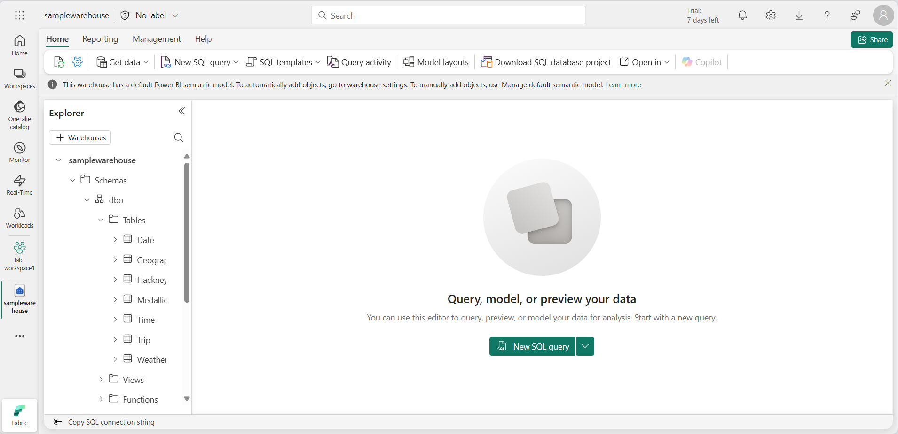

---
lab:
  title: Sicherer Datenzugriff in Microsoft Fabric
  module: Secure data access in Microsoft Fabric
---

# Sicherer Datenzugriff in Microsoft Fabric

Microsoft Fabric verfügt über ein mehrschichtiges Sicherheitsmodell zur Verwaltung des Datenzugriffs. Die Sicherheit kann für einen gesamten Arbeitsbereich, für einzelne Elemente oder über granulare Berechtigungen in jedem Fabric-Modul festgelegt werden. In dieser Übung sichern Sie Daten mithilfe von Arbeitsbereichen, Elementzugriffssteuerungen und OneLake-Datenzugriffsrollen.

Sie werden ungefähr **45** Minuten für dieses Lab benötigen.

## Erstellen eines Arbeitsbereichs

Erstellen Sie vor dem Arbeiten mit Daten in Fabric einen Arbeitsbereich mit aktivierter Fabric-Testversion.

1. Wählen Sie auf der [Microsoft Fabric-Startseite](https://app.fabric.microsoft.com/home?experience=fabric) unter `https://app.fabric.microsoft.com/home?experience=fabric` die Option **Data Warehouse**.
1. Wählen Sie auf der Menüleiste auf der linken Seite **Arbeitsbereiche** aus (Symbol ähnelt &#128455;).
1. Erstellen Sie einen neuen Arbeitsbereich mit einem Namen Ihrer Wahl, und wählen Sie einen Lizenzierungsmodus mit Fabric-Kapazitäten aus (*Testversion*, *Premium* oder *Fabric*).
1. Wenn Ihr neuer Arbeitsbereich geöffnet wird, sollte er leer sein.

    

> **Hinweis:** Wenn Sie einen Arbeitsbereich erstellen, werden Sie automatisch Mitglied der Rolle „Arbeitsbereichsadministrator“. 

## Erstellen eines Data Warehouse

Erstellen Sie als Nächstes ein Data Warehouse im von Ihnen erstellten Arbeitsbereich:

1. Klicken Sie auf der Data Warehouse-Startseite auf die Verknüpfung **Beispiel-Warehouse**, um ein neues Warehouse mit einem Namen Ihrer Wahl zu erstellen.  

    Nach einer Minute wird ein neues Warehouse erstellt:

    

## Erstellen eines Lakehouse
Als Nächstes erstellen Sie ein Lakehouse in dem Arbeitsbereich, den Sie erstellt haben.

1. Wählen Sie in der Menüleiste links **Arbeitsbereiche** aus (das Symbol sieht ähnlich aus wie 🗇).
2. Wählen Sie den von Ihnen erstellten Arbeitsbereich aus.
3. Wählen Sie im Arbeitsbereich die Schaltfläche **+ Neues Element** und dann **Lakehouse** aus. Erstellen Sie ein neues Lakehouse mit einem Namen Ihrer Wahl.

   Nach etwa einer Minute wird ein neues Lakehouse erstellt:

    

4. Wählen Sie die Kachel **Mit Beispieldaten beginnen**. Nach einer Minute wird das Lakehouse mit Daten gefüllt.

## Anwenden von Zugriffskontrollen für Arbeitsbereiche

Arbeitsbereichsrollen werden dazu verwendet, den Zugriff auf Arbeitsbereiche und die darin enthaltenen Inhalte zu steuern. Arbeitsbereichsrollen können zugewiesen werden, wenn Benutzende weitere Informationen zu einem Arbeitsbereich benötigen, wenn sie den Zugriff auf den Arbeitsbereich verwalten oder neue Fabric-Elemente erstellen müssen oder wenn sie bestimmte Berechtigungen zum Anzeigen, Ändern oder Freigeben von Inhalten im Arbeitsbereich benötigen.  

In dieser Übung fügen Sie einen Benutzer bzw. eine Benutzerin zu einer Arbeitsbereichsrolle hinzu, wenden Berechtigungen an und prüfen, was angezeigt wird, wenn die einzelnen Berechtigungen angewendet werden. Sie öffnen zwei Browser und melden sich als unterschiedliche Benutzende an. In einem Browser sind Sie **Arbeitsbereichsadministrator** und im anderen melden Sie sich als zweites, weniger privilegiertes Benutzerkonto an. In einem Browser ändert der Arbeitsbereichsadministrator die Berechtigungen für das zweite Benutzerkonto und im zweiten Browser können Sie die Auswirkungen der Änderung von Berechtigungen sehen.  

1. Wählen Sie auf der Menüleiste auf der linken Seite **Arbeitsbereiche** aus (Symbol ähnelt &#128455;).
2. Wählen Sie als Nächstes den von Ihnen erstellten Arbeitsbereich aus.
3. Wählen Sie oben auf dem Bildschirm **Zugriff verwalten** aus.

> **Hinweis**: Sie finden das angemeldete Benutzerkonto, das Mitglied der Rolle **Arbeitsbereichsadministrator** ist, weil Sie den Arbeitsbereich erstellt haben. Anderen Benutzenden wird noch kein Zugriff auf den Arbeitsbereich zugewiesen.

4. Als Nächstes sehen Sie, was ein Benutzerkonto ohne Berechtigungen für den Arbeitsbereich angezeigt bekommt. Öffnen Sie in Ihrem Browser ein InPrivate-Fenster. Wählen Sie im Microsoft Edge-Browser die Ellipse in der oberen rechten Ecke aus und wählen Sie **Neues InPrivate-Fenster** aus.
5. Geben Sie https://app.fabric.microsoft.com ein und melden Sie sich als zweites Benutzerkonto an, das Sie für Tests verwenden.  
6. Wählen Sie in der linken unteren Ecke Ihres Bildschirms **Microsoft Fabric** und dann **Data Warehouse** aus. Wählen Sie anschließend **Arbeitsbereiche** aus (das Symbol sieht ähnlich aus wie &#128455;).  

> **Hinweis:** Das zweite Benutzerkonto hat keinen Zugriff auf den Arbeitsbereich, sodass es nicht angezeigt werden kann.

7. Als Nächstes weisen Sie dem zweiten Benutzerkonto die Rolle **Betrachter im Arbeitsbereich** zu und sehen, dass die Rolle Lesezugriff auf das Warehouse im Arbeitsbereich gewährt.  
8. Kehren Sie zum Browserfenster zurück, in dem Sie als Arbeitsbereichsadministrator angemeldet sind. Stellen Sie sicher, dass Sie sich noch auf der Seite befinden, auf der der von Ihnen erstellte Arbeitsbereich angezeigt wird. Er sollte Ihre neuen Arbeitsbereichselemente und das Musterlager und das Lakehouse am unteren Rand der Seite aufgeführt haben.
9. Wählen Sie **Zugriff verwalten** oben rechts auf dem Bildschirm.
10. Wählen Sie **Personen oder Gruppen hinzufügen**. Geben Sie die E-Mail des zweiten Benutzerkontos ein, mit dem Sie testen. Wählen Sie **Hinzufügen**, um den Benutzerkonto die Rolle **Betrachter** des Arbeitsbereichs zuzuweisen. 
11. Kehren Sie zum InPrivate-Browserfenster zurück, in dem Sie als zweites Benutzerkonto angemeldet sind, und wählen Sie die Schaltfläche „Aktualisieren“ im Browser, um die dem zweiten Benutzerkonto zugewiesenen Sitzungsberechtigungen zu aktualisieren.
12. Wählen Sie das Symbol **Arbeitsbereiche** in der linken Menüleiste (das Symbol sieht ähnlich aus wie &#128455;) und wählen Sie den Namen des Arbeitsbereichs aus, den Sie als Benutzerkonto mit Administratorrechten für den Arbeitsbereich erstellt haben. Das zweite Benutzerkonto kann nun alle Elemente im Arbeitsbereich sehen, da ihm die Rolle **Betrachter im Arbeitsbereich** zugewiesen wurde.

    

13. Wählen Sie das Warehouse aus und öffnen Sie es.
14. Wählen Sie die Tabelle **Datum** und warten Sie, bis die Zeilen geladen sind. Sie können die Zeilen sehen, da Sie als Mitglied der Rolle „Betrachter im Arbeitsbereich“ über CONNECT- und ReadData-Berechtigungen für Tabellen im Warehouse verfügen. Weitere Informationen zu den Rechten, die der Rolle „Betrachter im Arbeitsbereich“ gewährt werden, finden Sie unter [Arbeitsbereichsrollen](https://learn.microsoft.com/en-us/fabric/data-warehouse/workspace-roles).
15. Wählen Sie als Nächstes das Symbol **Arbeitsbereiche** in der linken Menüleiste und wählen Sie dann das Lakehouse.
16. Wenn sich das Lakehouse öffnet, klicken Sie auf das Dropdown-Feld in der oberen rechten Ecke des Bildschirms, auf dem **Lakehouse** steht, und wählen Sie **SQL-Analyseendpunkt**.
17. Wählen Sie die Tabelle **publicholidays** und warten Sie, bis die Daten angezeigt werden. Daten in der Lakehouse-Tabelle können vom SQL-Analyseendpunkt gelesen werden, da das Benutzerkonto Mitglied der Rolle „Betrachter im Arbeitsbereich“ ist, die Leseberechtigungen für den SQL-Analyseendpunkt gewährt.

## Anwenden der Element-Zugriffskontrolle

Elementberechtigungen steuern den Zugriff auf einzelne Fabric-Elemente in einem Arbeitsbereich, z. B. Warehouses, Lakehouses und semantische Modelle. In dieser Übung entfernen Sie die in der vorherigen Übung angewendeten **Betrachter im Arbeitsbereich**-Berechtigungen und wenden dann Berechtigungen auf Elementebene für das Warehouse an, sodass ein weniger privilegiertes Benutzerkonto nur die Warehouse-Daten, nicht aber die Lakehouse-Daten einsehen kann.

1. Kehren Sie zu dem Browserfenster zurück, in dem Sie als Arbeitsbereichsadministrator angemeldet sind. Wählen Sie **Arbeitsbereiche** aus dem linken Navigationsbereich aus. 
2. Wählen Sie den Arbeitsbereich, den Sie erstellt haben, um ihn zu öffnen.
3. Wählen Sie **Zugriff verwalten** am oberen Rand des Bildschirms.
4. Wählen Sie das Wort **Betrachter** unter dem Namen des zweiten Benutzerkontos. Wählen Sie in dem eingeblendeten Menü **Entfernen**.

   

5. Schließen Sie den Abschnitt **Zugriff verwalten**.
6. Bewegen Sie den Mauszeiger im Arbeitsbereich über den Namen Ihres Lagers und eine Ellipse (**...**) erscheint. Markieren Sie die Ellipse und wählen Sie **Berechtigungen verwalten**.

7. Wählen Sie **Benutzer hinzufügen** und geben Sie den Namen des zweiten Benutzerkontos ein. 
8. Im eingeblendeten Feld markieren Sie unter **Zusätzliche Berechtigungen** **Alle Daten mit SQL lesen (ReadData)** und deaktivieren alle anderen Kontrollkästchen.

    

9. Klicken Sie auf **Gewähren**.

10. Kehren Sie zum Browserfenster zurück, in dem Sie als zweites Benutzerkonto angemeldet sind. Aktualisieren Sie die Browseransicht.  

11. Das zweite Benutzerkonto hat keinen Zugriff mehr auf den Arbeitsbereich und hat stattdessen nur Zugriff auf das Warehouse. Sie können Arbeitsbereiche im linken Navigationsbereich nicht mehr durchsuchen, um das Warehouse zu finden. Wählen Sie **OneLake** im linken Navigationsmenü, um das Warehouse zu finden. 

12. Wählen Sie das Warehouse aus. Wählen Sie auf dem angezeigten Bildschirm die Option **Öffnen** in der oberen Menüleiste aus.

13. Wenn die Warehouse-Ansicht angezeigt wird, wählen Sie die **Datumstabelle** aus, um Tabellendaten anzuzeigen. Die Zeilen sind sichtbar, weil das Benutzerkonto immer noch Lesezugriff auf das Warehouse hat, weil die ReadData-Berechtigung durch die Verwendung von Elementberechtigungen auf das Warehouse angewendet wurde.

## Anwenden von OneLake-Datenzugriffsrollen in einem Lakehouse

Mit OneLake-Datenzugriffsrollen können Sie benutzerdefinierte Rollen in einem Lakehouse erstellen und Leseberechtigungen für von Ihnen angegebene Ordner erteilen. OneLake-Datenzugriffsrollen sind derzeit ein Vorschaufeature.

In dieser Übung werden Sie eine Elementberechtigung zuweisen und eine OneLake-Datenzugriffsrolle erstellen und damit experimentieren, wie diese zusammenarbeiten, um den Zugriff auf Daten in einem Lakehouse einzuschränken.  

1. Bleiben Sie im Browser, in dem Sie als zweites Benutzerkonto angemeldet sind.  
2. Wählen Sie in der linken Navigationsleiste **OneLake** aus. Das Lakehouse wird dem zweiten Benutzerkonto nicht angezeigt.  
3. Kehren Sie zum Browser zurück, in dem Sie als Arbeitsbereichsadministrator angemeldet sind.
4. Wählen Sie im linken Menü **Arbeitsbereiche** und dann Ihren Arbeitsbereich aus. Bewegen Sie den Mauszeiger über den Namen des Lakehouses.  
5. Wählen Sie rechts neben der Ellipse (**...**) **Berechtigungen verwalten** aus.

      

6. Wählen Sie auf dem angezeigten Bildschirm **Benutzer hinzufügen** aus. 
7. Weisen Sie das zweite Benutzerkonto dem Lakehouse zu und stellen Sie sicher, dass keines der Kontrollkästchen im Fenster **Personen Zugriff gewähren** aktiviert ist.  

      

8. Klicken Sie auf **Gewähren**. Das zweite Benutzerkonto verfügt jetzt über Leseberechtigungen für das Lakehouse. Die Leseberechtigung erlaubt es den Benutzenden nur, die Metadaten für das Lakehouse zu sehen, nicht aber die zugrunde liegenden Daten. Als Nächstes überprüfen wir dies.
9. Kehren Sie zum Browser zurück, in dem Sie als zweites Benutzerkonto angemeldet sind. Aktualisieren Sie den Browser.
10. Wählen Sie im linken Navigationsbereich **OneLake** aus.  
11. Wählen Sie das Lakehouse aus und öffnen Sie es. 
12. Wählen Sie in der oberen Menüleiste **Öffnen** aus. Sie können die Tabellen oder Dateien nicht erweitern, obwohl Leseberechtigungen erteilt wurden. Als Nächstes gewähren Sie dem zweiten Benutzerkonto Zugriff auf einen bestimmten Ordner mithilfe von OneLake-Datenzugriffsberechtigungen.
13. Kehren Sie zum Browser zurück, in dem Sie als Arbeitsbereichsadministrator angemeldet sind.
14. Wählen Sie auf der linken Navigationsleiste **Arbeitsbereiche** aus.
15. Wählen Sie Ihren Arbeitsbereichsnamen aus.
16. Wählen Sie das Lakehouse aus.
1. Wenn das Lakehouse geöffnet wird, wählen Sie in der oberen Menüleiste **OneLake-Datenzugriff verwalten** aus und aktivieren Sie die Funktion, indem Sie auf die Schaltfläche **Weiter** klicken.

      

14. Wählen Sie auf dem angezeigten Bildschirm **OneLake-Datenzugriff verwalten (Vorschau)** eine neue Rolle aus.
  
      

15. Erstellen Sie eine neue Rolle mit dem Namen **publicholidays**, die nur auf den publicholidays-Ordner zugreifen kann, wie im Screenshot unten gezeigt.

      

16. Wenn die Erstellung der Rolle abgeschlossen ist, wählen Sie **Rolle zuweisen** und weisen die Rolle Ihrem zweiten Benutzerkonto zu, wählen **Hinzufügen** und wählen dann **Speichern**.
 
       

17. Kehren Sie zum Browser zurück, in dem Sie als zweites Benutzerkonto angemeldet sind. Vergewissern Sie sich, dass Sie sich noch auf der Seite befinden, auf der das Lakehouse geöffnet ist. Aktualisieren Sie den Browser.  
18. Wählen Sie die Tabelle **publicholidays** und warten Sie, bis die Daten geladen wurden. Das Benutzerkonto kann nur auf die Daten in der publicholidays-Tabelle zugreifen, da dem Benutzerkonto die benutzerdefinierte OneLake Datenzugriffsrolle zugewiesen wurde. Die Rolle erlaubt es ihnen, nur die Daten in der publicholidays-Tabelle zu finden, nicht aber die Daten in anderen Tabellen, Dateien oder Ordnern.

       

## Bereinigen von Ressourcen

In dieser Übung haben Sie Daten mithilfe von Arbeitsbereichszugriffssteuerelementen, Elementzugriffssteuerelementen und OneLake-Datenzugriffsrollen gesichert.

1. Wählen Sie in der linken Navigationsleiste das Symbol für Ihren Arbeitsbereich aus, um alle darin enthaltenen Elemente anzuzeigen.
2. Wählen Sie auf der oberen Symbolleiste im Menü die Option **Arbeitsbereichseinstellungen** aus.
3. Wählen Sie im Abschnitt **Allgemein** die Option **Diesen Arbeitsbereich entfernen** aus.
