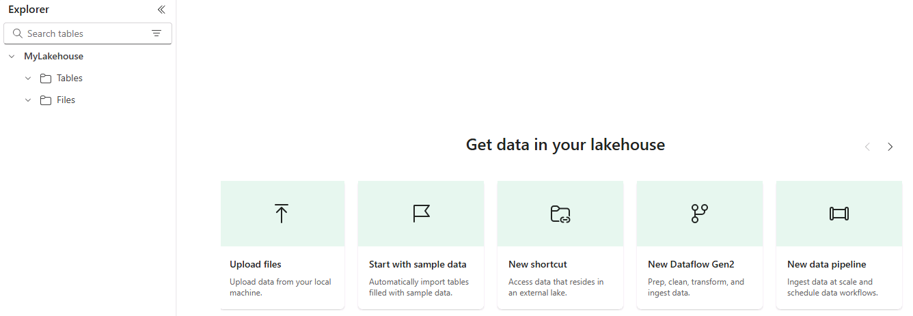

---
lab:
  title: Implementieren von Bereitstellungspipelines in Microsoft Fabric
  module: Implement CI/CD in Microsoft Fabric
---

# Implementieren von Bereitstellungspipelines in Microsoft Fabric

Mit Bereitstellungspipelines in Microsoft Fabric können Sie den Prozess des Kopierens von Änderungen am Inhalt von Fabric-Elementen zwischen Umgebungen wie Entwicklung, Test und Produktion automatisieren. Sie können Bereitstellungspipelines verwenden, um Inhalte zu entwickeln und zu testen, bevor sie die Endbenutzenden erreichen. In dieser Übung erstellen Sie eine Bereitstellungspipeline und weisen der Pipeline Phasen zu. Dann erstellen Sie einige Inhalte in einem Entwicklungsarbeitsbereich und verwenden Bereitstellungspipelines, um sie zwischen den Pipelinestufen Entwicklung, Test und Produktion zu verteilen.

> **Hinweis**: Um diese Übung durchführen zu können, müssen Sie Mitglied der Admin-Rolle des Fabric-Arbeitsbereichs sein. Um Rollen zuzuweisen, siehe [Rollen in Arbeitsbereichen in Microsoft Fabric](https://learn.microsoft.com/en-us/fabric/get-started/roles-workspaces).

Dieses Lab dauert etwa **20** Minuten.

## Erstellen von Arbeitsbereichen

Erstellen Sie drei Arbeitsbereiche, in denen die Fabric-Testversion aktiviert ist.

1. Navigieren Sie in einem Browser unter `https://app.fabric.microsoft.com/home?experience=fabric` zur [Microsoft Fabric-Startseite](https://app.fabric.microsoft.com/home?experience=fabric) und melden Sie sich mit Ihren Fabric-Anmeldeinformationen an.
2. Wählen Sie auf der Menüleiste auf der linken Seite **Arbeitsbereiche** aus (Symbol ähnelt &#128455;).
3. Erstellen Sie einen neuen Arbeitsbereich mit dem Namen Entwicklung und wählen Sie einen Lizenzierungsmodus, der Fabric-Kapazität beinhaltet (*Trial*, *Premium* oder *Fabric*).
4. Wiederholen Sie die Schritte 1 und 2 und erstellen Sie zwei weitere Arbeitsbereiche mit den Namen Test und Produktion. Ihre Arbeitsbereiche sind: Entwicklung, Test und Produktion.
5. Wählen Sie das Symbol **Arbeitsbereiche** in der Menüleiste auf der linken Seite und stellen Sie fest, dass es drei Arbeitsbereiche gibt: Entwicklung, Test und Produktion

> **Hinweis**: Wenn Sie aufgefordert werden, einen eindeutigen Namen für die Arbeitsbereiche einzugeben, hängen Sie eine oder mehrere Zufallszahlen an die Wörter an: Entwicklung, Test oder Produktion.

## Erstellen einer Bereitstellungspipeline

Als Nächstes erstellen Sie eine Bereitstellungspipeline.

1. Wählen Sie in der Menüleiste auf der linken Seite **Arbeitsbereiche** aus.
2. Wählen Sie **Bereitstellungspipelines**, dann **Neue Pipeline**.
3. Geben Sie im Fenster **Neue Bereitstellungspipeline hinzufügen** der Pipeline einen eindeutigen Namen und wählen Sie **Weiter**.
4. Wählen Sie im Fenster der neuen Pipeline **Erstellen und fortfahren**.

## Arbeitsbereiche den Phasen einer Bereitstellungspipeline zuweisen

Weisen Sie den Phasen der Bereitstellungspipeline Arbeitsbereiche zu.

1. Wählen Sie in der linken Menüleiste die Pipeline, die Sie erstellt haben. 
2. Erweitern Sie in dem daraufhin angezeigten Fenster die Optionen unter **Arbeitsbereich zuweisen** für jede Bereitstellungsphase und wählen Sie den Namen des Arbeitsbereichs aus, der dem Namen der Phase entspricht.
3. Markieren Sie das Häkchen **Zuweisen** für jede Bereitstellungsphase.

  

## Inhalt erstellen

Es wurden noch keine Fabric-Elemente in Ihren Arbeitsbereichen erstellt. Als Nächstes erstellen Sie ein Lakehouse im Entwicklungsarbeitsbereich.

1. Wählen Sie in der Menüleiste auf der linken Seite **Arbeitsbereiche** aus.
2. Wählen Sie den Arbeitsbereich **Entwicklung**.
3. Wählen Sie **Neues Element** aus.
4. In dem erscheinenden Fenster wählen Sie **Seehaus** und im Fenster **Neues Lakehouse** nennen Sie das Lakehouse **LabLakehouse**.
5. Klicken Sie auf **Erstellen**.
6. Wählen Sie im Fenster Lakehouse Explorer **Mit Beispieldaten beginnen**, um das neue Lakehouse mit Daten zu füllen.

  

7. Wählen Sie das Beispiel **NYCTaxi**.
8. Wählen Sie in der Menüleiste auf der linken Seite die von Ihnen erstellte Pipeline.
9. Wählen Sie die **Bereitstellungsphase**, und unter dem Canvas der Bereitstellungspipeline sehen Sie das von Ihnen erstellte Lakehouse als Phasenelement. Am linken Rand der **Testphase** befindet sich ein **X** innerhalb eines Kreises. Das **X** zeigt an, dass die Entwicklungs- und Testphasen nicht synchronisiert sind.
10. Wählen Sie die Phase **Test** aus. Unter der Entwurfsübersicht für die Bereitstellung können Sie sehen, dass das von Ihnen erstellte Lakehouse nur ein Element der Phase „Quelle“ ist, die sich in diesem Fall auf die Phase **Entwicklung** bezieht.  

  

## Inhalte zwischen den Phasen bereitstellen

Stellen Sie das Lakehouse von der **Entwicklungsphase** in die **Testphase** und **Produktionsphase** ein.
1. Wählen Sie in der **Entwicklungsphase** der Pipeline die Schaltfläche **Bereitstellen** aus, um das Lakehouse in seinem aktuellen Zustand in die Textphase zu kopieren. 
2. Wählen Sie im Fenster **Zur nächsten Stufe verlagern** die Option **Verlagern**.
3. Zwischen der Test- und der Produktionsphase befindet sich ein orangefarbenes X. Wählen Sie den nach unten gerichteten Pfeil unter dem orangefarbenen X aus. Das Lakehouse befindet sich in der Entwicklungs- und Testphase, aber noch nicht in der Produktionsphase.
4. Wählen Sie in der Phase **Test** die Option **Einsetzen**.
5. Wählen Sie im Fenster **Zur nächsten Stufe verlagern** die Option **Verlagern**. Das grüne Häkchen zwischen den Etappen zeigt an, dass alle Etappen synchronisiert sind und denselben Inhalt enthalten.
6. Die Verwendung von Bereitstellungspipelines zur Bereitstellung zwischen den Phasen aktualisiert auch den Inhalt in den Arbeitsbereichen, die der Bereitstellungsphase entsprechen. Lassen Sie uns das bestätigen.
7. Wählen Sie in der Menüleiste auf der linken Seite **Arbeitsbereiche** aus.
8. Wählen Sie den Arbeitsbereich **Test**. Das Lakehouse wurde dort kopiert.
9. Öffnen Sie den Arbeitsbereich **Produktion** über das Symbol **Arbeitsbereiche** im linken Menü. Das Lakehouse wurde ebenfalls in den Arbeitsbereich Produktion kopiert.

## Bereinigen

In dieser Übung haben Sie eine Bereitstellungspipeline erstellt und der Pipeline Phasen zugewiesen. Dann haben Sie Inhalte in einem Entwicklungsarbeitsbereich erstellt und mithilfe von Bereitstellungspipelines zwischen den Pipelinestufen bereitgestellt.

- Wählen Sie in der linken Navigationsleiste das Symbol für jeden Arbeitsbereich, um alle darin enthaltenen Elemente anzuzeigen.
- Wählen Sie auf der oberen Symbolleiste im Menü die Option Arbeitsbereichseinstellungen aus.
- Wählen Sie im Abschnitt Allgemein die Option Diesen Arbeitsbereich entfernen aus.
