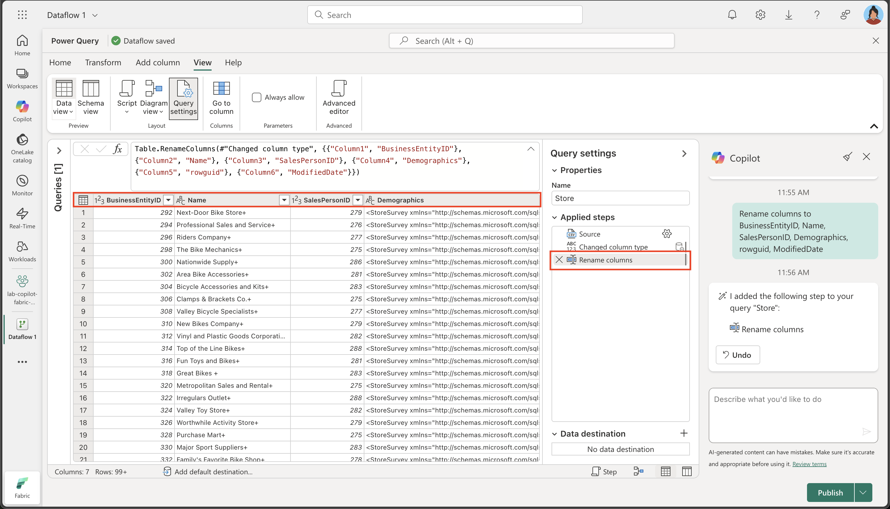
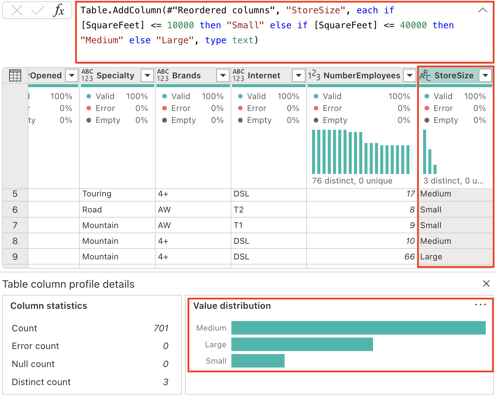
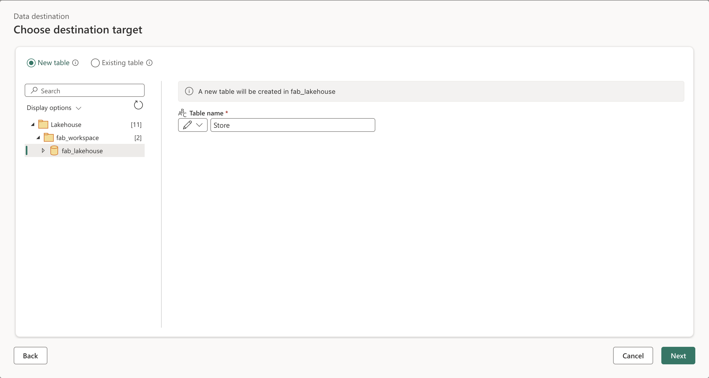

---
lab:
  title: Intelligenteres Arbeiten mit Copilot in Microsoft Fabric Dataflow Gen2
  module: Get started with Copilot in Fabric for data engineering
---

# Intelligenteres Arbeiten mit Copilot in Microsoft Fabric Dataflow Gen2

In Microsoft Fabric stellen Dataflows (Gen2) eine Verbindung mit verschiedenen Datenquellen her und führen Transformationen in Power Query Online durch. Diese können dann in Datenpipelines zum Erfassen von Daten in einem Lakehouse- oder einem anderen Analysespeicher, oder zum Definieren eins Datasets für einen Power BI-Bericht verwendet werden. Dieses Lab bietet eine Einführung in Copilot in Dataflows (Gen2), anstatt sich auf die Erstellung einer komplexen Unternehmenslösung zu konzentrieren.

Diese Übung dauert ca. **30** Minuten.

## Lerninhalte

Durch Abschluss dieses Labs lernen Sie Folgendes:

- Verwenden von Copilot in Microsoft Fabric Dataflow Gen2, um Datentransformationsaufgaben zu beschleunigen
- Erfassen, Bereinigen und Transformieren von Daten mithilfe von Power Query Online mit Copilot-Unterstützung
- Anwenden von bewährten Methoden für die Datenqualität an, z. B. das Umbenennen von Spalten, das Entfernen unerwünschter Zeichen und das Festlegen geeigneter Datentypen
- Analysieren und Erweitern von XML-Daten innerhalb eines Dataflows
- Kategorisieren fortlaufender Daten in aussagekräftige Gruppen zur Analyse
- Veröffentlichen transformierter Daten in einem Lakehouse und Validieren der Ergebnisse
- Nutzen der KI-gestützten Datentechnik zur Verbesserung der Produktivität und Datenqualität

## Vor der Installation

Sie benötigen eine [Microsoft Fabric-Kapazität (F2 oder höher)](https://learn.microsoft.com/fabric/fundamentals/copilot-enable-fabric) mit aktiviertem Copilot, um diese Übung abzuschließen.

## Übungsszenario

Contoso, ein globales Einzelhandelsunternehmen, modernisiert seine Dateninfrastruktur mithilfe von Microsoft Fabric. Als Data Engineer sind Sie mit der Aufbereitung von Speicherinformationen für Analysen beauftragt. Die Rohdaten werden in einer CSV-Datei gespeichert und enthalten eingebettete XML-Felder, inkonsistente Spaltennamen und unerwünschte Zeichen. Sie sollen Copilot in Dataflow Gen2 verwenden, um diese Daten zu erfassen, zu bereinigen, zu transformieren und anzureichern, sodass sie für die Berichterstellung und Analyse im Lakehouse geeignet sind. Diese praktische Übung führt Sie durch die einzelnen Schritte und veranschaulicht, wie Copilot allgemeine Datentechnikaufgaben beschleunigt und vereinfacht.

## Erstellen eines Arbeitsbereichs

Erstellen Sie vor dem Arbeiten mit Daten in Fabric einen Arbeitsbereich mit aktivierter Fabric-Version. Ein Arbeitsbereich dient als Container für alle Ihre Fabric-Elemente und bietet Zusammenarbeitsmöglichkeiten für Teams.

1. Navigieren Sie in einem Browser unter `https://app.fabric.microsoft.com/home?experience=fabric` zur [Microsoft Fabric-Startseite](https://app.fabric.microsoft.com/home?experience=fabric) und melden Sie sich mit Ihren Fabric-Anmeldeinformationen an.

1. Wählen Sie auf der Menüleiste auf der linken Seite **Arbeitsbereiche** aus (Symbol ähnelt &#128455;).

1. Erstellen Sie einen neuen Arbeitsbereich mit einem Namen Ihrer Wahl, und wählen Sie einen Lizenzierungsmodus mit Fabric-Kapazitäten aus (*Premium* oder *Fabric*). Beachten Sie, dass die *Testversion* nicht unterstützt wird.

    > **Wichtig:** Für Copilot-Features in Fabric ist eine kostenpflichtige Kapazität (F2 oder höher) erforderlich. Testarbeitsbereiche unterstützen Copilot nicht.

1. Wenn Ihr neuer Arbeitsbereich geöffnet wird, sollte er leer sein.

    

## Erstellen eines Lakehouse

Da Sie nun einen Arbeitsbereich besitzen, ist es an der Zeit, ein Data Lakehouse zu erstellen, in dem Daten erfasst werden sollen.

1. Wählen Sie in der Menüleiste auf der linken Seite **Erstellen** aus. Wählen Sie auf der Seite *Neu* unter dem Abschnitt *Datentechnik* die Option **Lakehouse** aus. Wählen Sie einen eindeutigen Namen Ihrer Wahl aus.

    >**Hinweis**: Wenn die Option **Erstellen** nicht an die Seitenleiste angeheftet ist, müssen Sie zuerst die Ellipses-Option (**…**) auswählen.

    Nach etwa einer Minute wird ein neues leeres Lakehouse erstellt.

    

## Erstellen eines Dataflows (Gen2) zum Erfassen von Daten

Nachdem Sie über ein Lakehouse verfügen, müssen Sie nun einige Daten darin erfassen. Eine Möglichkeit dazu ist das Definieren eines Dataflows, der einen Prozess zum *Extrahieren, Transformieren und Laden* (ETL) kapselt.

1. Wählen Sie auf der Startseite für Ihren Arbeitsbereich **Daten abrufen** > **Neuer Dataflow Gen2** aus. Nach einigen Sekunden wird wie nachfolgend dargestellt der Power Query-Editor für Ihren neuen Dataflow geöffnet:

    

1. Wählen Sie **Importieren aus einer Text-/CSV-Datei** aus, und erstellen Sie eine neue Datenquelle mit den folgenden Einstellungen:

   - **Verknüpfung zur Datei**: *Ausgewählt*
   - **Dateipfad oder URL**: `https://raw.githubusercontent.com/MicrosoftLearning/mslearn-fabric/refs/heads/main/Allfiles/Labs/22a/Store.csv`
   - **Verbindung**: Neue Verbindung erstellen
   - **Datengateway**: (keiner)
   - **Authentifizierungsart**: Anonym
   - **Datenschutzebene**: Keiner

1. Wählen Sie **Weiter** aus, um eine Vorschau der Dateidaten anzuzeigen, und **erstellen** Sie dann die Datenquelle. Der Power Query-Editor zeigt wie folgt die Datenquelle und eine anfängliche Reihe von Abfrageschritten zum Formatieren der Daten an:

    

1. Wählen Sie auf der Registerkarte des Menübands **Start** in der Gruppe **Insights** **Copilot**aus, wie hier gezeigt:
    
    

1. Die Spaltennamen sind derzeit zu generisch und haben keine klare Bedeutung (wahrscheinlich Column1, Column2 usw.). Aussagekräftige Spaltennamen sind entscheidend für das Verständnis von Daten und die Downstreamverarbeitung. Verwenden Sie den folgenden Prompt, um sie zu verfeinern und sicherzustellen, dass sie die beabsichtigten Informationen korrekt vermitteln:

    ```copilot-prompt
    Rename columns to BusinessEntityID, Name, SalesPersonID, Demographics, rowguid, ModifiedDate
    ```

    Beachten Sie, dass die Spaltennamen jetzt präzise und aussagekräftig sind. Darüber hinaus wurde ein zusätzlicher Schritt in die Liste angewendeter Schritte integriert, der zeigt, wie Copilot unter der Haube automatisch Power Query M-Code generiert:
    
    

1. Bestimmte Spalten enthalten ein „+“-Zeichen am Ende ihrer Textwerte. Dies ist ein häufiges Problem mit der Datenqualität, das die Datenanalyse und die Downstreamverarbeitung beeinträchtigen kann. 

    
    
    Entfernen wir diese unerwünschten Zeichen mithilfe des folgenden Prompts:
    
    ```copilot-prompt
    Delete the last character from the columns Name, Demographics, rowguid
    ```
    
    **Warum ist das wichtig?** Das Entfernen überflüssiger Zeichen stellt Datenkonsistenz sicher und verhindert Probleme beim Ausführen von Zeichenfolgenvorgängen oder Datenverknüpfungen im späteren Prozess.

1. Die Tabelle enthält einige redundante Spalten, die entfernt werden müssen, um unser Dataset zu optimieren und die Verarbeitungseffizienz zu verbessern. Verwenden Sie den folgenden Prompt, um die Daten entsprechend zu verfeinern:

    
    
    ```copilot-prompt
    Remove the rowguid and Column7 columns
    ```
    
    **Hinweis:** Die Spalte `rowguid` wird in der Regel für interne Datenbankvorgänge verwendet und wird für die Analyse nicht benötigt. `Column7` scheint eine leere oder irrelevante Spalte zu sein, die keinen Nutzen für das Dataset hat.
    
1. Die Spalte „Demographics“ enthält ein unsichtbares Unicode-Zeichen, die Bytereihenfolge-Marke (Byte Order Mark, BOM) \ufeff, das die XML-Datenanalyse beeinträchtigt. Wir müssen es entfernen, um eine ordnungsgemäße Verarbeitung sicherzustellen. Geben Sie im Copilot-Bereich die folgende Eingabeaufforderung ein:

    ```copilot-prompt
    Remove the Byte Order Mark (BOM) \ufeff from the Demographics column
    ```
    
    **Grundlegendes zu BOM**: Die Bytereihenfolge-Marke ist ein Unicode-Zeichen, das am Anfang von Textdateien angezeigt werden kann, um die Bytereihenfolge der Textcodierung anzugeben. Es ist zwar nützlich für die Erkennung der Dateicodierung, kann aber Probleme verursachen, wenn strukturierte Daten wie XML-Daten analysiert werden.
    
    Sehen Sie sich die Formel an, die zum Entfernen des Zeichens generiert wurde:
    
    
    
1. Wir sind nun bereit, die XML-Daten zu parsen und in separate Spalten zu erweitern. Die Spalte „Demographics“ enthält XML-formatierte Daten, die wertvolle Filialinformationen wie Jahresumsätze, Ladenfläche und andere Geschäftsmetriken enthalten.

    
    
    Geben Sie im Copilot-Bereich die folgende Eingabeaufforderung ein:
    
    ```copilot-prompt
    Parse this XML and expand it's columns
    ```
    
    **Grundlegendes zum XML-Parsing**: XML (Extensible Markup Language) ist ein strukturiertes Datenformat, das häufig zum Speichern hierarchischer Informationen verwendet wird. Durch das Parsen und Erweitern des XML-Codes konvertieren wir geschachtelte Daten in eine flache, tabellarische Struktur, die einfacher zu analysieren ist.
    
    Beachten Sie, dass der Tabelle neue Spalten hinzugefügt wurden (möglicherweise müssen Sie nach rechts scrollen).
    
    

1. Entfernen Sie die Spalte „Demographics“. Sie wird nicht mehr benötigt, da wir alle wertvollen Informationen in separate Spalten extrahiert haben. Geben Sie im Copilot-Bereich die folgende Eingabeaufforderung ein:

    ```copilot-prompt
    Remove the Demographics column.
    ```

    **Gründe für das Entfernen dieser Spalte**: Nachdem wir nun die XML-Daten geparst und einzelne Spalten für jeden Aspekt erstellt haben, ist die ursprüngliche Spalte „Demographics“, die den unformatierten XML-Code enthält, überflüssig. Sie kann bedenkenlos entfernt werden, um das Dataset zu bereinigen.

1. Die Spalte „ModifiedDate“ hat ein kaufmännisches Und-Zeichen (&) am Ende ihrer Werte. Es muss vor dem Parsen entfernt werden, um eine ordnungsgemäße Datenverarbeitung sicherzustellen.

    
    
    Geben Sie im Copilot-Bereich die folgende Eingabeaufforderung ein:
    
    ```copilot-prompt
    Remove the last character from the ModifiedDate
    ```

1. Nun können wir den Datentyp in DateTime konvertieren, um die richtigen Datums-/Uhrzeitvorgänge und Analysen zu ermöglichen. Geben Sie im Copilot-Bereich die folgende Eingabeaufforderung ein:

    ```copilot-prompt
    Set the data type to DateTime
    ```

    **Wichtigkeit des Datentyps**: Die Konvertierung in den richtigen Datentyp ist entscheidend, um eine ordnungsgemäße Sortierung, Filterung und datumsbasierte Berechnungen bei der Downstreamanalyse zu ermöglichen.

    Beachten Sie, dass der Datentyp von „ModifiedDate“ in DateTime geändert wurde:
    
    
    
1. Ändern Sie die Datentypen mehrerer Spalten in numerische Werte, um mathematische Operationen und ordnungsgemäße Aggregationen zu ermöglichen. Geben Sie im Copilot-Bereich die folgende Eingabeaufforderung ein:

    ```copilot-prompt
    Set the data type to whole number for the following columns: AnnualSales, AnnualRevenue, SquareFeet, NumberEmployee
    ```
    
    **Gründe für die Konvertierung in Zahlen**: Numerische Datentypen ermöglichen korrekte mathematische Berechnungen, Aggregationen (Summe, Durchschnitt usw.) und statistische Analysen, die mit textbasierten Daten nicht möglich wären.
    
1. Das Feld „SquareFeet“ enthält numerische Werte im Bereich von 6.000 bis 80.000. Das Erstellen von kategorischen Gruppierungen aus kontinuierlichen numerischen Daten ist ein gängiges analytisches Verfahren, das die Interpretation und Analyse von Daten vereinfacht.

    
    
    Wir generieren eine neue Spalte, um die Filialgröße entsprechend zu kategorisieren. Geben Sie im Copilot-Bereich die folgende Eingabeaufforderung ein:
    
    ```copilot-prompt
    Add a column StoreSize, based on the SquareFeet:
        0 - 10000: Small
        10001 - 40000: Medium
        40001 - 80000: Large
    ```
    
    Beachten Sie, dass eine neue Spalte „StoreSize“ mit einer Formel hinzugefügt wurde, die auf der Spalte „SquareFeet“ basiert. Beachten Sie auch, dass das Spaltenprofil die drei verschiedenen Werte aufweist: Klein, Mittel und Groß.
    
    
    
1. Ändern Sie die Datentypen von Spalten, für die derzeit kein angegebener Typ vorhanden ist. Geben Sie im Copilot-Bereich die folgende Eingabeaufforderung ein:

    ```copilot-prompt
    Set the datatype of the following columns to text: Name, BankName, BusinessType, YearOpened, Specialty, Brands, Internet, StoreSize
    ```
    
    **Datentypkonsistenz**: Das explizite Festlegen von Datentypen stellt ein vorhersagbares Verhalten in Downstreamprozessen sicher und verhindert automatische Typrückschlüsse, die zu unerwarteten Ergebnissen führen können.
    
## Erläuterung zum Code

1. Wir haben mehrere Transformationen durchgeführt. Bitten wir Copilot, die von uns ausgeführten Schritte zusammenzufassen:

    ```copilot-prompt
    Describe this query
    ```
    
    Sie sehen, dass das Ergebnis im Bereich „Copilot“ erscheint. Im Folgenden finden Sie ein Beispiel für die gelieferte Erklärung. Ihre Ergebnisse können geringfügig abweichen, da KI-generierte Inhalte fehlerhaft sein können.
    
    
    
    *Hier finden Sie eine Erläuterung für **Store**: Laden und Transformieren einer CSV-Datei, Analysieren von XML-Daten und Kategorisieren von Filialen nach Größe*
    
    - _**Quelle**: Laden einer CSV-Datei aus einer URL mit einem Pipetrennzeichen und einer bestimmten Codierung_
    - _**Geänderter Spaltentyp**: Ändern der Datentypen der Spalten_
    - _**Spalten umbenennen**: Umbenennen der Spalten in aussagekräftige Namen_
    - _**Benutzerdefiniert**: Entfernen des letzten Zeichens aus den Spalten „Name“, „Demographics“ und „rowguid“_
    - _**Spalten entfernen**: Entfernen der Spalten „rowguid“ und „Column7“_
    - _**Benutzerdefiniert 1**: Entfernen aller vorangestellten Sonderzeichen aus der Spalte „Demographics“_
    - _**Benutzerdefiniert 2**: Parsen der Spalte „Demographics“ als XML und Erweitern derselben in mehrere Spalten_
    - _**Spalten entfernen 1**: Entfernen der ursprünglichen Spalte „Demographics“_
    - _**Spalten transformieren**: Entfernen des letzten Zeichens aus der Spalte „ModifiedDate“_
    - _**Spalten transformieren 1**: Konvertieren der Spalte „ModifiedDate“ in den datetime-Typ_
    - _**Typ ändern**: Ändern der Datentypen der Spalten „AnnualSales“, „AnnualRevenue“, „SquareFeet“ und „NumberEmployees“ in eine ganze Zahl_
    - _**Bedingte Spalte**: Hinzufügen der neuen Spalte „StoreSize“ basierend auf dem Wert „SquareFeet“ und Kategorisieren der Filialen als „Small“, „Medium“ oder „Large“_
    - _**Typ ändern 1**: Ändern der Datentypen mehrerer Spalten in Text_
    
## Hinzufügen eines Datenziels für einen Dataflow

1. Wählen Sie auf der Symbolleiste die Registerkarte **Start** aus, und wählen Sie dann im Dropdownmenü **Datenziel hinzufügen** die Option **Lakehouse** aus.

    > **Hinweis:** Wenn diese Option ausgegraut ist, verfügen Sie möglicherweise bereits über einen Datenzielsatz. Überprüfen Sie das Datenziel unten im Bereich der „Abfrageeinstellungen“ auf der rechten Seite des Power Query-Editors. Wenn ein Ziel bereits festgelegt ist, können Sie es mit dem Zahnradsymbol ändern.

1. Bearbeiten Sie die Verbindung im Dialogfeld **Herstellen einer Verbindung mit dem Datenziel**, und melden Sie sich mit Ihrem Power BI-Unternehmenskonto an, um die Identität festzulegen, die der Dataflow für den Zugriff auf das Lakehouse verwendet.

    

1. Wählen Sie **Weiter** aus, und suchen Sie in der Liste der verfügbaren Arbeitsbereiche nach Ihrem Arbeitsbereich. Wählen Sie in der Liste das Lakehouse aus, das Sie zu Beginn dieser Übung in Ihrem Arbeitsbereich erstellt haben. Geben Sie dann eine neue Tabelle mit dem Namen **Store** an:

    

1. Klicken Sie auf **Weiter** und deaktivieren Sie auf der Seite **Zieleinstellungen wählen** die Option **Automatische Einstellungen verwenden**, wählen Sie **Anhängen** und dann **Einstellungen speichern**.

    > **Hinweis:** Sie sollten den *Power Query-Editor* zum Aktualisieren von Datentypen verwenden. Sie können dies aber auch auf dieser Seite tun, wenn Sie möchten.

    

1. Wählen Sie **Speichern und ausführen** aus, um den Dataflow zu veröffentlichen. Warten Sie dann, bis der **Dataflow 1**-Dataflow in Ihrem Arbeitsbereich erstellt wird.

## Validieren Ihrer Arbeit

Jetzt ist es an der Zeit, den ETL-Prozess aus dem Dataflow zu validieren und sicherzustellen, dass alle Transformationen ordnungsgemäß angewendet wurden.

1. Navigieren Sie zurück zu Ihrem Arbeitsbereich, und öffnen Sie das Lakehouse, das Sie zuvor erstellt haben.

1. Suchen und öffnen Sie im Lakehouse die Tabelle **Store**. (Möglicherweise müssen Sie einige Minuten warten, bevor sie aufgefüllt wird, wenn der Dataflow die Daten verarbeitet.)

1. Beachten Sie die folgenden wichtigen Aspekte Ihrer transformierten Daten:

   - **Spaltennamen**: Vergewissern Sie sich, dass diese mit den von Ihnen angegebenen aussagekräftigen Namen übereinstimmen (BusinessEntityID, Name, SalesPersonID usw.).
   - **Datentypen**: Überprüfen Sie, ob numerische Spalten als Zahlen, DateTime-Spalten als Datum/Uhrzeit und Textspalten als Text angezeigt werden.
   - **Datenqualität**: Bestätigen, dass unerwünschte Zeichen (+, &) entfernt wurden.
   - **XML-Erweiterung**: Sehen Sie sich die einzelnen Spalten an, die aus den ursprünglichen XML-Daten von „Demographics“ extrahiert wurden.
   - **StoreSize-Kategorisierung**: Bestätigen Sie, dass die Kategorien „Small/Medium/Large“ auf Grundlage von SquareFeet-Werten ordnungsgemäß erstellt wurden.
   - **Datenvollständigkeit**: Vergewissern Sie sich, dass während des Transformationsprozesses keine kritischen Daten verloren gegangen sind.

   

    **Warum ist das wichtig?** Die endgültige Tabelle sollte klare, gut strukturierte Daten mit aussagekräftigen Spaltennamen, geeigneten Datentypen und der neuen kategorischen Spalte „StoreSize“ enthalten. Dieses Beispiel veranschaulicht, wie Copilot dabei helfen kann, unformatierte, unübersichtliche Daten in ein bereinigtes, analysierbares Dataset zu transformieren.

## Bereinigen von Ressourcen

Wenn Sie die Untersuchung von Dataflows in Microsoft Fabric abgeschlossen haben, können Sie den Arbeitsbereich löschen, den Sie für diese Übung erstellt haben.

1. Navigieren Sie in Ihrem Browser zu Microsoft Fabric.
1. Wählen Sie auf der Leiste auf der linken Seite das Symbol für Ihren Arbeitsbereich aus, um alle darin enthaltenen Elemente anzuzeigen.
1. Wählen Sie **Arbeitsbereichseinstellungen** und scrollen Sie im Abschnitt **Allgemein** nach unten und wählen Sie **Diesen Arbeitsbereich entfernen**.
1. Wählen Sie **Löschen**, um den Arbeitsbereich zu löschen.

