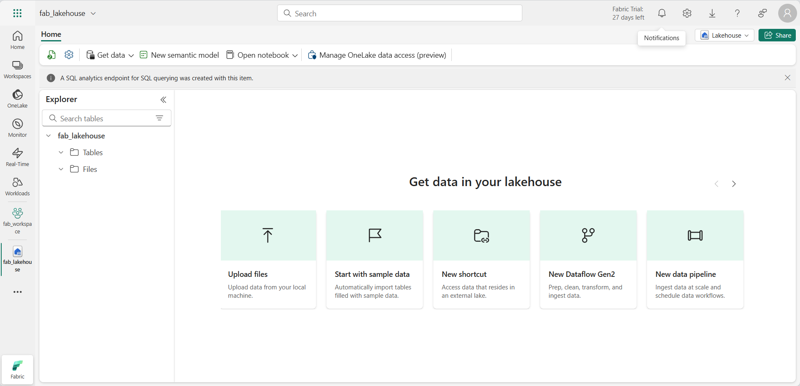
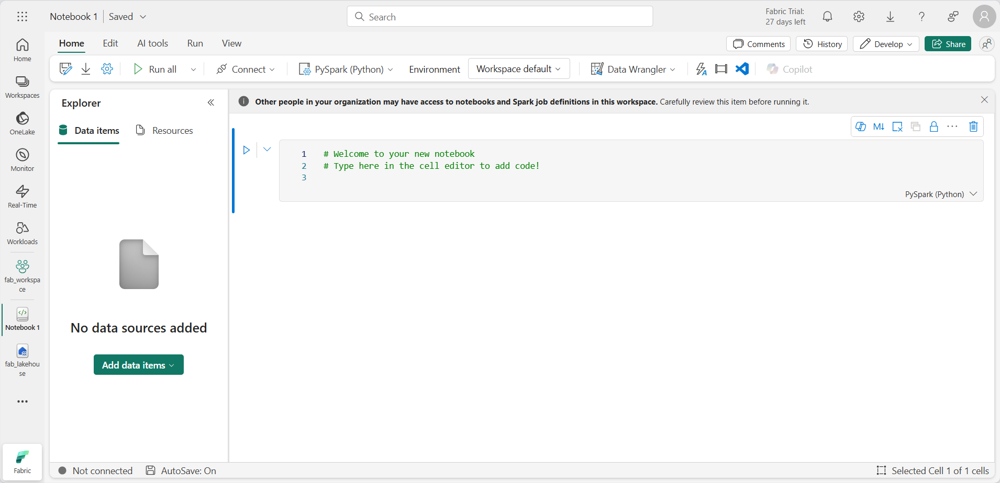
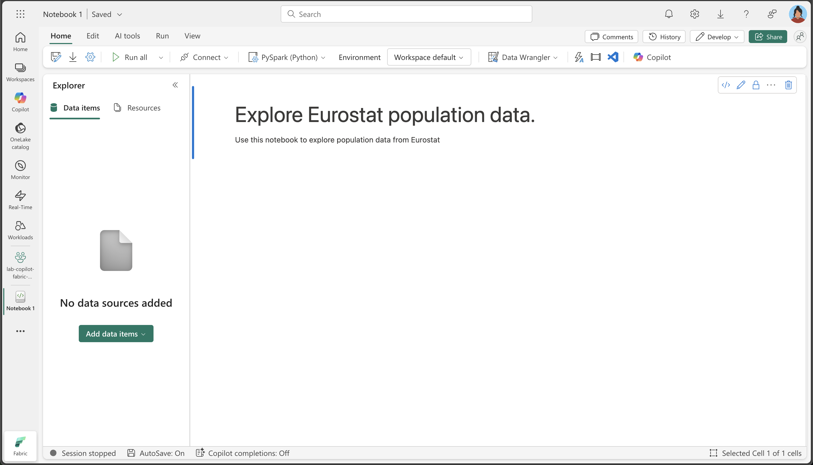

---
lab:
  title: Analysieren von Daten mit Apache Spark und Copilot in Microsoft Fabric-Notebooks
  module: Get started with Copilot in Fabric for data engineering
---

# Analysieren von Daten mit Apache Spark und Copilot in Microsoft Fabric-Notebooks

In diesem Lab verwenden wir Copilot für Fabric Data Engineering, um Daten in einem Lakehouse mithilfe eines Notebooks zu laden, zu transformieren und zu speichern. Notebooks bieten eine interaktive Umgebung, die Code, Visualisierungen und narrativen Text in einem einzigen Dokument kombiniert. Dieses Format erleichtert es Ihnen, Ihren Workflow zu dokumentieren, Ihre Begründung zu erläutern und Ergebnisse mit anderen zu teilen. Mithilfe von Notebooks können Sie Code iterativ entwickeln und testen, Daten bei jedem Schritt visualisieren und einen klaren Überblick über Ihren Analyseprozess behalten. Dieser Ansatz verbessert die Zusammenarbeit, Reproduzierbarkeit und das Verständnis, was Notebooks zu einem idealen Tool für Datentechnik- und -analyseaufgaben macht.

In der Regel müssen Sie beim Arbeiten mit Notebooks für Datentechnik Code in Sprachen wie Python oder Scala schreiben und über ein solides Verständnis von Frameworks und Bibliotheken wie Apache Spark und Pandas verfügen. Dies kann für diejenigen, die noch nicht mit dem Programmieren oder diesen Tools vertraut sind, eine Herausforderung darstellen. Mit Copilot in Fabric-Notebooks können Sie Ihre Datenaufgaben in natürlicher Sprache beschreiben, und Copilot generiert dann den erforderlichen Code für Sie. Dadurch wird ein Großteil der technisch komplexen Aufgaben übernommen, und Sie können sich auf Ihre Analyse konzentrieren.

Diese Übung dauert ca. **30** Minuten.

## Lerninhalte

Nach Abschluss dieses Labs können Sie Folgendes:

- Erstellen und Konfigurieren eines Microsoft Fabric-Arbeitsbereichs und eines Lakehouse für Datentechnikaufgaben
- Verwenden von Copilot in Fabric-Notebooks, um Code aus Prompts in natürlicher Sprache zu generieren
- Erfassen, Bereinigen und Transformieren von Daten mit Apache Spark und Copilot-gestützten Workflows
- Normalisieren und Aufbereiten statistischer Datasets für die Analyse, indem Sie Datentypen aufteilen, filtern und konvertieren
- Speichern von transformierten Daten als Tabelle im Lakehouse für Downstreamanalysen
- Verwenden von Copilot, um Abfragen und Visualisierungen für das Durchsuchen und Validieren von Daten zu generieren
- Bewährte Methoden für die Datenbereinigung, -transformation und zusammenarbeitsorientierte Analyse in Microsoft Fabric

## Vor der Installation

Sie benötigen eine [Microsoft Fabric-Kapazität (F2 oder höher)](https://learn.microsoft.com/fabric/fundamentals/copilot-enable-fabric) mit aktiviertem Copilot, um diese Übung abzuschließen.

> **Hinweis:** Zur Vereinfachung steht Ihnen ein Notebook mit allen Prompts für diese Übung zum Download zur Verfügung:

`https://github.com/MicrosoftLearning/mslearn-fabric/raw/refs/heads/main/Allfiles/Labs/22b/Starter/eurostat-notebook.ipynb`

## Übungsszenario

Stellen wir uns vor, dass Contoso Health, ein Krankenhausnetzwerk mit mehreren Fachbereichen, seine Dienste in der EU erweitern und die projizierten Bevölkerungsdaten analysieren möchte. In diesem Beispiel wird das Dataset für die Bevölkerungsprojektion von [Eurostat](https://ec.europa.eu/eurostat/web/main/home) (statistisches Amt der Europäischen Union) verwendet.

Quelle: EUROPOP2023, Bevölkerung am 1. Januar nach Alter, Geschlecht und Projektionstyp [[proj_23np](https://ec.europa.eu/eurostat/databrowser/product/view/proj_23np?category=proj.proj_23n)], zuletzt aktualisiert am 28. Juni 2023.

## Erstellen eines Arbeitsbereichs

Erstellen Sie vor dem Arbeiten mit Daten in Fabric einen Arbeitsbereich mit aktivierter Fabric-Version. Ein Arbeitsbereich in Microsoft Fabric dient als Umgebung für die Zusammenarbeit, in der Sie alle Ihre Datentechnikartefakte organisieren und verwalten können, einschließlich Lakehouses, Notebooks und Datasets. Stellen Sie sich diesen als Projektordner vor, der alle Ressourcen enthält, die für Ihre Datenanalyse benötigt werden.

1. Navigieren Sie in einem Browser unter `https://app.fabric.microsoft.com/home?experience=fabric` zur [Microsoft Fabric-Startseite](https://app.fabric.microsoft.com/home?experience=fabric) und melden Sie sich mit Ihren Fabric-Anmeldeinformationen an.

1. Wählen Sie auf der Menüleiste auf der linken Seite **Arbeitsbereiche** aus (Symbol ähnelt &#128455;).

1. Erstellen Sie einen neuen Arbeitsbereich mit einem Namen Ihrer Wahl, und wählen Sie einen Lizenzierungsmodus mit Fabric-Kapazitäten aus (*Premium* oder *Fabric*). Beachten Sie, dass die *Testversion* nicht unterstützt wird.
   
    > **Warum ist das wichtig?** Copilot benötigt eine kostenpflichtige Fabric-Kapazität, um zu funktionieren. Dadurch wird sichergestellt, dass Sie Zugriff auf die KI-gestützten Features haben, die beim Generieren von Code in diesem Lab helfen.

1. Wenn Ihr neuer Arbeitsbereich geöffnet wird, sollte er leer sein.

    

## Erstellen eines Lakehouse

Da Sie nun einen Arbeitsbereich besitzen, ist es an der Zeit, ein Lakehouse zu erstellen, in dem Daten erfasst werden sollen. Ein Lakehouse kombiniert die Vorteile eines Data Lake (Speichern von Rohdaten in verschiedenen Formaten) mit einem Data Warehouse (strukturierte Daten, die für Analysen optimiert sind). Es dient sowohl als Speicherort für unsere Rohdaten zur Bevölkerung als auch als Ziel für unser bereinigtes, transformiertes Dataset.

1. Wählen Sie in der Menüleiste auf der linken Seite **Erstellen** aus. Wählen Sie auf der Seite *Neu* unter dem Abschnitt *Datentechnik* die Option **Lakehouse** aus. Wählen Sie einen eindeutigen Namen Ihrer Wahl aus.

    >**Hinweis**: Wenn die Option **Erstellen** nicht an die Seitenleiste angeheftet ist, müssen Sie zuerst die Ellipses-Option (**…**) auswählen.


Nach etwa einer Minute wird ein neues leeres Lakehouse erstellt.



## Erstellen eines Notebooks

Sie können nun ein Fabric-Notizbuch erstellen, um mit Ihren Daten zu arbeiten. Notebooks bieten eine interaktive Umgebung, in der Sie Code schreiben und ausführen, Ergebnisse visualisieren und Ihren Datenanalyseprozess dokumentieren können. Sie eignen sich ideal für explorative Datenanalysen und iterative Entwicklung, da Sie die Ergebnisse der einzelnen Schritte sofort sehen können.

1. Wählen Sie in der Menüleiste auf der linken Seite **Erstellen** aus. Wählen Sie auf der Seite *Neu* im Abschnitt *Datentechnik* die Option **Notebook** aus.

    Ein neues Notebook mit dem Namen **Notebook 1** wird erstellt und geöffnet.

    

1. Fabric weist jedem Notizbuch, das Sie erstellen, einen Namen zu, z. B. Notizbuch 1, Notizbuch 2 usw. Klicken Sie auf das Bedienfeld oberhalb der Registerkarte **Home** im Menü, um den Namen in einen aussagekräftigeren Namen zu ändern.

    

1. Markieren Sie die erste Zelle (die momentan eine Codezelle ist), und verwenden Sie dann in der oberen rechten Symbolleiste die Schaltfläche **M↓**, um sie in eine Abschriftenzelle umzuwandeln. Der in der Zelle enthaltene Text wird dann als formatierter Text angezeigt.

    > **Gründe für die Verwendung von Markdownzellen**: Markdownzellen ermöglichen es Ihnen, Ihre Analyse mit formatiertem Text zu dokumentieren, sodass Ihr Notebook für andere (oder Sie selbst, wenn Sie später darauf zurückkehren) besser lesbar und verständlich wird.

    

1. Verwenden Sie die Taste 🖉 (Bearbeiten), um die Zelle in den Bearbeitungsmodus zu schalten, und ändern Sie dann den Markdown wie unten gezeigt.

    ```md
    # Explore Eurostat population data.
    Use this notebook to explore population data from Eurostat
    ```
    
    
    
    Wenn Sie fertig sind, klicken Sie auf eine beliebige Stelle im Notebook außerhalb der Zelle, um die Bearbeitung zu beenden.

## Anfügen des Lakehouse an Ihr Notebook

Um mit Daten in Ihrem Lakehouse aus dem Notebook zu arbeiten, müssen Sie das Lakehouse an Ihr Notebook anfügen. Diese Verbindung ermöglicht es Ihrem Notebook, aus dem Lakehousespeicher zu lesen und in diesen zu schreiben, wodurch eine nahtlose Integration zwischen Ihrer Analyseumgebung und Ihrem Datenspeicher entsteht.

1. Wählen Sie Ihren neuen Arbeitsbereich in der linken Leiste aus. Sie sehen eine Liste der Elemente, die im Arbeitsbereich enthalten sind, einschließlich Ihres Lakehouses und Ihres Notebooks.

1. Wählen Sie das Lakehouse aus, um den Explorer-Bereich anzuzeigen.

1. Wählen Sie im oberen Menü **Notebook öffnen** und **Vorhandenes Notebook** aus, und öffnen Sie dann das Notebook, das Sie zuvor erstellt haben. Das Notebook sollte nun neben dem Explorer-Bereich geöffnet sein. Erweitern Sie die Lakehouses und dann die Liste „Dateien“. Beachten Sie, dass neben dem Notebook-Editor noch keine Tabelle oder Dateien aufgeführt sind:

    

    > **Was zu sehen ist**: Im Explorer-Bereich auf der linken Seite wird ihre Lakehousestruktur angezeigt. Derzeit ist sie leer, aber während wir Daten laden und verarbeiten, erscheinen Dateien im Abschnitt **Dateien** und Tabellen im Abschnitt **Tabellen**.


## Laden von Daten

Jetzt verwenden wir Copilot, um uns beim Herunterladen von Daten über die Eurostat-API zu unterstützen. Anstatt Python-Code von Grund auf neu zu schreiben, beschreiben wir in natürlicher Sprache, was wir tun möchten, und Copilot generiert dann den entsprechenden Code. Dies veranschaulicht einen der wichtigsten Vorteile der KI-gestützten Programmierung: Sie können sich auf die Geschäftslogik statt auf die Details der technischen Implementierung konzentrieren.

1. Erstellen Sie eine neue Zelle in Ihrem Notebook, und kopieren Sie die folgende Anweisung in die Zelle. Um anzugeben, dass Copilot Code generieren soll, verwenden Sie `%%code` als erste Anweisung in der Zelle. 

    > **Informationen zum Magic-Befehl `%%code`**: Diese spezielle Anweisung teilt Copilot mit, dass Python-Code basierend auf Ihrer Beschreibung in natürlicher Sprache generiert werden soll. Es ist einer von mehreren „Magic-Befehlen“, mit denen Sie effektiver mit Copilot interagieren können.

    ```copilot-prompt
    %%code
    
    Download the following file from this URL:
    
    https://ec.europa.eu/eurostat/api/dissemination/sdmx/2.1/data/proj_23np$defaultview/?format=TSV
     
    Then write the file to the default lakehouse into a folder named temp. Create the folder if it doesn't exist yet.
    ```
    
1. Wählen Sie ▷ **Zelle ausführen** links neben der Zelle aus, um den Code auszuführen.

    Copilot generiert den folgenden Code, der sich je nach Umgebung und den neuesten Updates für Copilot geringfügig unterscheiden kann.
    
    
    
    > **Funktionsweise von Copilot**: Beachten Sie, wie Copilot Ihre Anforderung in natürlicher Sprache in funktionierenden Python-Code umsetzt. Es versteht, dass Sie eine HTTP-Anforderung senden, das Dateisystem verarbeiten und die Daten an einem bestimmten Speicherort in Ihrem Lakehouse speichern müssen.
    
    Im Folgenden finden Sie den vollständigen Code, falls während der Ausführung Ausnahmen auftreten:
    
    ```python
    #### ATTENTION: AI-generated code can include errors or operations you didn't intend. Review the code in this cell carefully before running it.
    
    import requests
    import os
    
    # Define the URL and the local path
    url = "https://ec.europa.eu/eurostat/api/dissemination/sdmx/2.1/data/proj_23np$defaultview/?format=TSV"
    local_path = "/lakehouse/default/Files/temp/"
    file_name = "proj_23np.tsv"
    file_path = os.path.join(local_path, file_name)
    
    # Create the temporary directory if it doesn't exist
    if not os.path.exists(local_path):
        os.makedirs(local_path)
    
    # Download the file
    response = requests.get(url)
    response.raise_for_status()  # Check that the request was successful
    
    # Write the content to the file
    with open(file_path, "wb") as file:
        file.write(response.content)
    
    print(f"File downloaded and saved to {file_path}")
    ```

1. Wählen Sie die Option ▷ **Zelle ausführen** links neben der Zelle aus, um den Code auszuführen und die Ausgabe zu beobachten. Die Datei sollte heruntergeladen und im temporären Ordner Ihres Lakehouse gespeichert werden.

    > **Hinweis**: Möglicherweise müssen Sie Ihre Lakehouse-Dateien aktualisieren, indem Sie die drei Punkte auswählen.
    
    

1. Nachdem sich die Rohdatendatei nun in unserem Lakehouse befindet, müssen wir sie in einen Spark-DataFrame laden, damit wir sie analysieren und transformieren können. Erstellen Sie eine neue Zelle in Ihrem Notebook, und kopieren Sie die folgende Anweisung in die Zelle.

    > **Information** (Informationen): Ein DataFrame ist eine verteilte Datensammlung, die in benannten Spalten organisiert ist, ähnlich wie eine Tabelle in einer Datenbank oder Kalkulationstabelle.

    ```copilot-prompt
    %%code
    
    Load the file 'Files/temp/proj_23np.tsv' into a spark dataframe.
    
    The fields are separated with a tab.
    
    Show the contents of the DataFrame using display method.
    ```

1. Wählen Sie die Option ▷ **Zelle ausführen** links neben der Zelle aus, um den Code auszuführen und die Ausgabe zu beobachten. Der DataFrame sollte die Daten aus der TSV-Datei enthalten. Hier ist ein Beispiel dafür, wie der generierte Code aussehen könnte:

    ```python
    #### ATTENTION: AI-generated code can include errors or operations you didn't intend. Review the code in this cell carefully before running it.
    
    # Load the file 'Files/temp/proj_23np.tsv' into a spark dataframe.
    # The fields have been separated with a tab.
    file_path = "Files/temp/proj_23np.tsv"
    
    spark_df = spark.read.format("csv").option("delimiter", "\t").option("header", "true").load(file_path)
    
    # Show the contents of the DataFrame using display method
    display(spark_df)
    ```

Hier sehen Sie ein Beispiel für eine mögliche Ausgabe:

| freq,projection,sex,age,unit,geo\TIME_PERIOD |      2022  |      2023  |   ...  |      2100  |
| -------------------------------------------- | ---------- | ---------- | ------ | ---------- |
|                         A,BSL,F,TOTAL,PER,AT |   4553444  |   4619179  |   ...  |   4807661  |
|                         A,BSL,F,TOTAL,PER,BE |   5883978  |   5947528  |   ...  |   6331785  |
|                         A,BSL,F,TOTAL,PER,BG |   3527626  |   3605059  |   ...  |   2543673  |
|                                          ... |       ...  |       ...  |   ...  |   5081250  |
|                         A,BSL,F,TOTAL,PER,CY |    463622  |    476907  |   ...  |    504781  |

> **Grundlegendes zur Datenstruktur**: Beachten Sie, dass die erste Spalte mehrere Werte enthält, die durch Kommas getrennt sind (Häufigkeit, Projektionstyp, Geschlecht, Alter, Einheit und geografischer Standort), während die verbleibenden Spalten Jahre mit Bevölkerungswerten darstellen. Diese Struktur ist in statistischen Datasets üblich, muss jedoch für eine effektive Analyse bereinigt werden.

## Transformieren von Daten: Aufteilen von Feldern

Lassen Sie uns nun fortfahren und die Daten transformieren. Wir müssen sicherstellen, dass das erste Feld in separate Spalten aufgeteilt wird. Darüber hinaus müssen wir sicherstellen, dass wir mit den richtigen Datentypen arbeiten und Filter anwenden. 

> **Warum die Felder aufgeteilt werden müssen**: Die erste Spalte enthält mehrere Informationen, die miteinander verkettet sind (Häufigkeit, Projektionstyp, Geschlecht, Altersruppe, Einheit und geografischer Code). Für eine ordnungsgemäße Analyse sollte jeder dieser Aspekte sich in einer eigenen Spalte befinden. Dieser Prozess wird als „Normalisierung“ der Datenstruktur bezeichnet.

1. Erstellen Sie eine neue Zelle in Ihrem Notebook, und kopieren Sie die folgende Anweisung in die Zelle.


    ```copilot-prompt
    %%code
    
    From the currently loaded DataFrame, split the first field 'freq,projection,sex,age,unit,geo\TIME_PERIOD' using a comma into 6 separate fields.
    ```

1. Wählen Sie die Option ▷ **Zelle ausführen** links neben der Zelle aus, um den Code auszuführen und die Ausgabe zu beobachten. Hier sehen Sie ein Beispiel für eine mögliche Ausgabe:

    ```python
    #### ATTENTION: AI-generated code can include errors or operations you didn't intend. Review the code in this cell carefully before running it.
    
    from pyspark.sql.functions import split, col
    
    # Split the first field 'freq,projection,sex,age,unit,geo\TIME_PERIOD' into 6 separate fields
    spark_df = spark_df.withColumn("freq", split(col("freq,projection,sex,age,unit,geo\\TIME_PERIOD"), ",").getItem(0)) \
                       .withColumn("projection", split(col("freq,projection,sex,age,unit,geo\\TIME_PERIOD"), ",").getItem(1)) \
                       .withColumn("sex", split(col("freq,projection,sex,age,unit,geo\\TIME_PERIOD"), ",").getItem(2)) \
                       .withColumn("age", split(col("freq,projection,sex,age,unit,geo\\TIME_PERIOD"), ",").getItem(3)) \
                       .withColumn("unit", split(col("freq,projection,sex,age,unit,geo\\TIME_PERIOD"), ",").getItem(4)) \
                       .withColumn("geo", split(col("freq,projection,sex,age,unit,geo\\TIME_PERIOD"), ",").getItem(5))
    
    # Show the updated DataFrame
    display(spark_df)
    ```

1. Wählen Sie ▷ **Zelle ausführen** links neben der Zelle aus, um den Code auszuführen. Möglicherweise müssen Sie in der Tabelle nach rechts scrollen, um die Felder zu sehen, die der Tabelle hinzugefügt wurden.

    

## Transformieren von Daten: Entfernen von Feldern

Einige Felder in der Tabelle haben keinen Nutzen, da sie nur einen einzelnen eindeutigen Eintrag enthalten. Gemäß den bewährten Methoden sollten sie aus dem Dataset entfernt werden.

> **Datenbereinigungsprinzip**: Spalten mit nur einem eindeutigen Wert bieten keinen analytischen Nutzen und können Ihr Dataset unnötig komplex machen. Das Entfernen vereinfacht die Datenstruktur und verbessert die Leistung. In diesem Fall sind „freq“ (Häufigkeit), „age“ (alle Datensätze zeigen TOTAL) und „unit“ (alle Datensätze zeigen PER für Personen) für alle Zeilen konstant.

1. Erstellen Sie eine neue Zelle in Ihrem Notebook, und kopieren Sie die folgende Anweisung in die Zelle.

    ```copilot-prompt
    %%code
    
    From the currently loaded DataFrame, remove the fields 'freq', 'age', 'unit'.
    ```

1. Wählen Sie die Option ▷ **Zelle ausführen** links neben der Zelle aus, um den Code auszuführen und die Ausgabe zu beobachten. Hier sehen Sie ein Beispiel für eine mögliche Ausgabe:

    ```python
    #### ATTENTION: AI-generated code can include errors or operations you didn't intend. Review the code in this cell carefully before running it.
    
    # Remove the fields 'freq', 'age', 'unit'
    spark_df = spark_df.drop("freq", "age", "unit")
    
    # Show the updated DataFrame
    display(spark_df)
    ```

1. Wählen Sie ▷ **Zelle ausführen** links neben der Zelle aus, um den Code auszuführen.

## Transformieren von Daten: Neuanordnen von Feldern

Wenn Sie Ihre Daten zunächst mit den wichtigsten identifizierenden Spalten organisieren, sind sie leichter lesbar und verständlich. Bei der Datenanalyse ist es üblich, kategorische/dimensionale Spalten (z. B. Projektionstyp, Geschlecht und geografischer Standort) vor den numerischen/Measurespalten (die Bevölkerungswerte nach Jahr) anzuordnen.

1. Erstellen Sie eine neue Zelle in Ihrem Notebook, und kopieren Sie die folgende Anweisung in die Zelle.

    ```copilot-prompt
    %%code
    
    From the currently loaded DataFrame, the fields 'projection', 'sex', 'geo' should be positioned first.
    ```

1. Wählen Sie die Option ▷ **Zelle ausführen** links neben der Zelle aus, um den Code auszuführen und die Ausgabe zu beobachten. Hier sehen Sie ein Beispiel für eine mögliche Ausgabe:

    ```python
    #### ATTENTION: AI-generated code can include errors or operations you didn't intend. Review the code in this cell carefully before running it.
    
    # Reorder the DataFrame with 'projection', 'sex', 'geo' fields first
    new_column_order = ['projection', 'sex', 'geo'] + [col for col in spark_df.columns if col not in {'projection', 'sex', 'geo'}]
    spark_df = spark_df.select(new_column_order)
    
    # Show the reordered DataFrame
    display(spark_df)
    ```

1. Wählen Sie ▷ **Zelle ausführen** links neben der Zelle aus, um den Code auszuführen.

## Transformieren von Daten: Ersetzen von Werten

Das Projektionsfeld enthält derzeit kryptische Codes, die nicht benutzerfreundlich sind. Zur besseren Lesbarkeit und Analyse ersetzen wir diese Codes durch aussagekräftige Namen, die deutlich machen, was jedes Projektionsszenario darstellt.

> **Grundlegendes zu Projektionsszenarios**: Statistische Organisationen verwenden häufig verschiedene Szenarios, um zukünftige Veränderungen der Bevölkerung zu modellieren. Die Baseline stellt das wahrscheinlichste Szenario dar, während Sensitivitätstests zeigen, wie sich die Bevölkerung unter unterschiedlichen Annahmen zu Fruchtbarkeitsraten, Sterblichkeitsraten und Migrationsmustern ändern kann.

1. Erstellen Sie eine neue Zelle in Ihrem Notebook, und kopieren Sie die folgende Anweisung in die Zelle.


    ```copilot-prompt
    %%code
    
    The 'projection' field contains codes that should be replaced with the following values:
        _'BSL' -> 'Baseline projections'.
        _'LFRT' -> 'Sensitivity test: lower fertility'.
        _'LMRT' -> 'Sensitivity test: lower mortality'.
        _'HMIGR' -> 'Sensitivity test: higher migration'.
        _'LMIGR' -> 'Sensitivity test: lower migration'.
        _'NMIGR' -> 'Sensitivity test: no migration'.
    ```

1. Wählen Sie die Option ▷ **Zelle ausführen** links neben der Zelle aus, um den Code auszuführen und die Ausgabe zu beobachten. Hier sehen Sie ein Beispiel für eine mögliche Ausgabe:

    ```python
    #### ATTENTION: AI-generated code can include errors or operations you didn't intend. Review the code in this cell carefully before running it.
    
    from pyspark.sql.functions import when
    
    # Replace projection codes
    spark_df = spark_df.withColumn("projection", 
                                   when(spark_df["projection"] == "BSL", "Baseline projections")
                                   .when(spark_df["projection"] == "LFRT", "Sensitivity test: lower fertility")
                                   .when(spark_df["projection"] == "LMRT", "Sensitivity test: lower mortality")
                                   .when(spark_df["projection"] == "HMIGR", "Sensitivity test: higher migration")
                                   .when(spark_df["projection"] == "LMIGR", "Sensitivity test: lower migration")
                                   .when(spark_df["projection"] == "NMIGR", "Sensitivity test: no migration")
                                   .otherwise(spark_df["projection"]))
    
    # Display the updated DataFrame
    display(spark_df)
    ```

1. Wählen Sie ▷ **Zelle ausführen** links neben der Zelle aus, um den Code auszuführen.

    
    
## Transformieren von Daten: Filtern von Daten

Die Tabelle mit den Bevölkerungsprojektionen enthält zwei Zeilen für Länder, die es als solche nicht gibt: EU27_2020 (*Gesamtsummen für die Europäische Union – 27 Länder*) und EA20 (*Eurozone – 20 Länder*). Wir müssen diese beiden Zeilen entfernen, da die Daten nur das niedrigste Aggregationsintervall haben sollen.

> **Datengranularitätsprinzip**: Für eine detaillierte Analyse ist es wichtig, mit Daten auf möglichst präziser Ebene zu arbeiten. Aggregierte Werte (z. B. EU-Gesamtwerte) können bei Bedarf immer berechnet werden, aber die Aufnahme in Ihr Basisdataset kann zu doppelter Zählung oder Verwirrung bei der Analyse führen.


1. Erstellen Sie eine neue Zelle in Ihrem Notebook, und kopieren Sie die folgende Anweisung in die Zelle.

    ```copilot-prompt
    %%code
    
    Filter the 'geo' field and remove values 'EA20' and 'EU27_2020' (these are not countries).
    ```

1. Wählen Sie die Option ▷ **Zelle ausführen** links neben der Zelle aus, um den Code auszuführen und die Ausgabe zu beobachten. Hier sehen Sie ein Beispiel für eine mögliche Ausgabe:

    ```python
    #### ATTENTION: AI-generated code can include errors or operations you didn't intend. Review the code in this cell carefully before running it.
    
    # Filter out 'geo' values 'EA20' and 'EU27_2020'
    spark_df = spark_df.filter((spark_df['geo'] != 'EA20') & (spark_df['geo'] != 'EU27_2020'))
    
    # Display the filtered DataFrame
    display(spark_df)
    ```

1. Wählen Sie ▷ **Zelle ausführen** links neben der Zelle aus, um den Code auszuführen.

    Die Tabelle für die Bevölkerungsprojektion beinhaltet auch das Feld „sex“, das die folgenden eindeutigen Werte enthält:
    
    - M: Male
    - F: Weiblich
    - T: Total (Summe von männlich + weiblich)

    Auch hier müssen wir die Summen entfernen, um die Daten auf der niedrigsten Detailebene zu halten.

    > **Gründe für das Entfernen von Summen**: Ähnlich wie bei den geografischen Aggregationen sollen nur die einzelnen Geschlechtskategorien (männlich und weiblich) beibehalten und die Gesamtwerte ausgeschlossen werden. Das ermöglicht eine flexiblere Analyse. Sie können die Werte von „Male“ und „Female“ jederzeit addieren, um Summen zu erhalten, aber Sie können die Summen nicht wieder in die einzelnen Summanden aufteilen.

1. Erstellen Sie eine neue Zelle in Ihrem Notebook, und kopieren Sie die folgende Anweisung in die Zelle.

    ```copilot-prompt
    %%code
    
    Filter the 'sex' field and remove 'T' (these are totals).
    ```

1. Wählen Sie die Option ▷ **Zelle ausführen** links neben der Zelle aus, um den Code auszuführen und die Ausgabe zu beobachten. Hier sehen Sie ein Beispiel für eine mögliche Ausgabe:

    ```python
    #### ATTENTION: AI-generated code can include errors or operations you didn't intend. Review the code in this cell carefully before running it.
    
    # Filter out 'sex' values 'T'
    spark_df = spark_df.filter(spark_df['sex'] != 'T')
    
    # Display the filtered DataFrame
    display(spark_df)
    ```

1. Wählen Sie ▷ **Zelle ausführen** links neben der Zelle aus, um den Code auszuführen.

## Transformieren von Daten: Kürzen von Leerzeichen

Einige Feldnamen in der Tabelle für die Bevölkerungsprojektion haben ein Leerzeichen am Ende. Wir müssen einen Kürzungsvorgang auf die Namen dieser Felder anwenden.

> **Auswirkungen auf die Datenqualität**: Zusätzliche Leerzeichen in Spaltennamen können Probleme verursachen, wenn Daten abgefragt oder Visualisierungen erstellt werden. Dies ist ein häufiges Problem mit der Datenqualität, insbesondere wenn Daten aus externen Quellen stammen oder aus anderen Systemen exportiert werden. Das Kürzen von Leerzeichen sorgt für Konsistenz und verhindert Probleme, die später schwer zu debuggen sind.

1. Erstellen Sie eine neue Zelle in Ihrem Notebook, und kopieren Sie die folgende Anweisung in die Zelle.

    ```copilot-prompt
    %%code
    
    Strip spaces from all field names in the dataframe.
    ```

1. Wählen Sie die Option ▷ **Zelle ausführen** links neben der Zelle aus, um den Code auszuführen und die Ausgabe zu beobachten. Hier sehen Sie ein Beispiel für eine mögliche Ausgabe:

    ```python
    #### ATTENTION: AI-generated code can include errors or operations you didn't intend. Review the code in this cell carefully before running it.
    
    from pyspark.sql.functions import col
    
    # Strip spaces from all field names
    spark_df = spark_df.select([col(column).alias(column.strip()) for column in spark_df.columns])
    
    # Display the updated DataFrame
    display(spark_df)
    ```

1. Wählen Sie ▷ **Zelle ausführen** links neben der Zelle aus, um den Code auszuführen.

## Transformieren von Daten: Datentypkonvertierung

Wenn wir die Daten später ordnungsgemäß analysieren möchten (z. B. mit Power BI oder SQL), müssen wir sicherstellen, dass die Datentypen (z. B. Zahlen und Datum/Uhrzeit) richtig festgelegt sind. 

> **Wichtigkeit der richtigen Datentypen**: Wenn Daten aus Textdateien geladen werden, werden zunächst alle Spalten als Zeichenfolgen behandelt. Das Konvertieren von Jahresspalten in ganze Zahlen ermöglicht mathematische Operationen (z. B. Berechnungen und Aggregationen) und eine ordnungsgemäße Sortierung. Dieser Schritt ist für Downstreamanalyse- und Visualisierungstools entscheidend.

1. Erstellen Sie eine neue Zelle in Ihrem Notebook, und kopieren Sie die folgende Anweisung in die Zelle.

    ```copilot-prompt
    %%code
    
    Convert the data type of all the year fields to integer.
    ```

1. Wählen Sie die Option ▷ **Zelle ausführen** links neben der Zelle aus, um den Code auszuführen und die Ausgabe zu beobachten. Hier sehen Sie ein Beispiel für eine mögliche Ausgabe:

    ```python
    #### ATTENTION: AI-generated code can include errors or operations you didn't intend. Review the code in this cell carefully before running it.
    
    from pyspark.sql.functions import col
    
    # Convert the data type of all the year fields to integer
    year_columns = [col(column).cast("int") for column in spark_df.columns if column.strip().isdigit()]
    spark_df = spark_df.select(*spark_df.columns[:3], *year_columns)
    
    # Display the updated DataFrame
    display(spark_df)
    ```
    
1. Wählen Sie ▷ **Zelle ausführen** links neben der Zelle aus, um den Code auszuführen. Hier ist ein Beispiel dafür, wie die Ausgabe aussehen könnte (Spalten und Zeilen aus Platzgründen entfernt):

|          Projektion (projection)|sex|geo|    2022|    2023|     ...|    2100|
|--------------------|---|---|--------|--------|--------|--------| 
|Baseline projections|  F| AT| 4553444| 4619179|     ...| 4807661|
|Baseline projections|  F| BE| 5883978| 5947528|     ...| 6331785|
|Baseline projections|  F| BG| 3527626| 3605059|     ...| 2543673|
|...                 |...|...|     ...|     ...|     ...|     ...|
|Baseline projections|  F| LU|  320333|  329401|     ...|  498954|

>[!TIP]
> Möglicherweise müssen Sie in der Tabelle nach rechts scrollen, um alle Spalten zu sehen.

## Speichern von Daten

Als Nächstes speichern wir die transformierten Daten in unserem Lakehouse. 

> **Gründe für das Speichern der transformierten Daten**: Nach dem Aufwand für die Datenbereinigung und -transformation sollen die Ergebnisse beibehalten werden. Das Speichern der Daten als Tabelle im Lakehouse ermöglicht es uns und anderen, dieses bereinigte Dataset für verschiedene Analyseszenarios zu verwenden, ohne den Transformationsprozess wiederholen zu müssen. Außerdem können andere Tools im Microsoft Fabric-Ökosystem (z. B. Power BI, SQL-Analyse-Endpunkte und Data Factory) mit diesen Daten arbeiten.

1. Erstellen Sie eine neue Zelle in Ihrem Notebook, und kopieren Sie die folgende Anweisung in die Zelle.

    ```copilot-prompt
    %%code
    
    Save the dataframe as a new table named 'Population' in the default lakehouse.
    ```
    
1. Wählen Sie ▷ **Zelle ausführen** links neben der Zelle aus, um den Code auszuführen. Copilot generiert den Code, der sich je nach Umgebung und den neuesten Updates für Copilot geringfügig unterscheiden kann.

    ```python
    #### ATTENTION: AI-generated code can include errors or operations you didn't intend. Review the code in this cell carefully before running it.
    
    spark_df.write.format("delta").saveAsTable("Population")
    ```

1. Wählen Sie ▷ **Zelle ausführen** links neben der Zelle aus, um den Code auszuführen.

## Validierung durch Fragen

Testen wir nun die Leistung von Copilot für die Datenanalyse. Anstatt komplexe SQL-Abfragen oder Visualisierungscode von Grund auf neu zu schreiben, können wir Copilot Fragen in natürlicher Sprache zu unseren Daten stellen, und es wird der entsprechende Code generiert, um sie zu beantworten.

1. Um zu bestätigen, dass die Daten ordnungsgemäß gespeichert sind, erweitern Sie die Tabellen in Ihrem Lakehouse, und überprüfen Sie den Inhalt. Möglicherweise müssen Sie den Ordner „Tabellen“ aktualisieren, indem Sie die drei Punkte auswählen. 

    

1. Wählen Sie im Menüband „Start“ die Option „Copilot“ aus.

    > **Copilot-Chatoberfläche**: Das Copilot-Panel enthält eine Chatoberfläche, in der Sie Fragen zu Ihren Daten in natürlicher Sprache stellen können. Copilot kann Code für die Analyse generieren, Visualisierungen erstellen und Ihnen helfen, Muster in Ihrem Dataset zu untersuchen.

    

1. Geben Sie den folgenden Prompt ein:

    ```copilot-prompt
    What are the projected population trends for geo BE  from 2020 to 2050 as a line chart visualization. Make sure to sum up male and female numbers. Use only existing columns from the population table. Perform the query using SQL.
    ```

    > **Was dieses Beispiel veranschaulicht**: Dieser Prompt veranschaulicht die Fähigkeit von Copilot, den Kontext (unsere Population-Tabelle) zu verstehen, SQL-Abfragen zu generieren und Visualisierungen zu erstellen. Das ist besonders nützlich, da Datenabfragen mit Visualisierungen in einer einzelnen Anforderung kombiniert werden.

1. Sehen Sie sich die generierte Ausgabe an, die sich je nach Umgebung und den neuesten Updates für Copilot geringfügig unterscheiden kann. Kopieren Sie das Codefragment in eine neue Zelle.

    ```python
    #### ATTENTION: AI-generated code can include errors or operations you didn't intend. Review the code in this cell carefully before running it.
    
    import plotly.graph_objs as go
    
    # Perform the SQL query to get projected population trends for geo BE, summing up male and female numbers
    result = spark.sql(
        """
        SELECT projection, sex, geo, SUM(`2022`) as `2022`, SUM(`2023`) as `2023`, SUM(`2025`) as `2025`,
               SUM(`2030`) as `2030`, SUM(`2035`) as `2035`, SUM(`2040`) as `2040`,
               SUM(`2045`) as `2045`, SUM(`2050`) as `2050`
        FROM Population
        WHERE geo = 'BE' AND projection = 'Baseline projections'
        GROUP BY projection, sex, geo
        """
    )
    df = result.groupBy("projection").sum()
    df = df.orderBy("projection").toPandas()
    
    # Extract data for the line chart
    years = df.columns[1:].tolist()
    values = df.iloc[0, 1:].tolist()
    
    # Create the plot
    fig = go.Figure()
    fig.add_trace(go.Scatter(x=years, y=values, mode='lines+markers', name='Projected Population'))
    
    # Update the layout
    fig.update_layout(
        title='Projected Population Trends for Geo BE (Belgium) from 2022 to 2050',
        xaxis_title='Year',
        yaxis_title='Population',
        template='plotly_dark'
    )
    
    # Display the plot
    fig.show()
    ```

1. Wählen Sie ▷ **Zelle ausführen** links neben der Zelle aus, um den Code auszuführen. 

    Sehen Sie sich das erstellte Diagramm an:
    
    
    
    > **Was Sie erreicht haben**: Sie haben Copilot erfolgreich verwendet, um eine Visualisierung zu generieren, die die Bevölkerungstrends für Belgien im Laufe der Zeit anzeigt. Dadurch wird der gesamte Datentechnikworkflow veranschaulicht: Erfassung, Transformation, Speicherung und Analyse von Daten – alles mit KI-Unterstützung.

## Bereinigen von Ressourcen

In dieser Übung haben Sie gelernt, wie Sie Copilot und Spark verwenden, um mit Daten in Microsoft Fabric zu arbeiten.

Wenn Sie mit der Untersuchung Ihrer Daten fertig sind, können Sie die Spark-Sitzung beenden und den Arbeitsbereich löschen, den Sie für diese Übung erstellt haben.

1.  Wählen Sie im Notebookmenü **Sitzung beenden** aus, um die Spark-Sitzung zu beenden.
1.  Wählen Sie auf der Leiste auf der linken Seite das Symbol für Ihren Arbeitsbereich aus, um alle darin enthaltenen Elemente anzuzeigen.
1.  Wählen Sie **Arbeitsbereichseinstellungen** und scrollen Sie im Abschnitt **Allgemein** nach unten und wählen Sie **Diesen Arbeitsbereich entfernen**.
1.  Wählen Sie **Löschen**, um den Arbeitsbereich zu löschen.
