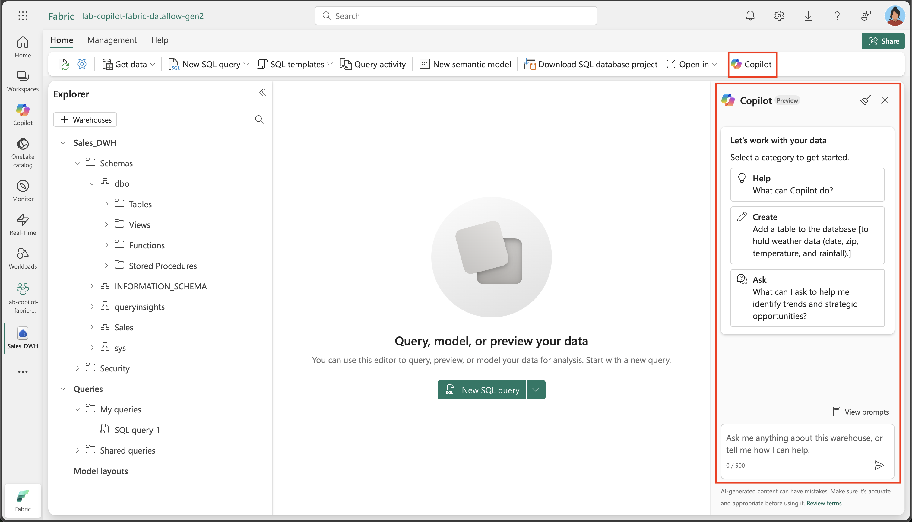

---
lab:
  title: Verwenden von Copilot im Microsoft Fabric-Data Warehouse
  module: Get started with Copilot in Fabric for Data Warehouse
---

# Verwenden von Copilot im Microsoft Fabric-Data Warehouse

In Microsoft Fabric stellt ein Data Warehouse eine relationale Datenbank für umfangreiche Analysen bereit. Im Gegensatz zum standardmäßigen schreibgeschützten SQL-Endpunkt für Tabellen, die in einem Lakehouse definiert sind, bietet ein Data Warehouse vollständige SQL-Semantik, einschließlich der Möglichkeit zum Einfügen, Aktualisieren und Löschen von Daten in den Tabellen. In dieser Übung werden wir untersuchen, wie wir Copilot zum Erstellen von SQL-Abfragen nutzen können.

Diese Übung dauert ca. **30** Minuten.

## Was Sie lernen werden:

Nach Abschluss dieses Labs können Sie Folgendes:

- Verstehen der Rolle von Data Warehouses in Microsoft Fabric
- Erstellen und Konfigurieren eines Arbeitsbereichs und eines Data Warehouse in Fabric
- Laden und Untersuchen von Beispieldaten mithilfe von SQL
- Verwenden von Copilot, um SQL-Abfragen über Prompts in natürlicher Sprache zu generieren, zu verfeinern und Probleme zu behandeln
- Erstellen von Sichten und Durchführen erweiterter Datenanalysen mit KI-gestützter SQL-Generierung
- Anwenden der Funktionen von Copilot, um das Durchsuchen und Analysieren von Daten zu beschleunigen

## Vor der Installation

Sie benötigen eine [Microsoft Fabric-Kapazität (F2 oder höher)](https://learn.microsoft.com/fabric/fundamentals/copilot-enable-fabric) mit aktiviertem Copilot, um diese Übung abzuschließen.

## Übungsszenario

In dieser Übung sind Sie Data Analyst bei einem Einzelhandelsunternehmen, das die Vertriebsleistung mit Microsoft Fabric besser verstehen möchte. Ihr Team hat kürzlich die Data-Warehouse-Funktionen von Fabric eingeführt und ist daran interessiert, Copilot zu nutzen, um das Durchsuchen von Daten und die Berichterstellung zu beschleunigen. Sie erstellen ein neues Data Warehouse, laden Einzelhandelsdaten und verwenden Copilot, um SQL-Abfragen zu generieren und zu verfeinern. Am Ende des Labs haben Sie praktische Erfahrungen mit der Verwendung von KI, um Vertriebstrends zu analysieren, wiederverwendbare Sichten zu erstellen und erweiterte Datenanalysen innerhalb der Fabric-Umgebung durchzuführen.

## Erstellen eines Arbeitsbereichs

Erstellen Sie vor dem Arbeiten mit Daten in Fabric einen Arbeitsbereich mit aktivierter Fabric-Version. Ein Arbeitsbereich in Microsoft Fabric dient als Umgebung für die Zusammenarbeit, in der Sie alle Ihre Datentechnikartefakte organisieren und verwalten können, einschließlich Lakehouses, Notebooks und Datasets. Stellen Sie sich diesen als Projektordner vor, der alle Ressourcen enthält, die für Ihre Datenanalyse benötigt werden.

1. Navigieren Sie in einem Browser unter `https://app.fabric.microsoft.com/home?experience=fabric` zur [Microsoft Fabric-Startseite](https://app.fabric.microsoft.com/home?experience=fabric) und melden Sie sich mit Ihren Fabric-Anmeldeinformationen an.

1. Wählen Sie auf der Menüleiste auf der linken Seite **Arbeitsbereiche** aus (Symbol ähnelt &#128455;).

1. Erstellen Sie einen neuen Arbeitsbereich mit einem Namen Ihrer Wahl, und wählen Sie einen Lizenzierungsmodus mit Fabric-Kapazitäten aus (*Premium* oder *Fabric*). Beachten Sie, dass die *Testversion* nicht unterstützt wird.
   
    > **Warum ist das wichtig?** Copilot benötigt eine kostenpflichtige Fabric-Kapazität, um zu funktionieren. Dadurch wird sichergestellt, dass Sie Zugriff auf die KI-gestützten Features haben, die beim Generieren von Code in diesem Lab helfen.

1. Wenn Ihr neuer Arbeitsbereich geöffnet wird, sollte er leer sein.


## Erstellen eines Data Warehouse

Da Sie nun einen Arbeitsbereich besitzen, ist es an der Zeit, ein Data Warehouse zu erstellen. Ein Data Warehouse in Microsoft Fabric ist eine relationale Datenbank, die für analytische Workloads optimiert ist. Im Gegensatz zu herkömmlichen Datenbanken, die für Transaktionsvorgänge entwickelt wurden, sind Data Warehouses so strukturiert, dass große Datenmengen und komplexe Abfragen effizient verarbeitet werden. Suchen Sie die Verknüpfung, um ein neues Warehouse zu erstellen:

1. Wählen Sie in der Menüleiste auf der linken Seite **Erstellen** aus. Wählen Sie auf der Seite *Neu* unter dem Abschnitt *Data Warehouse* die Option **Warehouse**. Wählen Sie einen eindeutigen Namen Ihrer Wahl aus. Dieser Name kennzeichnet Ihr Data Warehouse innerhalb des Arbeitsbereichs. Wählen Sie also einen aussagekräftigen Namen aus, der dessen Zweck widerspiegelt.

    >**Hinweis**: Wenn die Option **Erstellen** nicht an die Seitenleiste angeheftet ist, müssen Sie zuerst die Ellipses-Option (**…**) auswählen.

    Nach etwa einer Minute wird ein neues Warehouse erstellt. Der Bereitstellungsprozess richtet die zugrunde liegende Infrastruktur ein und erstellt die erforderlichen Komponenten für Ihre analytische Datenbank:

    

## Erstellen von Tabellen und Einfügen von Daten

Ein Warehouse ist eine relationale Datenbank, in der Sie Tabellen und andere Objekte definieren können. Um die Funktionen von Copilot zu veranschaulichen, benötigen wir Beispieldaten, mit denen wir arbeiten können. Wir erstellen ein typisches Einzelhandelsverkaufsschema mit Dimensionstabellen (Kunde, Datum, Produkt) und einer Faktentabelle (Verkaufsaufträge). Dies ist ein gängiges Muster beim Data Warehousing, das als Sternschema bezeichnet wird.

1. Verwenden Sie auf der Registerkarte **Start** die Schaltfläche **Neue SQL-Abfrage**, um eine neue Abfrage zu erstellen. Dadurch wird ein SQL-Editor geöffnet, in dem Sie Transact-SQL-Befehle schreiben und ausführen können. Kopieren Sie dann den Transact-SQL-Code aus `https://raw.githubusercontent.com/MicrosoftLearning/mslearn-fabric/refs/heads/main/Allfiles/Labs/22c/create-dw.txt`, und fügen Sie ihn in den neuen Abfragebereich ein. Dieses Skript enthält alle erforderlichen CREATE TABLE- und INSERT-Anweisungen, um unser Beispieldataset zu erstellen.

1. Führen Sie die Abfrage aus, die ein einfaches Data Warehouse-Schema erstellt und einige Daten lädt. Die Ausführung des Skripts sollte etwa 30 Sekunden dauern. Während dieser Zeit erstellt die Datenbank-Engine die Tabellenstrukturen und füllt sie mit Beispielumsatzdaten für den Einzelhandel auf.

1. Verwenden Sie die Schaltfläche **Aktualisieren** auf der Symbolleiste, um Metriken zu aktualisieren. Überprüfen Sie dann im Bereich **Explorer**, ob das **dbo**-Schema im Data Warehouse jetzt die folgenden vier Tabellen enthält:
   
    - **DimCustomer**: enthält Kundeninformationen einschließlich Namen und Adressen
    - **DimDate**: eine Datumsdimensionstabelle mit Kalenderinformationen (Jahr, Monat, Wochentag usw.)
    - **DimProduct**: Produktkatalog mit Kategorien, Namen und Preisinformationen
    - **FactSalesOrder**: die zentrale Faktentabelle, die Verkaufstransaktionen mit Fremdschlüsseln für die Dimensionstabellen enthält

    > **Tipp**: Wenn das Laden des Schemas eine Weile dauert, aktualisieren Sie einfach die Browserseite. Im Explorer-Bereich wird die Datenbankstruktur angezeigt, und Tabellen und anderen Datenbankobjekte können einfach durchsucht werden.

## Abfragen von Data Warehouse-Tabellen

Da das Data Warehouse eine relationale Datenbank ist, können Sie SQL verwenden, um die zugehörigen Tabellen abzufragen. Das Schreiben komplexer SQL-Abfragen von Grund auf kann jedoch zeitaufwändig und fehleranfällig sein. Die Arbeit mit Copilot macht es noch schneller, SQL-Abfragen zu generieren. Copilot verwendet künstliche Intelligenz, um Ihre Anforderungen in natürlicher Sprache zu verstehen und in die richtige SQL-Syntax zu übersetzen, sodass die Datenanalyse leichter zugänglich ist.

1. Schließen Sie die aktuelle **SQL-Abfrage 1**. Dadurch wird der Arbeitsbereich bereinigt, sodass wir uns auf die Verwendung von Copilot für die Abfragegenerierung konzentrieren können.

1. Wählen Sie im Menüband „Start“ die Option „Copilot“ aus. Dadurch wird der Bereich des Copilot-Assistenten geöffnet, in dem Sie mit KI interagieren können, um Abfragen zu generieren.

    

1. Finden wir zunächst heraus, was Copilot kann. Klicken Sie auf den Vorschlag mit der Bezeichnung `What can Copilot do?`, und senden Sie ihn als Prompt.

    Lesen Sie die Ausgabe, und bedenken Sie, dass sich Copilot derzeit in der Vorschauphase befindet und Sie beim Brainstorming, beim Generieren von SQL-Abfragen, beim Erklären und Korrigieren von Abfragen usw. unterstützen kann.
    
    
    
1. Wir möchten den Umsatz nach Monat analysieren. Dies ist eine gängige Geschäftsanforderung: Das Verständnis von Umsatztrends im Zeitverlauf hilft dabei, saisonale Muster, Wachstumstrends und Leistungsmetriken zu identifizieren. Geben Sie den folgenden Prompt ein, und senden Sie ihn.

    ```copilot-prompt
    /generate-sql Calculate monthly sales revenue
    ```

1. Sehen Sie sich die generierte Ausgabe an, die sich je nach Umgebung und den neuesten Updates für Copilot geringfügig unterscheiden kann. Beachten Sie, wie Copilot Ihre Anforderung interpretiert und entsprechende JOIN-Anweisungen zwischen den Fakten- und Dimensionstabellen erstellt, um Umsatzdaten nach Monat zu aggregieren.

1. Wählen Sie das Symbol **Code einfügen** in der oberen rechten Ecke der Abfrage aus. Dadurch wird die generierte SQL-Abfrage aus dem Copilot-Bereich in Ihren SQL-Editor übertragen, wo Sie sie ausführen können.

    

1. Führen Sie die Abfrage aus, indem Sie oberhalb der Abfrage die Option **Ausführen** auswählen und die Ausgabe beobachten. Es sollten monatliche Umsatzsummen angezeigt werden, die veranschaulichen, wie Ihre Umsatzdaten für bestimmte Zeiträume aggregiert werden.

    

1. Erstellen Sie eine **neue SQL-Abfrage**, und stellen Sie eine Folgefrage, um auch den Monatsnamen und die Vertriebsregion in die Ergebnisse einzuschließen. Dies veranschaulicht, wie Sie Ihre Abfragen mit Copilot iterativ verfeinern können, indem Sie auf vorherigen Anforderungen aufbauen, um eine ausführlichere Analyse zu erstellen:

    ```copilot-prompt
    /generate-sql Retrieves sales revenue data grouped by year, month, month name and sales region
    ```

1. Wählen Sie das Symbol **Code einfügen** und dann ▷ **Ausführen** für die Abfrage aus. Sehen Sie sich die zurückgegebene Ausgabe an. Beachten Sie, wie Copilot die Abfrage an zusätzliche Dimensionen anpasst und gleichzeitig die Logik für die Berechnung des Hauptumsatzes beibehält.

1. Wir erstellen eine Sicht aus dieser Abfrage, indem wir Copilot die folgende Frage stellen. Sichten sind virtuelle Tabellen, in denen Abfragelogik gespeichert wird, sodass komplexe Abfragen einfacher wiederverwendet werden können und konsistente Datenzugriffsmuster für die Berichterstellung und Analyse bereitgestellt werden:

    ```copilot-prompt
    /generate-sql Create a view in the dbo schema that shows sales revenue data grouped by year, month, month name and sales region
    ```

1. Wählen Sie das Symbol **Code einfügen** und dann ▷ **Ausführen** für die Abfrage aus. Sehen Sie sich die generierte Ausgabe an. 

    Die Abfrage wird nicht erfolgreich ausgeführt, da die SQL-Anweisung den Datenbanknamen als Präfix enthält, was im Data Warehouse beim Definieren einer Sicht nicht zulässig ist. Dies ist ein häufiges Syntaxproblem bei der Arbeit auf verschiedenen Datenbankplattformen. Was in einer Umgebung funktioniert, muss möglicherweise in einer anderen angepasst werden.

1. Wählen Sie die Option **Abfragefehler beheben** aus. Beobachten Sie, wie Copilot Korrekturen an der Abfrage vornimmt. Dies veranschaulicht eines der praktischen Features von Copilot: Es können nicht nur Abfragen generiert, sondern auch Syntaxfehler automatisch behandelt und behoben werden.

    
    
    Hier sehen Sie ein Beispiel für die korrigierte Abfrage. Beachten Sie die `Auto-Fix`-Kommentare, die erläutern, welche Änderungen vorgenommen wurden:
    
    ```sql
    -- Auto-Fix: Removed the database name prefix from the CREATE VIEW statement
    CREATE VIEW [dbo].[SalesRevenueView] AS
    SELECT 
        [DD].[Year],
        [DD].[Month],
        [DD].[MonthName],
        -- NOTE: I couldn't find SalesRegion information in your warehouse schema
        SUM([FS1].[SalesTotal]) AS [TotalRevenue]
    FROM 
        [dbo].[FactSalesOrder] AS [FS1] -- Auto-Fix: Removed the database name prefix
    JOIN 
        [dbo].[DimDate] AS [DD] ON [FS1].[SalesOrderDateKey] = [DD].[DateKey] -- Auto-Fix: Removed the database name prefix
    -- NOTE: I couldn't find SalesRegion information in your warehouse schema
    GROUP BY 
        [DD].[Year],
        [DD].[Month],
        [DD].[MonthName]; 
    ```
    
    Beachten Sie, dass Copilot nicht nur die Syntaxfehler behoben, sondern auch hilfreiche Kommentare erstellt hat, die die Änderungen erläutern und darauf hinweisen, dass die Informationen zur Vertriebsregion im aktuellen Schema nicht verfügbar waren.

1. Geben Sie einen weiteren Prompt ein, um eine detaillierte Produktauflistung nach Kategorie zu erhalten. Diese Abfrage veranschaulicht erweiterte SQL-Features wie Fensterfunktionen für die Rangfolge von Daten innerhalb von Gruppen. Für jede Produktkategorie sollten die verfügbaren Produkte zusammen mit ihren Listenpreisen angezeigt und basierend auf dem Preis innerhalb ihrer jeweiligen Kategorien eingestuft werden. 

    ```copilot-prompt
    /generate-sql Retrieve a detailed product listing, organized by category. For each product category, it should display the available products along with their list prices and rank them within their respective categories based on price. 
    ```

1. Wählen Sie das Symbol **Code einfügen** und dann ▷ **Ausführen** für die Abfrage aus. Sehen Sie sich die zurückgegebene Ausgabe an. 

    Dies ermöglicht einen einfachen Vergleich von Produkten innerhalb derselben Kategorie und hilft dabei, die teuersten und günstigsten Artikel zu ermitteln. Die Rangfolgefunktion ist besonders nützlich für Produktverwaltung, Preisanalyse und Bestandsentscheidungen.

## Zusammenfassung

In dieser Übung haben Sie ein Data Warehouse erstellt, das mehrere Tabellen enthält. Sie haben Copilot verwendet, um SQL-Abfragen zum Analysieren von Daten im Data Warehouse zu generieren. Sie haben erlebt, wie KI den Prozess des Schreibens komplexer SQL-Abfragen beschleunigen, Fehler automatisch beheben und Ihnen helfen kann, Daten effizienter zu untersuchen.

In diesem Lab haben Sie Folgendes gelernt:
- Verwenden von Prompts in natürlicher Sprache zum Generieren von SQL-Abfragen
- Verwenden der Fehlerkorrekturfunktionen von Copilot zum Beheben von Syntaxproblemen
- Erstellen von Sichten und komplexen analytischen Abfragen mit KI-Unterstützung
- Anwenden von Rangfolgefunktionen und Gruppierungen für die Datenanalyse

## Bereinigen von Ressourcen

Wenn Sie mit der Einführung in Copilot für Data Warehouses in Microsoft Fabric fertig sind, können Sie den Arbeitsbereich löschen, den Sie für diese Übung erstellt haben.

1. Navigieren Sie in Ihrem Browser zu Microsoft Fabric.
1. Wählen Sie auf der Leiste auf der linken Seite das Symbol für Ihren Arbeitsbereich aus, um alle darin enthaltenen Elemente anzuzeigen.
1. Wählen Sie **Arbeitsbereichseinstellungen** und scrollen Sie im Abschnitt **Allgemein** nach unten und wählen Sie **Diesen Arbeitsbereich entfernen**.
1. Wählen Sie **Löschen**, um den Arbeitsbereich zu löschen.


