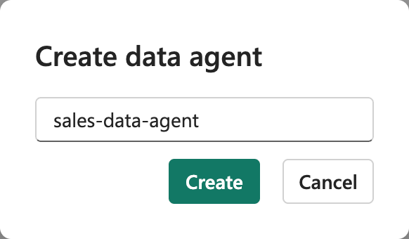
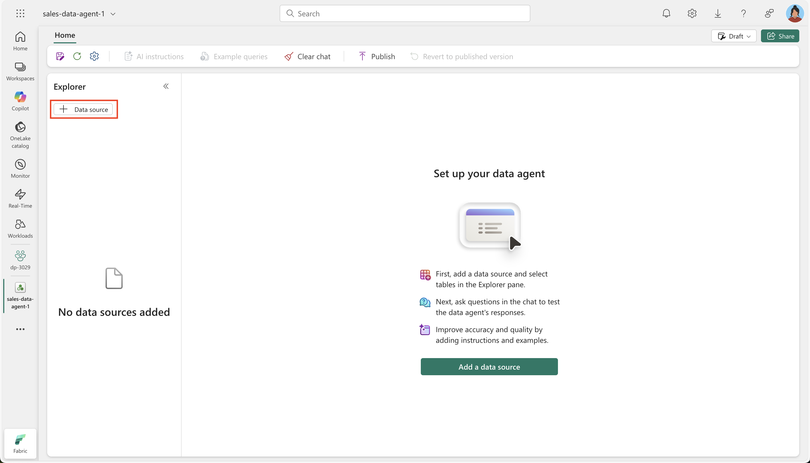
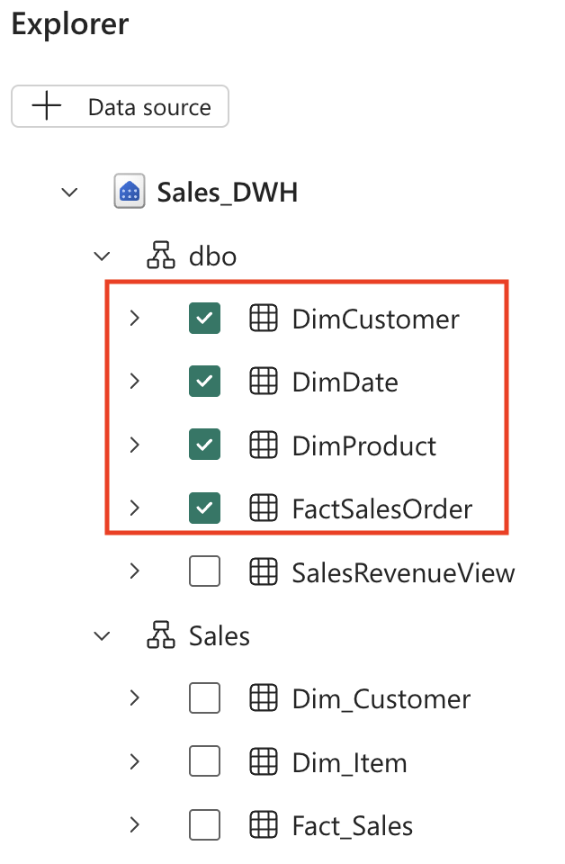

---
lab:
  title: Chatten mit Ihren Daten mithilfe von Microsoft Fabric-Datenagents
  module: Implement Fabric Data Agents
---

# Chatten mit Ihren Daten mithilfe von Microsoft Fabric-Datenagents

Ein Microsoft Fabric-Datenagent ermöglicht eine natürliche Interaktion mit Ihren Daten, indem Sie Fragen in einfachem Englisch stellen und strukturierte, lesbare Antworten erhalten. Da es nicht notwendig ist, Abfragesprachen wie SQL (Structured Query Language), DAX (Datenanalyseausdrücke) oder KQL (Kusto Query Language) zu beherrschen, macht der Datenagent Datenerkenntnisse organisationsweit zugänglich, unabhängig vom technischen Fachwissen.

Diese Übung dauert ca. **30** Minuten.

## Was Sie lernen werden:

Durch Abschluss dieses Labs lernen Sie Folgendes:

- Zweck und Vorteile von Microsoft Fabric-Datenagents für die Datenanalyse in natürlicher Sprache
- Erstellen und Konfigurieren eines Fabric-Arbeitsbereichs und eines Data Warehouse
- Laden und Untersuchen eines Verkaufsdatasets mit Sternschema
- Übersetzung von Fragen in einfachem Englisch in SQL-Abfragen durch Datenagents
- Entwickeln der Fähigkeiten, um effektive analytische Fragen zu stellen und KI-generierte Ergebnisse zu interpretieren
- Nutzung von KI-Tools, um Datenzugriff und -erkenntnisse zu demokratisieren

## Vor der Installation

Sie benötigen eine [Microsoft Fabric-Kapazität (F2 oder höher)](https://learn.microsoft.com/fabric/fundamentals/copilot-enable-fabric) mit aktiviertem Copilot, um diese Übung abzuschließen.

## Übungsszenario

In dieser Übung erstellen wir ein Data Warehouse für den Vertrieb, laden einige Daten in das Data Warehouse und erstellen dann einen Fabric-Datenagent. Anschließend stellen wir verschiedene Fragen und untersuchen, wie der Datenagent natürliche Sprache in SQL-Abfragen übersetzt, um Erkenntnisse zu gewinnen. Dieser praktische Ansatz veranschaulicht die Leistungsfähigkeit der KI-gestützten Datenanalyse, ohne dass umfassende SQL-Kenntnisse erforderlich sind. Fangen wir an!

## Erstellen eines Arbeitsbereichs

Erstellen Sie vor dem Arbeiten mit Daten in Fabric einen Arbeitsbereich mit aktivierter Fabric-Version. Ein Arbeitsbereich in Microsoft Fabric dient als Umgebung für die Zusammenarbeit, in der Sie alle Ihre Datentechnikartefakte organisieren und verwalten können, einschließlich Lakehouses, Notebooks und Datasets. Stellen Sie sich diesen als Projektordner vor, der alle Ressourcen enthält, die für Ihre Datenanalyse benötigt werden.

1. Navigieren Sie in einem Browser unter `https://app.fabric.microsoft.com/home?experience=fabric` zur [Microsoft Fabric-Startseite](https://app.fabric.microsoft.com/home?experience=fabric) und melden Sie sich mit Ihren Fabric-Anmeldeinformationen an.

1. Wählen Sie auf der Menüleiste auf der linken Seite **Arbeitsbereiche** aus (Symbol ähnelt &#128455;).

1. Erstellen Sie einen neuen Arbeitsbereich mit einem Namen Ihrer Wahl, und wählen Sie einen Lizenzierungsmodus mit Fabric-Kapazitäten aus (*Premium* oder *Fabric*). Beachten Sie, dass die *Testversion* nicht unterstützt wird.
   
    > **Warum ist das wichtig?** Copilot benötigt eine kostenpflichtige Fabric-Kapazität, um zu funktionieren. Dadurch wird sichergestellt, dass Sie Zugriff auf die KI-gestützten Features haben, die beim Generieren von Code in diesem Lab helfen.

1. Wenn Ihr neuer Arbeitsbereich geöffnet wird, sollte er leer sein.


## Erstellen eines Data Warehouse

Da Sie nun einen Arbeitsbereich besitzen, ist es an der Zeit, ein Data Warehouse zu erstellen. Ein Data Warehouse ist ein zentrales Repository, in dem strukturierte Daten aus verschiedenen Quellen gespeichert werden, die für analytische Abfragen und Berichte optimiert sind. In unserem Fall erstellen wir ein einfaches Data Warehouse für den Vertrieb, das als Grundlage für unsere Interaktionen mit dem Datenagent dient. Suchen Sie die Verknüpfung, um ein neues Warehouse zu erstellen:

1. Wählen Sie in der Menüleiste auf der linken Seite **Erstellen** aus. Wählen Sie auf der Seite *Neu* unter dem Abschnitt *Data Warehouse* die Option **Warehouse**. Wählen Sie einen eindeutigen Namen Ihrer Wahl aus.

    >**Hinweis**: Wenn die Option **Erstellen** nicht an die Seitenleiste angeheftet ist, müssen Sie zuerst die Ellipses-Option (**…**) auswählen.

    Nach einer Minute wird ein neues Warehouse erstellt:

    

## Erstellen von Tabellen und Einfügen von Daten

Ein Warehouse ist eine relationale Datenbank, in der Sie Tabellen und andere Objekte definieren können. Um unseren Datenagent nützlich zu machen, müssen wir ihn mit Beispielumsatzdaten auffüllen. Das Skript, das wir ausführen, erstellt ein typisches Data-Warehouse-Schema mit Dimensionstabellen (mit beschreibenden Attributen) und einer Faktentabelle (die messbare Geschäftsereignisse enthält). Dieser Sternschemaentwurf ist für analytische Abfragen optimiert, die der Datenagent generiert.

1. Verwenden Sie auf der Registerkarte **Start** die Schaltfläche **Neue SQL-Abfrage**, um eine neue Abfrage zu erstellen. Kopieren Sie dann den Transact-SQL-Code aus `https://raw.githubusercontent.com/MicrosoftLearning/mslearn-fabric/refs/heads/main/Allfiles/Labs/22d/create-dw.txt`, und fügen Sie ihn in den neuen Abfragebereich ein.

    > **Funktionsweise dieses Skripts**: Das Skript erstellt ein vollständiges Data Warehouse für den Vertrieb mit Kundeninformationen, Produktdetails, Datumsdimensionen und Verkaufstransaktionen. Dieses realistische Dataset ermöglicht es uns, dem Datenagent relevante, geschäftsspezifische Fragen zu stellen.

1. Führen Sie die Abfrage aus, die ein einfaches Data Warehouse-Schema erstellt und einige Daten lädt. Die Ausführung des Skripts sollte etwa 30 Sekunden dauern.

1. Verwenden Sie die Schaltfläche **Aktualisieren** auf der Symbolleiste, um Metriken zu aktualisieren. Überprüfen Sie dann im Bereich **Explorer**, ob das **dbo**-Schema im Data Warehouse jetzt die folgenden vier Tabellen enthält:
   
    - **DimCustomer**: enthält Kundeninformationen wie Namen, Standorte und Kontaktdetails
    - **DimDate**: enthält datumsbezogene Attribute wie Geschäftsjahre, Quartale und Monate für die zeitbasierte Analyse
    - **DimProduct**: enthält Produktinformationen wie Namen, Kategorien und Preise
    - **FactSalesOrder**: enthält die tatsächlichen Verkaufstransaktionen, die Kunden, Produkte und Datumsangaben verknüpfen

    > **Tipp**: Wenn das Laden des Schemas eine Weile dauert, aktualisieren Sie einfach die Browserseite.

## Erstellen eines Fabric-Datenagents

Ein Fabric-Datenagent ist ein KI-basierter Assistent, der Fragen in natürlicher Sprache zu Ihren Daten verstehen und automatisch die entsprechenden Abfragen generieren kann, um sie zu beantworten. Dadurch müssen Benutzer die SQL-, KQL- oder DAX-Syntax nicht beherrschen, und es werden trotzdem präzise, datenbasierte Erkenntnisse geliefert. Erstellen und konfigurieren wir unseren Datenagent:

1. Erstellen Sie einen neuen Datenagent.
   
    

1. Geben Sie ihm einen Namen wie **`sales-data-agent`**.

    > **Warum die Benennung wichtig ist**: Ein aussagekräftiger Name hilft Ihnen und Ihrem Team, den Zweck und Umfang dieses Datenagents zu verstehen, insbesondere bei der Verwaltung mehrerer Agents für verschiedene Datendomänen.
    
    

1. Wählen Sie **Datenquelle hinzufügen** aus. 

    

1. Wählen Sie das Data Warehouse aus, das Sie zuvor erstellt haben.

    > **Herstellen einer Verbindung mit Ihren Daten**: Der Datenagent benötigt Zugriff auf Ihre Tabellen, um das Schema und die Beziehungen zu verstehen. Das ermöglicht es, präzise SQL-Abfragen basierend auf Ihren Fragen zu generieren.

1. Erweitern Sie das Data Warehouse, und überprüfen Sie **DimCustomer**, **DimDate**, **DimProduct** und **FactSalesOrder**.

    > **Tabellenauswahlstrategie**: Durch das Auswählen aller vier Tabellen gewähren wir dem Datenagent Zugriff auf das vollständige Datenmodell. Dadurch können komplexe Fragen beantwortet werden, die sich über mehrere Tabellen erstrecken, z. B. Umsatztrends nach Kundenstandort oder Produktleistung im Zeitverlauf.

    

## Fragen zu

Jetzt ist es an der Zeit, mit dem Experimentieren zu beginnen und Fragen an unseren Datenagent zu stellen. In diesem Abschnitt wird veranschaulicht, wie natürliche Sprache in SQL-Abfragen transformiert werden kann, sodass Benutzer ohne technisches SQL-Wissen Datenanalysen nutzen können. Jede Frage zeigt sowohl die Antwort als auch die zugrunde liegende Abfrage an, die generiert wurde.

1. Stellen Sie eine Frage, indem Sie den folgenden Prompt eingeben: 

    ```copilot-prompt
    How many products did we sell by fiscal year?
    ```

    Beachten Sie die resultierende Antwort: Wir haben im Geschäftsjahr 2021 insgesamt 12.630 Produkte und im Geschäftsjahr 2022 13.336 Produkte verkauft.

1. Erweitern Sie den abgeschlossenen Schritt und den zugehörigen Teilschritt. Dadurch wird die SQL-Abfrage angezeigt, die vom Datenagent generiert wurde, um die Frage zu beantworten.

    > **Gelegenheit zum Lernen**: Indem Sie die generierte SQL-Abfrage untersuchen, können Sie verstehen, wie der Datenagent Ihre Frage interpretiert hat, und mehr über die zugrunde liegenden Datenbeziehungen erfahren. Diese Transparenz schafft Vertrauen in die KI-generierten Ergebnisse.
    
    
    
    Copilot hat den folgenden SQL-Code generiert, der sich je nach Umgebung und den neuesten Updates für Copilot geringfügig unterscheiden kann.
    
    ```sql
    SELECT d.Year, SUM(f.Quantity) AS TotalProductsSold
    FROM dbo.FactSalesOrder f
    JOIN dbo.DimDate d ON f.SalesOrderDateKey = d.DateKey
    GROUP BY d.Year
    ORDER BY d.Year;
    ```

    > **SQL-Erklärung**: Diese Abfrage verknüpft die Faktentabelle (FactSalesOrder) mit der Datumsdimension (DimDate), um den Umsatz nach Jahr zu gruppieren und die Mengen zu addieren. Beachten Sie, dass der Datenagent automatisch verstanden hat, dass „products sold“ sich auf das Feld „Quantity“ bezieht und „fiscal year“ dem Feld „Year“ in der Datumsdimension zugeordnet ist.

1. Fahren Sie mit der folgenden Frage fort: 

    ```copilot-prompt
    What are the top 10 most popular products all time?
    ```

    > **Was zu erwarten ist**: Diese Frage veranschaulicht, wie der Datenagent Rangfolgevorgänge durchführen kann, wobei Produktinformationen mit Verkaufsdaten verbunden werden, um Bestseller zu identifizieren.

1. Stellen Sie diese Folgefrage: 

    ```copilot-prompt
    What are the historical trends across all my data?
    ```

    > **Erweiterte Analyse**: Diese allgemeinere Frage zeigt, wie der Datenagent Trendanalysen für mehrere Dimensionen bereitstellen kann, einschließlich zeitbasierter Muster in Vertrieb, Kundenverhalten und Produktleistung.

1. Probieren Sie weitere Fragen aus, um verschiedene Aspekte Ihrer Daten zu untersuchen:

    ```copilot-prompt
    In which countries are our customers located?
    ```
    
    ```copilot-prompt
    How many products did we sell in the United States?
    ```
    
    ```copilot-prompt
    How much revenue did we make in FY 2022?
    ```
    
    ```copilot-prompt
    How much was our total sales revenue, by fiscal year, fiscal quarter and month name?
    ```

    > **Pro-Tipp**: Jede dieser Fragen ist auf verschiedene Analyseszenarios ausgerichtet: geografische Analyse, gefilterte Aggregationen, Umsatzberechnungen und hierarchische Zeitanalyse. Experimentieren Sie mit Variationen, um zu sehen, wie sich der Datenagent an verschiedene Fragearten anpasst.

## Grundlegendes zur Datenstruktur

Beachten Sie beim Experimentieren mit Fragen diese Datenmerkmale, um gezieltere Fragen zu stellen:

- **Ablauf des Geschäftsjahrs**: Das Geschäftsjahr beginnt im Juli (7. Monat). Q1 läuft also von Juli bis September, Q2 von Oktober bis Dezember, Q3 von Januar bis März und Q4 von April bis Juni.

- **Kundenidentifikation**: Das Feld „CustomerAltKey“ enthält Kunden-E-Mail-Adressen, die für kundenspezifische Abfragen nützlich sein können.

- **Währung:** Alle Listenpreise und Verkaufssummen sind in GBP (Britisches Pfund).

- **Datenbeziehungen**: Die Tabelle „FactSalesOrder“ verbindet Kunden, Produkte und Datumsangaben über Fremdschlüssel und ermöglicht so komplexe mehrdimensionale Analysen.

> **Weiter experimentieren**: Versuchen Sie, Fragen zu stellen, die diese Elemente kombinieren, z. B. „Wie war unser Umsatz im ersten Quartal des Geschäftsjahrs 2022?“ oder „Welche Kunden im Vereinigten Königreich haben die teuersten Produkte gekauft?“ Der Datenagent verarbeitet automatisch die komplexen Verknüpfungen und Berechnungen, die zur Beantwortung dieser Fragen erforderlich sind.

## Zusammenfassung

Glückwunsch! Folgende Schritte wurden erfolgreich ausgeführt:

- **Einen Fabric-Arbeitsbereich** und ein Data Warehouse mit einem realistischen Verkaufsdataset erstellt
- **Einen Datenagent erstellt und konfiguriert**, der Fragen in natürlicher Sprache zu Ihren Daten verstehen kann
- **KI-gesteuerte Datenanalyse ausprobiert**, indem Sie Fragen in einfachem Englisch stellen und sich ansehen, wie diese in SQL-Abfragen übersetzt werden
- **Verschiedene Arten analytischer Fragen** von einfachen Aggregationen bis hin zu komplexen Trendanalysen untersucht

### Wichtige Erkenntnisse

- **Demokratisierter Datenzugriff**: Datenagents machen Analysen für Benutzer unabhängig von ihren SQL-Kenntnissen zugänglich
- **Transparenz und Vertrauen**: Sie können die generierte SQL-Abfragen jederzeit überprüfen, um zu verstehen, wie Fragen beantwortet werden.
- **Flexibilität natürlicher Sprache**: Die KI kann mit Variationen in Ausdrücken und sogar kleinere Tippfehler in Fragen umgehen.
- **Komplexe Abfragegenerierung**: Der Agent verarbeitet Joins, Aggregationen und Filter automatisch basierend auf Eingaben in natürlicher Sprache.

### Nächste Schritte

Erwägen Sie, Folgendes auszuprobieren:

- **Benutzerdefinierte Anweisungen**: Fügen Sie geschäftsspezifischen Kontext zur Verbesserung der Antworten des Datenagents hinzu.
- **Zusätzliche Datenquellen**: Verbinden Sie weitere Tabellen oder Datasets, um das Wissen des Agents zu erweitern.
- **Erweiterte Fragen**: Probieren Sie komplexere Analyseszenarios mit mehreren Zeiträumen, Kundensegmenten oder Produktkategorien aus.
- **Integration**: Betten Sie Datenagent-Erkenntnissen in Berichte, Dashboards oder Geschäftsanwendungen ein.

Der Fabric-Datenagent ist ein wichtiger Schritt, um Datenerkenntnisse in Ihrer Organisation wirklich zugänglich zu machen und die Lücke zwischen Daten und Entscheidungsfindung zu schließen.
